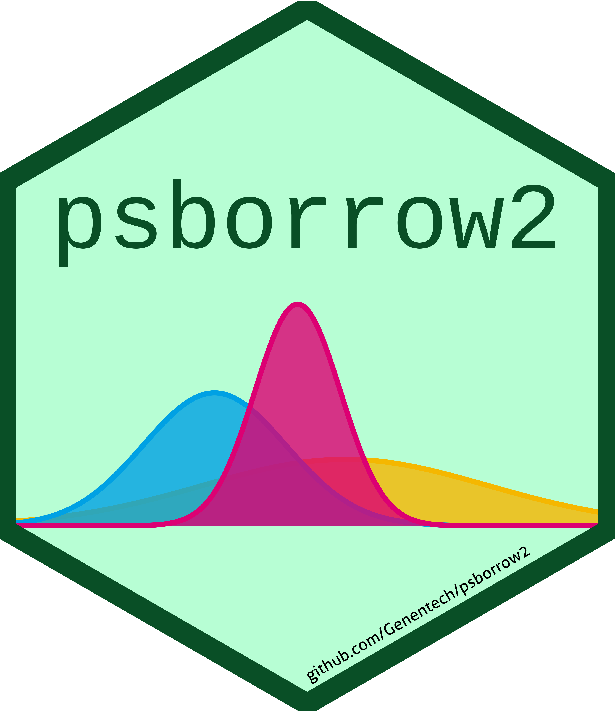

# psborrow2 

<!-- badges: start -->

[](https://github.com/Genentech/psborrow2)
[](https://www.tidyverse.org/lifecycle/#stable)

<!-- badges: end -->

## Overview

`psborrow2` is an R package that for conducting Bayesian dynamic borrowing
analyses and simulation studies (Lewis et al 2019, Viele et al 2014)
`psborrow2` helps the user:

1. **Apply Bayesian dynamic borrowing methods**. `psborrow2` has a user-friendly interface for
   conducting Bayesian dynamic borrowing analyses using the hierarchical commensurate prior approach
   that handles the computationally-difficult MCMC sampling
   on behalf of the user.

2. **Conduct simulation studies of Bayesian dynamic borrowing methods**. `psborrow2` includes a
   framework to compare different trial and borrowing characteristics in a unified way
   in simulation studies to inform trial design.

3. **Generate data for simulation studies**. `psborrow2` includes a set of functions to generate
   data for simulation studies.

## Installation

You can install the latest version of `psborrow2` on CRAN with:

```r
install.packages('psborrow2')
```

or you can install the development version with:

```r
remotes::install_github("Genentech/psborrow2")
```

Please note that [`cmdstanr`](https://mc-stan.org/cmdstanr/) is highly recommended, but will not be installed by default when installing `psborrow2`.
To install `cmdstanr`, follow the instructions outlined by the [`cmdstanr` documentation](https://mc-stan.org/cmdstanr/) or use:

```r
install.packages("cmdstanr", repos = c("https://stan-dev.r-universe.dev", getOption("repos")))
```

## Tutorial

To learn how to use the `psborrow2` R package, refer to the [package website (https://genentech.github.io/psborrow2/)](https://genentech.github.io/psborrow2/).

## `psborrow` vs. `psborrow2`

`psborrow2` is the successor to
[`psborrow`](https://github.com/Genentech/psborrow). [`psborrow`](https://github.com/Genentech/psborrow)
is still freely available on [`CRAN`](https://cran.r-project.org/package=psborrow) with the
same validated functionality; however, the package is not actively developed.
Major updates in `psborrow2` include:

- New, more flexible user interface
- New MCMC software (STAN)
- Expanded functionality (e.g., more outcomes, more flexibility in priors, more flexibility in data generation, etc.)

The name `psborrow` combines propensity scoring (`ps`) and Bayesian dynamic
`borrow`ing. As one might expect, both `psborrow` and `psborrow2` can be used to combine dynamic
borrowing and propensity-score adjustment/weighting methods.

## Bibliography

Lewis CJ, Sarkar S, Zhu J, Carlin BP. Borrowing from historical control data
in cancer drug development: a cautionary tale and practical guidelines.
Statistics in biopharmaceutical research. 2019 Jan 2;11(1):67-78.

Viele K, Berry S, Neuenschwander B, Amzal B, Chen F, Enas N, Hobbs B,
Ibrahim JG, Kinnersley N, Lindborg S, Micallef S. Use of historical control
data for assessing treatment effects in clinical trials. Pharmaceutical
statistics. 2014 Jan;13(1):41-54.
