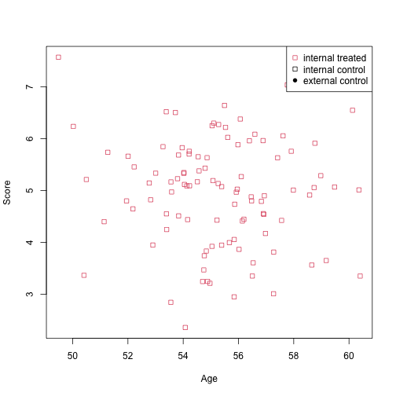

This vignette will show the internal functions for generating data that can be used in simulation studies.


```r
library(psborrow2)
library(dplyr)
```

## Generating Baseline Data

First we define how to generate baseline data for our study. In its simplest form we only need to define how many
patients are in the arms: treated internal, control internal, control external.


```r
simple_baseline <- create_baseline_object(
  n_trt_int = 100,
  n_ctrl_int = 50,
  n_ctrl_ext = 100
)
```

This object defines how the data will be created. To actually generate a sample, use `generate()` to produce a
list containing `data.frame`s for each arm. We can convert this to a single `data.frame` if needed.


```r
baseline_data <- generate(simple_baseline)
baseline_data
#> Baseline Data List
#> 
#> Internal Treated
#>  patid ext trt
#>      1   0   1
#>      2   0   1
#>      3   0   1
#>      4   0   1
#>      5   0   1
#>      6   0   1
#> Internal Control
#>  patid ext trt
#>    101   0   0
#>    102   0   0
#>    103   0   0
#>    104   0   0
#>    105   0   0
#>    106   0   0
#> External Control
#>  patid ext trt
#>    151   1   0
#>    152   1   0
#>    153   1   0
#>    154   1   0
#>    155   1   0
#>    156   1   0
as.data.frame(baseline_data)
#>   patid ext trt
#> 1     1   0   1
#> 2     2   0   1
#> 3     3   0   1
#> 4     4   0   1
#> 5     5   0   1
#> 6     6   0   1
#>  [ reached 'max' / getOption("max.print") -- omitted 244 rows ]
```

Often we are interested in some additional covariates. Internally the package uses multivariate normal distributions,
so we need to specify the means and (co-)variances. We have the option to specify different distribution parameters
for the internal and external arms. The internal arms are assumed to be randomized and therefore come from the same
distribution. If no external parameters are specified, the internal ones are used for both.


```r
with_age <- create_baseline_object(
  n_trt_int = 100,
  n_ctrl_int = 50,
  n_ctrl_ext = 100,
  covariates = baseline_covariates(
    names = "age",
    means_int = 55,
    covariance_int = covariance_matrix(5)
  )
)
set.seed(123)
generate(with_age)
#> Baseline Data List
#> 
#> Internal Treated
#>  patid ext trt      age
#>      1   0   1 53.74674
#>      2   0   1 54.48531
#>      3   0   1 58.48538
#>      4   0   1 55.15766
#>      5   0   1 55.28910
#>  [ reached 'max' / getOption("max.print") -- omitted 1 rows ]
#> Internal Control
#>  patid ext trt      age
#>    101   0   0 53.41148
#>    102   0   0 55.57441
#>    103   0   0 54.44838
#>    104   0   0 54.22287
#>    105   0   0 52.87212
#>  [ reached 'max' / getOption("max.print") -- omitted 1 rows ]
#> External Control
#>  patid ext trt      age
#>    151   1   0 56.76144
#>    152   1   0 56.71963
#>    153   1   0 55.74283
#>    154   1   0 52.74520
#>    155   1   0 54.73290
#>  [ reached 'max' / getOption("max.print") -- omitted 1 rows ]
```

In a more complex setting, we can generate correlated baseline covariates by specifying a variance-covariance matrix as
the main diagonal (variance components) and the upper triangle (covariance components).


```r
covariance_matrix(diag = c(5, 1.2), upper_tri = c(0.1))
#>      [,1] [,2]
#> [1,]  5.0  0.1
#> [2,]  0.1  1.2

with_age_score <- create_baseline_object(
  n_trt_int = 100,
  n_ctrl_int = 50,
  n_ctrl_ext = 100,
  covariates = baseline_covariates(
    names = c("age", "score"),
    means_int = c(55, 5),
    means_ext = c(60, 5),
    covariance_int = covariance_matrix(diag = c(5, 1)),
    covariance_ext = covariance_matrix(diag = c(5, 1.2), upper_tri = c(0.1))
  )
)
data_age_score <- generate(with_age_score)
```


```r
df_age_score <- as.data.frame(data_age_score)
plot(
  x = df_age_score$age,
  y = df_age_score$score,
  col = df_age_score$trt + 1,
  pch = df_age_score$ext * 16,
  xlab = "Age",
  ylab = "Score"
)
legend(
  "topright",
  legend = c("internal treated", "internal control", "external control"),
  col = c(2, 1, 1),
  pch = c(0, 0, 16)
)
```



Finally, we have the option to transform non-normal covariates, such as with binary cut-offs.
These can be added to existing objects and can use built-in functions or used defined.

```r
with_age_score <- with_age_score %>%
  set_transformations(
    score_high = binary_cutoff("score", int_cutoff = 0.7, ext_cutoff = 0.7),
    score_rounded = function(data) round(data$score)
  )
set.seed(123)
generate(with_age_score)
#> Baseline Data List
#> 
#> Internal Treated
#>  patid ext trt      age    score score_high score_rounded
#>      1   0   1 53.74674 4.769823          0             5
#>      2   0   1 58.48538 5.070508          0             5
#>  [ reached 'max' / getOption("max.print") -- omitted 4 rows ]
#> Internal Control
#>  patid ext trt      age    score score_high score_rounded
#>    101   0   0 59.91669 6.312413          1             6
#>    102   0   0 54.40712 5.543194          1             6
#>  [ reached 'max' / getOption("max.print") -- omitted 4 rows ]
#> External Control
#>  patid ext trt      age    score score_high score_rounded
#>    151   1   0 58.40067 4.247311          0             4
#>    152   1   0 57.90136 3.947487          0             4
#>  [ reached 'max' / getOption("max.print") -- omitted 4 rows ]
```


## Generating Survival Data

Using the baseline object we have specified, we can generate survival outcome data including various parameters like
dropout rate, enrollment rate and clinical cut-off.

First we need to specify the outcome distribution. The underlying data generation is handled by the `simsurv` package.
The `create_event_dist()` function take the parameters needed to define the distribution. In the simplest case we can use an
exponential distribution by specifying a single `lambda` parameter. We could also use Weibull or Gompertz distributions,
mixtures of distributions, or even specify an arbitrary (log/cumulative) hazard function.

```r
exponential_dist <- create_event_dist(dist = "exponential", lambda = 1 / 24)
```

The minimum required parameters to create a data simulation object are a baseline object and an event distribution.

```r
create_data_simulation(
  baseline = create_baseline_object(n_trt_int = 100, n_ctrl_int = 50, n_ctrl_ext = 100),
  event_dist = exponential_dist
) %>% generate()
#> SimDataList object with  1  different scenarios
#>   sim_id treatment_hr drift_hr n_datasets_per_param
#> 1      1            1        1                    1
```

We can expand by including a baseline object with covariates and so we need coefficients for including them in the
hazard calculation. Further we can include coefficient for the treatment parameter (`treatment_hr`) and for the
difference between internal and external arms (`drift_hr`).

```r
data_sim <- create_data_simulation(
  baseline = with_age_score,
  coefficients = c(age = 0.001, score_high = 1.5),
  event_dist = exponential_dist,
  treatment_hr = 0.5,
  drift_hr = 0.9
)

data_list <- generate(data_sim)

data_list
#> SimDataList object with  1  different scenarios
#>   sim_id treatment_hr drift_hr n_datasets_per_param
#> 1      1          0.5      0.9                    1
```

We can peek at the data with `get_data()`:


```r
get_data(data_list, index = 1, dataset = 1) %>% head()
#>   patid      age score_high trt ext  eventtime status enrollment cens
#> 1     1 53.25887          0   1   0 163.587989      1          1    0
#> 2     2 55.64217          0   1   0   6.884799      1          1    0
#>  [ reached getOption("max.print") -- omitted 4 rows ]
```


We can control how datasets are generated with the `n`, `treatment_hr` and `drift_hr` parameters of `generate()`. These
will override the defaults specified in `create_data_simulation()`.

```r
generate(data_sim, n = 10, treatment_hr = c(1, 1.3, 2), drift_hr = c(1, 1.2))
#> SimDataList object with  6  different scenarios
#>   sim_id treatment_hr drift_hr n_datasets_per_param
#> 1      1          1.0      1.0                   10
#> 2      2          1.3      1.0                   10
#> 3      3          2.0      1.0                   10
#> 4      4          1.0      1.2                   10
#> 5      5          1.3      1.2                   10
#>  [ reached 'max' / getOption("max.print") -- omitted 1 rows ]
```

To add other features to the simulation there are `set_enrollment()`, `set_cut_off()` and `set_dropout()` functions
which modify a `DataSimObject`.

### Enrollment

Currently only one enrollment option is defined, `enrollment_constant` where a fixed number of patients are enrolled in
each period for a given time duration, so `enrollment_constant(rate = c(5, 2), for_time = c(4, 5))` enrolls 5 patients
in periods 1, 2, 3, 4, and then 2 patients each in 5, 6, 7, 8, 9.

New methods can be specified by defining a function that takes a parameter `n`, the number of patients to generate
enrollment times for.

```r
poisson_enrollment <- custom_enrollment(
  fun = function(n) rpois(n, lambda = 5),
  label = "Poisson enrollment distribution"
)
set_enrollment(data_sim, internal = poisson_enrollment)
#> DataSimObject
#> -------------
#> Baseline object:
#> Baseline Data Simulation Object
#>   N internal treated:  100 
#>   N internal control:  50 
#>   N external control:  100 
#> 
#> Covariates: 
#> [[1]]
#>  covariate means_internal means_external
#>        age             55             60
#>      score              5              5
#> 
#> Covariance Matrices
#> Internal          External
#>       age score         age score 
#> age     5     0   age   5.0   0.1 
#> score   0     1   score 0.1   1.2 
#> 
#> Transformations: 
#>    score_high, score_rounded 
#> 
#> Event distribution:
#> exponential distribution with lambda = 0.0416666666666667 
#> 
#> Treatment HR:  0.5 
#> Drift HR:  0.9 
#> 
#> Coefficients:
#>        age score_high 
#>      0.001      1.500 
#> 
#> Enrollment:
#>  Internal: Poisson enrollment distribution 
#>  External: Poisson enrollment distribution 
#> 
#> Dropout:
#>  Internal treated: No distribution specified 
#>  Internal control: No distribution specified 
#>  External control: No distribution specified 
#> 
#> Clinical cut off:
#>  Internal: No cut off 
#>  External: No cut off
```

### Drop Out

Drop out is defined using the same `create_event_dist()` function as for the survival time. No covariates can be
specified for these distributions, but we can set different distributions for the three arms.


```r
set_dropout(
  data_sim,
  internal_treated = create_event_dist(dist = "exponential", lambdas = 1 / 50),
  internal_control = create_event_dist(dist = "exponential", lambdas = 1 / 55),
  external_control = create_event_dist(dist = "weibull", lambdas = 1 / 40, gammas = 1.1)
)
#> DataSimObject
#> -------------
#> Baseline object:
#> Baseline Data Simulation Object
#>   N internal treated:  100 
#>   N internal control:  50 
#>   N external control:  100 
#> 
#> Covariates: 
#> [[1]]
#>  covariate means_internal means_external
#>        age             55             60
#>      score              5              5
#> 
#> Covariance Matrices
#> Internal          External
#>       age score         age score 
#> age     5     0   age   5.0   0.1 
#> score   0     1   score 0.1   1.2 
#> 
#> Transformations: 
#>    score_high, score_rounded 
#> 
#> Event distribution:
#> exponential distribution with lambda = 0.0416666666666667 
#> 
#> Treatment HR:  0.5 
#> Drift HR:  0.9 
#> 
#> Coefficients:
#>        age score_high 
#>      0.001      1.500 
#> 
#> Enrollment:
#>  Internal: Enrolling 1 patient per time 
#>  External: Enrolling 1 patient per time 
#> 
#> Dropout:
#>  Internal treated: exponential distribution with lambda = 0.02 
#>  Internal control: exponential distribution with lambda = 0.0181818181818182 
#>  External control: weibull distribution with lambda = 0.025 and gamma = 1.1 
#> 
#> Clinical cut off:
#>  Internal: No cut off 
#>  External: No cut off
```

## Clinical Cut Off

In some cases we want to mimic a clinical trial cut off rule, where all patient data after a certain time are censored.
Different rules are available such as:
  - fixed time after first patient is enrolled `cut_off_after_first(time = 36)`
  - fixed time after last patient is enrolled `cut_off_after_first(time = 60)`
  - fixed number of events observed `cut_off_after_events(n = 45)`

If a patient has survival time longer than these rules their status will be set to `0` and `eventtime` set to the cut
off time.

```r
set_cut_off(
  data_sim,
  internal = cut_off_after_first(time = 36),
  external = cut_off_after_events(n = 45)
)
#> DataSimObject
#> -------------
#> Baseline object:
#> Baseline Data Simulation Object
#>   N internal treated:  100 
#>   N internal control:  50 
#>   N external control:  100 
#> 
#> Covariates: 
#> [[1]]
#>  covariate means_internal means_external
#>        age             55             60
#>      score              5              5
#> 
#> Covariance Matrices
#> Internal          External
#>       age score         age score 
#> age     5     0   age   5.0   0.1 
#> score   0     1   score 0.1   1.2 
#> 
#> Transformations: 
#>    score_high, score_rounded 
#> 
#> Event distribution:
#> exponential distribution with lambda = 0.0416666666666667 
#> 
#> Treatment HR:  0.5 
#> Drift HR:  0.9 
#> 
#> Coefficients:
#>        age score_high 
#>      0.001      1.500 
#> 
#> Enrollment:
#>  Internal: Enrolling 1 patient per time 
#>  External: Enrolling 1 patient per time 
#> 
#> Dropout:
#>  Internal treated: No distribution specified 
#>  Internal control: No distribution specified 
#>  External control: No distribution specified 
#> 
#> Clinical cut off:
#>  Internal: Cut off after first enrolled patient reaches time = 36 
#>  External: Cut off after 45 events
```


## Running a simulation

Putting all that together:


```r
my_baseline <- create_baseline_object(
  n_trt_int = 100,
  n_ctrl_int = 50,
  n_ctrl_ext = 100,
  covariates = baseline_covariates(
    names = c("age", "score"),
    means_int = c(55, 5),
    means_ext = c(60, 5),
    covariance_int = covariance_matrix(diag = c(5, 1)),
    covariance_ext = covariance_matrix(diag = c(5, 1.2), upper_tri = c(0.1))
  ),
  transformations = list(score_high = binary_cutoff("score", int_cutoff = 0.7, ext_cutoff = 0.7))
)

my_data_sim_setup <- create_data_simulation(
  baseline = my_baseline,
  coefficients = c(age = 0.001, score_high = 1.1),
  event_dist = create_event_dist(dist = "exponential", lambdas = 1 / 50)
) %>%
  set_enrollment(
    internal = enrollment_constant(rate = c(25, 10), for_time = c(4, 30)),
    external = enrollment_constant(rate = c(30, 10), for_time = c(4, 30))
  ) %>%
  set_dropout(
    internal_treated = create_event_dist(dist = "exponential", lambdas = 1 / 50),
    internal_control = create_event_dist(dist = "exponential", lambdas = 1 / 55),
    external_control = create_event_dist(dist = "exponential", lambdas = 1 / 40)
  ) %>%
  set_cut_off(
    internal = cut_off_after_first(time = 60),
    external = cut_off_after_events(n = 100)
  )

my_data_list <- generate(my_data_sim_setup, n = 3, treatment_hr = c(1, 1.3), drift_hr = c(1, 1.2))
```

Now we can define the simulation setup for the models:


```r
borrowing <- sim_borrowing_list(list(full = borrowing_full("ext")))
outcome <- sim_outcome_list(
  list(standard_outcome = outcome_surv_exponential(
    time_var = "eventtime",
    cens_var = "cens",
    baseline_prior = prior_normal(0, 1000)
  ))
)
covariate <- sim_covariate_list(list(
  cov1 = add_covariates(c("age", "score_high"), prior_normal(0, 1000)),
  no_covs = NULL
))

treatment <- sim_treatment_list(
  list(standard_tx = treatment_details(trt_flag_col = "trt", trt_prior = prior_normal(0, 1000)))
)

sim_obj <- create_simulation_obj(
  data_matrix_list = my_data_list,
  outcome = outcome,
  borrowing = borrowing,
  treatment = treatment,
  covariate = covariate
)
```

And finally sample from these models. See the vignette "4. Conduct a simulation study" for more details.


```r
sim_results <- mcmc_sample(sim_obj, chains = 1)
get_results(sim_results)
```


### Using fixed external data

We can also include a known data set as the external data, if we wish to simulate the operating characteristics of
using previously collected data. This is done by setting the `external_data` argument in `create_data_simulation` to a
data frame. This data is included after enrollment, cut-off and dropout functions are applied, so these have no effect
on the fixed data.

It is possible to include a fixed external dataset and additionally simulate external patients by setting `n_ctrl_ext`
to a non-zero value. This will simulate external patients in addition to the fixed data.


```r
historical_trial_data <- data.frame(
  age = rnorm(40, 60, 5),
  score_high = rbinom(40, 1, 0.7),
  trt = 0,
  eventtime = rexp(40, 1 / 50),
  status = 1,
  enrollment = 1 # enrollment is specified here but not used in clinical cut off
)

my_internal_baseline <- create_baseline_object(
  n_trt_int = 100,
  n_ctrl_int = 50,
  n_ctrl_ext = 0,
  covariates = baseline_covariates(
    names = c("age", "score"),
    means_int = c(55, 5),
    means_ext = c(60, 5),
    covariance_int = covariance_matrix(diag = c(5, 1)),
    covariance_ext = covariance_matrix(diag = c(5, 1.2), upper_tri = c(0.1))
  ),
  transformations = list(score_high = binary_cutoff("score", int_cutoff = 0.7, ext_cutoff = 0.7))
)

my_data_sim_setup_with_fixed <- create_data_simulation(
  baseline = my_internal_baseline,
  coefficients = c(age = 0.001, score_high = 1.1),
  event_dist = create_event_dist(dist = "exponential", lambdas = 1 / 50),
  fixed_external_data = historical_trial_data
) %>%
  set_enrollment(
    internal = enrollment_constant(rate = c(25, 10), for_time = c(4, 30)),
    external = enrollment_constant(rate = c(30, 10), for_time = c(4, 30))
  ) %>%
  set_dropout(
    internal_treated = create_event_dist(dist = "exponential", lambdas = 1 / 50),
    internal_control = create_event_dist(dist = "exponential", lambdas = 1 / 55),
    external_control = create_event_dist(dist = "exponential", lambdas = 1 / 40)
  ) %>%
  set_cut_off(
    internal = cut_off_after_first(time = 60),
    external = cut_off_after_events(n = 100)
  )
my_data_sim_setup_with_fixed
#> DataSimObject
#> -------------
#> Baseline object:
#> Baseline Data Simulation Object
#>   N internal treated:  100 
#>   N internal control:  50 
#>   N external control:  0 
#> 
#> Covariates: 
#> [[1]]
#>  covariate means_internal means_external
#>        age             55             60
#>      score              5              5
#> 
#> Covariance Matrices
#> Internal          External
#>       age score         age score 
#> age     5     0   age   5.0   0.1 
#> score   0     1   score 0.1   1.2 
#> 
#> Transformations: 
#>    score_high 
#> 
#> Event distribution:
#> exponential distribution with lambda = 0.02 
#> 
#> Treatment HR:  1 
#> Drift HR:  1 
#> 
#> Coefficients:
#>        age score_high 
#>      0.001      1.100 
#> 
#> Enrollment:
#>  Internal: Enrolling patients per time at rates: 25, 25, 25, 25, 10, 10, 10, 10, 10, 10, 10, 10.... 
#>  External: Enrolling patients per time at rates: 30, 30, 30, 30, 10, 10, 10, 10, 10, 10, 10, 10.... 
#> 
#> Dropout:
#>  Internal treated: exponential distribution with lambda = 0.02 
#>  Internal control: exponential distribution with lambda = 0.0181818181818182 
#>  External control: exponential distribution with lambda = 0.025 
#> 
#> Clinical cut off:
#>  Internal: Cut off after first enrolled patient reaches time = 60 
#>  External: Cut off after 100 events 
#> 
#> Fixed external data:
#>  Columns: age, score_high, trt, eventtime, status, enrollment, ext 
#>  N: 40

# Drift is not be used for the fixed external data!
generate(my_data_sim_setup_with_fixed, n = 1, treatment_hr = c(1, 1.3), drift_hr = c(1, 1.2))
#> Warning: Drift parameter is not applied to fixed external data
#> SimDataList object with  4  different scenarios
#>   sim_id treatment_hr drift_hr n_datasets_per_param
#> 1      1          1.0      1.0                    1
#> 2      2          1.3      1.0                    1
#> 3      3          1.0      1.2                    1
#> 4      4          1.3      1.2                    1

external_data_list <- generate(my_data_sim_setup_with_fixed, n = 3, treatment_hr = c(1, 1.3), drift_hr = c(1))
```

### Combining simulations

Simulation data objects can be combined so that a simulation can be run once.


```r
combined_data_list <- c(my_data_list, external_data_list)
combined_data_list
#> SimDataList object with  6  different scenarios
#>   sim_id treatment_hr drift_hr n_datasets_per_param
#> 1      1          1.0      1.0                    3
#> 2      2          1.3      1.0                    3
#> 3      3          1.0      1.2                    3
#> 4      4          1.3      1.2                    3
#> 5      5          1.0      1.0                    3
#>  [ reached 'max' / getOption("max.print") -- omitted 1 rows ]
```

