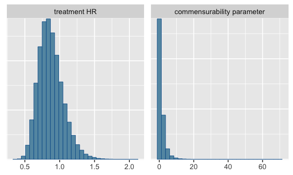
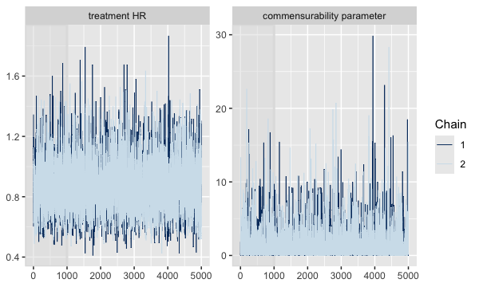

In this vignette, you'll learn how to conduct Bayesian dynamic borrowing (BDB)
analyses using `psborrow2`.

# Before you start

The functionality in this article relies on [`Stan`](https://mc-stan.org/) for model fitting,
specifically via the [`CmdStan`](https://mc-stan.org/users/interfaces/cmdstan.html)
and [`cmdstanr`](https://mc-stan.org/cmdstanr/) tools.

If you haven't used `CmdStan` before you'll need to install the R package
and the external program. More information can be found in the
[`cmdstanr` installation guide](https://mc-stan.org/cmdstanr/articles/cmdstanr.html).

The short version is:

```r
# Install the cmdstanr package
install.packages("cmdstanr", repos = c("https://mc-stan.org/r-packages/", getOption("repos")))
library(cmdstanr)

# Install the external CmdStan program
check_cmdstan_toolchain()
install_cmdstan(cores = 2)
```

Now you're ready to start with `psborrow2`.

```r
library(psborrow2)
library(cmdstanr)
```

# Creating an analysis object {.tabset}
For a BDB analysis in `psborrow2`, we need to create an object
of class `Analysis` which contains all the information needed to build a model
and compile an MCMC sampler using Stan. To create an `Analysis` object,
we will call the function `create_analysis_obj()`. Let's look at the four
required arguments to this function and evaluate them one-at-a-time.

```
create_analysis_obj(
  data_matrix,
  outcome,
  borrowing,
  treatment
)
```

## 1. `data_matrix` {.tabset}

### Required elements

`data_matrix` is where we input the one-row-per-patient `numeric` matrix for our
analysis. The column names of the matrix are not fixed, so the names of columns
will be specified in the outcome, treatment, and borrowing sections.

There are two columns required for all analyses:

* A flag denoting receipt of the experimental intervention (`1`) or not (`0`)
* A flag denoting whether the patient was part of the external data source
(`1`) or the internal trial (`0`)

#### Time-to-event

If the outcome is time-to-event, then two additional columns are needed:

* The duration of follow-up for each patient
* A flag denoting whether the patient was censored (`1`) or not (`0`)

#### Binary endpoints

If the outcome is binary, one additional column is needed:

* A flag denoting whether a patient had the event of interest (`1`) or not (`0`)

#### Covariates

Covariates may also be included in BDB analyses. These should be included
in the data matrix if the plan is to adjust for them.

***Note*** Only `numeric` matrices are supported. See [Example data] for creating such a matrix
from a `data.frame`.

***Note*** No missing data is currently allowed, all values must be non-missing.

### Example data

We will be using an example dataset stored in `psborrow2`
(`example_matrix`). If you are starting from a data frame or tibble,
you can easily create a suitable matrix with the `psborrow2` helper function
`create_data_matrix()`.

#### Creating a data matrix with `create_data_matrix()`

```r
# Start with data.frame
diabetic_df <- survival::diabetic

# For demonstration purposes, let some patients be external controls
diabetic_df$external <- ifelse(diabetic_df$trt == 0 & diabetic_df$id > 1000, 1, 0)

# Create the censor flag
diabetic_df$cens <- ifelse(diabetic_df$status == 0, 1, 0)

diabetes_matrix <- create_data_matrix(
  diabetic_df,
  outcome = c("time", "cens"),
  trt_flag_col = "trt",
  ext_flag_col = "external",
  covariates = ~ age + laser + risk
)
# Call `add_covariates()` with `covariates =  c("age", "laserargon", "risk") `

head(diabetes_matrix)
#    time cens trt external age laserargon risk
# 1 46.23    1   0        0  28          1    9
# 2 46.23    1   1        0  28          1    9
# 3 42.50    1   1        0  12          0    8
# 4 31.30    0   0        0  12          0    6
# 5 42.27    1   1        0   9          0   11
# 6 42.27    1   0        0   9          0   11
```

#### `psborrow2` example matrix
Let's look at the first few rows of the example matrix:


```r
head(example_matrix)
#      id ext trt cov4 cov3 cov2 cov1       time status cnsr resp
# [1,]  1   0   0    1    1    1    0  2.4226411      1    0    1
# [2,]  2   0   0    1    1    0    1 50.0000000      0    1    1
# [3,]  3   0   0    0    0    0    1  0.9674372      1    0    1
# [4,]  4   0   0    1    1    0    1 14.5774738      1    0    1
# [5,]  5   0   0    1    1    0    0 50.0000000      0    1    0
# [6,]  6   0   0    1    1    0    1 50.0000000      0    1    0
```

The column definitions are below:

* `ext`, 0/1, flag for external controls
* `trt`, 0/1, flag for treatment arm
* `cov1`, 0/1, a baseline covariate
* `cov2`, 0/1, a baseline covariate
* `time`, positive numeric, survival time
* `cnsr`, 0/1, censoring indicator
* `resp`, 0/1, indicator for binary response outcome

## 2. `outcome`

`psborrow2` currently supports four outcomes:

* Time-to-event with exponential distribution (constant hazard), created with
`outcome_surv_exponential()`
* Time-to-event with Weibull distribution and proportional hazards
parametrization, created with `outcome_surv_weibull_ph()`
* Binary endpoints with a Bernoulli distribution and using logistic regression,
created with `outcome_bin_logistic()`
* Continuous endpoints with a normal distribution, created with `outcome_cont_normal()`

After we select which outcome and distribution we want,
we need to specify a prior distribution for the baseline event rate,
`baseline_prior`. In this case, `baseline_prior` is
a log hazard rate. Let's assume we have no prior knowledge on this event rate,
so we'll specify an uninformative prior: `prior_normal(0, 1000)`.

For our example, let's conduct a time-to-event analysis using the exponential
distribution.


```r
outcome <- outcome_surv_exponential(
  time_var = "time",
  cens_var = "cnsr",
  baseline_prior = prior_normal(0, 1000)
)
outcome
# Outcome object with class OutcomeSurvExponential 
# 
# Outcome variables:
# time_var cens_var 
#   "time"   "cnsr" 
# 
# Baseline prior:
# Normal Distribution
# Parameters:
#  Stan  R    Value
#  mu    mean    0 
#  sigma sd   1000
```


## 3. `borrowing`

`psborrow2` supports three different borrowing methods, each of which has its own class:

* ***No borrowing***: This is the internal trial comparison without any external
data. Use `borrowing_none()` to specify this.
* ***Full borrowing***: This is pooling of the external and internal control arms. Use 
`borrowing_full()` to specify this.
* ***Bayesian dynamic borrowing with the hierarchical commensurate prior***: This borrowing is as described in [Hobbs et al. (2011)](https://doi.org/10.1111/j.1541-0420.2011.01564.x) and uses the hierarchical commensurate prior. Use `borrowing_hierarchical_commensurate()` to specify this.

The column name for the external control column flag in our matrix
is also required and passed to `ext_flag_col`.

Finally, for dynamic borrowing only, the hyperprior distribution on the commensurability
parameter must be specified. This hyperprior determines
(along with the comparability of the outcomes
between internal and external controls) how much borrowing of the external
control group will be performed. Example hyperpriors include largely
uninformative inverse gamma distributions
e.g., `prior_gamma(alpha = .001, beta = .001)` as well as more
informative distributions e.g., `prior_gamma(alpha = 1, beta = .001)`,
though any distribution on the positive real line can be used. Distributions
with more density at higher values (i.e., higher precision)
will lead to more borrowing. We'll choose an uninformative gamma prior
in this example.

***Note***: Prior distributions are outlined in greater detail in a separate
vignette, see `vignette('prior_distributions', package = 'psborrow2')`.


```r
borrowing <- borrowing_hierarchical_commensurate(
  ext_flag_col = "ext",
  tau_prior = prior_gamma(0.001, 0.001)
)
borrowing
# Borrowing object using the  Bayesian dynamic borrowing with the hierarchical commensurate prior  approach
# 
# External control flag: ext 
# 
# Commensurability parameter prior:
# Gamma Distribution
# Parameters:
#  Stan  R     Value
#  alpha shape 0.001
#  beta  rate  0.001
# Constraints: <lower=0>
```

## 3. `treatment`

Finally, treatment details are outlined in `treatment_details()`. Here, we first
specify the column for the treatment flag in `trt_flag_col`. In addition, we
need to specify the prior on the effect estimate, `trt_prior`. We'll use
another uninformative normal distribution for the prior on the treatment effect:


```r
treatment <- treatment_details(
  trt_flag_col = "trt",
  trt_prior = prior_normal(0, 1000)
)
treatment
# Treatment object
# 
# Treatment flag column: trt 
# 
# Treatment effect prior:
# Normal Distribution
# Parameters:
#  Stan  R    Value
#  mu    mean    0 
#  sigma sd   1000
```

## Application

Now that we have thought through each of the inputs to `create_analysis_obj()`,
let's create an analysis object:


```r
anls_obj <- create_analysis_obj(
  data_matrix = example_matrix,
  outcome = outcome,
  borrowing = borrowing,
  treatment = treatment,
  quiet = TRUE
)
```


The Stan model compiled successfully and informed us that we are
ready to begin sampling.

Note that if you are interested in seeing the Stan code that was generated,
you can use the `get_stan_code()` function to see the full Stan code that will
be compiled.


```r
get_stan_code(anls_obj)
# 
#   functions {
#   
# }
# 
#   data {
#   int<lower=0> N;
#   vector[N] trt;
#   vector[N] time;
# vector[N] cens;
# 
#   matrix[N,2] Z;
#   
# }
# 
#   parameters {
# real beta_trt;
# 
# real<lower=0> tau;
# vector[2] alpha;
# 
# }
# 
#   transformed parameters {
#   real HR_trt = exp(beta_trt);
# }
# 
#   model {
#   vector[N] lp;
#   vector[N] elp;
#   beta_trt ~ normal(0, 1000);
#   lp = Z * alpha + trt * beta_trt;
# elp = exp(lp) ;
#   
#   
#   tau ~ gamma(0.001, 0.001) ;
# real sigma;
# sigma = 1 / tau;
# alpha[2] ~ normal(0, 1000) ;
# alpha[1] ~ normal(alpha[2], sqrt(sigma)) ;
#   for (i in 1:N) {
#    if (cens[i] == 1) {
#       target += exponential_lccdf(time[i] | elp[i] );
#    } else {
#       target += exponential_lpdf(time[i] | elp[i] );
#    }
# }
# }
```

# Sampling from an analysis object

We can take draws from the posterior
distribution using the function `mcmc_sample()`. This function takes as input
our `Analysis` object and any arguments (other than the `data` argument)
that are passed to
[`CmdStanModel` objects](https://mc-stan.org/cmdstanr/reference/model-method-sample.html).
Note that running this may take a few minutes.


```r
results <- mcmc_sample(anls_obj,
  iter_warmup = 2000,
  iter_sampling = 50000,
  chains = 4,
  seed = 112233
)
```


# Summarizing results{.tabset}

As a `CmdStanMCMC` object, `results` has several methods which are outlined on
the
[`cmdstanr` website](https://mc-stan.org/cmdstanr/reference/CmdStanModel.html).
For instance, we can see a see a summary of the posterior distribution samples
with `results$summary()`:


```r
results$summary()
# # A tibble: 6 × 10
#   variable      mean    median     sd    mad          q5      q95  rhat ess_bulk
#   <chr>        <dbl>     <dbl>  <dbl>  <dbl>       <dbl>    <dbl> <dbl>    <dbl>
# 1 lp__     -1618.    -1618.    1.50   1.29   -1621.      -1.62e+3  1.00   71314.
# 2 beta_trt    -0.155    -0.158 0.199  0.198     -0.477    1.74e-1  1.00   85216.
# 3 tau          1.21      0.506 1.92   0.693      0.00418  4.74e+0  1.00   81024.
# 4 alpha[1]    -3.36     -3.35  0.161  0.161     -3.63    -3.10e+0  1.00   86029.
# 5 alpha[2]    -2.40     -2.40  0.0557 0.0557    -2.49    -2.31e+0  1.00  132062.
# 6 HR_trt       0.873     0.854 0.176  0.168      0.620    1.19e+0  1.00   85216.
# # ℹ 1 more variable: ess_tail <dbl>
```

The summary includes information for several parameter estimates
from our BDB model. Because it may not be immediately clear what the parameters
from the Stan model refer to, `psborrow2` has a function which returns a
variable dictionary from the analysis object to help interpret these parameters:


```r
variable_dictionary(anls_obj)
#   Stan_variable                        Description
# 1           tau         commensurability parameter
# 2      alpha[1] baseline log hazard rate, internal
# 3      alpha[2] baseline log hazard rate, external
# 4      beta_trt                   treatment log HR
# 5        HR_trt                       treatment HR
```

We can also capture all of the draws by calling `results$draws()`, which
returns an object of class `draws`. `draws` objects are
common in many MCMC sampling software packages and allow us to leverage
packages such as `posterior` and `bayesplot`.


```r
draws <- results$draws()
print(draws)
# # A draws_array: 50000 iterations, 4 chains, and 6 variables
# , , variable = lp__
# 
#          chain
# iteration     1     2     3     4
#         1 -1616 -1616 -1616 -1616
#         2 -1616 -1616 -1618 -1618
#         3 -1616 -1617 -1619 -1617
#         4 -1616 -1618 -1619 -1618
#         5 -1617 -1617 -1617 -1617
# 
# , , variable = beta_trt
# 
#          chain
# iteration     1      2      3      4
#         1 -0.20 -0.009 -0.022 -0.109
#         2 -0.31 -0.092 -0.167 -0.305
#         3 -0.16 -0.082  0.027  0.092
#         4 -0.24 -0.319 -0.092  0.226
#         5 -0.30 -0.081 -0.012 -0.439
# 
# , , variable = tau
# 
#          chain
# iteration    1    2    3    4
#         1 1.62 1.14 1.94 2.58
#         2 0.84 1.03 1.32 0.23
#         3 0.48 1.90 0.61 1.12
#         4 1.46 0.48 0.18 0.48
#         5 0.33 1.64 0.32 2.15
# 
# , , variable = alpha[1]
# 
#          chain
# iteration    1    2    3    4
#         1 -3.4 -3.4 -3.5 -3.4
#         2 -3.3 -3.4 -3.5 -3.4
#         3 -3.4 -3.4 -3.7 -3.5
#         4 -3.3 -3.4 -3.6 -3.6
#         5 -3.3 -3.5 -3.5 -3.2
# 
# # ... with 49995 more iterations, and 2 more variables
```

`psborrow2` also has a function to rename variables in `draws`
objects to be more interpretable, `rename_draws_covariates()`. This function
uses the `variable_dictionary` labels. Let's use it here to make the results
easier to interpret:


```r
draws <- rename_draws_covariates(draws, anls_obj)
summary(draws)
# # A tibble: 6 × 10
#   variable          mean   median     sd    mad       q5      q95  rhat ess_bulk
#   <chr>            <dbl>    <dbl>  <dbl>  <dbl>    <dbl>    <dbl> <dbl>    <dbl>
# 1 lp__          -1.62e+3 -1.62e+3 1.50   1.29   -1.62e+3 -1.62e+3  1.00   71314.
# 2 treatment lo… -1.55e-1 -1.58e-1 0.199  0.198  -4.77e-1  1.74e-1  1.00   85216.
# 3 commensurabi…  1.21e+0  5.06e-1 1.92   0.693   4.18e-3  4.74e+0  1.00   81024.
# 4 baseline log… -3.36e+0 -3.35e+0 0.161  0.161  -3.63e+0 -3.10e+0  1.00   86029.
# 5 baseline log… -2.40e+0 -2.40e+0 0.0557 0.0557 -2.49e+0 -2.31e+0  1.00  132062.
# 6 treatment HR   8.73e-1  8.54e-1 0.176  0.168   6.20e-1  1.19e+0  1.00   85216.
# # ℹ 1 more variable: ess_tail <dbl>
```

## Using `bayesplot`

With `draws` objects and the `bayesplot` package, we can create many useful visual summary
plots. We can visualize the marginal posterior distribution of a
variable we are interested in by plotting histograms of the draws with the
function `mcmc_hist()`. Let's do that for the Hazard ratio for the treatment
effect and for our commensurability parameter, tau.


```r
bayesplot::mcmc_hist(draws, c("treatment HR", "commensurability parameter"))
```

<div class="figure" style="text-align: center">

<p class="caption">plot of chunk mcmc-hist</p>
</div>

We can see other plots that help us understand and diagnose problems with
the MCMC sampler, such as trace and rank plots:


```r
bayesplot::color_scheme_set("mix-blue-pink")

bayesplot::mcmc_trace(
  draws[1:5000, 1:2, ], # Using a subset of draws only
  pars = c("treatment HR", "commensurability parameter"),
  n_warmup = 1000
)
```

<div class="figure" style="text-align: center">

<p class="caption">plot of chunk mcmc-trace</p>
</div>

Many other functions are outlined in the
[`bayesplot` vignettes](https://mc-stan.org/bayesplot/).

## Using `posterior`

`draws` objects are also supported by the `posterior` package,
which provides many other tools for analyzing MCMC draw data. For instance, we
can use the `summarize_draws()` function to derive 80% credible intervals
for all parameters:


```r
library(posterior)
summarize_draws(draws, ~ quantile(.x, probs = c(0.1, 0.9)))
# # A tibble: 6 × 3
#   variable                                `10%`     `90%`
#   <chr>                                   <dbl>     <dbl>
# 1 lp__                               -1620.     -1616.   
# 2 treatment log HR                      -0.408      0.100
# 3 commensurability parameter             0.0172     3.22 
# 4 baseline log hazard rate, internal    -3.57      -3.15 
# 5 baseline log hazard rate, external    -2.47      -2.33 
# 6 treatment HR                           0.665      1.11
```

Another useful application of the `posterior` package is the evaluation of the Monte Carlo
standard error for quantiles of a variable of interest:


```r
vm <- extract_variable_matrix(draws, "treatment HR")
mcse_quantile(x = vm, probs = c(0.1, 0.5, 0.9))
#  mcse_q10  mcse_q50  mcse_q90 
# 0.0006465 0.0006845 0.0012300
```

`posterior` contains many other helpful functions, as outlined in their
[vignettes](https://CRAN.R-project.org/package=posterior/vignettes/posterior.html).
