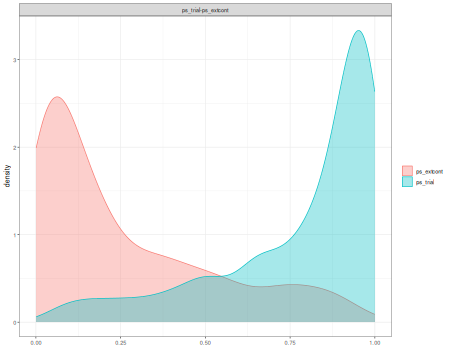
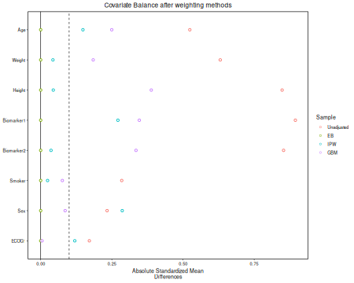
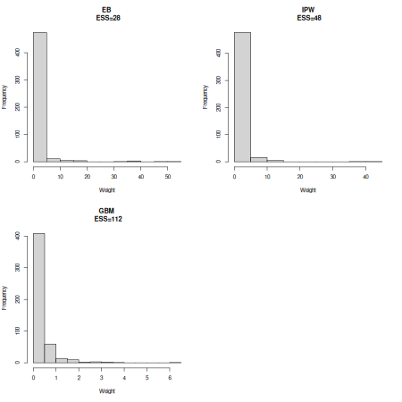

Using external control in the analysis of clinical trial data can be challenging as the two data source may be heterogeneous. In this document, we demonstrate the use of various matching and weighting techniques using readily available packages in R to adjust for imbalance in baseline covariates between the data sets. 

We first load all of the libraries used in this tutorial. 


``` r
# Loading the libraries
library(SimMultiCorrData)
library(ebal)
library(ggplot2)
library(tableone)
library(MatchIt)
library(twang)
library(cobalt)
library(dplyr)
library(overlapping)
library(survey)
```

To demonstrate the utility of the tools, we simulate data for a randomized controlled trial (RCT) and a dataset with external controls. We simulate a two arm trial where approximately $70\%$ of subjects receive the active treatment. The sample size for the RCT and external data is $n_D=600$ and $n_K=500$ respectively. In the RCT, we generate $5$ continuous and $3$ binary baseline covariates $X$ as follows:

* The continuous variables are
    + Age (years): mean = $55$ and variance = $15$
    + Weight (lbs): mean = $150$ and variance = $10$
    + Height (inches): mean = $65$ and variance = $6$
    + Biomarker1: mean = $53$ and variance = $5$
    + Biomarker2: mean = $50$ and variance = $6$


* The categorical variables are
    + Smoker: Yes = 1 and No = 0. Proportion of Yes is $20\%$.
    + Sex: Male = 1 and Female = 0. Proportion of Male is $80\%$.
    + ECOG1: ECOG 1 = 1 and ECOG 0 = 0. Proportion of ECOG 1 is $30\%$.

We simulate covariates with a correlation coefficient of $0.2$ between all variables. For the continuous variables, we also specify the skewness and kurtosis to be $0.2$ and $0.1$, respectively, for all variables. Given the randomized nature of the RCT, subjects are assigned treatment at random. 

Other variables in the simulated data include
    
* The treatment indicator is
    + group: group = 1 is treatment and group = 0 is placebo.
 
    
* The time to event variable is
    + time
 
    
* The event indicator variable is
    + event: event = 1 is an event indicator and event = 0 is censored

    
* The data indicator variable is
    + data: data = TRIAL indicating the trial data set

To generate the covariates, we first specify the sample sizes, number of continuous and categorical variables, the marginal moments of the covariates, and the correlation matrix. Note that rcorrvar2 requires the correlation matrix to be ordered as ordinal, continuous, Poisson, and Negative Binomial.

``` r
# Simulate correlated covariates
n_t <- 600 # Sample size in trial data
n_ec <- 500 # Sample size in external control data
k_cont <- 5 # Number of continuous variables
k_cat <- 3 # Number of categorical variables
means_cont_tc <- c(55, 150, 65, 35, 50) # Vector of means of continuous variables
vars_cont_tc <- c(15, 10, 6, 5, 6)
marginal_tc <- list(0.2, 0.8, 0.3)
rho_tc <- matrix(0.2, 8, 8)
diag(rho_tc) <- 1
skews_tc <- rep(0.2, 5)
skurts_tc <- rep(0.1, 5)
```

# Simulating trial data
After specifying the moments of the covariate distribution, we simulate the covariates using `rcorrvar2` function from `SimMultiCorrData` package.

``` r
# Simulating covariates
trial.data <- rcorrvar2(
  n = n_t, k_cont = k_cont, k_cat = k_cat, k_nb = 0,
  method = "Fleishman", seed = 1,
  means = means_cont_tc, vars = vars_cont_tc, # if continuous variables
  skews = skews_tc, skurts = skurts_tc,
  marginal = marginal_tc, rho = rho_tc
)
#> 
#>  Constants: Distribution  1  
#> 
#>  Constants: Distribution  2  
#> 
#>  Constants: Distribution  3  
#> 
#>  Constants: Distribution  4  
#> 
#>  Constants: Distribution  5  
#> 
#> Constants calculation time: 0.001 minutes 
#> Intercorrelation calculation time: 0.001 minutes 
#> Error loop calculation time: 0 minutes 
#> Total Simulation time: 0.002 minutes
```


``` r
trial.data <- data.frame(cbind(
  id = paste("TRIAL", 1:n_t, sep = ""), trial.data$continuous_variables,
  ifelse(trial.data$ordinal_variables == 1, 1, 0)
))
colnames(trial.data) <- c(
  "ID", "Age", "Weight", "Height", "Biomarker1", "Biomarker2", "Smoker",
  "Sex", "ECOG1"
)
```

We now simulate the survival outcome data using the Cox proportional hazards model [@cox1972regression] in which the hazard function $\lambda(t|\boldsymbol X, Z)$  is given by $$\lambda(t|\boldsymbol X, Z)=\lambda_0(t) \exp\{\boldsymbol X \boldsymbol \beta_{Trial} + Z \gamma\},$$

where $\lambda_0(t)=2$ is the baseline hazard function and assumed to be constant, $\boldsymbol X$ is a matrix of baseline covariates, $\boldsymbol \beta_{Trial}$ is a vector of covariate effects, $Z$ is the treatment indicator, and $\gamma$ is the treatment effect in terms of the log hazard ratio. 

<!-- #MS maybe this section below can be deleted, it might not be necessary to provide all of the coefficients -->
<!-- *   The true value of the covariates effect and treatment effect are -->
<!--       + $\beta_{Age,Trial}=0.3$ -->
<!--       + $\beta_{Weight,Trial}=0.1$ -->
<!--       + $\beta_{Height,Trial}=-0.3$ -->
<!--       + $\beta_{Biomarker1,Trial}=-0.2$ -->
<!--       + $\beta_{Biomarker2,Trial}=-0.12$ -->
<!--       + $\beta_{Smoker,Trial}=0.3$ -->
<!--       + $\beta_{Sex,Trial}=1$ -->
<!--       + $\beta_{ECOG1,Trial}=-1$ -->
<!--       + $\gamma=-0.4$ -->
      
The survival function is given by $$S(t|\boldsymbol X, Z)=exp\{-\Lambda(t|\boldsymbol X, Z)\},$$ where $\Lambda(t|\boldsymbol X, Z)=\int_0^t\lambda(u|\boldsymbol X, Z)du$. The time to event is generated using a inverse CDF method. The censoring time is generated independently from an exponential distribution with `rate=1/4`.

``` r
# Simulate survival outcome using Cox proportional hazards regression model
set.seed(1)
u <- runif(1)
lambda0 <- 2 # constant baseline hazard
# Simulate treatment indicator in the trial data
trial.data$group <- rbinom(n_t, 1, prob = 0.7)
beta <- c(0.3, 0.1, -0.3, -0.2, -0.12, 0.3, 1, -1, -0.4)
times <- -log(u) / (lambda0 * exp(as.matrix(trial.data[, -1]) %*% beta)) # Inverse CDF method
cens.time <- rexp(n_t, rate = 1 / 4) # Censoring time from exponential distribution
event <- as.numeric(times <= cens.time) # Event indicator. 0 is censored.
time <- pmin(times, cens.time)
```


``` r
# Combine trial data
trial.data <- data.frame(trial.data, time, event, data = "TRIAL")
```
The first 10 observations in the RCT data is shown below.


|ID      |      Age|   Weight|   Height| Biomarker1| Biomarker2| Smoker| Sex| ECOG1| group|      time| event|data  |
|:-------|--------:|--------:|--------:|----------:|----------:|------:|---:|-----:|-----:|---------:|-----:|:-----|
|TRIAL1  | 55.51419| 148.5092| 65.63899|   33.71898|   55.26178|      0|   1|     0|     1| 0.4089043|     0|TRIAL |
|TRIAL2  | 49.93326| 146.9441| 63.44883|   35.65828|   45.50928|      1|   1|     1|     1| 0.9721405|     0|TRIAL |
|TRIAL3  | 58.51588| 153.5435| 70.53193|   35.53710|   55.89283|      0|   1|     0|     0| 0.2956919|     0|TRIAL |
|TRIAL4  | 48.61226| 147.2873| 64.10615|   31.17663|   55.80523|      0|   1|     0|     1| 4.3111823|     0|TRIAL |
|TRIAL5  | 51.84943| 151.0312| 62.16361|   33.99677|   48.01981|      0|   1|     0|     0| 0.2644848|     0|TRIAL |
|TRIAL6  | 51.81743| 148.1115| 68.69766|   33.82398|   47.32652|      1|   1|     0|     0| 0.3103544|     0|TRIAL |
|TRIAL7  | 58.04648| 150.2572| 71.35831|   38.71276|   50.68694|      0|   1|     0|     1| 1.7177436|     0|TRIAL |
|TRIAL8  | 50.72777| 147.1815| 64.55223|   33.86884|   49.31299|      0|   1|     1|     1| 5.2652367|     0|TRIAL |
|TRIAL9  | 55.16073| 145.0733| 63.84238|   36.28519|   50.27354|      0|   1|     1|     1| 3.9595461|     1|TRIAL |
|TRIAL10 | 54.85184| 146.4757| 65.59890|   36.21950|   47.12495|      1|   1|     0|     1| 1.1788494|     1|TRIAL |


The censoring and event rate in the RCT data is 

``` r
table(trial.data$event) / nrow(trial.data)
#> 
#>         0         1 
#> 0.3883333 0.6116667
```

The distribution of the outcome time is

``` r
summary(trial.data$time)
#>     Min.  1st Qu.   Median     Mean  3rd Qu.     Max. 
#>  0.00771  0.35048  0.89904  1.61350  2.04652 21.27312
```


The summary of each of the baseline covariates and their standardized mean difference between treatment arms is shown below.

``` r
myVars <- c(
  "Age", "Weight", "Height", "Biomarker1", "Biomarker2", "Smoker", "Sex",
  "ECOG1"
)

## Vector of categorical variables
catVars <- c("Smoker", "Sex", "ECOG1", "group")

tab1 <- CreateTableOne(vars = myVars, strata = "group", data = trial.data, factorVars = catVars)
```


``` r
print(tab1, smd = TRUE)
#>                         Stratified by group
#>                          0              1              p      test SMD   
#>   n                         178            422                           
#>   Age (mean (SD))         54.82 (4.00)   55.08 (3.83)   0.451       0.067
#>   Weight (mean (SD))     150.18 (3.02)  149.92 (3.24)   0.357       0.084
#>   Height (mean (SD))      65.30 (2.39)   64.88 (2.49)   0.056       0.173
#>   Biomarker1 (mean (SD))  35.26 (2.38)   34.89 (2.16)   0.066       0.161
#>   Biomarker2 (mean (SD))  50.21 (2.52)   49.91 (2.43)   0.181       0.119
#>   Smoker = 1 (%)             32 (18.0)      87 (20.6)   0.530       0.067
#>   Sex = 1 (%)               132 (74.2)     344 (81.5)   0.054       0.178
#>   ECOG1 = 1 (%)              44 (24.7)     139 (32.9)   0.057       0.182
```

# Simulating external control data
The same set of covariates $X$ were simulated for the external control data as the RCT. The means, variances for continuous variables and proportion for categorical variables are modified for the external controls compared to the RCT according to the code below.


``` r
means_cont_ec <- c(55 + 2, 150 - 2, 65 - 2, 35 + 2, 50 - 2) # Vector of means of continuous variables
vars_cont_ec <- c(14, 10, 5, 5, 5)
marginal_ec <- list(0.3, 0.7, 0.4)
ext.cont.data <- rcorrvar2(
  n = n_ec, k_cont = k_cont, k_cat = k_cat, k_nb = 0,
  method = "Fleishman", seed = 3,
  means = means_cont_ec, vars = vars_cont_ec, # if continuous variables
  skews = skews_tc, skurts = skurts_tc,
  marginal = marginal_ec, rho = rho_tc
)
#> 
#>  Constants: Distribution  1  
#> 
#>  Constants: Distribution  2  
#> 
#>  Constants: Distribution  3  
#> 
#>  Constants: Distribution  4  
#> 
#>  Constants: Distribution  5  
#> 
#> Constants calculation time: 0.001 minutes 
#> Intercorrelation calculation time: 0.001 minutes 
#> Error loop calculation time: 0 minutes 
#> Total Simulation time: 0.002 minutes
```


``` r
ext.cont.data <- data.frame(cbind(
  id = paste("EC", 1:n_ec, sep = ""), ext.cont.data$continuous_variables,
  ifelse(ext.cont.data$ordinal_variables == 1, 1, 0)
))
colnames(ext.cont.data) <- c("ID", "Age", "Weight", "Height", "Biomarker1", "Biomarker2", "Smoker", "Sex", "ECOG1")
```

The same generating mechanism used for the RCT data was used to simulate survival time for the external controls.

``` r
# Simulate survival outcome using Cox proportional hazards regression model
set.seed(1111)
u <- runif(1)
lambda0 <- 6 # constant baseline hazard
beta <- c(-0.27, -0.1, 0.3, 0.2, 0.1, -0.31, -1, 1)
times <- -log(u) / (lambda0 * exp(as.matrix(ext.cont.data[, -1]) %*% beta)) # Inverse CDF method
cens.time <- rexp(n_ec, rate = 3) # Censoring time from exponential distribution
event <- as.numeric(times <= cens.time) # Event indicator. 0 is censored.
time <- pmin(times, cens.time)

# Simulate treatment indicator in the trial data
group <- 0

ext.cont.data <- data.frame(ext.cont.data, group, time, event, data = "EC")
```
The first 10 observations in the external control data is shown below.

``` r
knitr::kable(head(ext.cont.data, 10))
```


|ID   |      Age|   Weight|   Height| Biomarker1| Biomarker2| Smoker| Sex| ECOG1| group|      time| event|data |
|:----|--------:|--------:|--------:|----------:|----------:|------:|---:|-----:|-----:|---------:|-----:|:----|
|EC1  | 53.56019| 146.2147| 61.51467|   40.84616|   49.72928|      1|   1|     1|     0| 0.0140666|     1|EC   |
|EC2  | 63.77695| 152.2142| 62.02556|   38.95175|   49.78448|      0|   0|     0|     0| 0.0316781|     0|EC   |
|EC3  | 56.99771| 149.1450| 62.24326|   36.20215|   44.16568|      0|   1|     0|     0| 0.0269829|     0|EC   |
|EC4  | 59.12390| 149.8345| 59.44829|   39.34725|   49.72269|      0|   1|     0|     0| 0.4541084|     1|EC   |
|EC5  | 61.69661| 147.6965| 64.49722|   37.18740|   52.32832|      0|   1|     0|     0| 0.1916924|     1|EC   |
|EC6  | 61.68715| 151.9682| 64.44483|   37.41585|   51.00122|      0|   1|     0|     0| 0.0889376|     0|EC   |
|EC7  | 55.67649| 152.5314| 62.15795|   38.39580|   45.32034|      0|   1|     1|     0| 0.0368207|     0|EC   |
|EC8  | 53.59508| 145.5144| 64.03617|   36.10634|   47.25504|      0|   1|     1|     0| 0.0150613|     1|EC   |
|EC9  | 56.72507| 150.8987| 59.97046|   36.71559|   47.23557|      0|   0|     0|     0| 0.0379876|     0|EC   |
|EC10 | 53.92706| 148.9728| 63.72740|   39.32683|   48.73124|      0|   0|     0|     0| 0.0115712|     1|EC   |


The censoring and event rate in the trial data is 

``` r
table(ext.cont.data$event) / nrow(ext.cont.data)
#> 
#>    0    1 
#> 0.33 0.67
```

The distribution of the outcome time is

``` r
summary(ext.cont.data$time)
#>      Min.   1st Qu.    Median      Mean   3rd Qu.      Max. 
#> 1.655e-05 2.108e-02 5.736e-02 9.317e-02 1.281e-01 8.529e-01
```

# Merging trial and external control data
We can use `bind_rows` function to merge two datasets. Before using this function, we make sure that the column names for the same variables are consistent in the two datasets.


``` r
names(ext.cont.data)
#>  [1] "ID"         "Age"        "Weight"     "Height"     "Biomarker1"
#>  [6] "Biomarker2" "Smoker"     "Sex"        "ECOG1"      "group"     
#> [11] "time"       "event"      "data"
```


``` r
names(trial.data)
#>  [1] "ID"         "Age"        "Weight"     "Height"     "Biomarker1"
#>  [6] "Biomarker2" "Smoker"     "Sex"        "ECOG1"      "group"     
#> [11] "time"       "event"      "data"
# MS I recommend adding a statement that forces the colnames to be the same, like names(ex.cont.data)[1:10]=names(trial.data)[1:10]
```

Now, we merge the two datasets.


``` r
final.data <- data.frame(bind_rows(trial.data, ext.cont.data))
```


``` r
knitr::kable(head(final.data, 10))
```


|ID      |      Age|   Weight|   Height| Biomarker1| Biomarker2| Smoker| Sex| ECOG1| group|      time| event|data  |
|:-------|--------:|--------:|--------:|----------:|----------:|------:|---:|-----:|-----:|---------:|-----:|:-----|
|TRIAL1  | 55.51419| 148.5092| 65.63899|   33.71898|   55.26178|      0|   1|     0|     1| 0.4089043|     0|TRIAL |
|TRIAL2  | 49.93326| 146.9441| 63.44883|   35.65828|   45.50928|      1|   1|     1|     1| 0.9721405|     0|TRIAL |
|TRIAL3  | 58.51588| 153.5435| 70.53193|   35.53710|   55.89283|      0|   1|     0|     0| 0.2956919|     0|TRIAL |
|TRIAL4  | 48.61226| 147.2873| 64.10615|   31.17663|   55.80523|      0|   1|     0|     1| 4.3111823|     0|TRIAL |
|TRIAL5  | 51.84943| 151.0312| 62.16361|   33.99677|   48.01981|      0|   1|     0|     0| 0.2644848|     0|TRIAL |
|TRIAL6  | 51.81743| 148.1115| 68.69766|   33.82398|   47.32652|      1|   1|     0|     0| 0.3103544|     0|TRIAL |
|TRIAL7  | 58.04648| 150.2572| 71.35831|   38.71276|   50.68694|      0|   1|     0|     1| 1.7177436|     0|TRIAL |
|TRIAL8  | 50.72777| 147.1815| 64.55223|   33.86884|   49.31299|      0|   1|     1|     1| 5.2652367|     0|TRIAL |
|TRIAL9  | 55.16073| 145.0733| 63.84238|   36.28519|   50.27354|      0|   1|     1|     1| 3.9595461|     1|TRIAL |
|TRIAL10 | 54.85184| 146.4757| 65.59890|   36.21950|   47.12495|      1|   1|     0|     1| 1.1788494|     1|TRIAL |


``` r
knitr::kable(tail(final.data, 10))
```


|     |ID    |      Age|   Weight|   Height| Biomarker1| Biomarker2| Smoker| Sex| ECOG1| group|      time| event|data |
|:----|:-----|--------:|--------:|--------:|----------:|----------:|------:|---:|-----:|-----:|---------:|-----:|:----|
|1091 |EC491 | 69.53940| 159.5926| 67.71536|   39.26545|   52.12297|      0|   1|     0|     0| 0.8529239|     0|EC   |
|1092 |EC492 | 53.47004| 138.5339| 57.64346|   33.99965|   45.82407|      1|   1|     1|     0| 0.0578393|     0|EC   |
|1093 |EC493 | 56.55503| 152.2442| 63.43464|   37.62576|   44.14769|      1|   0|     0|     0| 0.1079433|     1|EC   |
|1094 |EC494 | 60.55909| 152.8971| 64.70891|   41.42971|   48.20160|      0|   1|     0|     0| 0.1439600|     1|EC   |
|1095 |EC495 | 57.59334| 147.7045| 63.79287|   41.56532|   51.17375|      1|   1|     0|     0| 0.0498988|     1|EC   |
|1096 |EC496 | 61.84329| 147.6566| 67.33102|   36.45325|   52.91298|      0|   1|     0|     0| 0.0927341|     1|EC   |
|1097 |EC497 | 63.15644| 146.0702| 59.24182|   39.62219|   46.17372|      1|   1|     0|     0| 0.1711318|     0|EC   |
|1098 |EC498 | 55.08102| 148.2339| 63.41347|   40.50234|   48.40309|      1|   0|     0|     0| 0.0179590|     1|EC   |
|1099 |EC499 | 57.80213| 149.0080| 63.27848|   32.43753|   49.81902|      1|   1|     0|     0| 0.0295196|     0|EC   |
|1100 |EC500 | 56.92428| 148.5391| 63.78767|   35.68987|   49.34849|      0|   1|     0|     0| 0.0514581|     0|EC   |


We examine the standardized mean difference for covariates between the RCT and external control data before conducting matching/weighting. Note that `strata="data"` in the following code.


``` r
tab2 <- CreateTableOne(vars = myVars, strata = "data", data = final.data, factorVars = catVars)
```


``` r
print(tab2, smd = TRUE)
#>                         Stratified by data
#>                          EC             TRIAL          p      test SMD   
#>   n                         500            600                           
#>   Age (mean (SD))         57.00 (3.75)   55.00 (3.88)  <0.001       0.524
#>   Weight (mean (SD))     148.00 (3.17)  150.00 (3.17)  <0.001       0.631
#>   Height (mean (SD))      63.00 (2.24)   65.00 (2.47)  <0.001       0.848
#>   Biomarker1 (mean (SD))  37.00 (2.24)   35.00 (2.24)  <0.001       0.895
#>   Biomarker2 (mean (SD))  48.00 (2.23)   50.00 (2.46)  <0.001       0.853
#>   Smoker = 1 (%)            161 (32.2)     119 (19.8)  <0.001       0.285
#>   Sex = 1 (%)               346 (69.2)     476 (79.3)  <0.001       0.233
#>   ECOG1 = 1 (%)             193 (38.6)     183 (30.5)   0.006       0.171
```

Note that the standardized mean difference for all covariates is large. Next, we will conduct matching/weighting approach to reduce difference in baseline characteristics.

We also examine the standardized mean difference for covariates between the treated and control patients before conducting matching/weighting. Note that `strata="group"` in the following code.


``` r
tab2 <- CreateTableOne(vars = myVars, strata = "group", data = final.data, factorVars = catVars)
```


``` r
print(tab2, smd = TRUE)
#>                         Stratified by group
#>                          0              1              p      test SMD   
#>   n                         678            422                           
#>   Age (mean (SD))         56.43 (3.94)   55.08 (3.83)  <0.001       0.347
#>   Weight (mean (SD))     148.57 (3.27)  149.92 (3.24)  <0.001       0.415
#>   Height (mean (SD))      63.60 (2.50)   64.88 (2.49)  <0.001       0.510
#>   Biomarker1 (mean (SD))  36.54 (2.40)   34.89 (2.16)  <0.001       0.723
#>   Biomarker2 (mean (SD))  48.58 (2.50)   49.91 (2.43)  <0.001       0.541
#>   Smoker = 1 (%)            193 (28.5)      87 (20.6)   0.005       0.183
#>   Sex = 1 (%)               478 (70.5)     344 (81.5)  <0.001       0.260
#>   ECOG1 = 1 (%)             237 (35.0)     139 (32.9)   0.535       0.043
```

# Propensity scores overlap

Before applying the matching/weighting methods, we investigate the overlapping of propensity scores. The overlapping coefficient is only $0.19$ indicating a very small overlap.


``` r
final.data$indicator <- ifelse(final.data$data == "TRIAL", 1, 0)
ps.logit <- glm(
  indicator ~ Age + Weight + Height + Biomarker1 + Biomarker2 + Smoker +
    Sex + ECOG1,
  data = final.data,
  family = binomial
)
psfit <- predict(ps.logit, type = "response", data = final.data)

ps_trial <- psfit[final.data$indicator == 1]
ps_extcont <- psfit[final.data$indicator == 0]
```


``` r
overlap(list(ps_trial = ps_trial, ps_extcont = ps_extcont), plot = TRUE)
```

<div class="figure" style="text-align: center">

<p class="caption">plot of chunk unnamed-chunk-28</p>
</div>

```
#> $OV
#> [1] 0.3854194
```

# Matching Methods

We will explore several matching methods to balance the balance the baseline characteristics between subjects in the RCT and external control data.

* Matching methods
    + 1:1 Nearest Neighbor Propensity score matching with a caliper width of 0.2 of the standard deviation of the logit of the propensity score      (PSML)
    + 1:1 Nearest Neighbor Propensity score matching with a caliper width of 0.2 of the standard deviation of raw propensity score                   (PSMR)
    + Genetic matching with replacement  (GM)
    + 1:1 Genetic matching without replacement (GMW)
    + 1:1 Optimal matching (OM)

All of the matching methods can be conducted using the `MatchIt` package. The matching is conducted between the RCT subjects and external control subjects. Hence, we introduce a variable named `indicator` in `final.data` to represent the data source indicator.


``` r
final.data$indicator <- ifelse(final.data$data == "TRIAL", 1, 0)
```
## PSML
This matching method is a variation of nearest neighbour or greedy matching that selects matches based on the difference in the logit of the propensity score, up to a certain distance (caliper) [@austin2011optimal]. We selected a caliper width of 0.2 of the standard deviation of the logit of the propensity score, where the propensity score is estimated using a logistic regression.

``` r
m.out.nearest.ratio1.caliper.lps <- matchit(
  indicator ~ Age + Weight + Height + Biomarker1 + Biomarker2 + Smoker +
    Sex + ECOG1,
  estimand = "ATT", data = final.data,
  method = "nearest", ratio = 1, caliper = 0.20,
  distance = "glm", link = "linear.logit", replace = FALSE,
  m.order = "largest"
)
#> Warning: Fewer control units than treated units; not all treated units will get
#> a match.
summary(m.out.nearest.ratio1.caliper.lps)
#> 
#> Call:
#> matchit(formula = indicator ~ Age + Weight + Height + Biomarker1 + 
#>     Biomarker2 + Smoker + Sex + ECOG1, data = final.data, method = "nearest", 
#>     distance = "glm", link = "linear.logit", estimand = "ATT", 
#>     replace = FALSE, m.order = "largest", caliper = 0.2, ratio = 1)
#> 
#> Summary of Balance for All Data:
#>            Means Treated Means Control Std. Mean Diff. Var. Ratio eCDF Mean
#> distance          2.0399       -1.6492          1.8996     1.0714    0.4135
#> Age              55.0001       57.0003         -0.5155     1.0679    0.1491
#> Weight          150.0006      148.0001          0.6303     1.0033    0.1714
#> Height           65.0010       63.0002          0.8102     1.2116    0.2249
#> Biomarker1       34.9998       36.9998         -0.8948     0.9993    0.2396
#> Biomarker2       50.0003       47.9994          0.8139     1.2201    0.2240
#> Smoker            0.1983        0.3220         -0.3101          .    0.1237
#> Sex               0.7933        0.6920          0.2503          .    0.1013
#> ECOG1             0.3050        0.3860         -0.1759          .    0.0810
#>            eCDF Max
#> distance     0.6710
#> Age          0.2287
#> Weight       0.2627
#> Height       0.3300
#> Biomarker1   0.3837
#> Biomarker2   0.3457
#> Smoker       0.1237
#> Sex          0.1013
#> ECOG1        0.0810
#> 
#> Summary of Balance for Matched Data:
#>            Means Treated Means Control Std. Mean Diff. Var. Ratio eCDF Mean
#> distance          0.3235       -0.0285          0.1812     1.2964    0.0459
#> Age              55.9123       56.1154         -0.0523     1.2509    0.0276
#> Weight          149.0808      148.6717          0.1289     0.7273    0.0419
#> Height           63.9712       63.8891          0.0332     0.9906    0.0251
#> Biomarker1       35.6912       36.1098         -0.1873     1.1815    0.0645
#> Biomarker2       48.8531       48.9186         -0.0266     1.0961    0.0167
#> Smoker            0.2731        0.2454          0.0697          .    0.0278
#> Sex               0.7593        0.7361          0.0572          .    0.0231
#> ECOG1             0.3750        0.3611          0.0302          .    0.0139
#>            eCDF Max Std. Pair Dist.
#> distance     0.1806          0.1818
#> Age          0.0880          1.0436
#> Weight       0.0972          1.0238
#> Height       0.0833          0.9004
#> Biomarker1   0.1667          1.0620
#> Biomarker2   0.0602          0.8814
#> Smoker       0.0278          0.9753
#> Sex          0.0231          0.9490
#> ECOG1        0.0139          0.9955
#> 
#> Sample Sizes:
#>           Control Treated
#> All           500     600
#> Matched       216     216
#> Unmatched     284     384
#> Discarded       0       0
```


``` r
final.data$ratio1_caliper_weights_lps <- m.out.nearest.ratio1.caliper.lps$weights
```

We now compare the SMD between the two datasets.


``` r
svy <- svydesign(id = ~0, data = final.data, weights = ~ratio1_caliper_weights_lps)
t1 <- svyCreateTableOne(vars = myVars, strata = "data", data = svy, factorVars = catVars)
```


``` r
print(t1, smd = TRUE)
#>                         Stratified by data
#>                          EC             TRIAL          p      test SMD   
#>   n                      216.00         216.00                           
#>   Age (mean (SD))         56.12 (3.50)   55.91 (3.92)   0.570       0.055
#>   Weight (mean (SD))     148.67 (3.23)  149.08 (2.76)   0.157       0.136
#>   Height (mean (SD))      63.89 (2.07)   63.97 (2.06)   0.680       0.040
#>   Biomarker1 (mean (SD))  36.11 (2.04)   35.69 (2.21)   0.041       0.197
#>   Biomarker2 (mean (SD))  48.92 (2.08)   48.85 (2.18)   0.750       0.031
#>   Smoker = 1 (%)           53.0 (24.5)    59.0 (27.3)   0.511       0.063
#>   Sex = 1 (%)             159.0 (73.6)   164.0 (75.9)   0.580       0.053
#>   ECOG1 = 1 (%)            78.0 (36.1)    81.0 (37.5)   0.765       0.029
```
<!-- "Hi Ming, does the following make sense to you? Maybe we don't need this. I am thinking to include SMD between the data sets as well as the SMD between all treated patients and all control patients from trial along with matched external control patients." -->

<!-- We also examine the SMD between all treated patients and all control patients from trial along with matched external control patients. -->
<!-- ```{r message=FALSE} -->
<!-- final.data$ratio1_caliper_weights_lps_star = 1 -->
<!-- final.data$ratio1_caliper_weights_lps_star[final.data$data=="EC"] = final.data$ratio1_caliper_weights_lps[final.data$data=="EC"] -->
<!-- ``` -->

<!-- ```{r message=FALSE} -->
<!-- svy <- svydesign(id = ~0, data=final.data,weights = ~ratio1_caliper_weights_lps_star) -->
<!-- t1 <- svyCreateTableOne(vars = myVars, strata = "group" , data = svy, factorVars = catVars) -->
<!-- ``` -->

<!-- ```{r message=FALSE} -->
<!-- print(t1,smd=TRUE) -->
<!-- ``` -->

## PSMR
This matching method is similar to PSML except the caliper width of 0.2 is based on the standard deviation of the propensity score scale [@stuart2011nonparametric].


``` r
m.out.nearest.ratio1.caliper <- matchit(
  indicator ~ Age + Weight + Height + Biomarker1 + Biomarker2 + Smoker +
    Sex + ECOG1,
  estimand = "ATT", data = final.data,
  method = "nearest", ratio = 1, caliper = 0.2, replace = FALSE
)
#> Warning: Fewer control units than treated units; not all treated units will get
#> a match.
summary(m.out.nearest.ratio1.caliper)
#> 
#> Call:
#> matchit(formula = indicator ~ Age + Weight + Height + Biomarker1 + 
#>     Biomarker2 + Smoker + Sex + ECOG1, data = final.data, method = "nearest", 
#>     estimand = "ATT", replace = FALSE, caliper = 0.2, ratio = 1)
#> 
#> Summary of Balance for All Data:
#>            Means Treated Means Control Std. Mean Diff. Var. Ratio eCDF Mean
#> distance          0.7838        0.2594          2.1718     0.8578    0.4135
#> Age              55.0001       57.0003         -0.5155     1.0679    0.1491
#> Weight          150.0006      148.0001          0.6303     1.0033    0.1714
#> Height           65.0010       63.0002          0.8102     1.2116    0.2249
#> Biomarker1       34.9998       36.9998         -0.8948     0.9993    0.2396
#> Biomarker2       50.0003       47.9994          0.8139     1.2201    0.2240
#> Smoker            0.1983        0.3220         -0.3101          .    0.1237
#> Sex               0.7933        0.6920          0.2503          .    0.1013
#> ECOG1             0.3050        0.3860         -0.1759          .    0.0810
#>            eCDF Max
#> distance     0.6710
#> Age          0.2287
#> Weight       0.2627
#> Height       0.3300
#> Biomarker1   0.3837
#> Biomarker2   0.3457
#> Smoker       0.1237
#> Sex          0.1013
#> ECOG1        0.0810
#> 
#> Summary of Balance for Matched Data:
#>            Means Treated Means Control Std. Mean Diff. Var. Ratio eCDF Mean
#> distance          0.5484        0.5043          0.1825     1.2207    0.0393
#> Age              55.9702       56.0739         -0.0267     1.3404    0.0303
#> Weight          149.3103      148.8024          0.1600     0.9051    0.0484
#> Height           64.1223       63.8898          0.0942     1.3449    0.0286
#> Biomarker1       36.1294       36.1398         -0.0046     1.1428    0.0211
#> Biomarker2       49.2931       48.9730          0.1302     1.3606    0.0287
#> Smoker            0.2338        0.2338          0.0000          .    0.0000
#> Sex               0.7662        0.7413          0.0614          .    0.0249
#> ECOG1             0.3184        0.3532         -0.0756          .    0.0348
#>            eCDF Max Std. Pair Dist.
#> distance     0.1194          0.1834
#> Age          0.0846          1.0346
#> Weight       0.0995          1.0964
#> Height       0.0846          0.9505
#> Biomarker1   0.0796          1.0343
#> Biomarker2   0.0896          0.9370
#> Smoker       0.0000          0.3582
#> Sex          0.0249          0.9461
#> ECOG1        0.0348          1.0266
#> 
#> Sample Sizes:
#>           Control Treated
#> All           500     600
#> Matched       201     201
#> Unmatched     299     399
#> Discarded       0       0
```


``` r
final.data$ratio1_caliper_weights <- m.out.nearest.ratio1.caliper$weights
```

We now compare the SMD between the two datasets.


``` r
svy <- svydesign(id = ~0, data = final.data, weights = ~ratio1_caliper_weights)
t1 <- svyCreateTableOne(vars = myVars, strata = "data", data = svy, factorVars = catVars)
```


``` r
print(t1, smd = TRUE)
#>                         Stratified by data
#>                          EC             TRIAL          p      test SMD   
#>   n                      201.00         201.00                           
#>   Age (mean (SD))         56.07 (3.53)   55.97 (4.09)   0.785       0.027
#>   Weight (mean (SD))     148.80 (3.24)  149.31 (3.09)   0.108       0.160
#>   Height (mean (SD))      63.89 (2.07)   64.12 (2.40)   0.297       0.104
#>   Biomarker1 (mean (SD))  36.14 (2.05)   36.13 (2.19)   0.961       0.005
#>   Biomarker2 (mean (SD))  48.97 (2.10)   49.29 (2.45)   0.160       0.140
#>   Smoker = 1 (%)           47.0 (23.4)    47.0 (23.4)   1.000      <0.001
#>   Sex = 1 (%)             149.0 (74.1)   154.0 (76.6)   0.563       0.058
#>   ECOG1 = 1 (%)            71.0 (35.3)    64.0 (31.8)   0.460       0.074
```

<!-- We also examine the SMD between all treated patients and all control patients from trial along with matched external control patients. -->

<!-- ```{r message=FALSE} -->
<!--  final.data$ratio1_caliper_weights_star = 1 -->
<!--  final.data$ratio1_caliper_weights_star[final.data$data=="EC"] = final.data$ratio1_caliper_weights[final.data$data=="EC"] -->
<!-- ``` -->

<!-- ```{r message=FALSE} -->
<!-- svy <- svydesign(id = ~0, data=final.data,weights = ~ratio1_caliper_weights_star) -->
<!-- t1 <- svyCreateTableOne(vars = myVars, strata = "group" , data = svy, factorVars = catVars) -->
<!-- ``` -->

<!-- ```{r message=FALSE} -->
<!-- print(t1,smd=TRUE) -->
<!-- ``` -->

<!-- ```{r message=FALSE} -->

<!-- ##MS: I think we should be consistent throughout the matching section in terms of which SMDS we present. We should certainly present the comparison between RCT and matched controls. We can also present treated + hybrid controls, but should be consistent throughout the vignette. -->
<!-- #head(final.data) -->
<!-- ``` -->
## GM
Genetic matching is a form of nearest neighbor matching where distances are computed using the generalized Mahalanobis distance, which is a generalization of the Mahalanobis distance with a scaling factor for each covariate that represents the importance of that covariate to the distance. A genetic algorithm is used to select the scaling factors. Matching is done with replacement, so an external control can be a matched for more than one patient in the treatment arm. Weighting is used to maintain the sample size in the treated arm [@sekhon2008multivariate].

For a treated unit $i$ and a control unit $j$, genetic matching uses the generalized Mahalanobis distance as $$\delta_{GMD}(\mathbf{x}_i,\mathbf{x}_j, \mathbf{W})=\sqrt{(\mathbf{x}_i - \mathbf{x}_j)'(\mathbf{S}^{-1/2})'\mathbf{W}(\mathbf{S}^{-1/2})(\mathbf{x}_i - \mathbf{x}_j)}$$ where $\mathbf{x}$ is a $p \times 1$ vector containing the value of each of the $p$ included covariates for that unit, $\mathbf{S}^{-1/2}$ is the Cholesky decomposition of the covariance matrix $\mathbf{S}$ of the covariates, and $\mathbf{W}$ is a diagonal matrix with scaling factors $w$ on the diagonal [@greifer2020update].
\[
  \begin{pmatrix}
    w_1 & 0 & \dots & 0 \\
    0 & w_2 & \dots & 0 \\
    \vdots & \vdots & \ddots & \vdots \\
    0 & 0 & \dots & w_p
  \end{pmatrix}
\]

If $w_k=1$ for all $k$ then the distance is the standard Mahalanobis distance. However, genetic matching estimates the optimal $w_k$s. The default is to maximize the smallest p-value among balance tests for the covariates in the matched sample (both Kolmogorov-Smirnov tests and t-tests for each covariate) [@greifer2020update].


``` r
m.out.genetic.ratio1 <- matchit(
  indicator ~ Age + Weight + Height + Biomarker1 + Biomarker2 + Smoker +
    Sex + ECOG1,
  replace = TRUE, estimand = "ATT",
  data = final.data, method = "genetic",
  ratio = 1, pop.size = 200
)
#> Error in `matchit2genetic()`:
#> ! The packages "Matching" and "rgenoud" are required.

summary(m.out.genetic.ratio1)
#> Error in `h()`:
#> ! error in evaluating the argument 'object' in selecting a method for function 'summary': object 'm.out.genetic.ratio1' not found
```


``` r
final.data$genetic_ratio1_weights <- m.out.genetic.ratio1$weights
#> Error:
#> ! object 'm.out.genetic.ratio1' not found
```

We now compare the SMD between the two datasets.


``` r
svy <- svydesign(id = ~0, data = final.data, weights = ~genetic_ratio1_weights)
#> Error:
#> ! object 'genetic_ratio1_weights' not found
t1 <- svyCreateTableOne(vars = myVars, strata = "data", data = svy, factorVars = catVars)
```


``` r
print(t1, smd = TRUE)
#>                         Stratified by data
#>                          EC             TRIAL          p      test SMD   
#>   n                      201.00         201.00                           
#>   Age (mean (SD))         56.07 (3.53)   55.97 (4.09)   0.785       0.027
#>   Weight (mean (SD))     148.80 (3.24)  149.31 (3.09)   0.108       0.160
#>   Height (mean (SD))      63.89 (2.07)   64.12 (2.40)   0.297       0.104
#>   Biomarker1 (mean (SD))  36.14 (2.05)   36.13 (2.19)   0.961       0.005
#>   Biomarker2 (mean (SD))  48.97 (2.10)   49.29 (2.45)   0.160       0.140
#>   Smoker = 1 (%)           47.0 (23.4)    47.0 (23.4)   1.000      <0.001
#>   Sex = 1 (%)             149.0 (74.1)   154.0 (76.6)   0.563       0.058
#>   ECOG1 = 1 (%)            71.0 (35.3)    64.0 (31.8)   0.460       0.074
```

## GMW

We now consider genetic matching without replacement.


``` r
m.out.genetic.ratio1 <- matchit(
  indicator ~ Age + Weight + Height + Biomarker1 + Biomarker2 + Smoker +
    Sex + ECOG1,
  replace = FALSE, estimand = "ATT",
  data = final.data, method = "genetic",
  ratio = 1, pop.size = 200
)
#> Error in `matchit2genetic()`:
#> ! The packages "Matching" and "rgenoud" are required.

summary(m.out.genetic.ratio1)
#> Error in `h()`:
#> ! error in evaluating the argument 'object' in selecting a method for function 'summary': object 'm.out.genetic.ratio1' not found
```


``` r
final.data$genetic_ratio1_weights_no_replace <- m.out.genetic.ratio1$weights
#> Error:
#> ! object 'm.out.genetic.ratio1' not found
```

We now compare the SMD between the two datasets.


``` r
svy <- svydesign(id = ~0, data = final.data, weights = ~genetic_ratio1_weights_no_replace)
#> Error:
#> ! object 'genetic_ratio1_weights_no_replace' not found
t1 <- svyCreateTableOne(vars = myVars, strata = "data", data = svy, factorVars = catVars)
```


``` r
print(t1, smd = TRUE)
#>                         Stratified by data
#>                          EC             TRIAL          p      test SMD   
#>   n                      201.00         201.00                           
#>   Age (mean (SD))         56.07 (3.53)   55.97 (4.09)   0.785       0.027
#>   Weight (mean (SD))     148.80 (3.24)  149.31 (3.09)   0.108       0.160
#>   Height (mean (SD))      63.89 (2.07)   64.12 (2.40)   0.297       0.104
#>   Biomarker1 (mean (SD))  36.14 (2.05)   36.13 (2.19)   0.961       0.005
#>   Biomarker2 (mean (SD))  48.97 (2.10)   49.29 (2.45)   0.160       0.140
#>   Smoker = 1 (%)           47.0 (23.4)    47.0 (23.4)   1.000      <0.001
#>   Sex = 1 (%)             149.0 (74.1)   154.0 (76.6)   0.563       0.058
#>   ECOG1 = 1 (%)            71.0 (35.3)    64.0 (31.8)   0.460       0.074
```

<!-- We will also check the standardized mean difference after including all the treated patients from trial data and only matched patients from external control along with all control patients from trial. -->

<!-- ```{r message=FALSE} -->
<!-- final.data$genetic_ratio1_weights_star = m.out.genetic.ratio1$weights -->
<!-- final.data$genetic_ratio1_weights_star[final.data$data=="TRIAL"] = 1 -->
<!-- ``` -->

<!-- ```{r message=FALSE} -->
<!-- svy <- svydesign(id = ~0, data=final.data,weights = ~genetic_ratio1_weights_star) -->
<!-- t1 <- svyCreateTableOne(vars = myVars, strata = "group" , data = svy, factorVars = catVars) -->
<!-- ``` -->

<!-- ```{r message=FALSE} -->
<!-- print(t1,smd=TRUE) -->
<!-- ``` -->

## OM
The optimal matching algorithm performs a global minimization of propensity score distance between the RCT subjects and matched external controls [@harris2016brief]. The criterion used is the sum of the absolute pair distances in the matched sample. Optimal pair matching and nearest neighbor matching often yield the same or very similar matched samples and some research has indicated that optimal pair matching is not much better than nearest neighbor matching at yielding balanced matched samples [@greifer2020update].


``` r
m.out.optimal.ratio1 <- matchit(
  indicator ~ Age + Weight + Height + Biomarker1 + Biomarker2 + Smoker +
    Sex + ECOG1,
  estimand = "ATT",
  data = final.data, method = "optimal",
  ratio = 1
)
#> Error in `matchit2optimal()`:
#> ! The package "optmatch" is required.

summary(m.out.optimal.ratio1)
#> Error in `h()`:
#> ! error in evaluating the argument 'object' in selecting a method for function 'summary': object 'm.out.optimal.ratio1' not found
```


``` r
final.data$optimal_ratio1_weights <- m.out.optimal.ratio1$weights
#> Error:
#> ! object 'm.out.optimal.ratio1' not found
```

We now compare the SMD between the two datasets.


``` r
svy <- svydesign(id = ~0, data = final.data, weights = ~optimal_ratio1_weights)
#> Error:
#> ! object 'optimal_ratio1_weights' not found
t1 <- svyCreateTableOne(vars = myVars, strata = "data", data = svy, factorVars = catVars)
```


``` r
print(t1, smd = TRUE)
#>                         Stratified by data
#>                          EC             TRIAL          p      test SMD   
#>   n                      201.00         201.00                           
#>   Age (mean (SD))         56.07 (3.53)   55.97 (4.09)   0.785       0.027
#>   Weight (mean (SD))     148.80 (3.24)  149.31 (3.09)   0.108       0.160
#>   Height (mean (SD))      63.89 (2.07)   64.12 (2.40)   0.297       0.104
#>   Biomarker1 (mean (SD))  36.14 (2.05)   36.13 (2.19)   0.961       0.005
#>   Biomarker2 (mean (SD))  48.97 (2.10)   49.29 (2.45)   0.160       0.140
#>   Smoker = 1 (%)           47.0 (23.4)    47.0 (23.4)   1.000      <0.001
#>   Sex = 1 (%)             149.0 (74.1)   154.0 (76.6)   0.563       0.058
#>   ECOG1 = 1 (%)            71.0 (35.3)    64.0 (31.8)   0.460       0.074
```


<!-- We will also check the standardized mean difference after including all the treated patients from trial data and only matched patients from external control along with all control patients from trial. -->

<!-- ```{r message=FALSE} -->
<!-- ##MS this is not outputting the SMDs -->
<!-- final.data$optimal_ratio1_weights_star = m.out.optimal.ratio1$weights -->
<!-- final.data$optimal_ratio1_weights_star[final.data$data=="TRIAL"] = 1 -->
<!-- ``` -->


# Weighting Methods

We also explore several weighting approaches.

* Weighting methods
    + Propensity score weighting based on a gradient boosted model (GBM)
    + Entropy balancing weighting (EB)
    + Inverse probability of treatment weighting (IPW)
    
## GBM

The GBM (Gradient Boosting Machine) is a machine learning method which generates predicted values from a flexible regression model. It can adjust for a large number of covariates. The estimation involves an iterative process with multiple regression trees to capture complex and non-linear relationships. One of the most useful features of GBM for estimating the propensity score is that its iterative estimation procedure can be tuned to find the propensity score model leading to the best balance between treated and control groups, where balance refers to the similarity between different groups on their propensity score weighted distributions of pretreatment covariates [@mccaffrey2013tutorial].


``` r
set.seed(1)


# Toolkit for Weighting and Analysis of Nonequivalent Groups
# https://cran.r-project.org/web/packages/twang/vignettes/twang.pdf

# Model includes non-linear effects and interactions with shrinkage to
# avoid overfitting

ps.AOD.ATT <- ps(
  indicator ~ Age + Weight + Height + Biomarker1 + Biomarker2 + Smoker +
    Sex + ECOG1,
  data = final.data,
  estimand = "ATT", interaction.depth = 3,
  shrinkage = 0.01, verbose = FALSE, n.trees = 7000,
  stop.method = c("es.mean", "ks.max")
)

# interaction.dept is the tree depth used in gradient boosting; loosely interpreted as
# the maximum number of variables that can be included in an interaction

# n.trees is the maximum number of gradient boosting iterations to be considered. The
# more iterations allows for more nonlienarity and interactions to be considered.

# shrinkage is a numeric value between 0 and 1 denoting the learning rate. Smaller
# values restrict the complexity that is added at each iteration of the gradient
# boosting algorithm. A smaller learning rate requires more iterations (n.trees), but
# adds some protection against model overfit. The default value is 0.01.

# windows()
# plot(ps.AOD.ATT, plot=5)
#
# summary(ps.AOD.ATT)
#
# # Relative influence
# summary(ps.AOD.ATT$gbm.obj, n.trees=ps.AOD.ATT$desc$ks.max.ATT$n.trees, plot=FALSE)
#
# bal.table(ps.AOD.ATT)

final.data$weights_gbm <- ps.AOD.ATT$w[, 1]
```

We now compare the SMD between the two datasets.


``` r
svy <- svydesign(id = ~0, data = final.data, weights = ~weights_gbm)
t1 <- svyCreateTableOne(vars = myVars, strata = "data", data = svy, factorVars = catVars)
```


``` r
print(t1, smd = TRUE)
#>                         Stratified by data
#>                          EC             TRIAL          p      test SMD   
#>   n                      149.20         600.00                           
#>   Age (mean (SD))         55.95 (3.43)   55.00 (3.88)   0.002       0.260
#>   Weight (mean (SD))     149.42 (3.10)  150.00 (3.17)   0.053       0.186
#>   Height (mean (SD))      64.08 (2.02)   65.00 (2.47)  <0.001       0.406
#>   Biomarker1 (mean (SD))  35.77 (2.16)   35.00 (2.24)  <0.001       0.353
#>   Biomarker2 (mean (SD))  49.22 (2.09)   50.00 (2.46)  <0.001       0.344
#>   Smoker = 1 (%)           34.5 (23.1)   119.0 (19.8)   0.389       0.081
#>   Sex = 1 (%)             112.8 (75.6)   476.0 (79.3)   0.344       0.089
#>   ECOG1 = 1 (%)            45.8 (30.7)   183.0 (30.5)   0.960       0.005
```

## EB

Entropy balancing is a weighting method to balance the covariates by assigning a scalar weight to each external control observations such that the reweighted groups satisfy a set of balance constraints that are imposed on the sample moments of the covariate distributions [@hainmueller2012entropy]. 

``` r
eb.out <- ebalance(final.data$indicator, final.data[, c(2:9)], max.iterations = 300)
final.data$eb_weights <- rep(1, nrow(final.data))
final.data$eb_weights[final.data$indicator == 0] <- eb.out$w
```

Note that the entropy balancing method failed to converge.


``` r
eb.out$converged
#> [1] TRUE
```

We now compare the SMD between the two datasets. By definition, the SMD after EB should be zero. 


``` r
svy <- svydesign(id = ~0, data = final.data, weights = ~eb_weights)
t1 <- svyCreateTableOne(vars = myVars, strata = "data", data = svy, factorVars = catVars)
```


``` r
print(t1, smd = TRUE)
#>                         Stratified by data
#>                          EC             TRIAL          p      test SMD   
#>   n                      600.00         600.00                           
#>   Age (mean (SD))         55.00 (3.42)   55.00 (3.88)   1.000      <0.001
#>   Weight (mean (SD))     150.00 (2.87)  150.00 (3.17)   1.000      <0.001
#>   Height (mean (SD))      65.00 (2.12)   65.00 (2.47)   1.000      <0.001
#>   Biomarker1 (mean (SD))  35.00 (2.03)   35.00 (2.24)   1.000      <0.001
#>   Biomarker2 (mean (SD))  50.00 (2.32)   50.00 (2.46)   1.000      <0.001
#>   Smoker = 1 (%)          119.0 (19.8)   119.0 (19.8)   1.000      <0.001
#>   Sex = 1 (%)             476.0 (79.3)   476.0 (79.3)   1.000      <0.001
#>   ECOG1 = 1 (%)           183.0 (30.5)   183.0 (30.5)   1.000      <0.001
```


<!-- We will also check the standardized mean difference after including all the treated patients from trial data and only matched patients from external control along with all control patients from trial. -->

<!-- ```{r message=FALSE} -->
<!-- final.data$eb_weights_star = final.data$eb_weights -->
<!-- final.data$eb_weights_star[final.data$data=="TRIAL"] = 1 -->
<!-- ``` -->


## IPW
The propensity score is defined as the probability of a patient being in a trial given the observed baseline covariates. We utilized the ATT weights, which are defined for the IPW as fixing the trial patients weight at unity, and external control patients as $\hat{e}(x)/(1-\hat{e}(x))$ where $\hat{e}(x)$ is estimated using a logistic regression model [@amusa2019examination].

``` r
ps.logit <- glm(
  indicator ~ Age + Weight + Height + Biomarker1 + Biomarker2 + Smoker +
    Sex + ECOG1,
  data = final.data,
  family = binomial
)
psfit <- predict(ps.logit, type = "response", data = final.data)

ps_trial <- psfit[final.data$indicator == 1]
ps_extcont <- psfit[final.data$indicator == 0]

final.data$invprob_weights <- NA
final.data$invprob_weights[final.data$indicator == 0] <- ps_extcont / (1 - ps_extcont)
final.data$invprob_weights[final.data$indicator == 1] <- ps_trial / ps_trial
```

We now compare the SMD between the two datasets.


``` r
svy <- svydesign(id = ~0, data = final.data, weights = ~invprob_weights)
t1 <- svyCreateTableOne(vars = myVars, strata = "data", data = svy, factorVars = catVars)
```


``` r
print(t1, smd = TRUE)
#>                         Stratified by data
#>                          EC             TRIAL          p      test SMD   
#>   n                      502.38         600.00                           
#>   Age (mean (SD))         55.57 (3.45)   55.00 (3.88)   0.237       0.154
#>   Weight (mean (SD))     150.14 (3.34)  150.00 (3.17)   0.803       0.042
#>   Height (mean (SD))      64.90 (2.28)   65.00 (2.47)   0.756       0.044
#>   Biomarker1 (mean (SD))  35.61 (2.07)   35.00 (2.24)   0.063       0.282
#>   Biomarker2 (mean (SD))  49.92 (2.39)   50.00 (2.46)   0.848       0.035
#>   Smoker = 1 (%)           94.3 (18.8)   119.0 (19.8)   0.816       0.027
#>   Sex = 1 (%)             336.1 (66.9)   476.0 (79.3)   0.100       0.283
#>   ECOG1 = 1 (%)           124.7 (24.8)   183.0 (30.5)   0.324       0.127
```


<!-- We will also check the standardized mean difference after including all the treated patients from trial data and only matched patients from external control along with all control patients from trial. -->

<!-- ```{r message=FALSE} -->
<!-- final.data$invprob_weights_star = final.data$invprob_weights -->
<!-- final.data$invprob_weights_star[final.data$data=="TRIAL"] = 1 -->
<!-- ``` -->


Next we will investigate balance plots.


``` r
covs <- data.frame(final.data[, c("Age", "Weight", "Height", "Biomarker1", "Biomarker2", "Smoker", "Sex", "ECOG1")])
data_with_weights <- final.data
```


# Balance Plots for Matching Methods
We now conduct a balance diagnostic by considering SMD plot. The x-axis of the plot represent the absolute value of the SMD and y-axis represent the list of all covariates. SMD greater than $0.1$ can be considered a sign of imbalance [@zhang2019balance]. Hence, we put a threshold of $0.1$ in the plot with a vertical dashed line.


``` r
love.plot(covs,
  treat = data_with_weights$data,
  weights = list(
    NNMPS = data_with_weights$ratio1_caliper_weights,
    NNMLPS = data_with_weights$ratio1_caliper_weights_lps,
    OPTM = data_with_weights$optimal_ratio1_weights,
    GENMATCH = data_with_weights$genetic_ratio1_weights,
    GENMATCHW = data_with_weights$genetic_ratio1_weights_no_replace
  ),
  thresholds = 0.1, binary = "std", shapes = c("circle filled"),
  line = FALSE, estimand = "ATT", abs = TRUE,
  sample.names = c(
    "PSMR",
    "PSML",
    "OM",
    "GM",
    "GMW"
  ),
  title = "Covariate Balance after matching methods",
  s.d.denom = "pooled"
)
#> Error in `love.plot()`:
#> ! The argument supplied to `weights` must be a named list of weights, names of
#> variables containing weights in an available data set, or objects with a
#> `get.w()` method.
```


# Balance Plots for Weighting Methods


``` r
love.plot(covs,
  treat = data_with_weights$data,
  weights = list(
    EB = data_with_weights$eb_weights,
    IPW = data_with_weights$invprob_weights,
    GBM = data_with_weights$weights_gbm
  ),
  thresholds = 0.1, binary = "std", shapes = c("circle filled"),
  line = FALSE, estimand = "ATT", abs = TRUE,
  sample.names = c(
    "EB",
    "IPW",
    "GBM"
  ),
  title = "Covariate Balance after weighting methods",
  s.d.denom = "pooled"
)
```

<div class="figure" style="text-align: center">

<p class="caption">plot of chunk unnamed-chunk-62</p>
</div>

We now investigate the effective sample size (ESS) in the trial and external control cohort.


``` r
# External control
ess.PSML.extcont <- (sum(data_with_weights$ratio1_caliper_weights_lps[data_with_weights$indicator == 0]))^2 /
  sum((data_with_weights$ratio1_caliper_weights_lps[data_with_weights$indicator == 0])^2)

ess.PSMR.extcont <- (sum(data_with_weights$ratio1_caliper_weights[data_with_weights$indicator == 0]))^2 /
  sum((data_with_weights$ratio1_caliper_weights[data_with_weights$indicator == 0])^2)

ess.OM.extcont <- (sum(data_with_weights$optimal_ratio1_weights[data_with_weights$indicator == 0]))^2 /
  sum((data_with_weights$optimal_ratio1_weights[data_with_weights$indicator == 0])^2)

ess.GM.extcont <- (sum(data_with_weights$genetic_ratio1_weights[data_with_weights$indicator == 0]))^2 /
  sum((data_with_weights$genetic_ratio1_weights[data_with_weights$indicator == 0])^2)

ess.eb.extcont <- (sum(data_with_weights$eb_weights[data_with_weights$indicator == 0]))^2 /
  sum((data_with_weights$eb_weights[data_with_weights$indicator == 0])^2)

ess.ipw.extcont <- (sum(data_with_weights$invprob_weights[data_with_weights$indicator == 0]))^2 /
  sum((data_with_weights$invprob_weights[data_with_weights$indicator == 0])^2)

ess.gbm.extcont <- (sum(data_with_weights$weights_gbm[data_with_weights$indicator == 0]))^2 /
  sum((data_with_weights$weights_gbm[data_with_weights$indicator == 0])^2)

ess.genetic.extcont <- (sum(data_with_weights$genetic_ratio1_weights[data_with_weights$indicator == 0]))^2 /
  sum((data_with_weights$genetic_ratio1_weights[data_with_weights$indicator == 0])^2)

ess.genetic.no.replace.extcont <- (sum(data_with_weights$genetic_ratio1_weights_no_replace[data_with_weights$indicator == 0]))^2 /
  sum((data_with_weights$genetic_ratio1_weights_no_replace[data_with_weights$indicator == 0])^2)
```


``` r
# Trial
ess.PSML.trial <- (sum(data_with_weights$ratio1_caliper_weights_lps[data_with_weights$indicator == 1]))^2 /
  sum((data_with_weights$ratio1_caliper_weights_lps[data_with_weights$indicator == 1])^2)

ess.PSMR.trial <- (sum(data_with_weights$ratio1_caliper_weights[data_with_weights$indicator == 1]))^2 /
  sum((data_with_weights$ratio1_caliper_weights[data_with_weights$indicator == 1])^2)

ess.OM.trial <- (sum(data_with_weights$optimal_ratio1_weights[data_with_weights$indicator == 1]))^2 /
  sum((data_with_weights$optimal_ratio1_weights[data_with_weights$indicator == 1])^2)

ess.GM.trial <- (sum(data_with_weights$genetic_ratio1_weights[data_with_weights$indicator == 1]))^2 /
  sum((data_with_weights$genetic_ratio1_weights[data_with_weights$indicator == 1])^2)

ess.eb.trial <- (sum(data_with_weights$eb_weights[data_with_weights$indicator == 1]))^2 /
  sum((data_with_weights$eb_weights[data_with_weights$indicator == 1])^2)

ess.ipw.trial <- (sum(data_with_weights$invprob_weights[data_with_weights$indicator == 1]))^2 /
  sum((data_with_weights$invprob_weights[data_with_weights$indicator == 1])^2)

ess.gbm.trial <- (sum(data_with_weights$weights_gbm[data_with_weights$indicator == 1]))^2 /
  sum((data_with_weights$weights_gbm[data_with_weights$indicator == 1])^2)

ess.genetic.trial <- (sum(data_with_weights$genetic_ratio1_weights[data_with_weights$indicator == 1]))^2 /
  sum((data_with_weights$genetic_ratio1_weights[data_with_weights$indicator == 1])^2)
ess.genetic.no.replace.trial <- (sum(data_with_weights$genetic_ratio1_weights_no_replace[data_with_weights$indicator == 1]))^2 /
  sum((data_with_weights$genetic_ratio1_weights_no_replace[data_with_weights$indicator == 1])^2)
```


``` r
out.ess <- data.frame(
  Unadjusted = c(length(which(final.data$data == "TRIAL")), length(which(final.data$data == "EC"))),
  PSML = c(ess.PSML.trial, ess.PSML.extcont),
  PSMR = c(ess.PSMR.trial, ess.PSMR.extcont),
  OM = c(ess.OM.trial, ess.OM.extcont),
  GM = c(ess.genetic.trial, ess.genetic.extcont),
  GMW = c(ess.genetic.no.replace.trial, ess.genetic.no.replace.extcont),
  EB = c(ess.eb.trial, ess.eb.extcont),
  IPW = c(ess.ipw.trial, ess.ipw.extcont),
  GBM = c(ess.gbm.trial, ess.gbm.extcont)
)

rownames(out.ess) <- c("Trial", "External Control")
```

Note: After applying the matching methods, some patients in RCT were excluded. For demonstration purpose in this article, we will also exclude RCT patients that were not matched in the Bayesian outcome model. However, in reality we may keep the full sample size in RCT and discounting could be done at the second stage with power prior and commensurate prior. Before, moving to the next stage of Bayesian borrowing, ESS also needs to be taken into account.

The ESS for each cohort using different methods are shown below. 

``` r
out.ess
#>                  Unadjusted PSML PSMR  OM  GM GMW        EB       IPW      GBM
#> Trial                   600  216  201 NaN NaN NaN 600.00000 600.00000 600.0000
#> External Control        500  216  201 NaN NaN NaN  27.66206  48.08584 111.8361
```

We also investigate the histogram of the weights for external control patients and the effective sample size (ESS).


``` r
par(mfrow = c(2, 2))
hist(data_with_weights$eb_weights[data_with_weights$indicator == 0], main = paste("EB \n ESS=", round(ess.eb.extcont), sep = ""), xlab = "Weight")
hist(data_with_weights$invprob_weights[data_with_weights$indicator == 0], main = paste("IPW\n ESS=", round(ess.ipw.extcont), sep = ""), xlab = "Weight")
hist(data_with_weights$weights_gbm[data_with_weights$indicator == 0], main = paste("GBM \n ESS=", round(ess.gbm.extcont), sep = ""), xlab = "Weight")
hist(data_with_weights$genetic_ratio1_weights[data_with_weights$indicator == 0], main = paste("GM \n ESS=", round(ess.genetic.extcont), sep = ""), xlab = "Weight")
#> Error in `hist.default()`:
#> ! 'x' must be numeric
```

<div class="figure" style="text-align: center">

<p class="caption">plot of chunk unnamed-chunk-67</p>
</div>


# Selection of matching/weighting methods

Based on the standardized difference mean plot, PSML, PSMR, and GM can be the methods for selection. In terms of ESS, the PSML has the highest sample size of $215$ in both trial and external control data. 


# References
