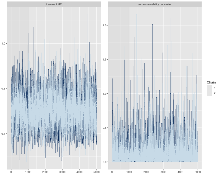
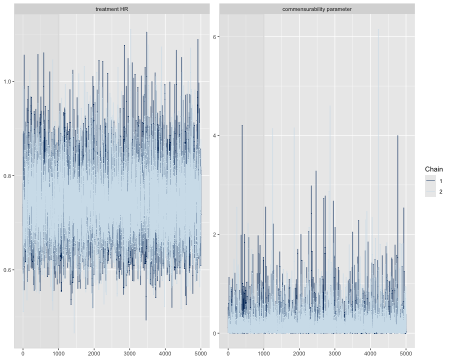
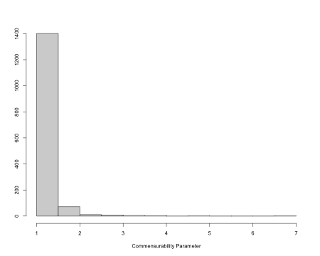
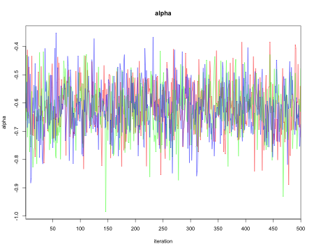
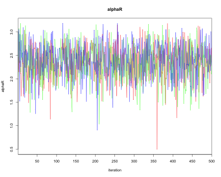
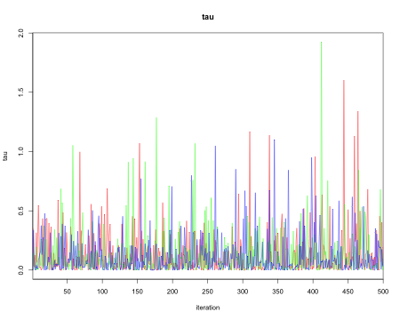
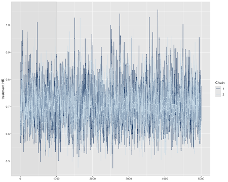
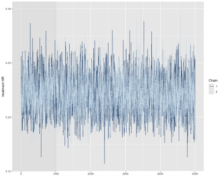

In the [previous article on matching/weighting methods](https://genentech.github.io/psborrow2/articles/match_weight_01_methods.html), we had used various matching/weighting methods to minimize selection bias. In this article, we will use matched/weighted cohort for Bayesian dynamic borrowing. This article is a follow-up to the matching/weighting article, which demonstrates methods to mitigate selection bias when designing externally controlled trial. In this article, we will illustrate Bayesian dynamic borrowing approaches using the matched and weighted cohort. We will use the `psborrow2`[@psborrow2] R package to demonstrate the use of Bayesian methods with an example for time to event outcome. In addition to using `psborrow2` package, we will also demonstrate how to implement power and commensurate prior models with piecewise exponential baseline hazard function.

We consider the following time to event outcome models in this article

* Exponential distribution with constant hazard
* Weibull distribution with proportional hazards parametrization
* Piecewise Exponential distribution (not implemented yet in `psborrow2` R package)

We will also consider several Bayesian dynamic borrowing methods 

* Commensurate prior
* Power prior

# Hazard function
The hazard function of $T$ at time $t$ is defined as the instantaneous rate of the event occurence that is still at risk at time $t$. It is defined as

\begin{equation}
  h(t)=\lim_\limits{\Delta \rightarrow 0 } P\frac{(t\leq T<t+\Delta t|T\geq t)}{\Delta t}=\frac{f(t)}{S(t)},
\end{equation}

where $f(t)$ is the density function of $T$ given $\theta$, and $S(t)=P(T>t)$ is the survival function of $T$.

# Cox proportional hazards model
We start with the Cox proportional hazards model [@cox1972regression] for observation $i$ as follows. To estimate the regression coefficients under the Bayesian framework, the baseline hazard function needs to be specified. This is not the case under a Frequentist Cox regression. The hazard at time $t$ is

\begin{equation}
\label{eq:coxmodel}
  \lambda(t|\boldsymbol{X}_i,Z_i)=\lambda_0(t|\alpha) \exp(\gamma Z_i +\beta^T \boldsymbol{X}_i), 
\end{equation}


where $\boldsymbol{X}_i$ is the vector of baseline covariates and $Z_i$ is the treatment indicator.

# Baseline hazard function
Baseline hazard functions can be modeled using common probability distributions in survival analysis, such as exponential, Weibull, and Gompertz. However, these standard specifications have limited flexibility and cannot capture irregular behaviors. Alternatively, more flexible hazard shapes can be specified using piecewise constant, piecewise exponential or spline functions, allowing for the representation of multimodal patterns and accommodating diverse irregularities [@lazaro2021bayesian]. The misspecification of the baseline hazard can lead to the loss of important model details which can be challenging to accurately estimate outcomes of interest, such as probabilities or survival curves. In this article, we consider the following baseline hazard functions.

* Exponential distribution with constant hazard
    + $\lambda_0(t|\alpha)=exp(\alpha)$


* Weibull distribution with proportional hazards parametrization
    + $\lambda_0(t|\zeta,\mu)=\alpha t\mu^{\zeta -1} \exp(-\mu t^\zeta)$ with shape parameter $\zeta$ and scale parameter $\mu$.

* Piecewise exponential distribution
    +  $\lambda_0(t|\alpha_1,...,\alpha_K)=exp(\alpha_k)$ for $t \in (s_{k-1},s_k],$ where $(s_{k-1},s_k]$ is the $k^{th}$ interval and $K$ is the total number of pre-specified intervals as in @murray2014semiparametric. In our example below, we will consider $s_k=(100*k/K)^{th}$ to the percentile of the event times from the treated group.

# Likelihood

We now introduce the likelihood along with the weight $w_i$ which is a subject specific weight. For the purpose of demonstration, we have considered the subject specific weight from inverse probability of treatment weighting method estimating ATT. In other words, $w_i=1$ for subject $i$ in RCT and $0 \leq w_i \leq 1$ for subject $i$ in RWD. Let ${Y}_{i}$ be the observed time, ${\delta}_{i}$ be an event indicator, $\boldsymbol{X}_{i}$ be the covariates, and ${Z}_{i}$ be the treatment indicator in the trial data. Similarly, let ${Y}_{0,i}$ be the observed time, ${\delta}_{0,i}$ be an event indicator, $\boldsymbol{X}_{0,i}$ be the covariates and ${Z}_{0,i}$ be the treatment indicator in external control data. The time axis is partitioned into $K$ intervals: $(0,\kappa_1],(\kappa_1,\kappa_2],\ldots,(\kappa_{K-1},\kappa_K)$. Let $\lambda_0(t|\alpha_k)=\exp{(\alpha_k)}$ be the piecewise exponential baseline hazard function with $t \in I_k=(\kappa_{k-1},\kappa_k)$ for $k=1,\ldots,K$. Denote $\boldsymbol{\alpha}=(\alpha_1,\ldots,\alpha_K)^\intercal$. Let $\boldsymbol\beta$ and $\gamma$ be the covariate and treatment effects respectively in trial. Similarly, let $\boldsymbol{\beta}_0$ and $\boldsymbol{\alpha}_0$ represent the parameters in external control. 

The joint likelihood of trial and external control for right censored observations after taking account the weight $w_i$ with baseline hazard as a piecewise exponential function and $K$ intervals can be written by slightly extending @murray2014semiparametric as


\[
 \begin{equation}
        \small
        \begin{split}
             & L(\boldsymbol{\alpha},\boldsymbol{\beta},\boldsymbol{\gamma},\boldsymbol{\alpha}_0,\boldsymbol{\beta}_0 |\boldsymbol{D},\boldsymbol{D}_0 )   \\ & =  L(\boldsymbol{\alpha},\boldsymbol{\beta},\boldsymbol{\gamma}|\boldsymbol{D},\boldsymbol \mu) L(\boldsymbol{\alpha}_0,\boldsymbol{\beta}_0|\boldsymbol{D}_0) \\
            & =\prod_{i=1}^n  \prod_{k=1}^K \Bigg[\exp{\bigg\{\mathcal I(Y_{i} \in I_k)\mathcal S_{ik}\bigg\}}^{\delta_{i}}
            \exp\bigg\{-\mathcal I(Y_{i} \in I_k) \bigg( \sum_{\ell=1}^{k-1} (\kappa_\ell  -  \kappa_{\ell-1}) \\
            & \times \exp{(\mathcal S_{i\ell})} 
             + (Y_{i} - \kappa_{k-1}) \exp{(\mathcal S_{ik}) } \bigg) \bigg\} \Bigg]
             \Bigg[ \exp{\bigg\{\mathcal I(Y_{0,i} \in I_k)  \mathcal S_{0,ik} \bigg\} }^{\delta_{0,i}} \\ 
          & \times \exp\bigg\{-\mathcal I(Y_{0,i} \in I_k) 
            \bigg( \sum_{\ell=1}^{k-1} (\kappa_\ell - \kappa_{\ell-1})\exp{(\mathcal S_{0,i\ell})}
             + (Y_{0,i} - \kappa_{k-1})\\ 
             & \times \exp{(\mathcal S_{0,ik}) } \bigg)  \bigg\} \Bigg],
        \end{split}
    \end{equation}
    \]
    

where $\mathcal S_{0,ik}=\alpha_{0,k} + \boldsymbol{\beta}_0^\intercal \boldsymbol{X}_{0,i}$, $\mathcal S_{ik}=\alpha_{k} + \boldsymbol{\beta}^\intercal \boldsymbol{X}_{i} + {\gamma} {Z}_{i}$, $n=n_T+n_E$; $n_T$ and $n_E$ are the sample size in trial and external control data respectively. If $w_i=1$, then the above likelihood becomes the traditional likelihood for Cox proportional hazards model. Above notations are similar as in @khanal2022semiparametric.

The joint likelihood can also be constructed in a similar way for other baseline hazard functions.

# Power prior model

We denote the data for the randomized controlled trial (RCT) as $D_1$ with the corresponding likelihood as $L(\gamma,\beta,\alpha│D_1 )$ and external control (EC) data as $D_0$ with corresponding likelihood as $L(\gamma,\beta,\alpha│D_0)$. The formulation of power prior is [@ibrahim2015power]
$$p(\gamma,\beta,\alpha│D_0,ν) \propto L(\gamma,\beta,\alpha│D_0 )^ν  *p(\gamma)*p(\beta)*p(\alpha),$$
where $0 \leq ν \leq 1$ is the vector of subject specific weights in the EC data, and $p(\gamma)$, $p(\beta)$, and $p(\alpha)$ are the priors for $\gamma$, $\beta$ and $\alpha$ respectively.

The posterior distribution is
$$p(\beta│D_1,D_0,ν) \propto L(\gamma,\beta,\alpha│D_1 )  L(\gamma,\beta,\alpha│D_0 )^ν  *p(\gamma)*p(\beta)*p(\alpha).$$

We consider the non-informative prior distributions for the parameters as $\gamma \sim N(0,0.001)$, $\beta_j \sim N(0,0.001)$ for $j=1...,P$ with $P$ baseline covariates, and $\alpha_k \sim N(0,0.001)$ for $k=1,...,K$ intervals.

Note: To avoid confusion, $N(a,b)$ means a normal distribution with mean $a$ and precision $b$.

# Commensurate prior model
Let $\boldsymbol{\eta}=(\beta_1,...,\beta_P,\alpha_1,...,\alpha_K)$ and $\boldsymbol{\eta}_0=(\beta_{10},...,\beta_{P0},\alpha_{10},...,\alpha_{K0})$ be the parameter vector for RCT and RWD respectively. We consider the following commensurate prior 

$$\eta_\ell|\eta_{0,\ell},\tau_\ell \sim N(\eta_{\ell 0},\tau_\ell) \quad \quad \ell=1,\cdots,P+K,$$

where $\tau_\ell$ is the precision parameter that determines the degree of borrowing, $P$ is the total number of covariates and $K$ is the total number of intervals. For the precision parameter, we assign a gamma prior as $\tau_\ell \sim Gamma(0.01,0.01)$. 

# Conducting Analysis

We first load the following libraries.


```r
#Loading the libraries
library(R2jags)
#> Warning: package 'R2jags' was built under R version 4.3.2
#> Warning: package 'coda' was built under R version 4.3.2
library(psborrow2)
library(cmdstanr)
#> Warning: package 'cmdstanr' was built under R version 4.3.3
library(posterior)
library(bayesplot)
#> Warning: package 'bayesplot' was built under R version 4.3.2
library(kableExtra)
#> Warning: package 'kableExtra' was built under R version 4.3.2
library(survival)
#> Warning: package 'survival' was built under R version 4.3.3
```

## Example data
We also load the data set `data_with_weights`. 

* The continuous variables are
    + `Age` (years)
    + `Weight` (lbs)
    + `Height` (inches)
    + `Biomarker1`
    + `Biomarker2`

* The categorical variables are
    + `Smoker`: Yes = 1 and No = 0
    + `Sex`: Male = 1 and Female = 0
    + `ECOG1`: ECOG 1 = 1 and ECOG 0 = 0

    
* The treatment indicator is
    + `group`: group = 1 is treatment and group = 0 is placebo
 
    
* The time to event variable is
    + `time`
 
    
* The event indicator variable is
    + `event`: event = 1 represents an event occurred and event = 0 indicates the event was censored

    
* The data source indicator variable is
    + `indicator`: indicator=1 is the RCT data and indicator=0 is the EC data
    
* The estimated weights after applying matching/weighting methods are
  + `ratio1_caliper_weights_lps`: Weights after 1:1 Nearest Neighbor Propensity score matching with a caliper width of 0.2 of the standard deviation of the logit of the propensity score
  + `ratio_caliper_weights`: Weights after 1:1 Nearest Neighbor Propensity score matching with a caliper width of 0.2 of the standard deviation of raw propensity score
  + `genetic_ratio1_weights`: Weights after 1:1 Genetic matching with replacement
  + `genetic_ratio1_weights_no_replace`: Weights after 1:1 Genetic matching without replacement
  + `optimal_ratio1_weights`: Weights after 1:1 Optimal matching
  + `weights_gbm`: Weights (ATT) after using Generalized Boosted Model to estimate propensity score
  + `eb_weights`: Weights (ATT) after Entropy Balancing
  + `invprob_weights`: Weights (ATT) after Inverse Probability Treatment Weighting using logistic regression


```r
data_with_weights <- read.csv("data_with_weights.csv")
data_with_weights$cnsr <- 1 - data_with_weights$event
data_with_weights <- data_with_weights[, sapply(data_with_weights, class) %in% c("numeric", "integer")]
data_with_weights$ext <- 1 - data_with_weights$indicator #External control flag
data_with_weights$norm.weights=data_with_weights$invprob_weights
data_with_weights$norm.weights[data_with_weights$ext==1]=data_with_weights$norm.weights[data_with_weights$ext==1]/max(data_with_weights$norm.weights[data_with_weights$ext==1])
data_with_weights <- as.matrix(data_with_weights)
```

The first six observations of the data set is shown below.

```r
head(data_with_weights)
#>      X      Age   Weight   Height Biomarker1 Biomarker2 Smoker Sex ECOG1 group
#> [1,] 1 56.63723 150.8678 65.79587   39.69306   47.71659      0   1     0     1
#> [2,] 2 52.21456 145.0049 63.72807   29.83998   48.36954      1   1     1     1
#> [3,] 3 53.46470 146.6449 63.73311   37.64033   48.64362      0   0     0     0
#> [4,] 4 51.89528 147.6856 66.44799   41.08949   46.04826      1   1     1     1
#> [5,] 5 52.17130 151.8084 66.16895   34.48727   51.26657      1   1     1     0
#> [6,] 6 57.01979 144.6115 64.03365   34.82447   52.03498      0   1     0     0
#>           time event indicator ratio1_caliper_weights_lps
#> [1,] 0.4089043     0         1                          1
#> [2,] 0.9721405     0         1                          0
#> [3,] 0.2956919     0         1                          1
#> [4,] 4.3111823     0         1                          1
#> [5,] 0.2644848     0         1                          0
#> [6,] 0.3103544     0         1                          1
#>      ratio1_caliper_weights genetic_ratio1_weights
#> [1,]                      1                      1
#> [2,]                      0                      1
#> [3,]                      1                      1
#> [4,]                      1                      1
#> [5,]                      0                      1
#> [6,]                      0                      1
#>      genetic_ratio1_weights_no_replace optimal_ratio1_weights weights_gbm
#> [1,]                                 0                      1           1
#> [2,]                                 1                      1           1
#> [3,]                                 0                      1           1
#> [4,]                                 0                      1           1
#> [5,]                                 1                      1           1
#> [6,]                                 1                      1           1
#>      eb_weights invprob_weights cnsr ext norm.weights
#> [1,]          1               1    1   0            1
#> [2,]          1               1    1   0            1
#> [3,]          1               1    1   0            1
#> [4,]          1               1    1   0            1
#> [5,]          1               1    1   0            1
#> [6,]          1               1    1   0            1
```

# Exponential distribution with constant hazard with gamma prior distribution (Using `psborrow2` R package)

The `psborrow2` package will be used to conduct the analysis.


We use exponential distribution for the outcome model as follows. Non-informative normal prior is used for the baseline parameter. The data `data_with_weights` contain the time and censoring variable. For demonstration purpose, we choose the subject level weight `invprob_weights` calculated using inverse probability of treatment weighting (IPTW). In this step we extract the time, censoring indicator and the normalized weight variables denoted by `time`, `cnsr` and `norm.weights` respectively.

```r
#Outcome
outcome <- outcome_surv_exponential(
  time_var = "time",
  cens_var = "cnsr",
  baseline_prior = prior_normal(0, 1000),
  weight_var = "norm.weights"
)

outcome
#> Outcome object with class OutcomeSurvExponential 
#> 
#> Outcome variables:
#>       time_var       cens_var     weight_var 
#>         "time"         "cnsr" "norm.weights" 
#> 
#> Baseline prior:
#> Normal Distribution
#> Parameters:
#>  Stan  R    Value
#>  mu    mean    0 
#>  sigma sd   1000
```


Next, the borrowing method is implemented as shown below. We consider Bayesian Dynamic Borrowing (BDB) in which gamma prior is assigned for the commensurability parameter. The `tau_prior` shown below is the hyperparameter of the commensurate prior which determines the degree of borrowing. We assign a gamma prior for this hyperparameter. Furhtermore, we also need to specify a flag for external data which is denoted by `ext`.

```r
#Borrowing
borrowing <- borrowing_hierarchical_commensurate(
  ext_flag_col = "ext",
  tau_prior = prior_gamma(0.001, 0.001)
)

borrowing
#> Borrowing object using the  Bayesian dynamic borrowing with the hierarchical commensurate prior  approach
#> 
#> External control flag: ext 
#> 
#> Commensurability parameter prior:
#> Gamma Distribution
#> Parameters:
#>  Stan  R     Value
#>  alpha shape 0.001
#>  beta  rate  0.001
#> Constraints: <lower=0>
```


Similarly, details regarding the treatment variable is specified below. A Non-informative prior is used for the treatment effect parameter $\gamma$. 

```r
#Treatment
treatment <- treatment_details(
  trt_flag_col = "group",
  trt_prior = prior_normal(0, 1000)
)
treatment
#> Treatment object
#> 
#> Treatment flag column: group 
#> 
#> Treatment effect prior:
#> Normal Distribution
#> Parameters:
#>  Stan  R    Value
#>  mu    mean    0 
#>  sigma sd   1000
```

Now, all the pieces are brought together to create the analysis object as shown below.


```r
#Application
anls_obj <- create_analysis_obj(
  data_matrix = data_with_weights,
  outcome = outcome,
  borrowing = borrowing,
  treatment = treatment
)
#> Inputs look good.
#> Stan program compiled successfully!
#> Ready to go! Now call `mcmc_sample()`.
```

Finally, we run the MCMC sample for $10,000$ iterations with $3$ chains.


```r
niter = 10000
results.exp.psborrow<- mcmc_sample(anls_obj,
  iter_warmup = round(niter/3),
  iter_sampling = niter,
  chains = 3,
  seed = 123
)
#> Running MCMC with 3 sequential chains...
#> 
#> Chain 1 finished in 13.6 seconds.
#> Chain 2 finished in 13.1 seconds.
#> Chain 3 finished in 12.4 seconds.
#> 
#> All 3 chains finished successfully.
#> Mean chain execution time: 13.0 seconds.
#> Total execution time: 39.7 seconds.

draws1 <- results.exp.psborrow$draws()
draws1 <- rename_draws_covariates(draws1, anls_obj)
```

The summary is shown below.

```r
results.exp.psborrow$summary()
#> # A tibble: 6 × 10
#>   variable     mean    median     sd    mad          q5      q95  rhat ess_bulk
#>   <chr>       <dbl>     <dbl>  <dbl>  <dbl>       <dbl>    <dbl> <dbl>    <dbl>
#> 1 lp__     -718.    -718.     1.51   1.29   -721.       -716.     1.00   10716.
#> 2 beta_trt   -0.357   -0.359  0.110  0.111    -0.536      -0.175  1.00   11632.
#> 3 tau         0.119    0.0505 0.183  0.0694    0.000443    0.470  1.00   12583.
#> 4 alpha[1]   -0.621   -0.620  0.0910 0.0924   -0.772      -0.474  1.00   11977.
#> 5 alpha[2]    2.36     2.38   0.374  0.368     1.70        2.93   1.00   18690.
#> 6 HR_trt      0.704    0.699  0.0778 0.0773    0.585       0.839  1.00   11632.
#> # ℹ 1 more variable: ess_tail <dbl>
```

The histogram of the posterior samples for hazard ratio and commensurability parameter as shown below.


```r
bayesplot::mcmc_hist(draws1, c("treatment HR"))
```

<div class="figure" style="text-align: center">

<p class="caption">plot of chunk unnamed-chunk-10</p>
</div>

```r
bayesplot::mcmc_hist(draws1, c("commensurability parameter"))
```

<div class="figure" style="text-align: center">

<p class="caption">plot of chunk unnamed-chunk-10</p>
</div>

```r
bayesplot::color_scheme_set("mix-blue-pink")
```

The $95\%$ credible interval can be calculated as follows.

```r
summarize_draws(draws1, ~ quantile(.x, probs = c(0.025, 0.975)))
#> # A tibble: 6 × 3
#>   variable                                `2.5%`  `97.5%`
#>   <chr>                                    <dbl>    <dbl>
#> 1 lp__                               -722.       -716.   
#> 2 treatment log HR                     -0.569      -0.141
#> 3 commensurability parameter            0.000109    0.628
#> 4 baseline log hazard rate, internal   -0.801      -0.448
#> 5 baseline log hazard rate, external    1.56        3.02 
#> 6 treatment HR                          0.566       0.869
```

We can graph other plots that help us evaluate convergence and diagnose problems with the MCMC sampler, such as trace plot.

```r
bayesplot::color_scheme_set("mix-blue-pink")

bayesplot::mcmc_trace(
  draws1[1:(round(niter/2)), 1:2, ], # Using a subset of draws only
  pars = c("treatment HR", "commensurability parameter"),
  n_warmup = niter/10
)
```

<div class="figure" style="text-align: center">

<p class="caption">plot of chunk unnamed-chunk-12</p>
</div>

# Time-to-event analysis with Weibull distribution and proportional hazards parametrization

We conduct analysis using a Weibull distribution for the outcome model using the `psborrow2` package as follows.

Non-informative normal prior is used for the baseline parameter $\mu$. An exponential prior is used for the Weibull shape parameter $\zeta$.


```r
#Outcome
outcome <- outcome_surv_weibull_ph(
  time_var = "time",
  cens_var = "cnsr",
  shape_prior=prior_exponential(1),
  baseline_prior = prior_normal(0, 1000),
  weight_var = "norm.weights"
)

outcome
#> Outcome object with class OutcomeSurvWeibullPH 
#> 
#> Outcome variables:
#>       time_var       cens_var     weight_var 
#>         "time"         "cnsr" "norm.weights" 
#> 
#> Baseline prior:
#> Normal Distribution
#> Parameters:
#>  Stan  R    Value
#>  mu    mean    0 
#>  sigma sd   1000 
#> 
#> shape_weibull prior:
#> Exponential Distribution
#> Parameters:
#>  Stan R    Value
#>  beta rate 1    
#> Constraints: <lower=0>
```

Next, the borrowing method is implemented as shown below. We consider Bayesian Dynamic Borrowing (BDB) in which a non-informative gamma prior is assigned for the commensurability parameter.


```r
#Borrowing
borrowing <- borrowing_hierarchical_commensurate(
  ext_flag_col = "ext",
  tau_prior = prior_gamma(0.001, 0.001)
)

borrowing
#> Borrowing object using the  Bayesian dynamic borrowing with the hierarchical commensurate prior  approach
#> 
#> External control flag: ext 
#> 
#> Commensurability parameter prior:
#> Gamma Distribution
#> Parameters:
#>  Stan  R     Value
#>  alpha shape 0.001
#>  beta  rate  0.001
#> Constraints: <lower=0>
```


Similarly, details regarding the treatment variable are specified below. Non-informative prior is used for treatment effect $\gamma$.


```r
#Treatment
treatment <- treatment_details(
  trt_flag_col = "group",
  trt_prior = prior_normal(0, 1000)
)
treatment
#> Treatment object
#> 
#> Treatment flag column: group 
#> 
#> Treatment effect prior:
#> Normal Distribution
#> Parameters:
#>  Stan  R    Value
#>  mu    mean    0 
#>  sigma sd   1000
```

Now, all the pieces are brought together to create the analysis object as shown below.


```r
#Application
data_with_weights <- as.matrix(data_with_weights)
anls_obj <- create_analysis_obj(
  data_matrix = data_with_weights,
  outcome = outcome,
  borrowing = borrowing,
  treatment = treatment
)
#> Inputs look good.
#> Stan program compiled successfully!
#> Ready to go! Now call `mcmc_sample()`.
```

Finally, we run the MCMC sample for $10,000$ iterations with $3$ chains.


```r
results.weib.psborrow<- mcmc_sample(anls_obj,
  iter_warmup = round(niter/3),
  iter_sampling = niter,
  chains = 3,
  seed = 123
)
#> Running MCMC with 3 sequential chains...
#> 
#> Chain 1 finished in 28.8 seconds.
#> Chain 2 finished in 29.4 seconds.
#> Chain 3 finished in 33.2 seconds.
#> 
#> All 3 chains finished successfully.
#> Mean chain execution time: 30.5 seconds.
#> Total execution time: 92.2 seconds.

draws2 <- results.weib.psborrow$draws()
draws2 <- rename_draws_covariates(draws2, anls_obj)
```

The summary is shown below.

```r
results.weib.psborrow$summary()
#> # A tibble: 7 × 10
#>   variable          mean   median     sd    mad       q5      q95  rhat ess_bulk
#>   <chr>            <dbl>    <dbl>  <dbl>  <dbl>    <dbl>    <dbl> <dbl>    <dbl>
#> 1 lp__          -708.    -7.07e+2 1.68   1.49   -7.11e+2 -706.     1.00   11530.
#> 2 beta_trt        -0.302 -3.03e-1 0.110  0.109  -4.82e-1   -0.120  1.00   16857.
#> 3 shape_weibull    0.836  8.35e-1 0.0322 0.0322  7.83e-1    0.890  1.00   21009.
#> 4 tau              0.180  7.77e-2 0.288  0.106   6.77e-4    0.693  1.00   14413.
#> 5 alpha[1]        -0.509 -5.08e-1 0.0931 0.0934 -6.62e-1   -0.358  1.00   16847.
#> 6 alpha[2]         1.97   2.00e+0 0.386  0.380   1.29e+0    2.57   1.00   20959.
#> 7 HR_trt           0.744  7.39e-1 0.0823 0.0804  6.17e-1    0.887  1.00   16857.
#> # ℹ 1 more variable: ess_tail <dbl>
```

Histogram of the posterior samples for hazard ratio and commensurability parameter are produced.


```r
bayesplot::mcmc_hist(draws2, c("treatment HR"))
```

<div class="figure" style="text-align: center">

<p class="caption">plot of chunk unnamed-chunk-19</p>
</div>

```r
bayesplot::mcmc_hist(draws2, c("commensurability parameter"))
```

<div class="figure" style="text-align: center">

<p class="caption">plot of chunk unnamed-chunk-19</p>
</div>

```r
bayesplot::color_scheme_set("mix-blue-pink")
```

The $95\%$ credible interval can be calculated as follows.

```r
summarize_draws(draws2, ~ quantile(.x, probs = c(0.025, 0.975)))
#> # A tibble: 7 × 3
#>   variable                                `2.5%`   `97.5%`
#>   <chr>                                    <dbl>     <dbl>
#> 1 lp__                               -712.       -705.    
#> 2 treatment log HR                     -0.515      -0.0855
#> 3 Weibull shape parameter               0.774       0.900 
#> 4 commensurability parameter            0.000170    0.945 
#> 5 baseline log hazard rate, internal   -0.692      -0.331 
#> 6 baseline log hazard rate, external    1.15        2.66  
#> 7 treatment HR                          0.598       0.918
```

We can see other plots that help us evaluate convergence and diagnose problems with the MCMC sampler, such as trace plot.

```r
bayesplot::color_scheme_set("mix-blue-pink")

bayesplot::mcmc_trace(
  draws2[1:(round(niter/2)), 1:2, ], # Using a subset of draws only
  pars = c("treatment HR", "commensurability parameter"),
  n_warmup = round(niter/10)
)
```

<div class="figure" style="text-align: center">

<p class="caption">plot of chunk unnamed-chunk-21</p>
</div>

# Power prior with piecewise exponential distribution (not implemented in `psborrow2` R package)

We will consider the Bayesian power prior with subject specific power parameters. The weights from various matching and weighting methods can be used as subject specific power parameters for external control subjects. The baseline hazard function will be based on piecewise exponential distribution. The following JAGS code, adapted from [@alvares2021bayesian], implements the power prior with piecewise exponential baseline hazard. We will consider a subject specific power parameter as the weights from inverse probability weighting method. The subject specific weights for external control patients are normalized by dividing each weight by the maximum weight.


```r
model{
		#POWER PRIOR JAGS CODE
  #Trial Data
  for (i in 1:n){
    # Pieces of the cumulative hazard function
    for (k in 1:int.obs[i]) {
      cond[i,k] <- step(time[i] - a[k + 1])
      HH[i , k] <- cond[i,k] * (a[k + 1] - a[k]) * exp(alpha[k]) +
      (1 - cond[i,k] ) * (time[i] - a[k]) * exp(alpha[k])
    }
    # Cumulative hazard function
    H[i] <- sum(HH[i,1 : int.obs[i]] )
  }
  for ( i in 1:n) {
    # Linear predictor
    elinpred[i] <- exp(inprod(beta[],X[i,]))
    # Log-hazard function
    logHaz[i] <- log( exp(alpha[int.obs[i]]) * elinpred[i])
    # Log-survival function
    logSurv[i] <- -H[i]  * elinpred[i]
    # Definition of the log-likelihood using zeros trick
    phi[i] <- 100000 - status[i] * logHaz[i] - logSurv[i]
    zeros[i] ~ dpois(phi[i])
  }

  #Real World or External Control Data
   for (i in 1:nR){
    # Pieces of the cumulative hazard function
    for (k in 1:int.obsR[i]) {
      condR[i,k] <- step(timeR[i] - a[k + 1])
      HHR[i , k] <- condR[i,k] * (a[k + 1] - a[k]) * exp(alpha[k]) +
      (1 - condR[i,k] ) * (timeR[i] - a[k]) * exp(alpha[k])
    }
    # Cumulative hazard function
    HR[i] <- sum(HHR[i,1 : int.obsR[i]] )
  }
  for ( i in 1:nR) {
    # Linear predictor
    elinpredR[i] <- exp(inprod(beta[],XR[i,]))
    # Log-hazard function
    logHazR[i] <- log(exp(alpha[int.obsR[i]]) * elinpredR[i])
    # Log-survival function
    logSurvR[i] <- -HR[i] * elinpredR[i]
    # Definition of the log-likelihood using zeros trick
    phiR[i] <- 100000 - rho[i] * statusR[i] * logHazR[i] - rho[i] * logSurvR[i] 
    #rho[i] is the subject level weight as a power prior
    zerosR[i] ~ dpois(phiR[i])
  }
  # Prior distributions
  for(l in 1: Nbetas ){
    beta[l] ~ dnorm(0 , 0.001)
  }

  for( k in 1 :m) {
  alpha[k] ~ dnorm(0,0.001)
  }

} 
```


We now define all the variables as in input to JAGS.


```r
data_with_weights=data.frame(data_with_weights)

#Trial Data
trial.data <- data_with_weights[data_with_weights$indicator==1,]

#External Control Data
ext.control.data <- data_with_weights[data_with_weights$indicator==0,]

#Input in JAGS code
n <- nrow(trial.data) #Sample size in trial data
nR <- nrow(ext.control.data) #Sample size in external control data

time <- trial.data$time #Survival time in trial data
timeR <- ext.control.data$time #Survival time in external control data

status <- trial.data$event #Event indicator in trial data
statusR <- ext.control.data$event #Event indicator in external control data

rho <- ext.control.data$invprob_weights/max(ext.control.data$invprob_weights) #Power prior weights

X <- as.matrix(trial.data[,10]) #Covariates in trial data
XR <- as.matrix(ext.control.data[,10]) #Covariates in external control data

Nbetas <- ncol(X)

zeros = rep(0, n)
zerosR = rep(0, nR)
```

We also need to pre-specify the number of intervals. For simplicity, we will consider $K=1$ interval. However, this method also works $K>1$.


```r
# Time axis partition
K <- 1 # number of intervals

#Cut points (Using the event times in trial data)
a=c(0,quantile(trial.data$time[trial.data$event==1],seq(0,1,by=1/K))[-c(1,K+1)],
    max(c(trial.data$time,ext.control.data$time))+0.0001)

#Trial data
# int.obs: vector that tells us at which interval each observation is
int.obs <- matrix(data = NA, nrow = nrow(trial.data), ncol = length(a) - 1)
d <- matrix(data = NA, nrow = nrow(trial.data), ncol = length(a) - 1)
for(i in 1:nrow(trial.data)) {
  for(k in 1:(length(a) - 1)) {
    d[i, k] <- ifelse(trial.data$time[i] - a[k] > 0, 1, 0) * 
      ifelse(a[k + 1] - trial.data$time[i] > 0, 1,0)
    int.obs[i, k] <- d[i, k] * k
  }
}
int.obs <- rowSums(int.obs)

#External control data
# int.obs: vector that tells us at which interval each observation is
int.obsR <- matrix(data = NA, nrow = nrow(ext.control.data), ncol = length(a) - 1)
d <- matrix(data = NA, nrow = nrow(ext.control.data), ncol = length(a) - 1)
for(i in 1:nrow(ext.control.data)) {
  for(k in 1:(length(a) - 1)) {
    d[i, k] <- ifelse(ext.control.data$time[i] - a[k] > 0, 1, 0) * 
      ifelse(a[k + 1] - ext.control.data$time[i] > 0, 1,0)
    int.obsR[i, k] <- d[i, k] * k
  }
}
int.obsR <- rowSums(int.obsR)
```


We now put all variables into a list as data inputs for JAGs.

```r
### JAGS ####
d.jags <- list("n", "nR", "time", "timeR",
               "a", "X", "XR","int.obs",
               "int.obsR","Nbetas",
               "zeros","zerosR","rho", 
               "status", "statusR","K")
```

We specify the parameter of interest as follows.


```r
#Parameter of interest
p.jags <- c("beta","alpha")
```

The standard normal distribution is used as an initial values for the parameter of interest.

```r
#Initial values for each parameter
i.jags <- function(){
  list(beta = rnorm(ncol(X)), alpha = rnorm(K))
}
```


Now, we call the `jags` function to conduct MCMC sampling with $3$ chains as shown below. We set number of iterations as $niter=10,000$ with a burn in of $5000$ and thinning of $10$.


```r
set.seed(1)
model1 <- jags(data = d.jags, model.file = "powerprior.txt", inits = i.jags, n.chains = 3,
               parameters=p.jags,n.iter=niter,n.burnin = round(niter/2),n.thin = 10)
#> Compiling model graph
#>    Resolving undeclared variables
#>    Allocating nodes
#> Graph information:
#>    Observed stochastic nodes: 1100
#>    Unobserved stochastic nodes: 2
#>    Total graph size: 17432
#> 
#> Initializing model
```

The summary can be produced using the following command.

```r
model1$BUGSoutput$summary
#>                   mean         sd          2.5%           25%           50%
#> alpha    -5.566809e-01 0.08954522 -7.394070e-01 -6.170039e-01 -5.543440e-01
#> beta     -4.200419e-01 0.10776354 -6.340181e-01 -4.921314e-01 -4.202084e-01
#> deviance  2.200015e+08 1.99156129  2.200015e+08  2.200015e+08  2.200015e+08
#>                    75%         97.5%     Rhat n.eff
#> alpha    -4.952955e-01 -3.884554e-01 1.000476  1500
#> beta     -3.479730e-01 -2.076608e-01 1.000497  1500
#> deviance  2.200015e+08  2.200015e+08 1.000000     1
```

The summary of the hazard ratio for treatment variable is shown below.

```r
c(summary(exp(model1$BUGSoutput$sims.list$beta[,1])),
  quantile(exp(model1$BUGSoutput$sims.list$beta[,1]),probs=c(0.025,0.975)))
#>      Min.   1st Qu.    Median      Mean   3rd Qu.      Max.      2.5%     97.5% 
#> 0.4931593 0.6113220 0.6569099 0.6608469 0.7061179 0.9601307 0.5304561 0.8124826
```
The histogram of the treatment hazard ratio can also be produced.

```r
hist(exp(model1$BUGSoutput$sims.list$beta[,1]),xlab="treatmentHR",main="",ylab="")
```

<div class="figure" style="text-align: center">

<p class="caption">plot of chunk unnamed-chunk-31</p>
</div>

The traceplot can be generated as follows.

```r
traceplot(model1,varname=c("alpha","beta"))
```

<div class="figure" style="text-align: center">

<p class="caption">plot of chunk unnamed-chunk-32</p>
</div><div class="figure" style="text-align: center">

<p class="caption">plot of chunk unnamed-chunk-32</p>
</div>


# Commensurate prior with piecewise exponential distribution (not implemented in `psborrow2` R package)

We will consider the Bayesian commensurate prior model.


```r
model{
  #Trial Data
  for (i in 1:n){
    # Pieces of the cumulative hazard function
    for (k in 1:int.obs[i]) {
      cond[i,k] <- step(time[i] - a[k + 1])
      HH[i , k] <- cond[i,k] * (a[k + 1] - a[k]) * exp(alpha[k]) +
      (1 - cond[i,k] ) * (time[i] - a[k]) * exp(alpha[k])
    }
    # Cumulative hazard function
    H[i] <- sum(HH[i,1 : int.obs[i]] )
  }
  for ( i in 1:n) {
    # Linear predictor
    elinpred[i] <- exp(inprod(beta[],X[i,]))
    # Log-hazard function
    logHaz[i] <- log(exp(alpha[int.obs[i]]) * elinpred[i])
    # Log-survival function
    logSurv[i] <- -H[i] * elinpred[i]
    # Definition of the log-likelihood using zeros trick
    phi[i] <- 100000 - wt[i]*status[i] * logHaz[i] - wt[i]*logSurv[i]
    zeros[i] ~ dpois(phi[i])
  }

  #Real World or External Control Data
   for (i in 1:nR){
    # Pieces of the cumulative hazard function
    for (k in 1:int.obsR[i]) {
      condE[i,k] <- step(timeR[i] - a[k + 1])
      HHE[i , k] <- condE[i,k] * (a[k + 1] - a[k]) * exp(alphaR[k]) +
      (1 - condE[i,k] ) * (timeR[i] - a[k]) * exp(alphaR[k])
    }
    # Cumulative hazard function
    HE[i] <- sum(HHE[i,1 : int.obsR[i]] )
  }
  for ( i in 1:nR) {
    # Linear predictor
    elinpredE[i] <- exp(inprod(beta0[],XR[i,]))
    # Log-hazard function
    logHazE[i] <- log(exp(alphaR[int.obsR[i]]) * elinpredE[i])
    # Log-survival function
    logSurvE[i] <- -HE[i] * elinpredE[i]
    # Definition of the log-likelihood using zeros trick
    phiE[i] <- 100000 - wtR[i]*statusR[i] * logHazE[i] - wtR[i] * logSurvE[i]
    zerosR[i] ~ dpois(phiE[i])
  }


  # Commensurate prior on the covariate effect
  for(l in 1: Nbetas ){
    beta0[l] ~ dnorm(0,0.0001);
    tau[l] ~ dgamma(0.01,0.01);
    beta[l] ~ dnorm(beta0[l],tau[l]);
  }
  
  # Normal prior on the piecewise exponential parameters for each interval
  for( m in 1 : K) {
  taualpha[m] ~ dgamma(0.01,0.01);
  alpha[m] ~ dnorm(alphaR[m],taualpha[m]);
  alphaR[m] ~ dnorm(0,0.0001);
  }

} 
```

We now define all the variables as in input to JAGS.

```r
data_with_weights=data.frame(data_with_weights)

#Trial Data
trial.data <- data_with_weights[data_with_weights$indicator==1,]

#External Control Data
ext.control.data <- data_with_weights[data_with_weights$indicator==0,]

#Input in JAGS code
n <- nrow(trial.data) #Sample size in trial data
nR <- nrow(ext.control.data) #Sample size in external control data

time <- trial.data$time #Survival time in trial data
timeR <- ext.control.data$time #Survival time in external control data

status <- trial.data$event #Event indicator in trial data
statusR <- ext.control.data$event #Event indicator in external control data

wt <- trial.data$norm.weights #Vector of weights in trial data
wtR <- ext.control.data$norm.weights #Vector of weights in external control data

X <- as.matrix(trial.data[,10]) #Treatment indicator in trial data
XR <- as.matrix(ext.control.data[,10]) #Treatment indicator in trial data

Nbetas <- ncol(X)

zeros = rep(0, n)
zerosR = rep(0, nR)
```
We also need to pre-specify the number of intervals. For simplicity, we will consider $K=1$ interval. However, this method also works when $K>1$.


```r
# Time axis partition
K <- 1 # number of intervals

#Cut points (Using the event times in trial data)
a=c(0,quantile(trial.data$time[trial.data$event==1],seq(0,1,by=1/K))[-c(1,K+1)],
    max(c(trial.data$time,ext.control.data$time))+0.0001)

#Trial data
# int.obs: vector that tells us at which interval each observation is
int.obs <- matrix(data = NA, nrow = nrow(trial.data), ncol = length(a) - 1)
d <- matrix(data = NA, nrow = nrow(trial.data), ncol = length(a) - 1)
for(i in 1:nrow(trial.data)) {
  for(k in 1:(length(a) - 1)) {
    d[i, k] <- ifelse(trial.data$time[i] - a[k] > 0, 1, 0) * 
      ifelse(a[k + 1] - trial.data$time[i] > 0, 1, 0)
    int.obs[i, k] <- d[i, k] * k
  }
}
int.obs <- rowSums(int.obs)

#External control data
# int.obs: vector that tells us at which interval each observation is
int.obsR <- matrix(data = NA, nrow = nrow(ext.control.data), ncol = length(a) - 1)
d <- matrix(data = NA, nrow = nrow(ext.control.data), ncol = length(a) - 1)
for(i in 1:nrow(ext.control.data)) {
  for(k in 1:(length(a) - 1)) {
    d[i, k] <- ifelse(ext.control.data$time[i] - a[k] > 0, 1, 0) * 
      ifelse(a[k + 1] - ext.control.data$time[i] > 0, 1,0)
    int.obsR[i, k] <- d[i, k] * k
  }
}
int.obsR <- rowSums(int.obsR)
```

We now put all variables into a list as data inputs for JAGs. Note that the letter $R$ in the following corresponds to RWD. For example, $XR$ is the covariate matrix in RWD.


```r
### JAGS ####
d.jags <- list("n", "nR", "time", "timeR",
               "a", "X", "XR","int.obs",
               "int.obsR","Nbetas",
               "zeros","zerosR","wt", "wtR",
               "status", "statusR","K")
```

We specify the parameter of interest as follows. Note that `alphaR` is the baseline hazard parameter for external control.


```r
#Parameter of interest
p.jags <- c("beta","alpha","alphaR","tau")
```

We generate initial values for $\beta$ and $\alpha$ from standard normal distributions, and $\tau$ from a non-informative Gamma distribution.

```r
#Initial values for each parameter
i.jags <- function(){
  list(beta = rnorm(ncol(X)), beta0 = rnorm(ncol(X)),
       alpha = rnorm(K),alphaR = rnorm(K),tau = rgamma(ncol(X),shape = 0.01,scale=0.01))
}
```


Now, we call the `jags` function to conduct MCMC sampling with $3$ chains as shown below. We set number of iterations as $niter=10,000$ with a burn in of $5000$ and thinning of $10$.


```r
set.seed(1)
model2 <- jags(data = d.jags, model.file = "commensurateprior.txt", inits = i.jags, n.chains = 3,
               parameters=p.jags,n.iter=niter,n.burnin = round(niter/2),n.thin = 10)
#> Compiling model graph
#>    Resolving undeclared variables
#>    Allocating nodes
#> Graph information:
#>    Observed stochastic nodes: 1100
#>    Unobserved stochastic nodes: 5
#>    Total graph size: 18642
#> 
#> Initializing model
```

The summary can be produced using the following command.

```r
model2$BUGSoutput$summary
#>                   mean         sd          2.5%           25%           50%
#> alpha    -6.191206e-01 0.08842641 -7.909870e-01 -6.787401e-01 -6.193462e-01
#> alphaR    2.366979e+00 0.36366809  1.593958e+00  2.144550e+00  2.379864e+00
#> beta     -3.596931e-01 0.10541071 -5.626927e-01 -4.319852e-01 -3.571647e-01
#> deviance  2.200014e+08 2.44607662  2.200014e+08  2.200014e+08  2.200014e+08
#> tau       1.254783e-01 0.18316338  4.693678e-04  1.536327e-02  5.811439e-02
#>                    75%         97.5%     Rhat n.eff
#> alpha    -5.575406e-01 -4.477827e-01 1.001772  1100
#> alphaR    2.627147e+00  3.007402e+00 1.004616   440
#> beta     -2.884953e-01 -1.600480e-01 1.000624  1500
#> deviance  2.200014e+08  2.200014e+08 1.000000     1
#> tau       1.585465e-01  6.215560e-01 1.001367  1500
```

The summary of the hazard ratio for treatment variable is shown below.

```r
c(summary(exp(model2$BUGSoutput$sims.list$beta[,1])),
  quantile(exp(model2$BUGSoutput$sims.list$beta[,1]),probs=c(0.025,0.975)))
#>      Min.   1st Qu.    Median      Mean   3rd Qu.      Max.      2.5%     97.5% 
#> 0.4932769 0.6492190 0.6996573 0.7017649 0.7493903 0.9788045 0.5696732 0.8521031
```
The histogram of the treatment hazard ratio can also be produced.

```r
hist(exp(model2$BUGSoutput$sims.list$beta[,1]),xlab="treatmentHR",main="",ylab="")
```

<div class="figure" style="text-align: center">

<p class="caption">plot of chunk unnamed-chunk-42</p>
</div>

The histogram of the commensurability parameter can also be produced.

```r
hist(exp(model2$BUGSoutput$sims.list$tau[,1]),xlab="Commensurability Parameter",main="",ylab="")
```

<div class="figure" style="text-align: center">

<p class="caption">plot of chunk unnamed-chunk-43</p>
</div>

The traceplot can be created as follows.

```r
traceplot(model2,varname=c("alpha","alphaR","beta","tau"))
```

<div class="figure" style="text-align: center">

<p class="caption">plot of chunk unnamed-chunk-44</p>
</div><div class="figure" style="text-align: center">

<p class="caption">plot of chunk unnamed-chunk-44</p>
</div><div class="figure" style="text-align: center">

<p class="caption">plot of chunk unnamed-chunk-44</p>
</div><div class="figure" style="text-align: center">

<p class="caption">plot of chunk unnamed-chunk-44</p>
</div>

# Exponential distribution (constant hazard) and no borrowing: Using `psborrow2` R package
In addition to specifying an exponential distribution using Bayesian dynamic borrowing, naive no-borrowing and full-borrowing analysis can be conducted using the exponential distribution following similar steps as above. These ype of analysis could be used as a sensitivity or exploratory analysis.

The `psborrow2` package will be used to conduct the analysis. Following are the steps.
  
We use exponential distribution for the outcome model as follows. Non-informative normal prior is used for the baseline parameter.

```r
#Outcome
outcome <- outcome_surv_exponential(
  time_var = "time",
  cens_var = "cnsr",
  baseline_prior = prior_normal(0, 1000)
)

outcome
#> Outcome object with class OutcomeSurvExponential 
#> 
#> Outcome variables:
#> time_var cens_var 
#>   "time"   "cnsr" 
#> 
#> Baseline prior:
#> Normal Distribution
#> Parameters:
#>  Stan  R    Value
#>  mu    mean    0 
#>  sigma sd   1000
```

Next, the borrowing method is implemented as shown below. We consider no borrowing as shown below.

```r
#Borrowing
borrowing <- borrowing_none(
  ext_flag_col = "ext"
)

borrowing
#> Borrowing object using the  No borrowing  approach
#> 
#> External control flag: ext
```

Similarly, details regarding the treatment variable is specified below. Non-informative prior is used a prior for treatment effect.

```r
#Treatment
treatment <- treatment_details(
  trt_flag_col = "group",
  trt_prior = prior_normal(0, 1000)
)
treatment
#> Treatment object
#> 
#> Treatment flag column: group 
#> 
#> Treatment effect prior:
#> Normal Distribution
#> Parameters:
#>  Stan  R    Value
#>  mu    mean    0 
#>  sigma sd   1000
```

Now, all the pieces are brought together to create the analysis object as shown below.


```r
data_with_weights <- as.matrix(data_with_weights)
#Application
anls_obj <- create_analysis_obj(
  data_matrix = data_with_weights,
  outcome = outcome,
  borrowing = borrowing,
  treatment = treatment
)
#> Inputs look good.
#> NOTE: excluding `ext` == `1`/`TRUE` for no borrowing.
#> Stan program compiled successfully!
#> Ready to go! Now call `mcmc_sample()`.
```

Finally, we run the MCMC sample with $3$ chains.


```r
results.no.psborrow<- mcmc_sample(anls_obj,
  iter_warmup = round(niter/3),
  iter_sampling = niter,
  chains = 3,
  seed = 123
)
#> Running MCMC with 3 sequential chains...
#> 
#> Chain 1 finished in 3.7 seconds.
#> Chain 2 finished in 4.1 seconds.
#> Chain 3 finished in 3.9 seconds.
#> 
#> All 3 chains finished successfully.
#> Mean chain execution time: 3.9 seconds.
#> Total execution time: 12.1 seconds.

draws3 <- results.no.psborrow$draws()
draws3 <- rename_draws_covariates(draws3, anls_obj)
```

The summary is shown below.

```r
results.no.psborrow$summary()
#> # A tibble: 4 × 10
#>   variable     mean   median     sd    mad       q5      q95  rhat ess_bulk
#>   <chr>       <dbl>    <dbl>  <dbl>  <dbl>    <dbl>    <dbl> <dbl>    <dbl>
#> 1 lp__     -727.    -727.    0.983  0.706  -729.    -726.     1.00   10417.
#> 2 beta_trt   -0.355   -0.356 0.109  0.109    -0.534   -0.174  1.00    8852.
#> 3 alpha      -0.623   -0.622 0.0910 0.0901   -0.776   -0.477  1.00    8695.
#> 4 HR_trt      0.705    0.700 0.0773 0.0757    0.586    0.840  1.00    8852.
#> # ℹ 1 more variable: ess_tail <dbl>
```

The histogram of the posterior samples for hazard ratio and commensurability parameter as shown below.


```r
bayesplot::mcmc_hist(draws3, c("treatment HR"))
```

<div class="figure" style="text-align: center">

<p class="caption">plot of chunk unnamed-chunk-51</p>
</div>

```r
bayesplot::color_scheme_set("mix-blue-pink")
```

The $95\%$ credible interval can be calculated as follows.

```r
summarize_draws(draws3, ~ quantile(.x, probs = c(0.025, 0.975)))
#> # A tibble: 4 × 3
#>   variable                   `2.5%`  `97.5%`
#>   <chr>                       <dbl>    <dbl>
#> 1 lp__                     -730.    -726.   
#> 2 treatment log HR           -0.568   -0.139
#> 3 baseline log hazard rate   -0.806   -0.451
#> 4 treatment HR                0.567    0.870
```

We can see other plots that help us understand and diagnose problems with the MCMC sampler, such as trace plot.

```r
bayesplot::color_scheme_set("mix-blue-pink")

bayesplot::mcmc_trace(
  draws3[1:(round(niter/2)), 1:2, ], # Using a subset of draws only
  pars = c("treatment HR"),
  n_warmup = round(niter/10)
)
```

<div class="figure" style="text-align: center">

<p class="caption">plot of chunk unnamed-chunk-53</p>
</div>

# Exponential distribution (constant hazard) and full borrowing: Using `psborrow2` R package

The `psborrow2` package will be used to conduct the analysis. Following are the steps.
  
We use exponential distribution for the outcome model as follows. Non-informative normal prior is used for the baseline parameter.

```r
#Outcome
outcome <- outcome_surv_exponential(
  time_var = "time",
  cens_var = "cnsr",
  baseline_prior = prior_normal(0, 1000)
)

outcome
#> Outcome object with class OutcomeSurvExponential 
#> 
#> Outcome variables:
#> time_var cens_var 
#>   "time"   "cnsr" 
#> 
#> Baseline prior:
#> Normal Distribution
#> Parameters:
#>  Stan  R    Value
#>  mu    mean    0 
#>  sigma sd   1000
```

Next, the borrowing method is implemented as shown below. We consider full borrowing as shown below.

```r
#Borrowing
borrowing <- borrowing_full(ext_flag_col = "ext")

borrowing
#> Borrowing object using the  Full borrowing  approach
#> 
#> External control flag: ext
```

Similarly, details regarding the treatment variable is specified below. Non-informative prior is used a prior for treatment effect.

```r
#Treatment
treatment <- treatment_details(
  trt_flag_col = "group",
  trt_prior = prior_normal(0, 1000)
)
treatment
#> Treatment object
#> 
#> Treatment flag column: group 
#> 
#> Treatment effect prior:
#> Normal Distribution
#> Parameters:
#>  Stan  R    Value
#>  mu    mean    0 
#>  sigma sd   1000
```

Now, all the pieces are brought together to create the analysis object as shown below.


```r
#Application
anls_obj <- create_analysis_obj(
  data_matrix = data_with_weights,
  outcome = outcome,
  borrowing = borrowing,
  treatment = treatment
)
#> Inputs look good.
#> NOTE: dropping column `ext` for full borrowing.
#> Stan program compiled successfully!
#> Ready to go! Now call `mcmc_sample()`.
```

Finally, we run the MCMC sample with $3$ chains.


```r
results.full.psborrow<- mcmc_sample(anls_obj,
  iter_warmup = round(niter/3),
  iter_sampling = niter,
  chains = 3,
  seed = 123
)
#> Running MCMC with 3 sequential chains...
#> 
#> Chain 1 finished in 5.9 seconds.
#> Chain 2 finished in 5.5 seconds.
#> Chain 3 finished in 5.9 seconds.
#> 
#> All 3 chains finished successfully.
#> Mean chain execution time: 5.8 seconds.
#> Total execution time: 17.8 seconds.

draws4 <- results.full.psborrow$draws()
draws4 <- rename_draws_covariates(draws4, anls_obj)
```

The summary is shown below.

```r
results.full.psborrow$summary()
#> # A tibble: 4 × 10
#>   variable     mean   median     sd    mad       q5      q95  rhat ess_bulk
#>   <chr>       <dbl>    <dbl>  <dbl>  <dbl>    <dbl>    <dbl> <dbl>    <dbl>
#> 1 lp__     -747.    -747.    1.01   0.710  -749.    -746.     1.00   13060.
#> 2 beta_trt   -1.51    -1.51  0.0765 0.0762   -1.64    -1.39   1.00   10894.
#> 3 alpha       0.534    0.535 0.0467 0.0463    0.458    0.610  1.00   10829.
#> 4 HR_trt      0.221    0.220 0.0169 0.0168    0.194    0.250  1.00   10894.
#> # ℹ 1 more variable: ess_tail <dbl>
```

The histogram of the posterior samples for hazard ratio and commensurability parameter as shown below.


```r
bayesplot::mcmc_hist(draws4, c("treatment HR"))
```

<div class="figure" style="text-align: center">

<p class="caption">plot of chunk unnamed-chunk-60</p>
</div>

```r
bayesplot::color_scheme_set("mix-blue-pink")
```

The $95\%$ credible interval can be calculated as follows.

```r
summarize_draws(draws4, ~ quantile(.x, probs = c(0.025, 0.975)))
#> # A tibble: 4 × 3
#>   variable                   `2.5%`  `97.5%`
#>   <chr>                       <dbl>    <dbl>
#> 1 lp__                     -750.    -746.   
#> 2 treatment log HR           -1.66    -1.36 
#> 3 baseline log hazard rate    0.442    0.625
#> 4 treatment HR                0.190    0.256
```

We can see other plots that help us understand and diagnose problems with the MCMC sampler, such as trace plot.

```r
bayesplot::color_scheme_set("mix-blue-pink")

bayesplot::mcmc_trace(
  draws4[1:(round(niter/2)), 1:2, ], # Using a subset of draws only
  pars = c("treatment HR"),
  n_warmup = round(niter/10)
)
```

<div class="figure" style="text-align: center">

<p class="caption">plot of chunk unnamed-chunk-62</p>
</div>

# Cox proportional hazards model using frequentist approach (No borrowing)

Now, we also demonstrate how researchers would fit a frequentist Cox model. For the first model, we will not borrow any information from external controls and use the trial data only.


```r
data_with_weights = data.frame(data_with_weights)
f1 <- coxph(Surv(time,event)~group, data=data_with_weights[data_with_weights$ext==0,])
summary(f1)
#> Call:
#> coxph(formula = Surv(time, event) ~ group, data = data_with_weights[data_with_weights$ext == 
#>     0, ])
#> 
#>   n= 600, number of events= 389 
#> 
#>          coef exp(coef) se(coef)      z Pr(>|z|)  
#> group -0.2540    0.7757   0.1105 -2.298   0.0216 *
#> ---
#> Signif. codes:  0 '***' 0.001 '**' 0.01 '*' 0.05 '.' 0.1 ' ' 1
#> 
#>       exp(coef) exp(-coef) lower .95 upper .95
#> group    0.7757      1.289    0.6246    0.9633
#> 
#> Concordance= 0.527  (se = 0.013 )
#> Likelihood ratio test= 5.1  on 1 df,   p=0.02
#> Wald test            = 5.28  on 1 df,   p=0.02
#> Score (logrank) test = 5.31  on 1 df,   p=0.02
```

# Cox proportional hazards model using frequentist approach (Full borrowing from external control)
A frequentist Cox model can also be fitted using all of the external control data via full borrowing.


```r
f2 <- coxph(Surv(time,event)~group, data=data_with_weights)
summary(f2)
#> Call:
#> coxph(formula = Surv(time, event) ~ group, data = data_with_weights)
#> 
#>   n= 1100, number of events= 727 
#> 
#>           coef exp(coef) se(coef)      z Pr(>|z|)    
#> group -1.10052   0.33270  0.07978 -13.79   <2e-16 ***
#> ---
#> Signif. codes:  0 '***' 0.001 '**' 0.01 '*' 0.05 '.' 0.1 ' ' 1
#> 
#>       exp(coef) exp(-coef) lower .95 upper .95
#> group    0.3327      3.006    0.2845     0.389
#> 
#> Concordance= 0.664  (se = 0.007 )
#> Likelihood ratio test= 198.5  on 1 df,   p=<2e-16
#> Wald test            = 190.3  on 1 df,   p=<2e-16
#> Score (logrank) test = 205.9  on 1 df,   p=<2e-16
```


# Summarizing all the results together
Now, we concatenate the results from all of the Bayesian and frequentist analysis approaches together. 

```r
hr1=results.exp.psborrow$summary()[6,c(2)]
hr1conf = summarize_draws(draws1, ~ quantile(.x, probs = c(0.025, 0.975)))[6,c(2,3)]
hr1.conf=c(hr1$mean,hr1conf$`2.5%`,hr1conf$`97.5%`)

hr2=c(mean(exp(model1$BUGSoutput$sims.list$beta[,1])),
  quantile(exp(model1$BUGSoutput$sims.list$beta[,1]),probs=c(0.025,0.975)))
hr2.conf=c(hr2)

hr3=results.weib.psborrow$summary()[7,c(2)]
hr3conf = summarize_draws(draws2, ~ quantile(.x, probs = c(0.025, 0.975)))[7,c(2,3)]
hr3.conf=c(hr3$mean,hr3conf$`2.5%`,hr3conf$`97.5%`)

hr4=c(mean(exp(model2$BUGSoutput$sims.list$beta[,1])),
  quantile(exp(model2$BUGSoutput$sims.list$beta[,1]),probs=c(0.025,0.975)))
hr4.conf=c(hr4)

hr5=results.no.psborrow$summary()[4,c(2)]
hr5conf = summarize_draws(draws3, ~ quantile(.x, probs = c(0.025, 0.975)))[4,c(2,3)]
hr5.conf=c(hr5$mean,hr5conf$`2.5%`,hr5conf$`97.5%`)

hr6=results.full.psborrow$summary()[4,c(2)]
hr6conf = summarize_draws(draws4, ~ quantile(.x, probs = c(0.025, 0.975)))[4,c(2,3)]
hr6.conf=c(hr6$mean,hr6conf$`2.5%`,hr6conf$`97.5%`)

hr7.conf=c(exp(coef(f1)),exp(confint(f1)))

hr8.conf=c(exp(coef(f2)),exp(confint(f2)))

out = round(rbind(hr1.conf,hr2.conf,hr3.conf,hr4.conf,hr5.conf,hr6.conf,hr7.conf,hr8.conf),4)

rownames(out)= NULL
out = data.frame(Method=c("Exponential distribution (constant hazard) and gamma prior",
                          "Piecewise exponential distribution (proportional hazard) and power prior",
                          "Weibull distribution (proportional hazard) and gamma prior",
                          "Piecewise exponential distribution (proportional hazard) and commensurate prior",
                          "Exponential distribution (constant hazard): No borrowing",
                          "Exponential distribution (constant hazard): Full borrowing",
                          "Cox model (Frequentist approach): No borrowing",
                          "Cox model (Frequentist approach): Full borrowing"),out)
colnames(out)[2:4] = c("Hazard Ratio","Lower 95% CI","Upper 95% CI")
```

The hazard ratio estimates and $95\%$ credible intervals for all the methods are shown below.


|Method                                                                          | Hazard Ratio| Lower 95% CI| Upper 95% CI|
|:-------------------------------------------------------------------------------|------------:|------------:|------------:|
|Exponential distribution (constant hazard) and gamma prior                      |       0.7040|       0.5660|       0.8688|
|Piecewise exponential distribution (proportional hazard) and power prior        |       0.6608|       0.5305|       0.8125|
|Weibull distribution (proportional hazard) and gamma prior                      |       0.7437|       0.5978|       0.9180|
|Piecewise exponential distribution (proportional hazard) and commensurate prior |       0.7018|       0.5697|       0.8521|
|Exponential distribution (constant hazard): No borrowing                        |       0.7054|       0.5666|       0.8699|
|Exponential distribution (constant hazard): Full borrowing                      |       0.2209|       0.1896|       0.2560|
|Cox model (Frequentist approach): No borrowing                                  |       0.7757|       0.6246|       0.9633|
|Cox model (Frequentist approach): Full borrowing                                |       0.3327|       0.2845|       0.3890|

__Note:__
CI: Credible Interval for Bayesian methods and Confidence interval for Frequentist method


# References


