<style type="text/css">
slides slide {
  background-image: none;
}
</style>


# Introducing `psborrow2`

## Presentation flow

- Bayesian Dynamic Borrowing
- History of `psborrow2`
- Overview of package
- Demonstration of a single dataset analysis
- Demonstration of a simulation study analysis
- Installing `psborrow2`

## Acknowledgements

`psborrow2` is the culmination of work from many individuals within
industry, academia, and the FDA. The below list of authors
and collaborators has been integral to the package development (alphabetical):

- Craig Gower-Page
- Isaac Gravestock
- Yichen Lu
- Herb Pang
- Daniel Sabanes Bove
- Matthew Secrest
- Jiawen Zhu

# Bayesian Dynamic Borrowing

## Hybrid controls

Hybrid control studies are those in which external data
are used to supplement the control arm of a
randomized, controlled trial (RCT). The schematic below describes such
a scenario:

<br>

<center>

</center>

## Types of borrowing

How best should we incorporate the knowledge we have on the external control arm?

There are several ways to do this. `psborrow2` allows for three
ways of incorporating external data:

<br>

<!--html_preserve--><div id="tkwtihkkbw" style="padding-left:0px;padding-right:0px;padding-top:10px;padding-bottom:10px;overflow-x:auto;overflow-y:auto;width:auto;height:auto;">
<style>#tkwtihkkbw table {
  font-family: system-ui, 'Segoe UI', Roboto, Helvetica, Arial, sans-serif, 'Apple Color Emoji', 'Segoe UI Emoji', 'Segoe UI Symbol', 'Noto Color Emoji';
  -webkit-font-smoothing: antialiased;
  -moz-osx-font-smoothing: grayscale;
}

#tkwtihkkbw thead, #tkwtihkkbw tbody, #tkwtihkkbw tfoot, #tkwtihkkbw tr, #tkwtihkkbw td, #tkwtihkkbw th {
  border-style: none;
}

#tkwtihkkbw p {
  margin: 0;
  padding: 0;
}

#tkwtihkkbw .gt_table {
  display: table;
  border-collapse: collapse;
  line-height: normal;
  margin-left: auto;
  margin-right: auto;
  color: #333333;
  font-size: 16px;
  font-weight: normal;
  font-style: normal;
  background-color: #FFFFFF;
  width: auto;
  border-top-style: solid;
  border-top-width: 2px;
  border-top-color: #A8A8A8;
  border-right-style: none;
  border-right-width: 2px;
  border-right-color: #D3D3D3;
  border-bottom-style: solid;
  border-bottom-width: 2px;
  border-bottom-color: #A8A8A8;
  border-left-style: none;
  border-left-width: 2px;
  border-left-color: #D3D3D3;
}

#tkwtihkkbw .gt_caption {
  padding-top: 4px;
  padding-bottom: 4px;
}

#tkwtihkkbw .gt_title {
  color: #333333;
  font-size: 125%;
  font-weight: initial;
  padding-top: 4px;
  padding-bottom: 4px;
  padding-left: 5px;
  padding-right: 5px;
  border-bottom-color: #FFFFFF;
  border-bottom-width: 0;
}

#tkwtihkkbw .gt_subtitle {
  color: #333333;
  font-size: 85%;
  font-weight: initial;
  padding-top: 3px;
  padding-bottom: 5px;
  padding-left: 5px;
  padding-right: 5px;
  border-top-color: #FFFFFF;
  border-top-width: 0;
}

#tkwtihkkbw .gt_heading {
  background-color: #FFFFFF;
  text-align: center;
  border-bottom-color: #FFFFFF;
  border-left-style: none;
  border-left-width: 1px;
  border-left-color: #D3D3D3;
  border-right-style: none;
  border-right-width: 1px;
  border-right-color: #D3D3D3;
}

#tkwtihkkbw .gt_bottom_border {
  border-bottom-style: solid;
  border-bottom-width: 2px;
  border-bottom-color: #D3D3D3;
}

#tkwtihkkbw .gt_col_headings {
  border-top-style: solid;
  border-top-width: 2px;
  border-top-color: #D3D3D3;
  border-bottom-style: solid;
  border-bottom-width: 2px;
  border-bottom-color: #D3D3D3;
  border-left-style: none;
  border-left-width: 1px;
  border-left-color: #D3D3D3;
  border-right-style: none;
  border-right-width: 1px;
  border-right-color: #D3D3D3;
}

#tkwtihkkbw .gt_col_heading {
  color: #333333;
  background-color: #FFFFFF;
  font-size: 100%;
  font-weight: normal;
  text-transform: inherit;
  border-left-style: none;
  border-left-width: 1px;
  border-left-color: #D3D3D3;
  border-right-style: none;
  border-right-width: 1px;
  border-right-color: #D3D3D3;
  vertical-align: bottom;
  padding-top: 5px;
  padding-bottom: 6px;
  padding-left: 5px;
  padding-right: 5px;
  overflow-x: hidden;
}

#tkwtihkkbw .gt_column_spanner_outer {
  color: #333333;
  background-color: #FFFFFF;
  font-size: 100%;
  font-weight: normal;
  text-transform: inherit;
  padding-top: 0;
  padding-bottom: 0;
  padding-left: 4px;
  padding-right: 4px;
}

#tkwtihkkbw .gt_column_spanner_outer:first-child {
  padding-left: 0;
}

#tkwtihkkbw .gt_column_spanner_outer:last-child {
  padding-right: 0;
}

#tkwtihkkbw .gt_column_spanner {
  border-bottom-style: solid;
  border-bottom-width: 2px;
  border-bottom-color: #D3D3D3;
  vertical-align: bottom;
  padding-top: 5px;
  padding-bottom: 5px;
  overflow-x: hidden;
  display: inline-block;
  width: 100%;
}

#tkwtihkkbw .gt_spanner_row {
  border-bottom-style: hidden;
}

#tkwtihkkbw .gt_group_heading {
  padding-top: 8px;
  padding-bottom: 8px;
  padding-left: 5px;
  padding-right: 5px;
  color: #333333;
  background-color: #FFFFFF;
  font-size: 100%;
  font-weight: initial;
  text-transform: inherit;
  border-top-style: solid;
  border-top-width: 2px;
  border-top-color: #D3D3D3;
  border-bottom-style: solid;
  border-bottom-width: 2px;
  border-bottom-color: #D3D3D3;
  border-left-style: none;
  border-left-width: 1px;
  border-left-color: #D3D3D3;
  border-right-style: none;
  border-right-width: 1px;
  border-right-color: #D3D3D3;
  vertical-align: middle;
  text-align: left;
}

#tkwtihkkbw .gt_empty_group_heading {
  padding: 0.5px;
  color: #333333;
  background-color: #FFFFFF;
  font-size: 100%;
  font-weight: initial;
  border-top-style: solid;
  border-top-width: 2px;
  border-top-color: #D3D3D3;
  border-bottom-style: solid;
  border-bottom-width: 2px;
  border-bottom-color: #D3D3D3;
  vertical-align: middle;
}

#tkwtihkkbw .gt_from_md > :first-child {
  margin-top: 0;
}

#tkwtihkkbw .gt_from_md > :last-child {
  margin-bottom: 0;
}

#tkwtihkkbw .gt_row {
  padding-top: 8px;
  padding-bottom: 8px;
  padding-left: 5px;
  padding-right: 5px;
  margin: 10px;
  border-top-style: solid;
  border-top-width: 1px;
  border-top-color: #D3D3D3;
  border-left-style: none;
  border-left-width: 1px;
  border-left-color: #D3D3D3;
  border-right-style: none;
  border-right-width: 1px;
  border-right-color: #D3D3D3;
  vertical-align: middle;
  overflow-x: hidden;
}

#tkwtihkkbw .gt_stub {
  color: #333333;
  background-color: #FFFFFF;
  font-size: 100%;
  font-weight: initial;
  text-transform: inherit;
  border-right-style: solid;
  border-right-width: 2px;
  border-right-color: #D3D3D3;
  padding-left: 5px;
  padding-right: 5px;
}

#tkwtihkkbw .gt_stub_row_group {
  color: #333333;
  background-color: #FFFFFF;
  font-size: 100%;
  font-weight: initial;
  text-transform: inherit;
  border-right-style: solid;
  border-right-width: 2px;
  border-right-color: #D3D3D3;
  padding-left: 5px;
  padding-right: 5px;
  vertical-align: top;
}

#tkwtihkkbw .gt_row_group_first td {
  border-top-width: 2px;
}

#tkwtihkkbw .gt_row_group_first th {
  border-top-width: 2px;
}

#tkwtihkkbw .gt_summary_row {
  color: #333333;
  background-color: #FFFFFF;
  text-transform: inherit;
  padding-top: 8px;
  padding-bottom: 8px;
  padding-left: 5px;
  padding-right: 5px;
}

#tkwtihkkbw .gt_first_summary_row {
  border-top-style: solid;
  border-top-color: #D3D3D3;
}

#tkwtihkkbw .gt_first_summary_row.thick {
  border-top-width: 2px;
}

#tkwtihkkbw .gt_last_summary_row {
  padding-top: 8px;
  padding-bottom: 8px;
  padding-left: 5px;
  padding-right: 5px;
  border-bottom-style: solid;
  border-bottom-width: 2px;
  border-bottom-color: #D3D3D3;
}

#tkwtihkkbw .gt_grand_summary_row {
  color: #333333;
  background-color: #FFFFFF;
  text-transform: inherit;
  padding-top: 8px;
  padding-bottom: 8px;
  padding-left: 5px;
  padding-right: 5px;
}

#tkwtihkkbw .gt_first_grand_summary_row {
  padding-top: 8px;
  padding-bottom: 8px;
  padding-left: 5px;
  padding-right: 5px;
  border-top-style: double;
  border-top-width: 6px;
  border-top-color: #D3D3D3;
}

#tkwtihkkbw .gt_last_grand_summary_row_top {
  padding-top: 8px;
  padding-bottom: 8px;
  padding-left: 5px;
  padding-right: 5px;
  border-bottom-style: double;
  border-bottom-width: 6px;
  border-bottom-color: #D3D3D3;
}

#tkwtihkkbw .gt_striped {
  background-color: rgba(128, 128, 128, 0.05);
}

#tkwtihkkbw .gt_table_body {
  border-top-style: solid;
  border-top-width: 2px;
  border-top-color: #D3D3D3;
  border-bottom-style: solid;
  border-bottom-width: 2px;
  border-bottom-color: #D3D3D3;
}

#tkwtihkkbw .gt_footnotes {
  color: #333333;
  background-color: #FFFFFF;
  border-bottom-style: none;
  border-bottom-width: 2px;
  border-bottom-color: #D3D3D3;
  border-left-style: none;
  border-left-width: 2px;
  border-left-color: #D3D3D3;
  border-right-style: none;
  border-right-width: 2px;
  border-right-color: #D3D3D3;
}

#tkwtihkkbw .gt_footnote {
  margin: 0px;
  font-size: 90%;
  padding-top: 4px;
  padding-bottom: 4px;
  padding-left: 5px;
  padding-right: 5px;
}

#tkwtihkkbw .gt_sourcenotes {
  color: #333333;
  background-color: #FFFFFF;
  border-bottom-style: none;
  border-bottom-width: 2px;
  border-bottom-color: #D3D3D3;
  border-left-style: none;
  border-left-width: 2px;
  border-left-color: #D3D3D3;
  border-right-style: none;
  border-right-width: 2px;
  border-right-color: #D3D3D3;
}

#tkwtihkkbw .gt_sourcenote {
  font-size: 90%;
  padding-top: 4px;
  padding-bottom: 4px;
  padding-left: 5px;
  padding-right: 5px;
}

#tkwtihkkbw .gt_left {
  text-align: left;
}

#tkwtihkkbw .gt_center {
  text-align: center;
}

#tkwtihkkbw .gt_right {
  text-align: right;
  font-variant-numeric: tabular-nums;
}

#tkwtihkkbw .gt_font_normal {
  font-weight: normal;
}

#tkwtihkkbw .gt_font_bold {
  font-weight: bold;
}

#tkwtihkkbw .gt_font_italic {
  font-style: italic;
}

#tkwtihkkbw .gt_super {
  font-size: 65%;
}

#tkwtihkkbw .gt_footnote_marks {
  font-size: 75%;
  vertical-align: 0.4em;
  position: initial;
}

#tkwtihkkbw .gt_asterisk {
  font-size: 100%;
  vertical-align: 0;
}

#tkwtihkkbw .gt_indent_1 {
  text-indent: 5px;
}

#tkwtihkkbw .gt_indent_2 {
  text-indent: 10px;
}

#tkwtihkkbw .gt_indent_3 {
  text-indent: 15px;
}

#tkwtihkkbw .gt_indent_4 {
  text-indent: 20px;
}

#tkwtihkkbw .gt_indent_5 {
  text-indent: 25px;
}
</style>
<table class="gt_table" data-quarto-disable-processing="false" data-quarto-bootstrap="false">
  <thead>
    
    <tr class="gt_col_headings">
      <th class="gt_col_heading gt_columns_bottom_border gt_left" rowspan="1" colspan="1" style="font-weight: bold;" scope="col" id="Borrowing type">Borrowing type</th>
      <th class="gt_col_heading gt_columns_bottom_border gt_left" rowspan="1" colspan="1" style="font-weight: bold;" scope="col" id="Description">Description</th>
    </tr>
  </thead>
  <tbody class="gt_table_body">
    <tr><td headers="Borrowing type" class="gt_row gt_left">No borrowing</td>
<td headers="Description" class="gt_row gt_left">Only include the internal RCT date (i.e., ignoring external controls)</td></tr>
    <tr><td headers="Borrowing type" class="gt_row gt_left">Full borrowing</td>
<td headers="Description" class="gt_row gt_left">Pool external and internal controls</td></tr>
    <tr><td headers="Borrowing type" class="gt_row gt_left">Bayesian dynamic borrowing (BDB)</td>
<td headers="Description" class="gt_row gt_left">Borrowing external controls to the extent that the outcomes are similar</td></tr>
  </tbody>
  
  
</table>
</div><!--/html_preserve-->

## Standard Bayesian analysis without borrowing

Consider a standard Bayesian model with survival as an endpoint without
external data. This is equally valid in "No borrowing" and "Full borrowing"
approaches. There are two parameters of interest:

- $\rho_{00}$, the hazard rate for the internal control
- $\rho_{10}$, the hazard rate for the internal experimental

The hazard ratio, $\theta$, is therefore:
$$
\theta = \frac{\rho_{10}}{\rho_{00}}
$$

And the posterior distribution of $\theta$ is:

$$
P(\theta | X) \propto P(X | \theta) \times P(\theta)
$$

## Bayesian Dynamic Borrowing

In BDB, we introduce two more parameters:

- $\rho_{01}$, the hazard rate of the external control cohort
- $\tau$, a precision parameter known as the "commensurability parameter"

Information from $\rho_{01}$ is used in estimating $\rho_{00}$ through a
hierarchical model:

$$
\rho_{00} | \rho_{01} \sim \operatorname{Normal}\left(\rho_{01}, \frac{1}{\tau}\right)
$$

The posterior distribution for $\theta$ is then:

$$
P(\theta, \tau | X) \propto P(X | \theta, \tau) \times P(\theta | \tau) \times P(\tau)
$$

## Impact of $\tau$

The commensurability parameter, $\tau$ dictates the extent of borrowing. This
is estimated by the model but can be influenced by the choice of hyperprior.
As $\tau$ approaches infinity, the prior distribution on $\rho_{00}$ effectively
becomes $\rho_{01}$:

$$
\rho_{00} \sim \rho_{01} \approxeq \operatorname{Normal}\left(\rho_{01}, \infty\right)
$$


## Choice of hyperprior for $\tau$

Consider two hyperprior distributions for $\tau$:


```
> Warning: Using `size` aesthetic for lines was deprecated in ggplot2 3.4.0.
> ℹ Please use `linewidth` instead.
> This warning is displayed once every 8 hours.
> Call `lifecycle::last_lifecycle_warnings()` to see where this warning was generated.
```

<div class="figure" style="text-align: center">
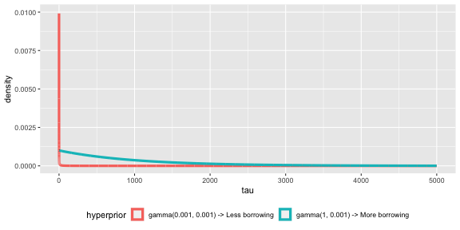
<p class="caption">plot of chunk unnamed-chunk-4</p>
</div>

The $gamma(1, .001)$ will induce more borrowing.

# History of `psborrow2`

## `psborrow2` timeline

`psborrow2` is the successor to [`psborrow`](https://cran.r-project.org/web/packages/psborrow/index.html),
an R package for simulation studies to aid trial
design and understand the benefits of BDB on
operating characteristics.

<!--html_preserve--><div id="ozlbcpozed" style="padding-left:0px;padding-right:0px;padding-top:10px;padding-bottom:10px;overflow-x:auto;overflow-y:auto;width:auto;height:auto;">
<style>#ozlbcpozed table {
  font-family: system-ui, 'Segoe UI', Roboto, Helvetica, Arial, sans-serif, 'Apple Color Emoji', 'Segoe UI Emoji', 'Segoe UI Symbol', 'Noto Color Emoji';
  -webkit-font-smoothing: antialiased;
  -moz-osx-font-smoothing: grayscale;
}

#ozlbcpozed thead, #ozlbcpozed tbody, #ozlbcpozed tfoot, #ozlbcpozed tr, #ozlbcpozed td, #ozlbcpozed th {
  border-style: none;
}

#ozlbcpozed p {
  margin: 0;
  padding: 0;
}

#ozlbcpozed .gt_table {
  display: table;
  border-collapse: collapse;
  line-height: normal;
  margin-left: auto;
  margin-right: auto;
  color: #333333;
  font-size: 16px;
  font-weight: normal;
  font-style: normal;
  background-color: #FFFFFF;
  width: auto;
  border-top-style: solid;
  border-top-width: 2px;
  border-top-color: #A8A8A8;
  border-right-style: none;
  border-right-width: 2px;
  border-right-color: #D3D3D3;
  border-bottom-style: solid;
  border-bottom-width: 2px;
  border-bottom-color: #A8A8A8;
  border-left-style: none;
  border-left-width: 2px;
  border-left-color: #D3D3D3;
}

#ozlbcpozed .gt_caption {
  padding-top: 4px;
  padding-bottom: 4px;
}

#ozlbcpozed .gt_title {
  color: #333333;
  font-size: 125%;
  font-weight: initial;
  padding-top: 4px;
  padding-bottom: 4px;
  padding-left: 5px;
  padding-right: 5px;
  border-bottom-color: #FFFFFF;
  border-bottom-width: 0;
}

#ozlbcpozed .gt_subtitle {
  color: #333333;
  font-size: 85%;
  font-weight: initial;
  padding-top: 3px;
  padding-bottom: 5px;
  padding-left: 5px;
  padding-right: 5px;
  border-top-color: #FFFFFF;
  border-top-width: 0;
}

#ozlbcpozed .gt_heading {
  background-color: #FFFFFF;
  text-align: center;
  border-bottom-color: #FFFFFF;
  border-left-style: none;
  border-left-width: 1px;
  border-left-color: #D3D3D3;
  border-right-style: none;
  border-right-width: 1px;
  border-right-color: #D3D3D3;
}

#ozlbcpozed .gt_bottom_border {
  border-bottom-style: solid;
  border-bottom-width: 2px;
  border-bottom-color: #D3D3D3;
}

#ozlbcpozed .gt_col_headings {
  border-top-style: solid;
  border-top-width: 2px;
  border-top-color: #D3D3D3;
  border-bottom-style: solid;
  border-bottom-width: 2px;
  border-bottom-color: #D3D3D3;
  border-left-style: none;
  border-left-width: 1px;
  border-left-color: #D3D3D3;
  border-right-style: none;
  border-right-width: 1px;
  border-right-color: #D3D3D3;
}

#ozlbcpozed .gt_col_heading {
  color: #333333;
  background-color: #FFFFFF;
  font-size: 100%;
  font-weight: normal;
  text-transform: inherit;
  border-left-style: none;
  border-left-width: 1px;
  border-left-color: #D3D3D3;
  border-right-style: none;
  border-right-width: 1px;
  border-right-color: #D3D3D3;
  vertical-align: bottom;
  padding-top: 5px;
  padding-bottom: 6px;
  padding-left: 5px;
  padding-right: 5px;
  overflow-x: hidden;
}

#ozlbcpozed .gt_column_spanner_outer {
  color: #333333;
  background-color: #FFFFFF;
  font-size: 100%;
  font-weight: normal;
  text-transform: inherit;
  padding-top: 0;
  padding-bottom: 0;
  padding-left: 4px;
  padding-right: 4px;
}

#ozlbcpozed .gt_column_spanner_outer:first-child {
  padding-left: 0;
}

#ozlbcpozed .gt_column_spanner_outer:last-child {
  padding-right: 0;
}

#ozlbcpozed .gt_column_spanner {
  border-bottom-style: solid;
  border-bottom-width: 2px;
  border-bottom-color: #D3D3D3;
  vertical-align: bottom;
  padding-top: 5px;
  padding-bottom: 5px;
  overflow-x: hidden;
  display: inline-block;
  width: 100%;
}

#ozlbcpozed .gt_spanner_row {
  border-bottom-style: hidden;
}

#ozlbcpozed .gt_group_heading {
  padding-top: 8px;
  padding-bottom: 8px;
  padding-left: 5px;
  padding-right: 5px;
  color: #333333;
  background-color: #FFFFFF;
  font-size: 100%;
  font-weight: initial;
  text-transform: inherit;
  border-top-style: solid;
  border-top-width: 2px;
  border-top-color: #D3D3D3;
  border-bottom-style: solid;
  border-bottom-width: 2px;
  border-bottom-color: #D3D3D3;
  border-left-style: none;
  border-left-width: 1px;
  border-left-color: #D3D3D3;
  border-right-style: none;
  border-right-width: 1px;
  border-right-color: #D3D3D3;
  vertical-align: middle;
  text-align: left;
}

#ozlbcpozed .gt_empty_group_heading {
  padding: 0.5px;
  color: #333333;
  background-color: #FFFFFF;
  font-size: 100%;
  font-weight: initial;
  border-top-style: solid;
  border-top-width: 2px;
  border-top-color: #D3D3D3;
  border-bottom-style: solid;
  border-bottom-width: 2px;
  border-bottom-color: #D3D3D3;
  vertical-align: middle;
}

#ozlbcpozed .gt_from_md > :first-child {
  margin-top: 0;
}

#ozlbcpozed .gt_from_md > :last-child {
  margin-bottom: 0;
}

#ozlbcpozed .gt_row {
  padding-top: 8px;
  padding-bottom: 8px;
  padding-left: 5px;
  padding-right: 5px;
  margin: 10px;
  border-top-style: solid;
  border-top-width: 1px;
  border-top-color: #D3D3D3;
  border-left-style: none;
  border-left-width: 1px;
  border-left-color: #D3D3D3;
  border-right-style: none;
  border-right-width: 1px;
  border-right-color: #D3D3D3;
  vertical-align: middle;
  overflow-x: hidden;
}

#ozlbcpozed .gt_stub {
  color: #333333;
  background-color: #FFFFFF;
  font-size: 100%;
  font-weight: initial;
  text-transform: inherit;
  border-right-style: solid;
  border-right-width: 2px;
  border-right-color: #D3D3D3;
  padding-left: 5px;
  padding-right: 5px;
}

#ozlbcpozed .gt_stub_row_group {
  color: #333333;
  background-color: #FFFFFF;
  font-size: 100%;
  font-weight: initial;
  text-transform: inherit;
  border-right-style: solid;
  border-right-width: 2px;
  border-right-color: #D3D3D3;
  padding-left: 5px;
  padding-right: 5px;
  vertical-align: top;
}

#ozlbcpozed .gt_row_group_first td {
  border-top-width: 2px;
}

#ozlbcpozed .gt_row_group_first th {
  border-top-width: 2px;
}

#ozlbcpozed .gt_summary_row {
  color: #333333;
  background-color: #FFFFFF;
  text-transform: inherit;
  padding-top: 8px;
  padding-bottom: 8px;
  padding-left: 5px;
  padding-right: 5px;
}

#ozlbcpozed .gt_first_summary_row {
  border-top-style: solid;
  border-top-color: #D3D3D3;
}

#ozlbcpozed .gt_first_summary_row.thick {
  border-top-width: 2px;
}

#ozlbcpozed .gt_last_summary_row {
  padding-top: 8px;
  padding-bottom: 8px;
  padding-left: 5px;
  padding-right: 5px;
  border-bottom-style: solid;
  border-bottom-width: 2px;
  border-bottom-color: #D3D3D3;
}

#ozlbcpozed .gt_grand_summary_row {
  color: #333333;
  background-color: #FFFFFF;
  text-transform: inherit;
  padding-top: 8px;
  padding-bottom: 8px;
  padding-left: 5px;
  padding-right: 5px;
}

#ozlbcpozed .gt_first_grand_summary_row {
  padding-top: 8px;
  padding-bottom: 8px;
  padding-left: 5px;
  padding-right: 5px;
  border-top-style: double;
  border-top-width: 6px;
  border-top-color: #D3D3D3;
}

#ozlbcpozed .gt_last_grand_summary_row_top {
  padding-top: 8px;
  padding-bottom: 8px;
  padding-left: 5px;
  padding-right: 5px;
  border-bottom-style: double;
  border-bottom-width: 6px;
  border-bottom-color: #D3D3D3;
}

#ozlbcpozed .gt_striped {
  background-color: rgba(128, 128, 128, 0.05);
}

#ozlbcpozed .gt_table_body {
  border-top-style: solid;
  border-top-width: 2px;
  border-top-color: #D3D3D3;
  border-bottom-style: solid;
  border-bottom-width: 2px;
  border-bottom-color: #D3D3D3;
}

#ozlbcpozed .gt_footnotes {
  color: #333333;
  background-color: #FFFFFF;
  border-bottom-style: none;
  border-bottom-width: 2px;
  border-bottom-color: #D3D3D3;
  border-left-style: none;
  border-left-width: 2px;
  border-left-color: #D3D3D3;
  border-right-style: none;
  border-right-width: 2px;
  border-right-color: #D3D3D3;
}

#ozlbcpozed .gt_footnote {
  margin: 0px;
  font-size: 90%;
  padding-top: 4px;
  padding-bottom: 4px;
  padding-left: 5px;
  padding-right: 5px;
}

#ozlbcpozed .gt_sourcenotes {
  color: #333333;
  background-color: #FFFFFF;
  border-bottom-style: none;
  border-bottom-width: 2px;
  border-bottom-color: #D3D3D3;
  border-left-style: none;
  border-left-width: 2px;
  border-left-color: #D3D3D3;
  border-right-style: none;
  border-right-width: 2px;
  border-right-color: #D3D3D3;
}

#ozlbcpozed .gt_sourcenote {
  font-size: 90%;
  padding-top: 4px;
  padding-bottom: 4px;
  padding-left: 5px;
  padding-right: 5px;
}

#ozlbcpozed .gt_left {
  text-align: left;
}

#ozlbcpozed .gt_center {
  text-align: center;
}

#ozlbcpozed .gt_right {
  text-align: right;
  font-variant-numeric: tabular-nums;
}

#ozlbcpozed .gt_font_normal {
  font-weight: normal;
}

#ozlbcpozed .gt_font_bold {
  font-weight: bold;
}

#ozlbcpozed .gt_font_italic {
  font-style: italic;
}

#ozlbcpozed .gt_super {
  font-size: 65%;
}

#ozlbcpozed .gt_footnote_marks {
  font-size: 75%;
  vertical-align: 0.4em;
  position: initial;
}

#ozlbcpozed .gt_asterisk {
  font-size: 100%;
  vertical-align: 0;
}

#ozlbcpozed .gt_indent_1 {
  text-indent: 5px;
}

#ozlbcpozed .gt_indent_2 {
  text-indent: 10px;
}

#ozlbcpozed .gt_indent_3 {
  text-indent: 15px;
}

#ozlbcpozed .gt_indent_4 {
  text-indent: 20px;
}

#ozlbcpozed .gt_indent_5 {
  text-indent: 25px;
}
</style>
<table class="gt_table" data-quarto-disable-processing="false" data-quarto-bootstrap="false">
  <thead>
    
    <tr class="gt_col_headings">
      <th class="gt_col_heading gt_columns_bottom_border gt_left" rowspan="1" colspan="1" style="font-weight: bold;" scope="col" id="Date">Date</th>
      <th class="gt_col_heading gt_columns_bottom_border gt_left" rowspan="1" colspan="1" style="font-weight: bold;" scope="col" id="Event">Event</th>
    </tr>
  </thead>
  <tbody class="gt_table_body">
    <tr><td headers="Date" class="gt_row gt_left">2019</td>
<td headers="Event" class="gt_row gt_left">psborrow development started</td></tr>
    <tr><td headers="Date" class="gt_row gt_left">Q2 2021</td>
<td headers="Event" class="gt_row gt_left">CRAN v0.1.0 published</td></tr>
    <tr><td headers="Date" class="gt_row gt_left">2021</td>
<td headers="Event" class="gt_row gt_left">Initial user feedback received from the interial POC study and the FDA CID pilot project</td></tr>
    <tr><td headers="Date" class="gt_row gt_left">Q1 2022</td>
<td headers="Event" class="gt_row gt_left">We start a collaboration with Roche statistical engineering team to productionize the package</td></tr>
    <tr><td headers="Date" class="gt_row gt_left">May 2022</td>
<td headers="Event" class="gt_row gt_left">psborrow v0.2.0 published (bug fixed, documentation improved) on CRAN</td></tr>
    <tr><td headers="Date" class="gt_row gt_left">Jul 2022</td>
<td headers="Event" class="gt_row gt_left">psborrow2 development started (faster, improved UI, tests, flexibility, more outcomes)</td></tr>
    <tr><td headers="Date" class="gt_row gt_left">Oct 2022</td>
<td headers="Event" class="gt_row gt_left">psborrow2 package made public</td></tr>
  </tbody>
  
  
</table>
</div><!--/html_preserve-->

# Overview of package

## Package objectives

`psborrow2` has two objectives:

### <b><u>1) Facilitate BDB analyses</u></b>
`psborrow2` has a user-friendly interface for conducting
BDB analyses that handles the computationally-difficult MCMC sampling
for the user

### <b><u>2) Facilitate simulation studies of BDB</u></b>
`psborrow2` can be used to compare different trial and BDB characteristics in a
unified way in simulation studies to inform trial design

# Demonstration of a single BDB analysis

## Prior distributions

In `psborrow2`, the user creates fully parametric Bayesian models with
proper prior distributions using the constructors:


```r
bernoulli_prior()
beta_prior()
cauchy_prior()
exponential_prior()
gamma_prior()
normal_prior()
poisson_prior()
uniform_prior()
```


```r
is(normal_prior(mu = 0, sigma = 100), "Prior")
> [1] TRUE
```

## Plotting priors

Each `Prior` object has a `plot` method.


```r
plot(
  normal_prior(mu = 0, sigma = 10),
  xlim = c(-100, 100),
  ylim = c(0, 0.1)
)
```

<div class="figure" style="text-align: center">
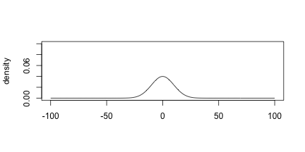
<p class="caption">plot of chunk unnamed-chunk-8</p>
</div>


## Plotting an uninformative normal prior


```r
plot(
  normal_prior(mu = 0, sigma = 10000),
  xlim = c(-100, 100),
  ylim = c(0, 0.1)
)
```

<div class="figure" style="text-align: center">
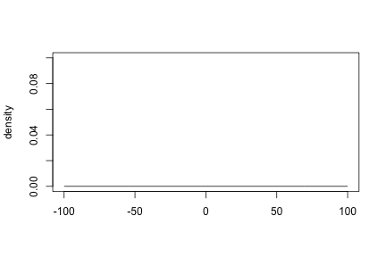
<p class="caption">plot of chunk unnamed-chunk-9</p>
</div>

## Hyperpriors for commensurability parameters

Let's look at a conservative hyperprior that will not encourage borrowing:


```r
plot(
  gamma_prior(alpha = 0.001, beta = 0.001),
  xlim = c(-1, 20),
  ylim = c(0, .025)
)
```

<div class="figure" style="text-align: center">
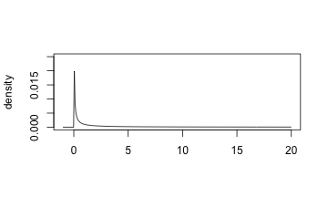
<p class="caption">plot of chunk unnamed-chunk-10</p>
</div>

##

Now let's look at a more aggressive hyperprior that may induce
borrowing:


```r
plot(
  gamma_prior(alpha = 1, beta = 0.001),
  xlim = c(-1, 20),
  ylim = c(0, .025)
)
```

<div class="figure" style="text-align: center">
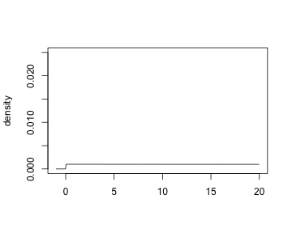
<p class="caption">plot of chunk unnamed-chunk-11</p>
</div>

## Example data

`psborrow2` has simulated example data we can use in an analysis.


```r
head(example_matrix[, c("ext", "trt", "time", "cnsr")])
>      ext trt       time cnsr
> [1,]   0   0  2.4226411    0
> [2,]   0   0 50.0000000    1
> [3,]   0   0  0.9674372    0
> [4,]   0   0 14.5774738    0
> [5,]   0   0 50.0000000    1
> [6,]   0   0 50.0000000    1
```

* `ext = 1` for external trial patients, else `ext = 0`
* `trt = 1` for experimentally-treated patients, else `trt = 0`
* `time` is the time to event or censorship
* `cnsr = 1` if a patient's follow-up was censored, else `csnr = 0`


##

The flags in this `data.frame` are explained in greater detail
in `?example_matrix`.

<center>
<br>
<!--html_preserve--><div id="khzvobqbnb" style="padding-left:0px;padding-right:0px;padding-top:10px;padding-bottom:10px;overflow-x:auto;overflow-y:auto;width:auto;height:auto;">
<style>#khzvobqbnb table {
  font-family: system-ui, 'Segoe UI', Roboto, Helvetica, Arial, sans-serif, 'Apple Color Emoji', 'Segoe UI Emoji', 'Segoe UI Symbol', 'Noto Color Emoji';
  -webkit-font-smoothing: antialiased;
  -moz-osx-font-smoothing: grayscale;
}

#khzvobqbnb thead, #khzvobqbnb tbody, #khzvobqbnb tfoot, #khzvobqbnb tr, #khzvobqbnb td, #khzvobqbnb th {
  border-style: none;
}

#khzvobqbnb p {
  margin: 0;
  padding: 0;
}

#khzvobqbnb .gt_table {
  display: table;
  border-collapse: collapse;
  line-height: normal;
  margin-left: auto;
  margin-right: auto;
  color: #333333;
  font-size: 16px;
  font-weight: normal;
  font-style: normal;
  background-color: #FFFFFF;
  width: auto;
  border-top-style: solid;
  border-top-width: 2px;
  border-top-color: #A8A8A8;
  border-right-style: none;
  border-right-width: 2px;
  border-right-color: #D3D3D3;
  border-bottom-style: solid;
  border-bottom-width: 2px;
  border-bottom-color: #A8A8A8;
  border-left-style: none;
  border-left-width: 2px;
  border-left-color: #D3D3D3;
}

#khzvobqbnb .gt_caption {
  padding-top: 4px;
  padding-bottom: 4px;
}

#khzvobqbnb .gt_title {
  color: #333333;
  font-size: 125%;
  font-weight: initial;
  padding-top: 4px;
  padding-bottom: 4px;
  padding-left: 5px;
  padding-right: 5px;
  border-bottom-color: #FFFFFF;
  border-bottom-width: 0;
}

#khzvobqbnb .gt_subtitle {
  color: #333333;
  font-size: 85%;
  font-weight: initial;
  padding-top: 3px;
  padding-bottom: 5px;
  padding-left: 5px;
  padding-right: 5px;
  border-top-color: #FFFFFF;
  border-top-width: 0;
}

#khzvobqbnb .gt_heading {
  background-color: #FFFFFF;
  text-align: center;
  border-bottom-color: #FFFFFF;
  border-left-style: none;
  border-left-width: 1px;
  border-left-color: #D3D3D3;
  border-right-style: none;
  border-right-width: 1px;
  border-right-color: #D3D3D3;
}

#khzvobqbnb .gt_bottom_border {
  border-bottom-style: solid;
  border-bottom-width: 2px;
  border-bottom-color: #D3D3D3;
}

#khzvobqbnb .gt_col_headings {
  border-top-style: solid;
  border-top-width: 2px;
  border-top-color: #D3D3D3;
  border-bottom-style: solid;
  border-bottom-width: 2px;
  border-bottom-color: #D3D3D3;
  border-left-style: none;
  border-left-width: 1px;
  border-left-color: #D3D3D3;
  border-right-style: none;
  border-right-width: 1px;
  border-right-color: #D3D3D3;
}

#khzvobqbnb .gt_col_heading {
  color: #333333;
  background-color: #FFFFFF;
  font-size: 100%;
  font-weight: normal;
  text-transform: inherit;
  border-left-style: none;
  border-left-width: 1px;
  border-left-color: #D3D3D3;
  border-right-style: none;
  border-right-width: 1px;
  border-right-color: #D3D3D3;
  vertical-align: bottom;
  padding-top: 5px;
  padding-bottom: 6px;
  padding-left: 5px;
  padding-right: 5px;
  overflow-x: hidden;
}

#khzvobqbnb .gt_column_spanner_outer {
  color: #333333;
  background-color: #FFFFFF;
  font-size: 100%;
  font-weight: normal;
  text-transform: inherit;
  padding-top: 0;
  padding-bottom: 0;
  padding-left: 4px;
  padding-right: 4px;
}

#khzvobqbnb .gt_column_spanner_outer:first-child {
  padding-left: 0;
}

#khzvobqbnb .gt_column_spanner_outer:last-child {
  padding-right: 0;
}

#khzvobqbnb .gt_column_spanner {
  border-bottom-style: solid;
  border-bottom-width: 2px;
  border-bottom-color: #D3D3D3;
  vertical-align: bottom;
  padding-top: 5px;
  padding-bottom: 5px;
  overflow-x: hidden;
  display: inline-block;
  width: 100%;
}

#khzvobqbnb .gt_spanner_row {
  border-bottom-style: hidden;
}

#khzvobqbnb .gt_group_heading {
  padding-top: 8px;
  padding-bottom: 8px;
  padding-left: 5px;
  padding-right: 5px;
  color: #333333;
  background-color: #FFFFFF;
  font-size: 100%;
  font-weight: initial;
  text-transform: inherit;
  border-top-style: solid;
  border-top-width: 2px;
  border-top-color: #D3D3D3;
  border-bottom-style: solid;
  border-bottom-width: 2px;
  border-bottom-color: #D3D3D3;
  border-left-style: none;
  border-left-width: 1px;
  border-left-color: #D3D3D3;
  border-right-style: none;
  border-right-width: 1px;
  border-right-color: #D3D3D3;
  vertical-align: middle;
  text-align: left;
}

#khzvobqbnb .gt_empty_group_heading {
  padding: 0.5px;
  color: #333333;
  background-color: #FFFFFF;
  font-size: 100%;
  font-weight: initial;
  border-top-style: solid;
  border-top-width: 2px;
  border-top-color: #D3D3D3;
  border-bottom-style: solid;
  border-bottom-width: 2px;
  border-bottom-color: #D3D3D3;
  vertical-align: middle;
}

#khzvobqbnb .gt_from_md > :first-child {
  margin-top: 0;
}

#khzvobqbnb .gt_from_md > :last-child {
  margin-bottom: 0;
}

#khzvobqbnb .gt_row {
  padding-top: 8px;
  padding-bottom: 8px;
  padding-left: 5px;
  padding-right: 5px;
  margin: 10px;
  border-top-style: solid;
  border-top-width: 1px;
  border-top-color: #D3D3D3;
  border-left-style: none;
  border-left-width: 1px;
  border-left-color: #D3D3D3;
  border-right-style: none;
  border-right-width: 1px;
  border-right-color: #D3D3D3;
  vertical-align: middle;
  overflow-x: hidden;
}

#khzvobqbnb .gt_stub {
  color: #333333;
  background-color: #FFFFFF;
  font-size: 100%;
  font-weight: initial;
  text-transform: inherit;
  border-right-style: solid;
  border-right-width: 2px;
  border-right-color: #D3D3D3;
  padding-left: 5px;
  padding-right: 5px;
}

#khzvobqbnb .gt_stub_row_group {
  color: #333333;
  background-color: #FFFFFF;
  font-size: 100%;
  font-weight: initial;
  text-transform: inherit;
  border-right-style: solid;
  border-right-width: 2px;
  border-right-color: #D3D3D3;
  padding-left: 5px;
  padding-right: 5px;
  vertical-align: top;
}

#khzvobqbnb .gt_row_group_first td {
  border-top-width: 2px;
}

#khzvobqbnb .gt_row_group_first th {
  border-top-width: 2px;
}

#khzvobqbnb .gt_summary_row {
  color: #333333;
  background-color: #FFFFFF;
  text-transform: inherit;
  padding-top: 8px;
  padding-bottom: 8px;
  padding-left: 5px;
  padding-right: 5px;
}

#khzvobqbnb .gt_first_summary_row {
  border-top-style: solid;
  border-top-color: #D3D3D3;
}

#khzvobqbnb .gt_first_summary_row.thick {
  border-top-width: 2px;
}

#khzvobqbnb .gt_last_summary_row {
  padding-top: 8px;
  padding-bottom: 8px;
  padding-left: 5px;
  padding-right: 5px;
  border-bottom-style: solid;
  border-bottom-width: 2px;
  border-bottom-color: #D3D3D3;
}

#khzvobqbnb .gt_grand_summary_row {
  color: #333333;
  background-color: #FFFFFF;
  text-transform: inherit;
  padding-top: 8px;
  padding-bottom: 8px;
  padding-left: 5px;
  padding-right: 5px;
}

#khzvobqbnb .gt_first_grand_summary_row {
  padding-top: 8px;
  padding-bottom: 8px;
  padding-left: 5px;
  padding-right: 5px;
  border-top-style: double;
  border-top-width: 6px;
  border-top-color: #D3D3D3;
}

#khzvobqbnb .gt_last_grand_summary_row_top {
  padding-top: 8px;
  padding-bottom: 8px;
  padding-left: 5px;
  padding-right: 5px;
  border-bottom-style: double;
  border-bottom-width: 6px;
  border-bottom-color: #D3D3D3;
}

#khzvobqbnb .gt_striped {
  background-color: rgba(128, 128, 128, 0.05);
}

#khzvobqbnb .gt_table_body {
  border-top-style: solid;
  border-top-width: 2px;
  border-top-color: #D3D3D3;
  border-bottom-style: solid;
  border-bottom-width: 2px;
  border-bottom-color: #D3D3D3;
}

#khzvobqbnb .gt_footnotes {
  color: #333333;
  background-color: #FFFFFF;
  border-bottom-style: none;
  border-bottom-width: 2px;
  border-bottom-color: #D3D3D3;
  border-left-style: none;
  border-left-width: 2px;
  border-left-color: #D3D3D3;
  border-right-style: none;
  border-right-width: 2px;
  border-right-color: #D3D3D3;
}

#khzvobqbnb .gt_footnote {
  margin: 0px;
  font-size: 90%;
  padding-top: 4px;
  padding-bottom: 4px;
  padding-left: 5px;
  padding-right: 5px;
}

#khzvobqbnb .gt_sourcenotes {
  color: #333333;
  background-color: #FFFFFF;
  border-bottom-style: none;
  border-bottom-width: 2px;
  border-bottom-color: #D3D3D3;
  border-left-style: none;
  border-left-width: 2px;
  border-left-color: #D3D3D3;
  border-right-style: none;
  border-right-width: 2px;
  border-right-color: #D3D3D3;
}

#khzvobqbnb .gt_sourcenote {
  font-size: 90%;
  padding-top: 4px;
  padding-bottom: 4px;
  padding-left: 5px;
  padding-right: 5px;
}

#khzvobqbnb .gt_left {
  text-align: left;
}

#khzvobqbnb .gt_center {
  text-align: center;
}

#khzvobqbnb .gt_right {
  text-align: right;
  font-variant-numeric: tabular-nums;
}

#khzvobqbnb .gt_font_normal {
  font-weight: normal;
}

#khzvobqbnb .gt_font_bold {
  font-weight: bold;
}

#khzvobqbnb .gt_font_italic {
  font-style: italic;
}

#khzvobqbnb .gt_super {
  font-size: 65%;
}

#khzvobqbnb .gt_footnote_marks {
  font-size: 75%;
  vertical-align: 0.4em;
  position: initial;
}

#khzvobqbnb .gt_asterisk {
  font-size: 100%;
  vertical-align: 0;
}

#khzvobqbnb .gt_indent_1 {
  text-indent: 5px;
}

#khzvobqbnb .gt_indent_2 {
  text-indent: 10px;
}

#khzvobqbnb .gt_indent_3 {
  text-indent: 15px;
}

#khzvobqbnb .gt_indent_4 {
  text-indent: 20px;
}

#khzvobqbnb .gt_indent_5 {
  text-indent: 25px;
}
</style>
<table class="gt_table" data-quarto-disable-processing="false" data-quarto-bootstrap="false">
  <thead>
    
    <tr class="gt_col_headings gt_spanner_row">
      <th class="gt_col_heading gt_columns_bottom_border gt_left" rowspan="2" colspan="1" scope="col" id=""></th>
      <th class="gt_center gt_columns_top_border gt_column_spanner_outer" rowspan="1" colspan="2" scope="colgroup" id="External trial data flag">
        <span class="gt_column_spanner">External trial data flag</span>
      </th>
      <th class="gt_col_heading gt_columns_bottom_border gt_center" rowspan="2" colspan="1" scope="col" id="Total">Total</th>
    </tr>
    <tr class="gt_col_headings">
      <th class="gt_col_heading gt_columns_bottom_border gt_center" rowspan="1" colspan="1" scope="col" id="0">0</th>
      <th class="gt_col_heading gt_columns_bottom_border gt_center" rowspan="1" colspan="1" scope="col" id="1">1</th>
    </tr>
  </thead>
  <tbody class="gt_table_body">
    <tr><td headers="label" class="gt_row gt_left">Experimental treatment flag</td>
<td headers="stat_1" class="gt_row gt_center"></td>
<td headers="stat_2" class="gt_row gt_center"></td>
<td headers="stat_0" class="gt_row gt_center"></td></tr>
    <tr><td headers="label" class="gt_row gt_left">    0</td>
<td headers="stat_1" class="gt_row gt_center">50</td>
<td headers="stat_2" class="gt_row gt_center">350</td>
<td headers="stat_0" class="gt_row gt_center">400</td></tr>
    <tr><td headers="label" class="gt_row gt_left">    1</td>
<td headers="stat_1" class="gt_row gt_center">100</td>
<td headers="stat_2" class="gt_row gt_center">0</td>
<td headers="stat_0" class="gt_row gt_center">100</td></tr>
    <tr><td headers="label" class="gt_row gt_left">Total</td>
<td headers="stat_1" class="gt_row gt_center">150</td>
<td headers="stat_2" class="gt_row gt_center">350</td>
<td headers="stat_0" class="gt_row gt_center">500</td></tr>
  </tbody>
  
  
</table>
</div><!--/html_preserve-->
</center>

<br>

It looks like we have 50 patients in our internal control,
100 in our internal experimental, and 350 in our external control.

## Naive internal comparisons

Let's start by exploring the three arms descriptively:

<div class="figure" style="text-align: center">
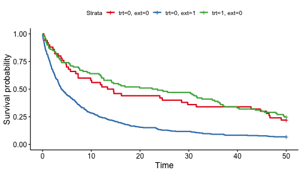
<p class="caption">plot of chunk unnamed-chunk-15</p>
</div>
<br>
Wow, the external control population looks quite different from the internal
control population!

##

<br>

As a point of reference, let's conduct a Cox proportional hazards model
looking just at the internal RCT data.

<br>

<center>
<!--html_preserve--><div id="ngqvwckhxc" style="padding-left:0px;padding-right:0px;padding-top:10px;padding-bottom:10px;overflow-x:auto;overflow-y:auto;width:auto;height:auto;">
<style>#ngqvwckhxc table {
  font-family: system-ui, 'Segoe UI', Roboto, Helvetica, Arial, sans-serif, 'Apple Color Emoji', 'Segoe UI Emoji', 'Segoe UI Symbol', 'Noto Color Emoji';
  -webkit-font-smoothing: antialiased;
  -moz-osx-font-smoothing: grayscale;
}

#ngqvwckhxc thead, #ngqvwckhxc tbody, #ngqvwckhxc tfoot, #ngqvwckhxc tr, #ngqvwckhxc td, #ngqvwckhxc th {
  border-style: none;
}

#ngqvwckhxc p {
  margin: 0;
  padding: 0;
}

#ngqvwckhxc .gt_table {
  display: table;
  border-collapse: collapse;
  line-height: normal;
  margin-left: auto;
  margin-right: auto;
  color: #333333;
  font-size: 16px;
  font-weight: normal;
  font-style: normal;
  background-color: #FFFFFF;
  width: auto;
  border-top-style: solid;
  border-top-width: 2px;
  border-top-color: #A8A8A8;
  border-right-style: none;
  border-right-width: 2px;
  border-right-color: #D3D3D3;
  border-bottom-style: solid;
  border-bottom-width: 2px;
  border-bottom-color: #A8A8A8;
  border-left-style: none;
  border-left-width: 2px;
  border-left-color: #D3D3D3;
}

#ngqvwckhxc .gt_caption {
  padding-top: 4px;
  padding-bottom: 4px;
}

#ngqvwckhxc .gt_title {
  color: #333333;
  font-size: 125%;
  font-weight: initial;
  padding-top: 4px;
  padding-bottom: 4px;
  padding-left: 5px;
  padding-right: 5px;
  border-bottom-color: #FFFFFF;
  border-bottom-width: 0;
}

#ngqvwckhxc .gt_subtitle {
  color: #333333;
  font-size: 85%;
  font-weight: initial;
  padding-top: 3px;
  padding-bottom: 5px;
  padding-left: 5px;
  padding-right: 5px;
  border-top-color: #FFFFFF;
  border-top-width: 0;
}

#ngqvwckhxc .gt_heading {
  background-color: #FFFFFF;
  text-align: center;
  border-bottom-color: #FFFFFF;
  border-left-style: none;
  border-left-width: 1px;
  border-left-color: #D3D3D3;
  border-right-style: none;
  border-right-width: 1px;
  border-right-color: #D3D3D3;
}

#ngqvwckhxc .gt_bottom_border {
  border-bottom-style: solid;
  border-bottom-width: 2px;
  border-bottom-color: #D3D3D3;
}

#ngqvwckhxc .gt_col_headings {
  border-top-style: solid;
  border-top-width: 2px;
  border-top-color: #D3D3D3;
  border-bottom-style: solid;
  border-bottom-width: 2px;
  border-bottom-color: #D3D3D3;
  border-left-style: none;
  border-left-width: 1px;
  border-left-color: #D3D3D3;
  border-right-style: none;
  border-right-width: 1px;
  border-right-color: #D3D3D3;
}

#ngqvwckhxc .gt_col_heading {
  color: #333333;
  background-color: #FFFFFF;
  font-size: 100%;
  font-weight: normal;
  text-transform: inherit;
  border-left-style: none;
  border-left-width: 1px;
  border-left-color: #D3D3D3;
  border-right-style: none;
  border-right-width: 1px;
  border-right-color: #D3D3D3;
  vertical-align: bottom;
  padding-top: 5px;
  padding-bottom: 6px;
  padding-left: 5px;
  padding-right: 5px;
  overflow-x: hidden;
}

#ngqvwckhxc .gt_column_spanner_outer {
  color: #333333;
  background-color: #FFFFFF;
  font-size: 100%;
  font-weight: normal;
  text-transform: inherit;
  padding-top: 0;
  padding-bottom: 0;
  padding-left: 4px;
  padding-right: 4px;
}

#ngqvwckhxc .gt_column_spanner_outer:first-child {
  padding-left: 0;
}

#ngqvwckhxc .gt_column_spanner_outer:last-child {
  padding-right: 0;
}

#ngqvwckhxc .gt_column_spanner {
  border-bottom-style: solid;
  border-bottom-width: 2px;
  border-bottom-color: #D3D3D3;
  vertical-align: bottom;
  padding-top: 5px;
  padding-bottom: 5px;
  overflow-x: hidden;
  display: inline-block;
  width: 100%;
}

#ngqvwckhxc .gt_spanner_row {
  border-bottom-style: hidden;
}

#ngqvwckhxc .gt_group_heading {
  padding-top: 8px;
  padding-bottom: 8px;
  padding-left: 5px;
  padding-right: 5px;
  color: #333333;
  background-color: #FFFFFF;
  font-size: 100%;
  font-weight: initial;
  text-transform: inherit;
  border-top-style: solid;
  border-top-width: 2px;
  border-top-color: #D3D3D3;
  border-bottom-style: solid;
  border-bottom-width: 2px;
  border-bottom-color: #D3D3D3;
  border-left-style: none;
  border-left-width: 1px;
  border-left-color: #D3D3D3;
  border-right-style: none;
  border-right-width: 1px;
  border-right-color: #D3D3D3;
  vertical-align: middle;
  text-align: left;
}

#ngqvwckhxc .gt_empty_group_heading {
  padding: 0.5px;
  color: #333333;
  background-color: #FFFFFF;
  font-size: 100%;
  font-weight: initial;
  border-top-style: solid;
  border-top-width: 2px;
  border-top-color: #D3D3D3;
  border-bottom-style: solid;
  border-bottom-width: 2px;
  border-bottom-color: #D3D3D3;
  vertical-align: middle;
}

#ngqvwckhxc .gt_from_md > :first-child {
  margin-top: 0;
}

#ngqvwckhxc .gt_from_md > :last-child {
  margin-bottom: 0;
}

#ngqvwckhxc .gt_row {
  padding-top: 8px;
  padding-bottom: 8px;
  padding-left: 5px;
  padding-right: 5px;
  margin: 10px;
  border-top-style: solid;
  border-top-width: 1px;
  border-top-color: #D3D3D3;
  border-left-style: none;
  border-left-width: 1px;
  border-left-color: #D3D3D3;
  border-right-style: none;
  border-right-width: 1px;
  border-right-color: #D3D3D3;
  vertical-align: middle;
  overflow-x: hidden;
}

#ngqvwckhxc .gt_stub {
  color: #333333;
  background-color: #FFFFFF;
  font-size: 100%;
  font-weight: initial;
  text-transform: inherit;
  border-right-style: solid;
  border-right-width: 2px;
  border-right-color: #D3D3D3;
  padding-left: 5px;
  padding-right: 5px;
}

#ngqvwckhxc .gt_stub_row_group {
  color: #333333;
  background-color: #FFFFFF;
  font-size: 100%;
  font-weight: initial;
  text-transform: inherit;
  border-right-style: solid;
  border-right-width: 2px;
  border-right-color: #D3D3D3;
  padding-left: 5px;
  padding-right: 5px;
  vertical-align: top;
}

#ngqvwckhxc .gt_row_group_first td {
  border-top-width: 2px;
}

#ngqvwckhxc .gt_row_group_first th {
  border-top-width: 2px;
}

#ngqvwckhxc .gt_summary_row {
  color: #333333;
  background-color: #FFFFFF;
  text-transform: inherit;
  padding-top: 8px;
  padding-bottom: 8px;
  padding-left: 5px;
  padding-right: 5px;
}

#ngqvwckhxc .gt_first_summary_row {
  border-top-style: solid;
  border-top-color: #D3D3D3;
}

#ngqvwckhxc .gt_first_summary_row.thick {
  border-top-width: 2px;
}

#ngqvwckhxc .gt_last_summary_row {
  padding-top: 8px;
  padding-bottom: 8px;
  padding-left: 5px;
  padding-right: 5px;
  border-bottom-style: solid;
  border-bottom-width: 2px;
  border-bottom-color: #D3D3D3;
}

#ngqvwckhxc .gt_grand_summary_row {
  color: #333333;
  background-color: #FFFFFF;
  text-transform: inherit;
  padding-top: 8px;
  padding-bottom: 8px;
  padding-left: 5px;
  padding-right: 5px;
}

#ngqvwckhxc .gt_first_grand_summary_row {
  padding-top: 8px;
  padding-bottom: 8px;
  padding-left: 5px;
  padding-right: 5px;
  border-top-style: double;
  border-top-width: 6px;
  border-top-color: #D3D3D3;
}

#ngqvwckhxc .gt_last_grand_summary_row_top {
  padding-top: 8px;
  padding-bottom: 8px;
  padding-left: 5px;
  padding-right: 5px;
  border-bottom-style: double;
  border-bottom-width: 6px;
  border-bottom-color: #D3D3D3;
}

#ngqvwckhxc .gt_striped {
  background-color: rgba(128, 128, 128, 0.05);
}

#ngqvwckhxc .gt_table_body {
  border-top-style: solid;
  border-top-width: 2px;
  border-top-color: #D3D3D3;
  border-bottom-style: solid;
  border-bottom-width: 2px;
  border-bottom-color: #D3D3D3;
}

#ngqvwckhxc .gt_footnotes {
  color: #333333;
  background-color: #FFFFFF;
  border-bottom-style: none;
  border-bottom-width: 2px;
  border-bottom-color: #D3D3D3;
  border-left-style: none;
  border-left-width: 2px;
  border-left-color: #D3D3D3;
  border-right-style: none;
  border-right-width: 2px;
  border-right-color: #D3D3D3;
}

#ngqvwckhxc .gt_footnote {
  margin: 0px;
  font-size: 90%;
  padding-top: 4px;
  padding-bottom: 4px;
  padding-left: 5px;
  padding-right: 5px;
}

#ngqvwckhxc .gt_sourcenotes {
  color: #333333;
  background-color: #FFFFFF;
  border-bottom-style: none;
  border-bottom-width: 2px;
  border-bottom-color: #D3D3D3;
  border-left-style: none;
  border-left-width: 2px;
  border-left-color: #D3D3D3;
  border-right-style: none;
  border-right-width: 2px;
  border-right-color: #D3D3D3;
}

#ngqvwckhxc .gt_sourcenote {
  font-size: 90%;
  padding-top: 4px;
  padding-bottom: 4px;
  padding-left: 5px;
  padding-right: 5px;
}

#ngqvwckhxc .gt_left {
  text-align: left;
}

#ngqvwckhxc .gt_center {
  text-align: center;
}

#ngqvwckhxc .gt_right {
  text-align: right;
  font-variant-numeric: tabular-nums;
}

#ngqvwckhxc .gt_font_normal {
  font-weight: normal;
}

#ngqvwckhxc .gt_font_bold {
  font-weight: bold;
}

#ngqvwckhxc .gt_font_italic {
  font-style: italic;
}

#ngqvwckhxc .gt_super {
  font-size: 65%;
}

#ngqvwckhxc .gt_footnote_marks {
  font-size: 75%;
  vertical-align: 0.4em;
  position: initial;
}

#ngqvwckhxc .gt_asterisk {
  font-size: 100%;
  vertical-align: 0;
}

#ngqvwckhxc .gt_indent_1 {
  text-indent: 5px;
}

#ngqvwckhxc .gt_indent_2 {
  text-indent: 10px;
}

#ngqvwckhxc .gt_indent_3 {
  text-indent: 15px;
}

#ngqvwckhxc .gt_indent_4 {
  text-indent: 20px;
}

#ngqvwckhxc .gt_indent_5 {
  text-indent: 25px;
}
</style>
<table class="gt_table" data-quarto-disable-processing="false" data-quarto-bootstrap="false">
  <thead>
    
    <tr class="gt_col_headings">
      <th class="gt_col_heading gt_columns_bottom_border gt_left" rowspan="1" colspan="1" scope="col" id="term">term</th>
      <th class="gt_col_heading gt_columns_bottom_border gt_right" rowspan="1" colspan="1" scope="col" id="estimate">estimate</th>
      <th class="gt_col_heading gt_columns_bottom_border gt_right" rowspan="1" colspan="1" scope="col" id="std.error">std.error</th>
      <th class="gt_col_heading gt_columns_bottom_border gt_right" rowspan="1" colspan="1" scope="col" id="statistic">statistic</th>
      <th class="gt_col_heading gt_columns_bottom_border gt_right" rowspan="1" colspan="1" scope="col" id="p.value">p.value</th>
      <th class="gt_col_heading gt_columns_bottom_border gt_right" rowspan="1" colspan="1" scope="col" id="conf.low">conf.low</th>
      <th class="gt_col_heading gt_columns_bottom_border gt_right" rowspan="1" colspan="1" scope="col" id="conf.high">conf.high</th>
    </tr>
  </thead>
  <tbody class="gt_table_body">
    <tr><td headers="term" class="gt_row gt_left">trt</td>
<td headers="estimate" class="gt_row gt_right">0.90</td>
<td headers="std.error" class="gt_row gt_right">0.20</td>
<td headers="statistic" class="gt_row gt_right">−0.56</td>
<td headers="p.value" class="gt_row gt_right">0.58</td>
<td headers="conf.low" class="gt_row gt_right">0.61</td>
<td headers="conf.high" class="gt_row gt_right">1.32</td></tr>
  </tbody>
  
  
</table>
</div><!--/html_preserve-->

</center>

<br>

Here, the hazard ratio is 0.90 (95% CI 0.61 - 1.32), ignoring the external
control data.

## Hybrid control analysis

Let's confirm that BDB will <b>not</b> perform much borrowing when we include
the external data. For a BDB analysis in `psborrow2`, we want to
create an object of class `Analysis` with:


```r
create_analysis_obj(
  data_matrix,
  outcome,
  borrowing,
  treatment
)
```

<!--html_preserve--><div id="qedhtvalnu" style="padding-left:0px;padding-right:0px;padding-top:10px;padding-bottom:10px;overflow-x:auto;overflow-y:auto;width:auto;height:auto;">
<style>#qedhtvalnu table {
  font-family: system-ui, 'Segoe UI', Roboto, Helvetica, Arial, sans-serif, 'Apple Color Emoji', 'Segoe UI Emoji', 'Segoe UI Symbol', 'Noto Color Emoji';
  -webkit-font-smoothing: antialiased;
  -moz-osx-font-smoothing: grayscale;
}

#qedhtvalnu thead, #qedhtvalnu tbody, #qedhtvalnu tfoot, #qedhtvalnu tr, #qedhtvalnu td, #qedhtvalnu th {
  border-style: none;
}

#qedhtvalnu p {
  margin: 0;
  padding: 0;
}

#qedhtvalnu .gt_table {
  display: table;
  border-collapse: collapse;
  line-height: normal;
  margin-left: auto;
  margin-right: auto;
  color: #333333;
  font-size: 16px;
  font-weight: normal;
  font-style: normal;
  background-color: #FFFFFF;
  width: auto;
  border-top-style: solid;
  border-top-width: 2px;
  border-top-color: #A8A8A8;
  border-right-style: none;
  border-right-width: 2px;
  border-right-color: #D3D3D3;
  border-bottom-style: solid;
  border-bottom-width: 2px;
  border-bottom-color: #A8A8A8;
  border-left-style: none;
  border-left-width: 2px;
  border-left-color: #D3D3D3;
}

#qedhtvalnu .gt_caption {
  padding-top: 4px;
  padding-bottom: 4px;
}

#qedhtvalnu .gt_title {
  color: #333333;
  font-size: 125%;
  font-weight: initial;
  padding-top: 4px;
  padding-bottom: 4px;
  padding-left: 5px;
  padding-right: 5px;
  border-bottom-color: #FFFFFF;
  border-bottom-width: 0;
}

#qedhtvalnu .gt_subtitle {
  color: #333333;
  font-size: 85%;
  font-weight: initial;
  padding-top: 3px;
  padding-bottom: 5px;
  padding-left: 5px;
  padding-right: 5px;
  border-top-color: #FFFFFF;
  border-top-width: 0;
}

#qedhtvalnu .gt_heading {
  background-color: #FFFFFF;
  text-align: center;
  border-bottom-color: #FFFFFF;
  border-left-style: none;
  border-left-width: 1px;
  border-left-color: #D3D3D3;
  border-right-style: none;
  border-right-width: 1px;
  border-right-color: #D3D3D3;
}

#qedhtvalnu .gt_bottom_border {
  border-bottom-style: solid;
  border-bottom-width: 2px;
  border-bottom-color: #D3D3D3;
}

#qedhtvalnu .gt_col_headings {
  border-top-style: solid;
  border-top-width: 2px;
  border-top-color: #D3D3D3;
  border-bottom-style: solid;
  border-bottom-width: 2px;
  border-bottom-color: #D3D3D3;
  border-left-style: none;
  border-left-width: 1px;
  border-left-color: #D3D3D3;
  border-right-style: none;
  border-right-width: 1px;
  border-right-color: #D3D3D3;
}

#qedhtvalnu .gt_col_heading {
  color: #333333;
  background-color: #FFFFFF;
  font-size: 100%;
  font-weight: normal;
  text-transform: inherit;
  border-left-style: none;
  border-left-width: 1px;
  border-left-color: #D3D3D3;
  border-right-style: none;
  border-right-width: 1px;
  border-right-color: #D3D3D3;
  vertical-align: bottom;
  padding-top: 5px;
  padding-bottom: 6px;
  padding-left: 5px;
  padding-right: 5px;
  overflow-x: hidden;
}

#qedhtvalnu .gt_column_spanner_outer {
  color: #333333;
  background-color: #FFFFFF;
  font-size: 100%;
  font-weight: normal;
  text-transform: inherit;
  padding-top: 0;
  padding-bottom: 0;
  padding-left: 4px;
  padding-right: 4px;
}

#qedhtvalnu .gt_column_spanner_outer:first-child {
  padding-left: 0;
}

#qedhtvalnu .gt_column_spanner_outer:last-child {
  padding-right: 0;
}

#qedhtvalnu .gt_column_spanner {
  border-bottom-style: solid;
  border-bottom-width: 2px;
  border-bottom-color: #D3D3D3;
  vertical-align: bottom;
  padding-top: 5px;
  padding-bottom: 5px;
  overflow-x: hidden;
  display: inline-block;
  width: 100%;
}

#qedhtvalnu .gt_spanner_row {
  border-bottom-style: hidden;
}

#qedhtvalnu .gt_group_heading {
  padding-top: 8px;
  padding-bottom: 8px;
  padding-left: 5px;
  padding-right: 5px;
  color: #333333;
  background-color: #FFFFFF;
  font-size: 100%;
  font-weight: initial;
  text-transform: inherit;
  border-top-style: solid;
  border-top-width: 2px;
  border-top-color: #D3D3D3;
  border-bottom-style: solid;
  border-bottom-width: 2px;
  border-bottom-color: #D3D3D3;
  border-left-style: none;
  border-left-width: 1px;
  border-left-color: #D3D3D3;
  border-right-style: none;
  border-right-width: 1px;
  border-right-color: #D3D3D3;
  vertical-align: middle;
  text-align: left;
}

#qedhtvalnu .gt_empty_group_heading {
  padding: 0.5px;
  color: #333333;
  background-color: #FFFFFF;
  font-size: 100%;
  font-weight: initial;
  border-top-style: solid;
  border-top-width: 2px;
  border-top-color: #D3D3D3;
  border-bottom-style: solid;
  border-bottom-width: 2px;
  border-bottom-color: #D3D3D3;
  vertical-align: middle;
}

#qedhtvalnu .gt_from_md > :first-child {
  margin-top: 0;
}

#qedhtvalnu .gt_from_md > :last-child {
  margin-bottom: 0;
}

#qedhtvalnu .gt_row {
  padding-top: 8px;
  padding-bottom: 8px;
  padding-left: 5px;
  padding-right: 5px;
  margin: 10px;
  border-top-style: solid;
  border-top-width: 1px;
  border-top-color: #D3D3D3;
  border-left-style: none;
  border-left-width: 1px;
  border-left-color: #D3D3D3;
  border-right-style: none;
  border-right-width: 1px;
  border-right-color: #D3D3D3;
  vertical-align: middle;
  overflow-x: hidden;
}

#qedhtvalnu .gt_stub {
  color: #333333;
  background-color: #FFFFFF;
  font-size: 100%;
  font-weight: initial;
  text-transform: inherit;
  border-right-style: solid;
  border-right-width: 2px;
  border-right-color: #D3D3D3;
  padding-left: 5px;
  padding-right: 5px;
}

#qedhtvalnu .gt_stub_row_group {
  color: #333333;
  background-color: #FFFFFF;
  font-size: 100%;
  font-weight: initial;
  text-transform: inherit;
  border-right-style: solid;
  border-right-width: 2px;
  border-right-color: #D3D3D3;
  padding-left: 5px;
  padding-right: 5px;
  vertical-align: top;
}

#qedhtvalnu .gt_row_group_first td {
  border-top-width: 2px;
}

#qedhtvalnu .gt_row_group_first th {
  border-top-width: 2px;
}

#qedhtvalnu .gt_summary_row {
  color: #333333;
  background-color: #FFFFFF;
  text-transform: inherit;
  padding-top: 8px;
  padding-bottom: 8px;
  padding-left: 5px;
  padding-right: 5px;
}

#qedhtvalnu .gt_first_summary_row {
  border-top-style: solid;
  border-top-color: #D3D3D3;
}

#qedhtvalnu .gt_first_summary_row.thick {
  border-top-width: 2px;
}

#qedhtvalnu .gt_last_summary_row {
  padding-top: 8px;
  padding-bottom: 8px;
  padding-left: 5px;
  padding-right: 5px;
  border-bottom-style: solid;
  border-bottom-width: 2px;
  border-bottom-color: #D3D3D3;
}

#qedhtvalnu .gt_grand_summary_row {
  color: #333333;
  background-color: #FFFFFF;
  text-transform: inherit;
  padding-top: 8px;
  padding-bottom: 8px;
  padding-left: 5px;
  padding-right: 5px;
}

#qedhtvalnu .gt_first_grand_summary_row {
  padding-top: 8px;
  padding-bottom: 8px;
  padding-left: 5px;
  padding-right: 5px;
  border-top-style: double;
  border-top-width: 6px;
  border-top-color: #D3D3D3;
}

#qedhtvalnu .gt_last_grand_summary_row_top {
  padding-top: 8px;
  padding-bottom: 8px;
  padding-left: 5px;
  padding-right: 5px;
  border-bottom-style: double;
  border-bottom-width: 6px;
  border-bottom-color: #D3D3D3;
}

#qedhtvalnu .gt_striped {
  background-color: rgba(128, 128, 128, 0.05);
}

#qedhtvalnu .gt_table_body {
  border-top-style: solid;
  border-top-width: 2px;
  border-top-color: #D3D3D3;
  border-bottom-style: solid;
  border-bottom-width: 2px;
  border-bottom-color: #D3D3D3;
}

#qedhtvalnu .gt_footnotes {
  color: #333333;
  background-color: #FFFFFF;
  border-bottom-style: none;
  border-bottom-width: 2px;
  border-bottom-color: #D3D3D3;
  border-left-style: none;
  border-left-width: 2px;
  border-left-color: #D3D3D3;
  border-right-style: none;
  border-right-width: 2px;
  border-right-color: #D3D3D3;
}

#qedhtvalnu .gt_footnote {
  margin: 0px;
  font-size: 90%;
  padding-top: 4px;
  padding-bottom: 4px;
  padding-left: 5px;
  padding-right: 5px;
}

#qedhtvalnu .gt_sourcenotes {
  color: #333333;
  background-color: #FFFFFF;
  border-bottom-style: none;
  border-bottom-width: 2px;
  border-bottom-color: #D3D3D3;
  border-left-style: none;
  border-left-width: 2px;
  border-left-color: #D3D3D3;
  border-right-style: none;
  border-right-width: 2px;
  border-right-color: #D3D3D3;
}

#qedhtvalnu .gt_sourcenote {
  font-size: 90%;
  padding-top: 4px;
  padding-bottom: 4px;
  padding-left: 5px;
  padding-right: 5px;
}

#qedhtvalnu .gt_left {
  text-align: left;
}

#qedhtvalnu .gt_center {
  text-align: center;
}

#qedhtvalnu .gt_right {
  text-align: right;
  font-variant-numeric: tabular-nums;
}

#qedhtvalnu .gt_font_normal {
  font-weight: normal;
}

#qedhtvalnu .gt_font_bold {
  font-weight: bold;
}

#qedhtvalnu .gt_font_italic {
  font-style: italic;
}

#qedhtvalnu .gt_super {
  font-size: 65%;
}

#qedhtvalnu .gt_footnote_marks {
  font-size: 75%;
  vertical-align: 0.4em;
  position: initial;
}

#qedhtvalnu .gt_asterisk {
  font-size: 100%;
  vertical-align: 0;
}

#qedhtvalnu .gt_indent_1 {
  text-indent: 5px;
}

#qedhtvalnu .gt_indent_2 {
  text-indent: 10px;
}

#qedhtvalnu .gt_indent_3 {
  text-indent: 15px;
}

#qedhtvalnu .gt_indent_4 {
  text-indent: 20px;
}

#qedhtvalnu .gt_indent_5 {
  text-indent: 25px;
}
</style>
<table class="gt_table" data-quarto-disable-processing="false" data-quarto-bootstrap="false">
  <thead>
    
    <tr class="gt_col_headings">
      <th class="gt_col_heading gt_columns_bottom_border gt_left" rowspan="1" colspan="1" scope="col" id="Argument">Argument</th>
      <th class="gt_col_heading gt_columns_bottom_border gt_left" rowspan="1" colspan="1" scope="col" id="Description">Description</th>
    </tr>
  </thead>
  <tbody class="gt_table_body">
    <tr><td headers="Argument" class="gt_row gt_left" style="font-weight: bold;">data_matrix</td>
<td headers="Description" class="gt_row gt_left">The data matrix, including all relevant outcome variables,and treatment arm and external control arm flags.</td></tr>
    <tr><td headers="Argument" class="gt_row gt_left" style="font-weight: bold;">outcome</td>
<td headers="Description" class="gt_row gt_left">Object of class Outcome as output by outcome_surv_exponential(), outcome_surv_weibull_ph(), or outcome_bin_logistic().</td></tr>
    <tr><td headers="Argument" class="gt_row gt_left" style="font-weight: bold;">borrowing</td>
<td headers="Description" class="gt_row gt_left">Object of class Borrowing as output by borrowing_details().</td></tr>
    <tr><td headers="Argument" class="gt_row gt_left" style="font-weight: bold;">treatment</td>
<td headers="Description" class="gt_row gt_left">Object of class Treatment as output by treatment_details().</td></tr>
  </tbody>
  
  
</table>
</div><!--/html_preserve-->

## Outcome class

Let's look at the `Outcome` class. There are three different
outcomes supported by `psborrow2`, each of which has a constructor:

<br>

<!--html_preserve--><div id="jmjrlqydes" style="padding-left:0px;padding-right:0px;padding-top:10px;padding-bottom:10px;overflow-x:auto;overflow-y:auto;width:auto;height:auto;">
<style>#jmjrlqydes table {
  font-family: system-ui, 'Segoe UI', Roboto, Helvetica, Arial, sans-serif, 'Apple Color Emoji', 'Segoe UI Emoji', 'Segoe UI Symbol', 'Noto Color Emoji';
  -webkit-font-smoothing: antialiased;
  -moz-osx-font-smoothing: grayscale;
}

#jmjrlqydes thead, #jmjrlqydes tbody, #jmjrlqydes tfoot, #jmjrlqydes tr, #jmjrlqydes td, #jmjrlqydes th {
  border-style: none;
}

#jmjrlqydes p {
  margin: 0;
  padding: 0;
}

#jmjrlqydes .gt_table {
  display: table;
  border-collapse: collapse;
  line-height: normal;
  margin-left: auto;
  margin-right: auto;
  color: #333333;
  font-size: 16px;
  font-weight: normal;
  font-style: normal;
  background-color: #FFFFFF;
  width: auto;
  border-top-style: solid;
  border-top-width: 2px;
  border-top-color: #A8A8A8;
  border-right-style: none;
  border-right-width: 2px;
  border-right-color: #D3D3D3;
  border-bottom-style: solid;
  border-bottom-width: 2px;
  border-bottom-color: #A8A8A8;
  border-left-style: none;
  border-left-width: 2px;
  border-left-color: #D3D3D3;
}

#jmjrlqydes .gt_caption {
  padding-top: 4px;
  padding-bottom: 4px;
}

#jmjrlqydes .gt_title {
  color: #333333;
  font-size: 125%;
  font-weight: initial;
  padding-top: 4px;
  padding-bottom: 4px;
  padding-left: 5px;
  padding-right: 5px;
  border-bottom-color: #FFFFFF;
  border-bottom-width: 0;
}

#jmjrlqydes .gt_subtitle {
  color: #333333;
  font-size: 85%;
  font-weight: initial;
  padding-top: 3px;
  padding-bottom: 5px;
  padding-left: 5px;
  padding-right: 5px;
  border-top-color: #FFFFFF;
  border-top-width: 0;
}

#jmjrlqydes .gt_heading {
  background-color: #FFFFFF;
  text-align: center;
  border-bottom-color: #FFFFFF;
  border-left-style: none;
  border-left-width: 1px;
  border-left-color: #D3D3D3;
  border-right-style: none;
  border-right-width: 1px;
  border-right-color: #D3D3D3;
}

#jmjrlqydes .gt_bottom_border {
  border-bottom-style: solid;
  border-bottom-width: 2px;
  border-bottom-color: #D3D3D3;
}

#jmjrlqydes .gt_col_headings {
  border-top-style: solid;
  border-top-width: 2px;
  border-top-color: #D3D3D3;
  border-bottom-style: solid;
  border-bottom-width: 2px;
  border-bottom-color: #D3D3D3;
  border-left-style: none;
  border-left-width: 1px;
  border-left-color: #D3D3D3;
  border-right-style: none;
  border-right-width: 1px;
  border-right-color: #D3D3D3;
}

#jmjrlqydes .gt_col_heading {
  color: #333333;
  background-color: #FFFFFF;
  font-size: 100%;
  font-weight: normal;
  text-transform: inherit;
  border-left-style: none;
  border-left-width: 1px;
  border-left-color: #D3D3D3;
  border-right-style: none;
  border-right-width: 1px;
  border-right-color: #D3D3D3;
  vertical-align: bottom;
  padding-top: 5px;
  padding-bottom: 6px;
  padding-left: 5px;
  padding-right: 5px;
  overflow-x: hidden;
}

#jmjrlqydes .gt_column_spanner_outer {
  color: #333333;
  background-color: #FFFFFF;
  font-size: 100%;
  font-weight: normal;
  text-transform: inherit;
  padding-top: 0;
  padding-bottom: 0;
  padding-left: 4px;
  padding-right: 4px;
}

#jmjrlqydes .gt_column_spanner_outer:first-child {
  padding-left: 0;
}

#jmjrlqydes .gt_column_spanner_outer:last-child {
  padding-right: 0;
}

#jmjrlqydes .gt_column_spanner {
  border-bottom-style: solid;
  border-bottom-width: 2px;
  border-bottom-color: #D3D3D3;
  vertical-align: bottom;
  padding-top: 5px;
  padding-bottom: 5px;
  overflow-x: hidden;
  display: inline-block;
  width: 100%;
}

#jmjrlqydes .gt_spanner_row {
  border-bottom-style: hidden;
}

#jmjrlqydes .gt_group_heading {
  padding-top: 8px;
  padding-bottom: 8px;
  padding-left: 5px;
  padding-right: 5px;
  color: #333333;
  background-color: #FFFFFF;
  font-size: 100%;
  font-weight: initial;
  text-transform: inherit;
  border-top-style: solid;
  border-top-width: 2px;
  border-top-color: #D3D3D3;
  border-bottom-style: solid;
  border-bottom-width: 2px;
  border-bottom-color: #D3D3D3;
  border-left-style: none;
  border-left-width: 1px;
  border-left-color: #D3D3D3;
  border-right-style: none;
  border-right-width: 1px;
  border-right-color: #D3D3D3;
  vertical-align: middle;
  text-align: left;
}

#jmjrlqydes .gt_empty_group_heading {
  padding: 0.5px;
  color: #333333;
  background-color: #FFFFFF;
  font-size: 100%;
  font-weight: initial;
  border-top-style: solid;
  border-top-width: 2px;
  border-top-color: #D3D3D3;
  border-bottom-style: solid;
  border-bottom-width: 2px;
  border-bottom-color: #D3D3D3;
  vertical-align: middle;
}

#jmjrlqydes .gt_from_md > :first-child {
  margin-top: 0;
}

#jmjrlqydes .gt_from_md > :last-child {
  margin-bottom: 0;
}

#jmjrlqydes .gt_row {
  padding-top: 8px;
  padding-bottom: 8px;
  padding-left: 5px;
  padding-right: 5px;
  margin: 10px;
  border-top-style: solid;
  border-top-width: 1px;
  border-top-color: #D3D3D3;
  border-left-style: none;
  border-left-width: 1px;
  border-left-color: #D3D3D3;
  border-right-style: none;
  border-right-width: 1px;
  border-right-color: #D3D3D3;
  vertical-align: middle;
  overflow-x: hidden;
}

#jmjrlqydes .gt_stub {
  color: #333333;
  background-color: #FFFFFF;
  font-size: 100%;
  font-weight: initial;
  text-transform: inherit;
  border-right-style: solid;
  border-right-width: 2px;
  border-right-color: #D3D3D3;
  padding-left: 5px;
  padding-right: 5px;
}

#jmjrlqydes .gt_stub_row_group {
  color: #333333;
  background-color: #FFFFFF;
  font-size: 100%;
  font-weight: initial;
  text-transform: inherit;
  border-right-style: solid;
  border-right-width: 2px;
  border-right-color: #D3D3D3;
  padding-left: 5px;
  padding-right: 5px;
  vertical-align: top;
}

#jmjrlqydes .gt_row_group_first td {
  border-top-width: 2px;
}

#jmjrlqydes .gt_row_group_first th {
  border-top-width: 2px;
}

#jmjrlqydes .gt_summary_row {
  color: #333333;
  background-color: #FFFFFF;
  text-transform: inherit;
  padding-top: 8px;
  padding-bottom: 8px;
  padding-left: 5px;
  padding-right: 5px;
}

#jmjrlqydes .gt_first_summary_row {
  border-top-style: solid;
  border-top-color: #D3D3D3;
}

#jmjrlqydes .gt_first_summary_row.thick {
  border-top-width: 2px;
}

#jmjrlqydes .gt_last_summary_row {
  padding-top: 8px;
  padding-bottom: 8px;
  padding-left: 5px;
  padding-right: 5px;
  border-bottom-style: solid;
  border-bottom-width: 2px;
  border-bottom-color: #D3D3D3;
}

#jmjrlqydes .gt_grand_summary_row {
  color: #333333;
  background-color: #FFFFFF;
  text-transform: inherit;
  padding-top: 8px;
  padding-bottom: 8px;
  padding-left: 5px;
  padding-right: 5px;
}

#jmjrlqydes .gt_first_grand_summary_row {
  padding-top: 8px;
  padding-bottom: 8px;
  padding-left: 5px;
  padding-right: 5px;
  border-top-style: double;
  border-top-width: 6px;
  border-top-color: #D3D3D3;
}

#jmjrlqydes .gt_last_grand_summary_row_top {
  padding-top: 8px;
  padding-bottom: 8px;
  padding-left: 5px;
  padding-right: 5px;
  border-bottom-style: double;
  border-bottom-width: 6px;
  border-bottom-color: #D3D3D3;
}

#jmjrlqydes .gt_striped {
  background-color: rgba(128, 128, 128, 0.05);
}

#jmjrlqydes .gt_table_body {
  border-top-style: solid;
  border-top-width: 2px;
  border-top-color: #D3D3D3;
  border-bottom-style: solid;
  border-bottom-width: 2px;
  border-bottom-color: #D3D3D3;
}

#jmjrlqydes .gt_footnotes {
  color: #333333;
  background-color: #FFFFFF;
  border-bottom-style: none;
  border-bottom-width: 2px;
  border-bottom-color: #D3D3D3;
  border-left-style: none;
  border-left-width: 2px;
  border-left-color: #D3D3D3;
  border-right-style: none;
  border-right-width: 2px;
  border-right-color: #D3D3D3;
}

#jmjrlqydes .gt_footnote {
  margin: 0px;
  font-size: 90%;
  padding-top: 4px;
  padding-bottom: 4px;
  padding-left: 5px;
  padding-right: 5px;
}

#jmjrlqydes .gt_sourcenotes {
  color: #333333;
  background-color: #FFFFFF;
  border-bottom-style: none;
  border-bottom-width: 2px;
  border-bottom-color: #D3D3D3;
  border-left-style: none;
  border-left-width: 2px;
  border-left-color: #D3D3D3;
  border-right-style: none;
  border-right-width: 2px;
  border-right-color: #D3D3D3;
}

#jmjrlqydes .gt_sourcenote {
  font-size: 90%;
  padding-top: 4px;
  padding-bottom: 4px;
  padding-left: 5px;
  padding-right: 5px;
}

#jmjrlqydes .gt_left {
  text-align: left;
}

#jmjrlqydes .gt_center {
  text-align: center;
}

#jmjrlqydes .gt_right {
  text-align: right;
  font-variant-numeric: tabular-nums;
}

#jmjrlqydes .gt_font_normal {
  font-weight: normal;
}

#jmjrlqydes .gt_font_bold {
  font-weight: bold;
}

#jmjrlqydes .gt_font_italic {
  font-style: italic;
}

#jmjrlqydes .gt_super {
  font-size: 65%;
}

#jmjrlqydes .gt_footnote_marks {
  font-size: 75%;
  vertical-align: 0.4em;
  position: initial;
}

#jmjrlqydes .gt_asterisk {
  font-size: 100%;
  vertical-align: 0;
}

#jmjrlqydes .gt_indent_1 {
  text-indent: 5px;
}

#jmjrlqydes .gt_indent_2 {
  text-indent: 10px;
}

#jmjrlqydes .gt_indent_3 {
  text-indent: 15px;
}

#jmjrlqydes .gt_indent_4 {
  text-indent: 20px;
}

#jmjrlqydes .gt_indent_5 {
  text-indent: 25px;
}
</style>
<table class="gt_table" data-quarto-disable-processing="false" data-quarto-bootstrap="false">
  <thead>
    
    <tr class="gt_col_headings">
      <th class="gt_col_heading gt_columns_bottom_border gt_left" rowspan="1" colspan="1" scope="col" id="Constructor">Constructor</th>
      <th class="gt_col_heading gt_columns_bottom_border gt_left" rowspan="1" colspan="1" scope="col" id="Description">Description</th>
    </tr>
  </thead>
  <tbody class="gt_table_body">
    <tr><td headers="Constructor" class="gt_row gt_left" style="font-weight: bold;">outcome_surv_exponential()</td>
<td headers="Description" class="gt_row gt_left">Exponential survival distribution</td></tr>
    <tr><td headers="Constructor" class="gt_row gt_left" style="font-weight: bold;">outcome_surv_weibull_ph()</td>
<td headers="Description" class="gt_row gt_left">Weibull survival distribution (proportional hazards formulation)</td></tr>
    <tr><td headers="Constructor" class="gt_row gt_left" style="font-weight: bold;">outcome_bin_logistic()</td>
<td headers="Description" class="gt_row gt_left">Bernoulli distribution with logit parametrization</td></tr>
  </tbody>
  
  
</table>
</div><!--/html_preserve-->

## Arguments to `outcome_surv_exponential()`


```r
outcome_surv_exponential(
  time_var,
  cens_var,
  baseline_prior
)
```

The first two arguments to `outcome_surv_exponential()` are straightforward:

- `time_var`, Name of time variable column in model matrix
- `cens_var`, Name of the censorship variable flag in model matrix

The final argument is more complicated:

- `baseline_prior`, Prior distribution for the log hazard rate of the external
control arm.

##

Let's create our outcome object with `outcome_surv_exponential()` using an uninformative
Normal prior distribution for the log hazard rate of the external control
arm.


```r
exp_outcome <- outcome_surv_exponential(
  time_var = "time",
  cens_var = "cnsr",
  baseline_prior = normal_prior(0, 10000)
)
```


```r
class(exp_outcome)
> [1] "OutcomeSurvExponential"
> attr(,"package")
> [1] "psborrow2"
```


```r
is(exp_outcome, "Outcome")
> [1] TRUE
```

## Borrowing class

Borrowing class objects are created with `borrowing_details()`.


```r
borrowing_details(
  method,
  ext_flag_col,
  tau_prior
)
```

- `method`, The type of borrowing to perform. It must be one of: `'BDB'`,
`'Full borrowing'`, or `'No borrowing'`
- `ext_flag_col`, The name of the column in the data matrix that corresponds to
the external control flag
- `tau_prior`, the hyperprior for the commensurability parameter (only
necessary for 'BDB')

##

Let's create a `Borrowing` object with a conservative inverse
Gamma distribution with rate and scale of 0.001:


```r
bdb_borrowing <- borrowing_details(
  method = "BDB",
  ext_flag_col = "ext",
  tau_prior = gamma_prior(alpha = 0.001, beta = 0.001)
)
```


```r
class(bdb_borrowing)
> [1] "Borrowing"
> attr(,"package")
> [1] "psborrow2"
```

## Treatment class

Finally, we'll create an object of class `Treatment` through the constructor
`treatment_details`.


```r
treatment_details(
  trt_flag_col,
  trt_prior
)
```

- `trt_flag_col`, The name of the column in the model matrix that corresponds to
the treatment flag
- `trt_prior`, Object of class `Prior` specifying the prior distribution of the
log hazard ratio for the experimental treatment

##

Let's assume an uninformative prior distribution for the log hazard ratio
of treatment and create our `Treatment` object:


```r
trt_details <- treatment_details(
  trt_flag_col = "trt",
  trt_prior = normal_prior(0, 10000)
)
```


```r
class(trt_details)
> [1] "Treatment"
> attr(,"package")
> [1] "psborrow2"
```

## Analysis class object

Now we have all the information we need to create an object of class `Analysis`:


```r
analysis_object <- create_analysis_obj(
  data_matrix = example_matrix,
  outcome = exp_outcome,
  borrowing = bdb_borrowing,
  treatment = trt_details
)
```


```r
class(analysis_object)
> [1] "Analysis"
> attr(,"package")
> [1] "psborrow2"
```

##
We can do this in one function call as well:


```r
analysis_object <- create_analysis_obj(
  data_matrix = example_matrix,
  outcome = outcome_surv_exponential(
    time_var = "time",
    cens_var = "cnsr",
    baseline_prior = normal_prior(0, 10000)
  ),
  borrowing = borrowing_details(
    method = "BDB",
    ext_flag_col = "ext",
    tau_prior = gamma_prior(alpha = 0.001, beta = 0.001)
  ),
  treatment = treatment_details(
    trt_flag_col = "trt",
    trt_prior = normal_prior(0, 10000)
  )
)
```

##


```r
print(analysis_object)
> Analysis Object
> 
> Outcome model: OutcomeSurvExponential 
> Outcome variables: time cnsr 
> 
> Borrowing method: BDB 
> External flag: ext 
> 
> Treatment variable: trt 
> 
> Data: Matrix with 500 observations 
>     -  50  internal controls
>     -  350  external controls 
>     -  100  internal experimental
> 
> Stan model compiled and ready to sample.
>  Call mcmc_sample() next.
```

## Sampling from an analysis object

The `Analysis` object suggests calling `mcmc_sample()`
as a next step. We'll follow that advice!


```r
results <- mcmc_sample(
  analysis_object,
  iter_warmup = 1000,
  iter_sampling = 1000,
  chains = 1,
  seed = 123
)
```


```r
results
>  variable     mean   median   sd  mad       q5      q95 rhat ess_bulk ess_tail
>  lp__     -1618.09 -1617.75 1.65 1.39 -1621.20 -1616.25 1.00      388      493
>  beta_trt    -0.16    -0.16 0.20 0.20    -0.49     0.17 1.00      251      439
>  tau          1.36     0.56 2.58 0.77     0.00     5.27 1.00      395      301
>  alpha[1]    -3.36    -3.36 0.17 0.16    -3.64    -3.11 1.00      231      354
>  alpha[2]    -2.40    -2.40 0.06 0.06    -2.49    -2.31 1.00      516      652
>  HR_trt       0.87     0.85 0.18 0.17     0.61     1.18 1.00      251      439
```

At this point in our analysis, we should refer
to the [`cmdstanr`](https://github.com/stan-dev/cmdstanr) site for
methods.

##

Let's look at a summary of the median and 95% credible intervals:

<!--html_preserve--><div id="blmkafwcen" style="padding-left:0px;padding-right:0px;padding-top:10px;padding-bottom:10px;overflow-x:auto;overflow-y:auto;width:auto;height:auto;">
<style>#blmkafwcen table {
  font-family: system-ui, 'Segoe UI', Roboto, Helvetica, Arial, sans-serif, 'Apple Color Emoji', 'Segoe UI Emoji', 'Segoe UI Symbol', 'Noto Color Emoji';
  -webkit-font-smoothing: antialiased;
  -moz-osx-font-smoothing: grayscale;
}

#blmkafwcen thead, #blmkafwcen tbody, #blmkafwcen tfoot, #blmkafwcen tr, #blmkafwcen td, #blmkafwcen th {
  border-style: none;
}

#blmkafwcen p {
  margin: 0;
  padding: 0;
}

#blmkafwcen .gt_table {
  display: table;
  border-collapse: collapse;
  line-height: normal;
  margin-left: auto;
  margin-right: auto;
  color: #333333;
  font-size: 16px;
  font-weight: normal;
  font-style: normal;
  background-color: #FFFFFF;
  width: auto;
  border-top-style: solid;
  border-top-width: 2px;
  border-top-color: #A8A8A8;
  border-right-style: none;
  border-right-width: 2px;
  border-right-color: #D3D3D3;
  border-bottom-style: solid;
  border-bottom-width: 2px;
  border-bottom-color: #A8A8A8;
  border-left-style: none;
  border-left-width: 2px;
  border-left-color: #D3D3D3;
}

#blmkafwcen .gt_caption {
  padding-top: 4px;
  padding-bottom: 4px;
}

#blmkafwcen .gt_title {
  color: #333333;
  font-size: 125%;
  font-weight: initial;
  padding-top: 4px;
  padding-bottom: 4px;
  padding-left: 5px;
  padding-right: 5px;
  border-bottom-color: #FFFFFF;
  border-bottom-width: 0;
}

#blmkafwcen .gt_subtitle {
  color: #333333;
  font-size: 85%;
  font-weight: initial;
  padding-top: 3px;
  padding-bottom: 5px;
  padding-left: 5px;
  padding-right: 5px;
  border-top-color: #FFFFFF;
  border-top-width: 0;
}

#blmkafwcen .gt_heading {
  background-color: #FFFFFF;
  text-align: center;
  border-bottom-color: #FFFFFF;
  border-left-style: none;
  border-left-width: 1px;
  border-left-color: #D3D3D3;
  border-right-style: none;
  border-right-width: 1px;
  border-right-color: #D3D3D3;
}

#blmkafwcen .gt_bottom_border {
  border-bottom-style: solid;
  border-bottom-width: 2px;
  border-bottom-color: #D3D3D3;
}

#blmkafwcen .gt_col_headings {
  border-top-style: solid;
  border-top-width: 2px;
  border-top-color: #D3D3D3;
  border-bottom-style: solid;
  border-bottom-width: 2px;
  border-bottom-color: #D3D3D3;
  border-left-style: none;
  border-left-width: 1px;
  border-left-color: #D3D3D3;
  border-right-style: none;
  border-right-width: 1px;
  border-right-color: #D3D3D3;
}

#blmkafwcen .gt_col_heading {
  color: #333333;
  background-color: #FFFFFF;
  font-size: 100%;
  font-weight: normal;
  text-transform: inherit;
  border-left-style: none;
  border-left-width: 1px;
  border-left-color: #D3D3D3;
  border-right-style: none;
  border-right-width: 1px;
  border-right-color: #D3D3D3;
  vertical-align: bottom;
  padding-top: 5px;
  padding-bottom: 6px;
  padding-left: 5px;
  padding-right: 5px;
  overflow-x: hidden;
}

#blmkafwcen .gt_column_spanner_outer {
  color: #333333;
  background-color: #FFFFFF;
  font-size: 100%;
  font-weight: normal;
  text-transform: inherit;
  padding-top: 0;
  padding-bottom: 0;
  padding-left: 4px;
  padding-right: 4px;
}

#blmkafwcen .gt_column_spanner_outer:first-child {
  padding-left: 0;
}

#blmkafwcen .gt_column_spanner_outer:last-child {
  padding-right: 0;
}

#blmkafwcen .gt_column_spanner {
  border-bottom-style: solid;
  border-bottom-width: 2px;
  border-bottom-color: #D3D3D3;
  vertical-align: bottom;
  padding-top: 5px;
  padding-bottom: 5px;
  overflow-x: hidden;
  display: inline-block;
  width: 100%;
}

#blmkafwcen .gt_spanner_row {
  border-bottom-style: hidden;
}

#blmkafwcen .gt_group_heading {
  padding-top: 8px;
  padding-bottom: 8px;
  padding-left: 5px;
  padding-right: 5px;
  color: #333333;
  background-color: #FFFFFF;
  font-size: 100%;
  font-weight: initial;
  text-transform: inherit;
  border-top-style: solid;
  border-top-width: 2px;
  border-top-color: #D3D3D3;
  border-bottom-style: solid;
  border-bottom-width: 2px;
  border-bottom-color: #D3D3D3;
  border-left-style: none;
  border-left-width: 1px;
  border-left-color: #D3D3D3;
  border-right-style: none;
  border-right-width: 1px;
  border-right-color: #D3D3D3;
  vertical-align: middle;
  text-align: left;
}

#blmkafwcen .gt_empty_group_heading {
  padding: 0.5px;
  color: #333333;
  background-color: #FFFFFF;
  font-size: 100%;
  font-weight: initial;
  border-top-style: solid;
  border-top-width: 2px;
  border-top-color: #D3D3D3;
  border-bottom-style: solid;
  border-bottom-width: 2px;
  border-bottom-color: #D3D3D3;
  vertical-align: middle;
}

#blmkafwcen .gt_from_md > :first-child {
  margin-top: 0;
}

#blmkafwcen .gt_from_md > :last-child {
  margin-bottom: 0;
}

#blmkafwcen .gt_row {
  padding-top: 8px;
  padding-bottom: 8px;
  padding-left: 5px;
  padding-right: 5px;
  margin: 10px;
  border-top-style: solid;
  border-top-width: 1px;
  border-top-color: #D3D3D3;
  border-left-style: none;
  border-left-width: 1px;
  border-left-color: #D3D3D3;
  border-right-style: none;
  border-right-width: 1px;
  border-right-color: #D3D3D3;
  vertical-align: middle;
  overflow-x: hidden;
}

#blmkafwcen .gt_stub {
  color: #333333;
  background-color: #FFFFFF;
  font-size: 100%;
  font-weight: initial;
  text-transform: inherit;
  border-right-style: solid;
  border-right-width: 2px;
  border-right-color: #D3D3D3;
  padding-left: 5px;
  padding-right: 5px;
}

#blmkafwcen .gt_stub_row_group {
  color: #333333;
  background-color: #FFFFFF;
  font-size: 100%;
  font-weight: initial;
  text-transform: inherit;
  border-right-style: solid;
  border-right-width: 2px;
  border-right-color: #D3D3D3;
  padding-left: 5px;
  padding-right: 5px;
  vertical-align: top;
}

#blmkafwcen .gt_row_group_first td {
  border-top-width: 2px;
}

#blmkafwcen .gt_row_group_first th {
  border-top-width: 2px;
}

#blmkafwcen .gt_summary_row {
  color: #333333;
  background-color: #FFFFFF;
  text-transform: inherit;
  padding-top: 8px;
  padding-bottom: 8px;
  padding-left: 5px;
  padding-right: 5px;
}

#blmkafwcen .gt_first_summary_row {
  border-top-style: solid;
  border-top-color: #D3D3D3;
}

#blmkafwcen .gt_first_summary_row.thick {
  border-top-width: 2px;
}

#blmkafwcen .gt_last_summary_row {
  padding-top: 8px;
  padding-bottom: 8px;
  padding-left: 5px;
  padding-right: 5px;
  border-bottom-style: solid;
  border-bottom-width: 2px;
  border-bottom-color: #D3D3D3;
}

#blmkafwcen .gt_grand_summary_row {
  color: #333333;
  background-color: #FFFFFF;
  text-transform: inherit;
  padding-top: 8px;
  padding-bottom: 8px;
  padding-left: 5px;
  padding-right: 5px;
}

#blmkafwcen .gt_first_grand_summary_row {
  padding-top: 8px;
  padding-bottom: 8px;
  padding-left: 5px;
  padding-right: 5px;
  border-top-style: double;
  border-top-width: 6px;
  border-top-color: #D3D3D3;
}

#blmkafwcen .gt_last_grand_summary_row_top {
  padding-top: 8px;
  padding-bottom: 8px;
  padding-left: 5px;
  padding-right: 5px;
  border-bottom-style: double;
  border-bottom-width: 6px;
  border-bottom-color: #D3D3D3;
}

#blmkafwcen .gt_striped {
  background-color: rgba(128, 128, 128, 0.05);
}

#blmkafwcen .gt_table_body {
  border-top-style: solid;
  border-top-width: 2px;
  border-top-color: #D3D3D3;
  border-bottom-style: solid;
  border-bottom-width: 2px;
  border-bottom-color: #D3D3D3;
}

#blmkafwcen .gt_footnotes {
  color: #333333;
  background-color: #FFFFFF;
  border-bottom-style: none;
  border-bottom-width: 2px;
  border-bottom-color: #D3D3D3;
  border-left-style: none;
  border-left-width: 2px;
  border-left-color: #D3D3D3;
  border-right-style: none;
  border-right-width: 2px;
  border-right-color: #D3D3D3;
}

#blmkafwcen .gt_footnote {
  margin: 0px;
  font-size: 90%;
  padding-top: 4px;
  padding-bottom: 4px;
  padding-left: 5px;
  padding-right: 5px;
}

#blmkafwcen .gt_sourcenotes {
  color: #333333;
  background-color: #FFFFFF;
  border-bottom-style: none;
  border-bottom-width: 2px;
  border-bottom-color: #D3D3D3;
  border-left-style: none;
  border-left-width: 2px;
  border-left-color: #D3D3D3;
  border-right-style: none;
  border-right-width: 2px;
  border-right-color: #D3D3D3;
}

#blmkafwcen .gt_sourcenote {
  font-size: 90%;
  padding-top: 4px;
  padding-bottom: 4px;
  padding-left: 5px;
  padding-right: 5px;
}

#blmkafwcen .gt_left {
  text-align: left;
}

#blmkafwcen .gt_center {
  text-align: center;
}

#blmkafwcen .gt_right {
  text-align: right;
  font-variant-numeric: tabular-nums;
}

#blmkafwcen .gt_font_normal {
  font-weight: normal;
}

#blmkafwcen .gt_font_bold {
  font-weight: bold;
}

#blmkafwcen .gt_font_italic {
  font-style: italic;
}

#blmkafwcen .gt_super {
  font-size: 65%;
}

#blmkafwcen .gt_footnote_marks {
  font-size: 75%;
  vertical-align: 0.4em;
  position: initial;
}

#blmkafwcen .gt_asterisk {
  font-size: 100%;
  vertical-align: 0;
}

#blmkafwcen .gt_indent_1 {
  text-indent: 5px;
}

#blmkafwcen .gt_indent_2 {
  text-indent: 10px;
}

#blmkafwcen .gt_indent_3 {
  text-indent: 15px;
}

#blmkafwcen .gt_indent_4 {
  text-indent: 20px;
}

#blmkafwcen .gt_indent_5 {
  text-indent: 25px;
}
</style>
<table class="gt_table" data-quarto-disable-processing="false" data-quarto-bootstrap="false">
  <thead>
    
    <tr class="gt_col_headings">
      <th class="gt_col_heading gt_columns_bottom_border gt_left" rowspan="1" colspan="1" scope="col" id="variable">variable</th>
      <th class="gt_col_heading gt_columns_bottom_border gt_right" rowspan="1" colspan="1" scope="col" id="2.5%">2.5%</th>
      <th class="gt_col_heading gt_columns_bottom_border gt_right" rowspan="1" colspan="1" scope="col" id="50%">50%</th>
      <th class="gt_col_heading gt_columns_bottom_border gt_right" rowspan="1" colspan="1" scope="col" id="97.5%">97.5%</th>
    </tr>
  </thead>
  <tbody class="gt_table_body">
    <tr><td headers="variable" class="gt_row gt_left">treatment log HR</td>
<td headers="2.5%" class="gt_row gt_right">−0.56</td>
<td headers="50%" class="gt_row gt_right">−0.16</td>
<td headers="97.5%" class="gt_row gt_right">0.22</td></tr>
    <tr><td headers="variable" class="gt_row gt_left">commensurability parameter</td>
<td headers="2.5%" class="gt_row gt_right">0.00</td>
<td headers="50%" class="gt_row gt_right">0.56</td>
<td headers="97.5%" class="gt_row gt_right">7.63</td></tr>
    <tr><td headers="variable" class="gt_row gt_left">baseline log hazard rate, internal</td>
<td headers="2.5%" class="gt_row gt_right">−3.71</td>
<td headers="50%" class="gt_row gt_right">−3.36</td>
<td headers="97.5%" class="gt_row gt_right">−3.06</td></tr>
    <tr><td headers="variable" class="gt_row gt_left">baseline log hazard rate, external</td>
<td headers="2.5%" class="gt_row gt_right">−2.50</td>
<td headers="50%" class="gt_row gt_right">−2.40</td>
<td headers="97.5%" class="gt_row gt_right">−2.30</td></tr>
    <tr><td headers="variable" class="gt_row gt_left" style="font-weight: bold; background-color: #E0FFFF;">treatment HR</td>
<td headers="2.5%" class="gt_row gt_right" style="font-weight: bold; background-color: #E0FFFF;">0.57</td>
<td headers="50%" class="gt_row gt_right" style="font-weight: bold; background-color: #E0FFFF;">0.85</td>
<td headers="97.5%" class="gt_row gt_right" style="font-weight: bold; background-color: #E0FFFF;">1.24</td></tr>
  </tbody>
  
  
</table>
</div><!--/html_preserve-->

<br>


<div class="figure" style="text-align: center">
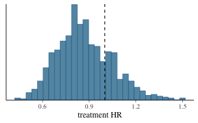
<p class="caption">plot of chunk unnamed-chunk-39</p>
</div>

##

Our results did not change substantially after using
BDB. This is exactly what we would expect given how different our
populations are!

Let's explore baseline characteristics and see if we can identify ways
in which the internal and external control arms differ:

<center>

<!--html_preserve--><div class="Rtable1"><table class="Rtable1">
<thead>
<tr>
<th class="grouplabel"></th>
<th colspan="2" class="grouplabel"><div>Control</div></th>
<th colspan="1" class="grouplabel"><div>Treatment</div></th>
<th colspan="2" class="grouplabel"><div>Overall</div></th>
</tr>
<tr>
<th class='rowlabel firstrow lastrow'></th>
<th class='firstrow lastrow'><span class='stratlabel'>Internal<br><span class='stratn'>(N=50)</span></span></th>
<th class='firstrow lastrow'><span class='stratlabel'>External<br><span class='stratn'>(N=350)</span></span></th>
<th class='firstrow lastrow'><span class='stratlabel'>Internal<br><span class='stratn'>(N=100)</span></span></th>
<th class='firstrow lastrow'><span class='stratlabel'>Internal<br><span class='stratn'>(N=150)</span></span></th>
<th class='firstrow lastrow'><span class='stratlabel'>External<br><span class='stratn'>(N=350)</span></span></th>
</tr>
</thead>
<tbody>
<tr>
<td class='rowlabel firstrow'>cov1</td>
<td class='firstrow'></td>
<td class='firstrow'></td>
<td class='firstrow'></td>
<td class='firstrow'></td>
<td class='firstrow'></td>
</tr>
<tr>
<td class='rowlabel'>Mean (SD)</td>
<td>0.540 (0.503)</td>
<td>0.740 (0.439)</td>
<td>0.630 (0.485)</td>
<td>0.600 (0.492)</td>
<td>0.740 (0.439)</td>
</tr>
<tr>
<td class='rowlabel lastrow'>Median [Min, Max]</td>
<td class='lastrow'>1.00 [0, 1.00]</td>
<td class='lastrow'>1.00 [0, 1.00]</td>
<td class='lastrow'>1.00 [0, 1.00]</td>
<td class='lastrow'>1.00 [0, 1.00]</td>
<td class='lastrow'>1.00 [0, 1.00]</td>
</tr>
<tr>
<td class='rowlabel firstrow'>cov2</td>
<td class='firstrow'></td>
<td class='firstrow'></td>
<td class='firstrow'></td>
<td class='firstrow'></td>
<td class='firstrow'></td>
</tr>
<tr>
<td class='rowlabel'>Mean (SD)</td>
<td>0.200 (0.404)</td>
<td>0.500 (0.501)</td>
<td>0.370 (0.485)</td>
<td>0.313 (0.465)</td>
<td>0.500 (0.501)</td>
</tr>
<tr>
<td class='rowlabel lastrow'>Median [Min, Max]</td>
<td class='lastrow'>0 [0, 1.00]</td>
<td class='lastrow'>0.500 [0, 1.00]</td>
<td class='lastrow'>0 [0, 1.00]</td>
<td class='lastrow'>0 [0, 1.00]</td>
<td class='lastrow'>0.500 [0, 1.00]</td>
</tr>
<tr>
<td class='rowlabel firstrow'>cov3</td>
<td class='firstrow'></td>
<td class='firstrow'></td>
<td class='firstrow'></td>
<td class='firstrow'></td>
<td class='firstrow'></td>
</tr>
<tr>
<td class='rowlabel'>Mean (SD)</td>
<td>0.760 (0.431)</td>
<td>0.403 (0.491)</td>
<td>0.760 (0.429)</td>
<td>0.760 (0.429)</td>
<td>0.403 (0.491)</td>
</tr>
<tr>
<td class='rowlabel lastrow'>Median [Min, Max]</td>
<td class='lastrow'>1.00 [0, 1.00]</td>
<td class='lastrow'>0 [0, 1.00]</td>
<td class='lastrow'>1.00 [0, 1.00]</td>
<td class='lastrow'>1.00 [0, 1.00]</td>
<td class='lastrow'>0 [0, 1.00]</td>
</tr>
<tr>
<td class='rowlabel firstrow'>cov4</td>
<td class='firstrow'></td>
<td class='firstrow'></td>
<td class='firstrow'></td>
<td class='firstrow'></td>
<td class='firstrow'></td>
</tr>
<tr>
<td class='rowlabel'>Mean (SD)</td>
<td>0.420 (0.499)</td>
<td>0.197 (0.398)</td>
<td>0.460 (0.501)</td>
<td>0.447 (0.499)</td>
<td>0.197 (0.398)</td>
</tr>
<tr>
<td class='rowlabel lastrow'>Median [Min, Max]</td>
<td class='lastrow'>0 [0, 1.00]</td>
<td class='lastrow'>0 [0, 1.00]</td>
<td class='lastrow'>0 [0, 1.00]</td>
<td class='lastrow'>0 [0, 1.00]</td>
<td class='lastrow'>0 [0, 1.00]</td>
</tr>
</tbody>
</table>
</div><!--/html_preserve-->
</center>

##

There appear to be some differences. Let's use statistical adjustment
base on the propensity score to address this:


```r
ps_model <- glm(ext ~ cov1 + cov2 + cov3 + cov4,
  data = example_dataframe,
  family = binomial
)
```


```r
ps_model
> 
> Call:  glm(formula = ext ~ cov1 + cov2 + cov3 + cov4, family = binomial, 
>     data = example_dataframe)
> 
> Coefficients:
> (Intercept)         cov1         cov2         cov3         cov4  
>      1.4389       0.5840       0.7643      -1.5827      -1.1420  
> 
> Degrees of Freedom: 499 Total (i.e. Null);  495 Residual
> Null Deviance:	    610.9 
> Residual Deviance: 508.1 	AIC: 518.1
```

##

We'll make a new matrix called `example_matrix_ps` which has 5 categories of
propensity score levels with approximately the same number of patients
in each.


```r
head(example_matrix_ps)
>         time cnsr trt ext ps_cat_low ps_cat_low_med ps_cat_high_med ps_cat_high
> 1  2.4226411    0   0   0          1              0               0           0
> 2 50.0000000    1   0   0          0              0               0           0
> 3  0.9674372    0   0   0          0              0               0           1
> 4 14.5774738    0   0   0          0              0               0           0
> 5 50.0000000    1   0   0          0              0               0           0
> 6 50.0000000    1   0   0          0              0               0           0
```


## Adjusting for covariates in `psborrow2`

To adjust for covariates, we'll use the costructor `add_covariates()`:


```r
add_covariates(
  covariates,
  priors
)
```

- `covariates`, Names of columns in the data matrix containing covariates to
be adjusted for
- `priors`, Either a single object of class `Prior` specifying the prior
distribution to apply to all covariates or a named list of distributions of
class `Prior`, one for each covariate

## Analysis object adjusting for propensity scores

Now let's create an `Analysis` object that adjusts for propensity scores:


```r
analysis_object_ps <- create_analysis_obj(
  data_matrix = example_matrix_ps,
  covariates = add_covariates(
    c("ps_cat_low", "ps_cat_low_med", "ps_cat_high_med", "ps_cat_high"),
    normal_prior(0, 10000)
  ),
  outcome = outcome_surv_exponential("time", "cnsr", normal_prior(0, 10000)),
  borrowing = borrowing_details("BDB", "ext", gamma_prior(0.001, 0.001)),
  treatment = treatment_details("trt", normal_prior(0, 10000))
)
```


```r
results_ps <- mcmc_sample(analysis_object_ps,
  iter_warmup = 1000,
  iter_sampling = 1000,
  chains = 1,
  seed = 123
)
```

##

It looks like we do indeed see a treatment effect when differences in the
distributions of baseline confounds are taken into consideration!

<br>

<!--html_preserve--><div id="yohpganilv" style="padding-left:0px;padding-right:0px;padding-top:10px;padding-bottom:10px;overflow-x:auto;overflow-y:auto;width:auto;height:auto;">
<style>#yohpganilv table {
  font-family: system-ui, 'Segoe UI', Roboto, Helvetica, Arial, sans-serif, 'Apple Color Emoji', 'Segoe UI Emoji', 'Segoe UI Symbol', 'Noto Color Emoji';
  -webkit-font-smoothing: antialiased;
  -moz-osx-font-smoothing: grayscale;
}

#yohpganilv thead, #yohpganilv tbody, #yohpganilv tfoot, #yohpganilv tr, #yohpganilv td, #yohpganilv th {
  border-style: none;
}

#yohpganilv p {
  margin: 0;
  padding: 0;
}

#yohpganilv .gt_table {
  display: table;
  border-collapse: collapse;
  line-height: normal;
  margin-left: auto;
  margin-right: auto;
  color: #333333;
  font-size: 16px;
  font-weight: normal;
  font-style: normal;
  background-color: #FFFFFF;
  width: auto;
  border-top-style: solid;
  border-top-width: 2px;
  border-top-color: #A8A8A8;
  border-right-style: none;
  border-right-width: 2px;
  border-right-color: #D3D3D3;
  border-bottom-style: solid;
  border-bottom-width: 2px;
  border-bottom-color: #A8A8A8;
  border-left-style: none;
  border-left-width: 2px;
  border-left-color: #D3D3D3;
}

#yohpganilv .gt_caption {
  padding-top: 4px;
  padding-bottom: 4px;
}

#yohpganilv .gt_title {
  color: #333333;
  font-size: 125%;
  font-weight: initial;
  padding-top: 4px;
  padding-bottom: 4px;
  padding-left: 5px;
  padding-right: 5px;
  border-bottom-color: #FFFFFF;
  border-bottom-width: 0;
}

#yohpganilv .gt_subtitle {
  color: #333333;
  font-size: 85%;
  font-weight: initial;
  padding-top: 3px;
  padding-bottom: 5px;
  padding-left: 5px;
  padding-right: 5px;
  border-top-color: #FFFFFF;
  border-top-width: 0;
}

#yohpganilv .gt_heading {
  background-color: #FFFFFF;
  text-align: center;
  border-bottom-color: #FFFFFF;
  border-left-style: none;
  border-left-width: 1px;
  border-left-color: #D3D3D3;
  border-right-style: none;
  border-right-width: 1px;
  border-right-color: #D3D3D3;
}

#yohpganilv .gt_bottom_border {
  border-bottom-style: solid;
  border-bottom-width: 2px;
  border-bottom-color: #D3D3D3;
}

#yohpganilv .gt_col_headings {
  border-top-style: solid;
  border-top-width: 2px;
  border-top-color: #D3D3D3;
  border-bottom-style: solid;
  border-bottom-width: 2px;
  border-bottom-color: #D3D3D3;
  border-left-style: none;
  border-left-width: 1px;
  border-left-color: #D3D3D3;
  border-right-style: none;
  border-right-width: 1px;
  border-right-color: #D3D3D3;
}

#yohpganilv .gt_col_heading {
  color: #333333;
  background-color: #FFFFFF;
  font-size: 100%;
  font-weight: normal;
  text-transform: inherit;
  border-left-style: none;
  border-left-width: 1px;
  border-left-color: #D3D3D3;
  border-right-style: none;
  border-right-width: 1px;
  border-right-color: #D3D3D3;
  vertical-align: bottom;
  padding-top: 5px;
  padding-bottom: 6px;
  padding-left: 5px;
  padding-right: 5px;
  overflow-x: hidden;
}

#yohpganilv .gt_column_spanner_outer {
  color: #333333;
  background-color: #FFFFFF;
  font-size: 100%;
  font-weight: normal;
  text-transform: inherit;
  padding-top: 0;
  padding-bottom: 0;
  padding-left: 4px;
  padding-right: 4px;
}

#yohpganilv .gt_column_spanner_outer:first-child {
  padding-left: 0;
}

#yohpganilv .gt_column_spanner_outer:last-child {
  padding-right: 0;
}

#yohpganilv .gt_column_spanner {
  border-bottom-style: solid;
  border-bottom-width: 2px;
  border-bottom-color: #D3D3D3;
  vertical-align: bottom;
  padding-top: 5px;
  padding-bottom: 5px;
  overflow-x: hidden;
  display: inline-block;
  width: 100%;
}

#yohpganilv .gt_spanner_row {
  border-bottom-style: hidden;
}

#yohpganilv .gt_group_heading {
  padding-top: 8px;
  padding-bottom: 8px;
  padding-left: 5px;
  padding-right: 5px;
  color: #333333;
  background-color: #FFFFFF;
  font-size: 100%;
  font-weight: initial;
  text-transform: inherit;
  border-top-style: solid;
  border-top-width: 2px;
  border-top-color: #D3D3D3;
  border-bottom-style: solid;
  border-bottom-width: 2px;
  border-bottom-color: #D3D3D3;
  border-left-style: none;
  border-left-width: 1px;
  border-left-color: #D3D3D3;
  border-right-style: none;
  border-right-width: 1px;
  border-right-color: #D3D3D3;
  vertical-align: middle;
  text-align: left;
}

#yohpganilv .gt_empty_group_heading {
  padding: 0.5px;
  color: #333333;
  background-color: #FFFFFF;
  font-size: 100%;
  font-weight: initial;
  border-top-style: solid;
  border-top-width: 2px;
  border-top-color: #D3D3D3;
  border-bottom-style: solid;
  border-bottom-width: 2px;
  border-bottom-color: #D3D3D3;
  vertical-align: middle;
}

#yohpganilv .gt_from_md > :first-child {
  margin-top: 0;
}

#yohpganilv .gt_from_md > :last-child {
  margin-bottom: 0;
}

#yohpganilv .gt_row {
  padding-top: 8px;
  padding-bottom: 8px;
  padding-left: 5px;
  padding-right: 5px;
  margin: 10px;
  border-top-style: solid;
  border-top-width: 1px;
  border-top-color: #D3D3D3;
  border-left-style: none;
  border-left-width: 1px;
  border-left-color: #D3D3D3;
  border-right-style: none;
  border-right-width: 1px;
  border-right-color: #D3D3D3;
  vertical-align: middle;
  overflow-x: hidden;
}

#yohpganilv .gt_stub {
  color: #333333;
  background-color: #FFFFFF;
  font-size: 100%;
  font-weight: initial;
  text-transform: inherit;
  border-right-style: solid;
  border-right-width: 2px;
  border-right-color: #D3D3D3;
  padding-left: 5px;
  padding-right: 5px;
}

#yohpganilv .gt_stub_row_group {
  color: #333333;
  background-color: #FFFFFF;
  font-size: 100%;
  font-weight: initial;
  text-transform: inherit;
  border-right-style: solid;
  border-right-width: 2px;
  border-right-color: #D3D3D3;
  padding-left: 5px;
  padding-right: 5px;
  vertical-align: top;
}

#yohpganilv .gt_row_group_first td {
  border-top-width: 2px;
}

#yohpganilv .gt_row_group_first th {
  border-top-width: 2px;
}

#yohpganilv .gt_summary_row {
  color: #333333;
  background-color: #FFFFFF;
  text-transform: inherit;
  padding-top: 8px;
  padding-bottom: 8px;
  padding-left: 5px;
  padding-right: 5px;
}

#yohpganilv .gt_first_summary_row {
  border-top-style: solid;
  border-top-color: #D3D3D3;
}

#yohpganilv .gt_first_summary_row.thick {
  border-top-width: 2px;
}

#yohpganilv .gt_last_summary_row {
  padding-top: 8px;
  padding-bottom: 8px;
  padding-left: 5px;
  padding-right: 5px;
  border-bottom-style: solid;
  border-bottom-width: 2px;
  border-bottom-color: #D3D3D3;
}

#yohpganilv .gt_grand_summary_row {
  color: #333333;
  background-color: #FFFFFF;
  text-transform: inherit;
  padding-top: 8px;
  padding-bottom: 8px;
  padding-left: 5px;
  padding-right: 5px;
}

#yohpganilv .gt_first_grand_summary_row {
  padding-top: 8px;
  padding-bottom: 8px;
  padding-left: 5px;
  padding-right: 5px;
  border-top-style: double;
  border-top-width: 6px;
  border-top-color: #D3D3D3;
}

#yohpganilv .gt_last_grand_summary_row_top {
  padding-top: 8px;
  padding-bottom: 8px;
  padding-left: 5px;
  padding-right: 5px;
  border-bottom-style: double;
  border-bottom-width: 6px;
  border-bottom-color: #D3D3D3;
}

#yohpganilv .gt_striped {
  background-color: rgba(128, 128, 128, 0.05);
}

#yohpganilv .gt_table_body {
  border-top-style: solid;
  border-top-width: 2px;
  border-top-color: #D3D3D3;
  border-bottom-style: solid;
  border-bottom-width: 2px;
  border-bottom-color: #D3D3D3;
}

#yohpganilv .gt_footnotes {
  color: #333333;
  background-color: #FFFFFF;
  border-bottom-style: none;
  border-bottom-width: 2px;
  border-bottom-color: #D3D3D3;
  border-left-style: none;
  border-left-width: 2px;
  border-left-color: #D3D3D3;
  border-right-style: none;
  border-right-width: 2px;
  border-right-color: #D3D3D3;
}

#yohpganilv .gt_footnote {
  margin: 0px;
  font-size: 90%;
  padding-top: 4px;
  padding-bottom: 4px;
  padding-left: 5px;
  padding-right: 5px;
}

#yohpganilv .gt_sourcenotes {
  color: #333333;
  background-color: #FFFFFF;
  border-bottom-style: none;
  border-bottom-width: 2px;
  border-bottom-color: #D3D3D3;
  border-left-style: none;
  border-left-width: 2px;
  border-left-color: #D3D3D3;
  border-right-style: none;
  border-right-width: 2px;
  border-right-color: #D3D3D3;
}

#yohpganilv .gt_sourcenote {
  font-size: 90%;
  padding-top: 4px;
  padding-bottom: 4px;
  padding-left: 5px;
  padding-right: 5px;
}

#yohpganilv .gt_left {
  text-align: left;
}

#yohpganilv .gt_center {
  text-align: center;
}

#yohpganilv .gt_right {
  text-align: right;
  font-variant-numeric: tabular-nums;
}

#yohpganilv .gt_font_normal {
  font-weight: normal;
}

#yohpganilv .gt_font_bold {
  font-weight: bold;
}

#yohpganilv .gt_font_italic {
  font-style: italic;
}

#yohpganilv .gt_super {
  font-size: 65%;
}

#yohpganilv .gt_footnote_marks {
  font-size: 75%;
  vertical-align: 0.4em;
  position: initial;
}

#yohpganilv .gt_asterisk {
  font-size: 100%;
  vertical-align: 0;
}

#yohpganilv .gt_indent_1 {
  text-indent: 5px;
}

#yohpganilv .gt_indent_2 {
  text-indent: 10px;
}

#yohpganilv .gt_indent_3 {
  text-indent: 15px;
}

#yohpganilv .gt_indent_4 {
  text-indent: 20px;
}

#yohpganilv .gt_indent_5 {
  text-indent: 25px;
}
</style>
<table class="gt_table" data-quarto-disable-processing="false" data-quarto-bootstrap="false">
  <thead>
    
    <tr class="gt_col_headings">
      <th class="gt_col_heading gt_columns_bottom_border gt_left" rowspan="1" colspan="1" scope="col" id="variable">variable</th>
      <th class="gt_col_heading gt_columns_bottom_border gt_right" rowspan="1" colspan="1" scope="col" id="2.5%">2.5%</th>
      <th class="gt_col_heading gt_columns_bottom_border gt_right" rowspan="1" colspan="1" scope="col" id="50%">50%</th>
      <th class="gt_col_heading gt_columns_bottom_border gt_right" rowspan="1" colspan="1" scope="col" id="97.5%">97.5%</th>
    </tr>
  </thead>
  <tbody class="gt_table_body">
    <tr><td headers="variable" class="gt_row gt_left">treatment log HR</td>
<td headers="2.5%" class="gt_row gt_right">−0.66</td>
<td headers="50%" class="gt_row gt_right">−0.35</td>
<td headers="97.5%" class="gt_row gt_right">−0.01</td></tr>
    <tr><td headers="variable" class="gt_row gt_left">commensurability parameter</td>
<td headers="2.5%" class="gt_row gt_right">0.22</td>
<td headers="50%" class="gt_row gt_right">59.02</td>
<td headers="97.5%" class="gt_row gt_right">2,382.44</td></tr>
    <tr><td headers="variable" class="gt_row gt_left">baseline log hazard rate, internal</td>
<td headers="2.5%" class="gt_row gt_right">−4.72</td>
<td headers="50%" class="gt_row gt_right">−4.23</td>
<td headers="97.5%" class="gt_row gt_right">−3.81</td></tr>
    <tr><td headers="variable" class="gt_row gt_left">baseline log hazard rate, external</td>
<td headers="2.5%" class="gt_row gt_right">−4.73</td>
<td headers="50%" class="gt_row gt_right">−4.24</td>
<td headers="97.5%" class="gt_row gt_right">−3.80</td></tr>
    <tr><td headers="variable" class="gt_row gt_left">ps_cat_low</td>
<td headers="2.5%" class="gt_row gt_right">−0.27</td>
<td headers="50%" class="gt_row gt_right">0.29</td>
<td headers="97.5%" class="gt_row gt_right">0.94</td></tr>
    <tr><td headers="variable" class="gt_row gt_left">ps_cat_low_med</td>
<td headers="2.5%" class="gt_row gt_right">0.64</td>
<td headers="50%" class="gt_row gt_right">1.11</td>
<td headers="97.5%" class="gt_row gt_right">1.61</td></tr>
    <tr><td headers="variable" class="gt_row gt_left">ps_cat_high_med</td>
<td headers="2.5%" class="gt_row gt_right">1.68</td>
<td headers="50%" class="gt_row gt_right">2.13</td>
<td headers="97.5%" class="gt_row gt_right">2.65</td></tr>
    <tr><td headers="variable" class="gt_row gt_left">ps_cat_high</td>
<td headers="2.5%" class="gt_row gt_right">2.52</td>
<td headers="50%" class="gt_row gt_right">2.98</td>
<td headers="97.5%" class="gt_row gt_right">3.49</td></tr>
    <tr><td headers="variable" class="gt_row gt_left" style="font-weight: bold; background-color: #E0FFFF;">treatment HR</td>
<td headers="2.5%" class="gt_row gt_right" style="font-weight: bold; background-color: #E0FFFF;">0.52</td>
<td headers="50%" class="gt_row gt_right" style="font-weight: bold; background-color: #E0FFFF;">0.71</td>
<td headers="97.5%" class="gt_row gt_right" style="font-weight: bold; background-color: #E0FFFF;">0.99</td></tr>
  </tbody>
  
  
</table>
</div><!--/html_preserve-->

##

The histogram of MCMC samples confirms this as well:

<br>

<div class="figure" style="text-align: center">
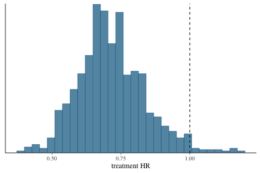
<p class="caption">plot of chunk unnamed-chunk-52</p>
</div>

## Summary of analyses


<div class="figure" style="text-align: center">
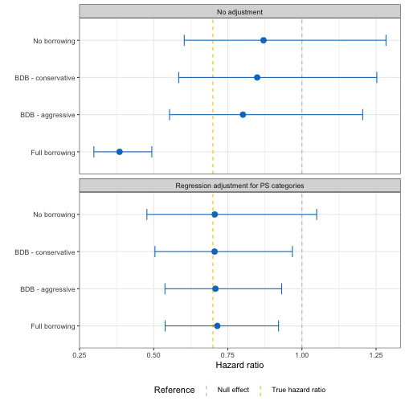
<p class="caption">plot of chunk unnamed-chunk-54</p>
</div>

# Demonstration of a simulation study

## Simulation study

We now turn to the question of how to design trials with BDB
in mind. Here, we will
create an object of class `Simulation` with `create_simulation_obj()`:


```r
create_simulation_obj(
  data_matrix_list,
  outcome,
  borrowing,
  treatment
)
```

If this looks similar to `create_analysis_obj()`, that is by design!

## `sim_data_list()`

The first argument we need to fill in
is `data_matrix_list`, created with `sim_data_list()`.


```r
sim_data_list(
  data_list,
  guide,
  effect,
  drift,
  index
)
```

The first argument is a list of lists of matrices. At the highest level,
we'll index different data generation parameters. At the lowest level,
we'll index different matrices generated with these parameters.

## `data_list`

This example `data_list` object is a
list of lists with two data generation scenarios (e.g., true
HR of 1.0 and true HR of 0.8).

<center>
{width=80%}
</center>

##

Suppose we have a list of lists of simulated data called
`my_data_list`:


There are four scenarios.


```r
NROW(my_data_list)
> [1] 4
```

Each scenario has 100 matrices.


```r
NROW(my_data_list[[1]])
> [1] 100
```


```r
head(my_data_list[[1]][[1]], 3)
>      id ext trt     time status cnsr
> [1,]  1   0   0 8.179722      1    0
> [2,]  2   0   0 6.884286      1    0
> [3,]  3   0   0 2.348331      1    0
```

## Data generation guide

We also need to create a `guide` that explains
how the data were generated. In this example, the four scenarios are
summarized with the below `guide`:


```r
my_sim_data_guide
>   true_hr          drift_hr id
> 1     0.6       No drift HR  1
> 2     1.0       No drift HR  2
> 3     0.6 Moderate drift HR  3
> 4     1.0 Moderate drift HR  4
```

This guide implies that `my_sim_data_guide[[1]]` is a list of
matrices where the treatment HR was 0.6 and the drift HR was 1.0.

##

Finally, we need to specify where in the `guide` three important features are:
the true hazard ratio, the drift hazard ratio, and the index. These are all
the columns we have in our guide, so we simply specify the column names:


```r
my_sim_data_list <- sim_data_list(
  data_list = my_data_list,
  guide = my_sim_data_guide,
  effect = "true_hr",
  drift = "drift_hr",
  index = "id"
)
```


```r
my_sim_data_list
> SimDataList object with  4  different scenarios
>   true_hr          drift_hr id n_datasets_per_param
> 1     0.6       No drift HR  1                  100
> 2     1.0       No drift HR  2                  100
> 3     0.6 Moderate drift HR  3                  100
> 4     1.0 Moderate drift HR  4                  100
```

## Borrowing list

For this simulation study, let's focus on comparing four borrowing methods:

* No borrowing
* BDB, conservative hyperprior
* BDB, aggressive hyperprior
* Full borrowing

How do we specify that we want to evaluate multiple borrowing methods?
We'll use a special list of `Borrowing` objects,
which we'll create through the function `sim_borrowing_list()`.

##

`sim_borrowing_list()` needs a named list of `Borrowing` objects:


```r
my_borrowing_list <- sim_borrowing_list(
  list(
    "No borrowing" = borrowing_details("No borrowing", "ext"),
    "Full borrowing" = borrowing_details("Full borrowing", "ext"),
    "BDB - conservative" = borrowing_details("BDB", "ext", gamma_prior(0.001, 0.001)),
    "BDB - aggressive" = borrowing_details("BDB", "ext", gamma_prior(1, 0.001))
  )
)
```


```r
my_borrowing_list
> SimBorrowingList object with  4  different scenario(s)
>   borrowing_scenario
> 1       No borrowing
> 2     Full borrowing
> 3 BDB - conservative
> 4   BDB - aggressive
```

##

Note, in this example we'll only pass a list of `Borrowing` objects, but
similar constructors exist for other `psborrow2` objects:


```r
sim_treatment_list()
sim_covariate_list()
sim_outcome_list()
```

*Note*: If you do not want to vary parameters in your simulation study,
you can simply pass an unlisted object. That is, you could call
`borrowing_details()` instead of `sim_borrowing_list()`.

## `create_simulation_obj()`

Now, let's create a `Simulation` object:


```r
simulation_obj <- create_simulation_obj(
  my_sim_data_list,
  outcome = outcome_surv_exponential("time",
    "cnsr",
    baseline_prior = normal_prior(0, 10000)
  ),
  borrowing = my_borrowing_list,
  treatment = treatment_details(
    trt_flag_col = "trt",
    trt_prior = normal_prior(0, 10000)
  )
)
```

## `mcmc_sample()`

As with `Analysis` objects, the next step for us with `Simulation` objects
is to call `mcmc_sample()`:


```r
simulation_res <- mcmc_sample(
  simulation_obj,
  iter_warmup = 1000,
  iter_sampling = 1000,
  chains = 1,
  seed = 123
)
```

You'll note the simulation study results are a special `psborrow2` class,
<b>NOT</b> a `CmdStanMCMC` object (as with `Analysis` objects).


```r
simulation_res
> `MCMCSimulationResult` object.  Call `get_results()` to save outputs as a data.frame
```

##

Let's get a useful `data.frame` of results by calling `get_results`:


```r
simulation_res_df <- get_results(simulation_res)
```


## Simulation study results

Let's see what exactly is contained in the results.


```r
colnames(simulation_res_df)
>  [1] "true_hr"              "drift_hr"             "id"                  
>  [4] "n_datasets_per_param" "outcome_scenario"     "borrowing_scenario"  
>  [7] "covariate_scenario"   "treatment_scenario"   "mse_mean"            
> [10] "bias_mean"            "null_coverage"        "true_coverage"
```

* `mse_mean`, the mean MSE for results
* `bias_mean`, the mean bias for the results
* `null_coverage`, the proportion of results that contain the null effect (1.0)
in the specified credible interval quantiles (default are 0.025 - 0.975)
* `true_coverage`, the proportion of results that contain the true effect
in the specified credible interval quantiles (default are 0.025 - 0.975)

##

Let's look at the number of parameter combinations that were evaluated:


```r
NROW(simulation_res_df)
> [1] 16
```


```r
head(simulation_res_df, 2)
>   true_hr    drift_hr id n_datasets_per_param outcome_scenario
> 1     0.6 No drift HR  1                  100          default
> 2     1.0 No drift HR  2                  100          default
>   borrowing_scenario covariate_scenario treatment_scenario  mse_mean  bias_mean
> 1       No borrowing      No adjustment            default 0.0553182 0.05738478
> 2       No borrowing      No adjustment            default 0.1282652 0.03553127
>   null_coverage true_coverage
> 1          0.50          0.96
> 2          0.95          0.95
```

This makes sense as we had
4 scenarios in our data generation step and
4 in our borrowing step. The cartesian
product is 16.

## MSE

We can use the results to plot MSE by scenario as below:

<div class="figure" style="text-align: center">
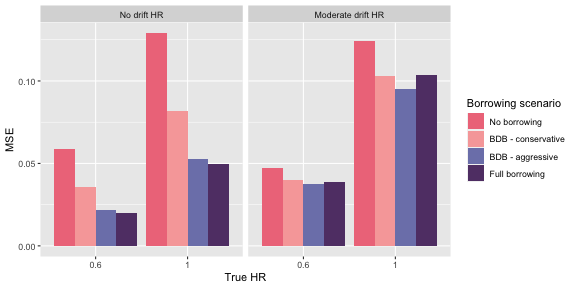
<p class="caption">plot of chunk unnamed-chunk-78</p>
</div>

## Type I error

Because we included a true HR of 1.0, we can evaluate type I error by looking
at the compliment to the true parameter coverage:

<div class="figure" style="text-align: center">
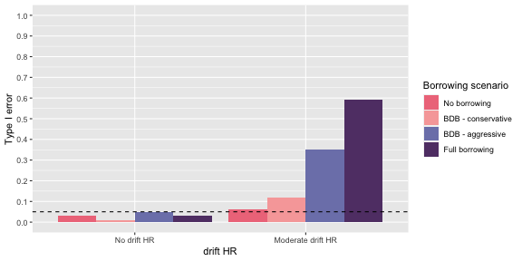
<p class="caption">plot of chunk unnamed-chunk-79</p>
</div>

## Power

We can include power by looking at the results for our true simulation of 0.6.

<div class="figure" style="text-align: center">
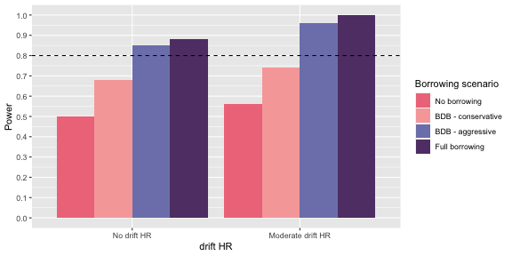
<p class="caption">plot of chunk unnamed-chunk-80</p>
</div>

# Installing `psborrow2`

##
`psborrow2` can be installed from GitHub with:


```r
devtools::install_git("https://github.com/Genentech/psborrow2")
```

Feedback can be provided through GitHub issues:

`https://github.com/Genentech/psborrow2/issues`

The vignettes can be accessed with:


```r
browseVignettes("psborrow2")
```

# Thank you!
