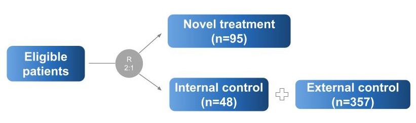

```{r, include = FALSE}
knitr::opts_chunk$set(
  collapse = TRUE,
  comment = ">"
)
```

```{css, echo=FALSE}
slides slide {
  background-image: none;
}
```

```{r psborrow2, include = FALSE}
library(psborrow2)
```

# Introducing `psborrow2`

## Presentation flow

- Bayesian Dynamic Borrowing
- History of `psborrow2`
- Overview of package
- Demonstration of a single dataset analysis
- Demonstration of a simulation study analysis

## Acknowledgements

`psborrow2` is the culmination of work from many individuals within
industry, academia, and the FDA. The below list of authors
and collaborators has been integral to the package development (alphabetical):

- Daniel Sabanes Bove
- Isaac Gravestock
- Craig Gower-Page
- Yichen Lu
- Herb Pang
- Matthew Secrest
- Jiawen Zhu

# Bayesian Dynamic Borrowing

## Hybrid controls

Hybrid control studies are those in which external data 
are used to supplement the control arm of a
randomized, controlled trial (RCT). The schematic below describes such 
a scenario:

<br>

<center>

</center>

## Types of borrowing

How best should we incorporate the knowledge we have on the external control arm?

There are several ways to do this. `psborrow2` allows for three 
ways of incorporating external data:

<br>

```{r echo = FALSE}
library(gt)
types_of_borrowing <- data.frame(
  bt = c("No borrowing", "Full borrowing", "Bayesian dynamic borrowing (BDB)"),
  desc = c(
    "Only include the internal RCT date (i.e., ignoring external controls)",
    "Pool external and internal controls",
    "Borrowing external controls to the extent that the outcomes are similar"
  )
)
colnames(types_of_borrowing) <- c("Borrowing type", "Description")
tab_style(
  gt(types_of_borrowing),
  locations = cells_column_labels(columns = everything()),
  style = list(
    cell_text(weight = "bold")
  )
)
```

## Standard Bayesian analysis without borrowing

Consider a standard Bayesian model with survival as an endpoint without 
external data. This is equally valid in "No borrowing" and "Full borrowing" 
approaches. There are two parameters of interest:

- $\rho_{00}$, the hazard rate for the internal control
- $\rho_{10}$, the hazard rate for the internal experimental

The hazard ratio, $\theta$, is therefore:
$$
\theta = \frac{\rho_{10}}{\rho_{00}}
$$

And the posterior distribution of $\theta$ is:

$$
P(\theta | X) \propto P(X | \theta) \times P(\theta)
$$

## Bayesian Dynamic Borrowing

In BDB, we introduce two more parameters: 

- $\rho_{01}$, the hazard rate of the external control cohort
- $\tau$, a precision parameter known as the "commensurability parameter"

Information from $\rho_{01}$ is used in estimating $\rho_{00}$ through a 
hierarchical model:

$$
\rho_{00} | \rho_{01} \sim Normal(\rho_{01}, \frac{1}{\tau})
$$

The posterior distribution for $\theta$ is then:

$$
P(\theta, \tau | X) \propto P(X | \theta, \tau) \times P(\theta | \tau) \times P(\tau)
$$

## Impact of $\tau$

$\tau$ dictates the extent of borrowing. At greater values of $\tau$, more 
borrowing is performed. As $\tau$ approaches infinity, the prior distribution 
on $\rho_{00}$ effectively becomes $\rho_{01}$:

$$
\rho_{00} \sim \rho_{01} \approxeq Normal(\rho_{01}, \infty)
$$

The commensurability parameter is estimated by the model but can be influenced
by the choice of hyperprior.

## Choice of hyperprior for $\tau$

Consider two hyperprior distributions for $\tau$:

```{r echo = FALSE, fig.align="center", fig.dim = c(8,4)}
library(ggplot2)
uninf_gamma <- vapply(seq(1, 10000, 1), dgamma, shape = .01, rate = .001, FUN.VALUE = numeric(1))
inf_gamma <- vapply(seq(1, 10000, 1), dgamma, shape = 1, rate = 0.001, FUN.VALUE = numeric(1))
gamma_dens_df <- data.frame(
  xval = c(seq(1, 10000, 1), seq(1, 10000, 1)),
  dens = c(uninf_gamma, inf_gamma),
  type = c(
    rep("gamma(0.01, 0.001) -> Less borrowing", length(uninf_gamma)),
    rep("gamma(1, 0.001) -> More borrowing", length(inf_gamma))
  )
)
gamma_dens_df$type <- factor(gamma_dens_df$type, levels = c(
  "gamma(1, 0.001) -> More borrowing",
  "gamma(0.01, 0.001) -> Less borrowing"
))
ggplot(gamma_dens_df) +
  geom_density(aes(
    x = xval,
    y = dens,
    fill = type
  ),
  stat = "identity"
  ) +
  scale_x_continuous(limits = c(0, 10000)) +
  scale_y_continuous(limits = c(0, .0010)) +
  labs(
    x = "tau",
    y = "density",
    fill = "hyperprior"
  ) +
  theme(
    legend.position = "bottom"
  )
```

The $gamma(1, .001)$ will induce more borrowing.

# History of `psborrow2`

## `psborrow2` timeline

`psborrow2` is the successor to [`psborrow`](https://cran.r-project.org/web/packages/psborrow/index.html),
an R package for simulation studies to aid trial
design and understand the benefits of BDB on
operating characteristics.

```{r echo = FALSE}
library(gt)
psborrow2_history <- data.frame(
  date = c("2019", "Q2 2021", "Q3 2021", "2021", "Q1 2022", "May 2022", "Jul 2022", "Oct 2022"),
  desc = c(
    "psborrow development started",
    "CRAN v0.1.0 published",
    "Biopharmaceutical Report Article to introduce psborrow published",
    "Initial user feedback received from the interial POC study and the FDA CID pilot project",
    "We start a collaboration with Roche statistical engineering team to productionize the package",
    "psborrow v0.2.0 published (bug fixed, documentation improved) on CRAN",
    "psborrow2 development started (faster, improved UI, tests, flexibility, more outcomes)",
    "psborrow2 package made public"
  )
)
colnames(psborrow2_history) <- c("Date", "Event")
tab_style(
  gt(psborrow2_history),
  locations = cells_column_labels(columns = everything()),
  style = list(
    cell_text(weight = "bold")
  )
)
```

# Overview of package

## Package objectives

`psborrow2` has two objectives:

### <b><u>1) Facilitate BDB analyses</u></b>
`psborrow2` has a user-friendly interface for conducting
BDB analyses that handles the computationally-difficult MCMC sampling
for the user

### <b><u>2) Facilitate simulation studies of BDB</u></b>
`psborrow2` can be used to compare different trial and BDB characteristics in a 
unified way in simulation studies to inform trial design

# Demonstration of a single BDB analysis

## Prior distributions

In `psborrow2`, the user creates fully parametric Bayesian models with 
proper prior distributions specified for all parameters using the constructors:

```{r eval = FALSE}
bernoulli_prior()
beta_prior()
cauchy_prior()
exponential_prior()
gamma_prior()
normal_prior()
poisson_prior()
uniform_prior()
```

Prior distributions all belong to parent class `Prior`:

```{r}
is(normal_prior(mu = 0, sigma = 100), "Prior")
```

## Plotting priors

Each `Prior` object has a `plot` method. For the sake of example, 
let's look at a normal distribution centered around <b>0</b> with 
standard deviation of <b>10</b>:

```{r fig.align = "center", fig.dim = c(6, 3)}
plot(
  normal_prior(mu = 0, sigma = 10),
  xlim = c(-100, 100),
  ylim = c(0, 0.1)
)
```


##

Let's also see what an uninformative normal prior may
look like:

```{r fig.align = "center", fig.dim = c(6, 4)}
plot(
  normal_prior(mu = 0, sigma = 10000),
  xlim = c(-100, 100),
  ylim = c(0, 0.1)
)
```

## Hyperpriors for commensurability parameters

In BDB, a hyperprior for the commensurability parameter, $\tau$, 
must be specified. Let's look at a conservative distribution:

```{r fig.align = "center", fig.dim = c(5, 3)}
plot(
  gamma_prior(alpha = 0.001, beta = 0.001),
  xlim = c(-1, 20),
  ylim = c(0, .04)
)
```

##

Now set's look at a conservative distribution:

```{r fig.align = "center", fig.dim = c(5, 3)}
plot(
  gamma_prior(alpha = 1, beta = 0.001),
  xlim = c(-1, 20),
  ylim = c(0, .04)
)
```

## Example data

`psborrow2` has example data we can use. Let's load the package and
explore a few relevant columns `example_matrix`.

```{r message = FALSE}
head(example_matrix[, c("ext", "trt", "time", "cnsr")], 3)
```

* `ext = 1` for external trial patients, else `ext = 0`
* `trt = 1` for experimentally-treated patients, else `trt = 0`
* `time` is the time to event or censorship
* `cnsr = 1` if a patient's follow-up was censored, else `csnr = 0`

```{r include = FALSE}
example_dataframe <- as.data.frame(example_matrix)
```

##

The flags in this `data.frame` are explained in greater detail
in `?example_matrix`. 

<center>
```{r echo = FALSE}
library(gtsummary)
tbl_cross(
  example_dataframe,
  trt,
  ext
)
```
</center>

It looks like we have 50 patients in our internal control,
100 in our internal experimental, and 350 in our external control.

## Naive internal comparisons

In a scenario where an RCT is completed, we may
first want to conduct an internal comparison. Let's evaluate a Cox proportional
hazards model.

```{r message = FALSE, echo = FALSE, fig.align = "center", fig.dim = c(5, 2)}
library(survival)
library(survminer)
km_fit <- survfit(Surv(time = time, event = 1 - cnsr) ~ trt, example_dataframe,
  subset = ext == 0
)
ggsurvplot(fit = km_fit, data = example_dataframe)
```
<br>
<center>
```{r message = FALSE, echo = FALSE}
library(broom)
library(tidyverse)
cox_fit <- coxph(Surv(time = time, event = 1 - cnsr) ~ trt,
  data = example_dataframe,
  subset = ext == 0
)

tidy(cox_fit, exponentiate = TRUE, conf.int = TRUE) %>% 
  gt() %>% 
  fmt_number(columns = 2:7, decimals = 2)
```

</center>

<br>

Here, the hazard ratio is 0.87 (95% CI 0.61 - 1.24).

## Hybrid control analysis

For a BDB analysis, we want to create an object of class `Analysis`
with `create_analysis_obj()`. There are four required arguments: 

```{r eval = FALSE}
create_analysis_obj(
  data_matrix,
  outcome,
  borrowing,
  treatment
)
```

```{r echo = FALSE}
gt(
  tribble(
    ~Argument, ~Description,
    "data_matrix", "The data matrix, including all relevant outcome variables, and treatment arm and external control arm flags.",
    "outcome", "Object of class Outcome as output by exp_surv_dist(), weib_ph_surv_dist(), or logistic_bin_outcome().",
    "borrowing", "Object of class Borrowing as output by borrowing_details().",
    "treatment", "Object of class Treatment as output by treatment_details()."
  )) %>% 
  tab_style(
  locations = cells_body(columns = "Argument"),
  style = list(
    cell_text(weight = "bold")
  ))
```

## Outcome class

Let's start with the `Outcome` class. There are three different
classes currently supported by `psborrow2`, each of which has a 
custom constructor:

<br>

```{r, echo = FALSE}
gt(
  tribble(
    ~Constructor, ~Description,
    "exp_surv_dist()", "Exponential survival distribution",
    "weib_ph_surv_dist()", "Weibull survival distribution (proportional hazards formulation)",
    "logistic_bin_outcome()", "Bernoulli distribution with logit parametrization"
  )) %>% 
  tab_style(
  locations = cells_body(columns = "Constructor"),
  style = list(
    cell_text(weight = "bold")
  ))
```

## Arguments to `exp_surv_dist()`

```{r eval = FALSE}
exp_surv_dist(time_var,
              cens_var,
              baseline_prior)
```

The first two arguments to `exp_surv_dist()` are straightforward:

- `time_var`, Name of time variable column in model matrix
- `cens_var`, Name of the censorship variable flag in model matrix

The final argument is more complicated:

- `baseline_prior`, Prior distribution for the log hazard rate of the external
control arm.

##

How do we specify a prior distribution for `baseline_prior`? We can do so with
`Prior` class objects.


##

Now that we've seen how to create an object of class `Prior`, let's create
our outcome object with `exp_surv_dist()`.

```{r}
exp_outcome <- exp_surv_dist(
  time_var = "time",
  cens_var = "cnsr",
  baseline_prior = normal_prior(0, 10000)
)
```

```{r}
class(exp_outcome)
```

## Borrowing class

```{r eval = FALSE}
borrowing_details(
  method, 
  ext_flag_col,
  tau_prior
)
```

- `method`, The type of borrowing to perform. It must be one of: `'BDB'`, 
`'Full borrowing'`, or `'No borrowing'`
- `ext_flag_col`, The name of the column in the data matrix that corresponds to 
the external control flag
- `tau_prior`, the hyperprior for the commensurability parameter (only 
necessary for 'BDB')

## 

We'll use a gamma distribution to create a largely uninformative prior. In 
the context of $\tau$, density concentrated around 0 is uninformative.

```{r fig.align = "center", fig.dim = c(6, 4)}
plot(gamma_prior(0.001, 0.001), xlim = c(-10, 100))
```

##

Now, let's create our `Borrowing` object:

```{r}
bdb_borrowing <- borrowing_details(
  method = "BDB",
  ext_flag_col = "ext",
  tau_prior = gamma_prior(alpha = 0.001, beta = 0.001)
)
```

##

```{r}
bdb_borrowing
```

## Treatment class

Finally, we'll create an object of class `Treatment` through the constructor
`treatment_details`. Only two arguments are required:

```{r eval = FALSE}
treatment_details(
  trt_flag_col,
  trt_prior
)
```

- `trt_flag_col`, The name of the column in the model matrix that corresponds to
the treatment flag
- `trt_prior`, Object of class `Prior` specifying the prior distribution of the
log hazard ratio for the experimental treatment

## 

Let's assume an uninformative prior distribution for the log hazard ratio
of treatment and create our `Treatment` object:

```{r}
trt_details <- treatment_details(
  trt_flag_col = "trt",
  trt_prior = normal_prior(0, 10000)
)
```

##

```{r}
trt_details
```

## Analysis class object

Now we have all the information we need to create an object of class `Analysis`:

```{r message = FALSE}
analysis_object <- create_analysis_obj(
  data_matrix = example_matrix,
  outcome = exp_outcome,
  borrowing = bdb_borrowing,
  treatment = trt_details
)
```

##

```{r}
analysis_object
```

## Sampling from an analysis object

The `Analysis` object suggests calling `mcmc_sample()`
as a next step. We'll follow that advice! Let's go ahead and take draws from the
posterior distribution using the function `mcmc_sample()`.

Look at `?mcmc_sample` for additional MCMC options that can be specified
in the analysis.

```{r include = FALSE}
results <- mcmc_sample(
  x = analysis_object,
  iter_warmup = 1000,
  iter_sampling = 1000,
  chains = 1
)
```

```{r eval = FALSE}
results <- mcmc_sample(analysis_object)
```

##

Note that `results` is of class `CmdStanMCMC`, which is a `cmdstanr` class.

```{r}
class(results)
```

At this point in our analysis, we should refer
to the [`cmdstanr`](https://github.com/stan-dev/cmdstanr) help pages for
methods to apply to these objects.

##

Let's look at a summary of the median and 95% credible intervals for the
parameters that our model evaluated:

```{r echo = FALSE, message=FALSE, warning=FALSE}
library(posterior)
library(bayesplot)
draws <- results$draws()
draws <- rename_draws_covariates(draws, analysis_object)

summarize_draws(draws, ~ quantile(.x, probs = c(0.025, 0.50, 0.975))) %>% 
  filter(variable != 'lp__') %>% 
  gt() %>% 
  fmt_number(2:4, decimals = 2) %>% 
  tab_style(
    locations = cells_body(rows = 5),
    style = list(
      cell_text(weight = "bold"),
      cell_fill(color = "lightcyan")
    ))

```

<br>

```{r message = FALSE, fig.align = "center", echo = FALSE, fig.dim = c(4, 2.5)}
library(bayesplot)
mcmc_hist(draws, c("treatment HR")) + 
   geom_vline(aes(xintercept = 1.0), linetype = 2)
```

##

Interestingly, our results did not change substantially after using
BDB This suggests that perhaps our outcome
distributions are dissimilar between internal and external control. 
Let's check:

```{r, fig.align="center", fig.dim = c(6,4), echo = FALSE}
ggsurvplot(
  survfit(Surv(time, 1 - cnsr) ~ ext, example_dataframe,
    subset = trt == 0
  ),
  example_dataframe
)
```

## Evaluating balance between cohorts

Maybe our cohorts are imbalanced:
<br>
<center>
```{r, echo = FALSE, message = FALSE, warning = FALSE}
library(table1)
t1 <- table1(~ cov1 + cov2 + cov3 + cov4|
  factor(trt, levels = 0:1, labels = c("Control", "Treatment")) +
    factor(ext, levels = 0:1, labels = c("Internal", "External")),
data = example_dataframe
)
t1
```
</center>

##

Let's consider adjusting for these imbalances through the use of
propensity scores. First, we'll build a propensity score model:

```{r}
ps_model <- glm(ext ~ cov1 + cov2 + cov3 + cov4,
                data = example_dataframe, 
                family = binomial)
```

```{r}
ps_model
```

##

We'll make a new matrix called `example_matrix_ps` which has 5 categories of
propensity score values with approximately the same number in each.
```{r include = FALSE}
ps <- predict(ps_model, type = "response")
example_dataframe$ps <- ps
```


```{r, include = FALSE}
example_dataframe$ps_cat_ <- cut(
  example_dataframe$ps,
  breaks = 5,
  include.lowest = TRUE
)
levels(example_dataframe$ps_cat_) <- c("ref", "low", 
                                      "low_med", "high_med", "high")

```

```{r include = FALSE}
example_matrix_ps <- create_data_matrix(
  example_dataframe,
  outcome = c("time", "cnsr"),
  trt_flag_col = "trt",
  ext_flag_col = "ext",
  covariates = ~ps_cat_
)
```

```{r}
head(example_matrix_ps)
```


## Adjusting for covariates in `psborrow2`

Let's do another BDB analysis, but this time we'll adjust for PS values.
To adjust for variables in `psborrow2`, use the function `add_covariates()`:

```{r eval = FALSE}
add_covariates(
  covariates,
  priors
)
```

- `covariates`, Names of columns in the data matrix containing covariates to
be adjusted for
- `priors`, Either a single object of class `Prior` specifying the prior 
distribution to apply to all covariates or a named list of distributions of 
class `Prior`, one for each covariate

## Analysis object adjusting for propensity scores

```{r message = FALSE}
analysis_object_ps <- create_analysis_obj(
  data_matrix = example_matrix_ps, 
  covariates = add_covariates(
    c("ps_cat_low", "ps_cat_low_med",
      "ps_cat_high_med", "ps_cat_high" ),
    normal_prior(0, 10000)),
  outcome = exp_surv_dist("time", "cnsr", normal_prior(0, 10000)),
  borrowing = borrowing_details("BDB", "ext", gamma_prior(0.001, 0.001)),
  treatment = treatment_details("trt", normal_prior(0, 10000))
)
```

```{r eval = FALSE}
results_ps <- mcmc_sample(analysis_object_ps)
```

```{r include = FALSE}
results_ps <- mcmc_sample(analysis_object_ps, 
                          iter_warmup = 1000, 
                          iter_sampling = 1000,
                          chains = 1)
```

## 

It looks like we do indeed see a treatment effect when relevant
confounders are taken into consideration!

```{r echo = FALSE}
draws_ps <- results_ps$draws()
draws_ps <- rename_draws_covariates(draws_ps, analysis_object_ps)

summarize_draws(draws_ps, ~ quantile(.x, probs = c(0.025, 0.50, 0.975))) %>% 
  filter(variable != 'lp__') %>% 
  gt() %>% 
  fmt_number(2:4, decimals = 2) %>% 
  tab_style(
  locations = cells_body(rows = 9),
    style = list(
      cell_text(weight = "bold"),
      cell_fill(color = "lightcyan")
    ))
```

##

The histogram of MCMC samples confirms this as well:

```{r echo = FALSE, message = FALSE, warning = FALSE, fig.dim = c(6, 4), fig.align='center'}
mcmc_hist(draws_ps, c("treatment HR")) + 
  geom_vline(aes(xintercept = 1.0), linetype = 2)
```

# Demonstration of a simulation study

## Simulation study

We now turn to the question of how to design trials with BDB 
in mind. Here, we will need to
create an object of class `Simulation` with `create_simulation_obj()`:

```{r eval = FALSE}
create_simulation_obj(
  data_matrix_list,
  outcome,
  borrowing,
  treatment
)
```

If this looks similar to `create_analysis_obj()`, that is by design!

## Important information on inputs!

All the inputs to `create_simulation_obj()` except the data argument
can be identical to those to `create_analysis_obj()`. That is, if you only
want to simulate with one treatment prior distribution, you can specify:

```{r eval = FALSE}
treatment = treatment_details("trt",
                              normal_prior(0, 1000)
                              )
```

If you want to specify multiple scenarios (maybe an informative
and uninformative prior), you effectively make a list of the treatment
details. 

## `sim_data_list()`

To fill in `create_simulation_obj()`, the first argument we need to fill in
is `data_matrix_list`. This argument requires a special `psborrow2`
data matrix list created by the function `sim_data_list()`.

```{r eval = FALSE}
sim_data_list(
  data_list,
  guide,
  effect,
  drift,
  index
)
```

The first argument is a list of lists of matrices. At the highest level,
we'll index different data generation parameters. At the lowest level,
we'll index different matrices generated with these parameters.

##

Suppose we have a list of lists of simulated data called
`my_data_list`:

```{r, include = FALSE}
library(simsurv)
sim_single_matrix <- function(true_hr = 0.6,
                              drift_hr = 1.0,
                              n = 600) {
  cov <- data.frame(
    id = 1:n,
    trt = rbinom(n, 1, 0.5)
  )
  cov$ext <- ifelse(cov$trt == 1L, 0L, rbinom(sum(cov$trt), 1, 0.5))

  # Simulate the event times
  dat <- simsurv(
    lambdas = 0.1,
    gammas = 1.5,
    betas = c(
      trt = log(true_hr),
      ext = log(drift_hr)
    ),
    x = cov,
    maxt = 5
  )

  dat$censor <- 1 - dat$status

  # Merge the simulated event times onto covariate data frame
  dat <- merge(cov, dat)

  as.matrix(dat)
}

set.seed(123)

# Create list of lists of data
my_data_list <- list(
  lapply(1:20, function(z) sim_single_matrix(true_hr = 0.6, drift_hr = 1.0)),
  lapply(1:20, function(z) sim_single_matrix(true_hr = 1.0, drift_hr = 1.0)),
  lapply(1:20, function(z) sim_single_matrix(true_hr = 0.6, drift_hr = 1.5)),
  lapply(1:20, function(z) sim_single_matrix(true_hr = 1.0, drift_hr = 1.5))
)
```

```{r}
NROW(my_data_list)
```

```{r}
NROW(my_data_list[[1]])
```

```{r}
head(my_data_list[[1]][[1]])
```

## Data generation guide

We also need to create a `guide` that explains
how the data were generated. In this example, here are the four
scenarios:

```{r echo = FALSE}
my_sim_data_guide <- expand.grid(
  true_hr = c(0.6, 1.0),
  drift_hr = c(1.0, 1.5)
)
```

```{r include = FALSE}
my_sim_data_guide$id <- seq(1, NROW(my_sim_data_guide))
```

```{r}
my_sim_data_guide
```

This guide implies that `my_sim_data_guide[[1]]` is a list of 
matrices where the treatment HR was 0.6 and the drift HR was 1.0.

##

Finally, we need to specify where in the `guide` three important features are:
the true hazard ratio, the drift hazard ratio, and the index. These are all
the columns we have in our guide, so we simply specify the inputs:

```{r}
my_sim_data_list <- sim_data_list(
  data_list = my_data_list,
  guide = my_sim_data_guide,
  effect = "true_hr",
  drift = "drift_hr",
  index = "id"
)
```

```{r}
my_sim_data_list
```

## Borrowing list

For this simulation study, let's focus on comparing three borrowing methods:

* No borrowing
* Full borrowing
* BDB 

To compare those three methods, we'll use a special list of `Borrowing` objects,
which we'll create through the function `sim_borrowing_list()`.

##

`sim_borrowing_list()` just needs a named list of `Borrowing` objects
as inputs, so let's pass one:

```{r}
my_borrowing_list <- sim_borrowing_list(
  list(
    "No borrowing" = borrowing_details("No borrowing", "ext"),
    "Full borrowing" = borrowing_details("Full borrowing", "ext"),
    "BDB" = borrowing_details("BDB", "ext", gamma_prior(0.001, 0.001))
  )
)
```

```{r}
my_borrowing_list
```

## `create_simulation_obj()`

Now, let's create a simulation object, filling in reasonable defaults
for `outcome` and `treatment`, which are features of the simulation study
we are not varying.

```{r}
simulation_obj <- create_simulation_obj(
  my_sim_data_list,
  outcome = exp_surv_dist("eventtime",
    "censor",
    baseline_prior = normal_prior(0, 10000)
  ),
  borrowing = my_borrowing_list,
  treatment = treatment_details(
    trt_flag_col = "trt",
    trt_prior = normal_prior(0, 10000)
  )
)
```

## `mcmc_sample()`

As with `Analysis` objects, the next step for us with `Simulation` objects
is to call `mcmc_sample()`:

```{r, include = FALSE}
simulation_res <- mcmc_sample(
  x = simulation_obj,
  iter_warmup = 500,
  iter_sampling = 250,
  chains = 1
)
```


```{r, eval = FALSE}
simulation_res <- mcmc_sample(simulation_obj)
```


You'll note the simulation study results are a special `psborrow2` class,
<b>NOT</b> a `CmdStanMCMC` object (as with `Analysis` objects).

```{r}
simulation_res
```

Let's get a useful `data.frame` of results by calling `get_results`:

```{r}
simulation_res_df <- get_results(simulation_res)
```

## Simulation study results

The simulation study results `data.frame` is essentially
the cartesian product of our starting `sim_data_list` parameters and the three
borrowing scenarios we evaluated:

```{r}
head(simulation_res_df, 2)
```

##

Let's see what exactly is contained in the results.

```{r}
colnames(simulation_res_df)
```

Several results columns exist that summarize results across iterations of the
same study parameters:

* `mse_mean`, the mean MSE for results
* `bias_mean`, the mean bias for the results
* `null_coverage`, the proportion of results that contain the null effect (1.0)
in the specified credible interval quantiles (default are 0.025 - 0.975)
* `true_coverage`, the proportion of results that contain the true effect
in the specified credible interval quantiles (default are 0.025 - 0.975)

##

Let's look at the number of parameter combinations that were evaluated:

```{r}
NROW(simulation_res_df)
```

This makes sense as we had
`r NROW(my_sim_data_guide)` scenarios in our data generation step and
`r NROW(my_borrowing_list@guide)` in our borrowing step. The cartesian
product is `r NROW(simulation_res_df)`.

## MSE

We can use the results to plot MSE by scenario as below:

```{r, echo = FALSE, fig.align = "center"}
ggplot(simulation_res_df) +
  geom_bar(aes(x = factor(true_hr), fill = borrowing_scenario, y = mse_mean),
    stat = "identity", position = "dodge"
  ) +
  labs(
    fill = "Borrowing scenario",
    x = "True HR",
    y = "MSE"
  ) +
  facet_wrap(~ paste0("drift HR = ", drift_hr)) +
  scale_fill_manual(values = c("#29339B", "#74A4BC", "#B6D6CC"))
```

## Type I error

Because we included a true HR of 1.0, we can evaluate type I error by looking
at the compliment to the true parameter coverage:

```{r, echo = FALSE, fig.align = "center"}
ggplot(simulation_res_df[simulation_res_df$true_hr == 1.0, ]) +
  geom_bar(aes(x = factor(drift_hr), fill = borrowing_scenario, y = 1 - true_coverage),
    stat = "identity", position = "dodge"
  ) +
  labs(
    fill = "Borrowing scenario",
    x = "drift HR",
    y = "Type I error"
  ) +
  scale_fill_manual(values = c("#29339B", "#74A4BC", "#B6D6CC"))
```

## Power

We can include power by looking at the results for our true simulation of 0.6.

```{r, echo = FALSE, fig.align = "center"}
ggplot(simulation_res_df[simulation_res_df$true_hr == 0.6, ]) +
  geom_bar(aes(x = factor(drift_hr), fill = borrowing_scenario, y = 1 - null_coverage),
    stat = "identity", position = "dodge"
  ) +
  labs(
    fill = "Borrowing scenario",
    x = "drift HR",
    y = "Type I error"
  ) +
  scale_fill_manual(values = c("#29339B", "#74A4BC", "#B6D6CC"))
```

# Questions?

## Thank you!

Thank you! Any questions?
