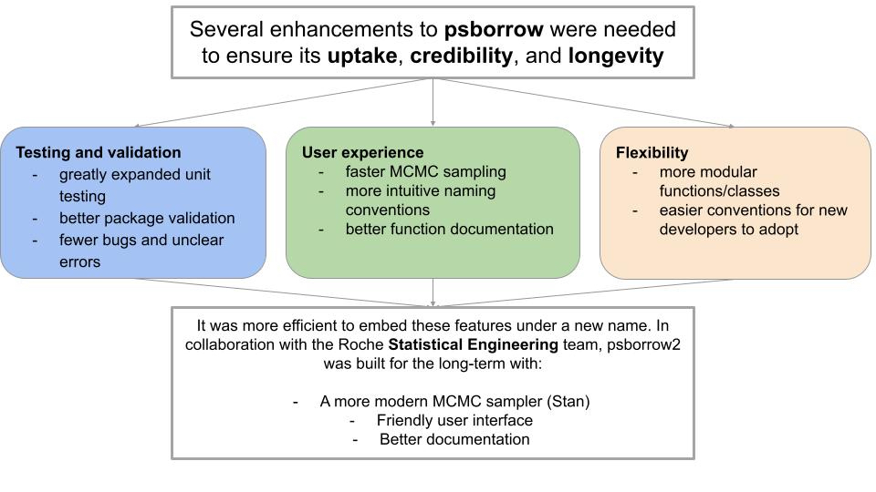
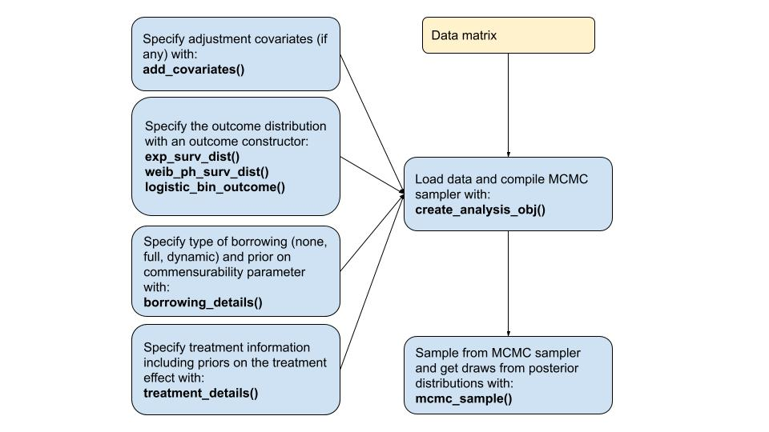
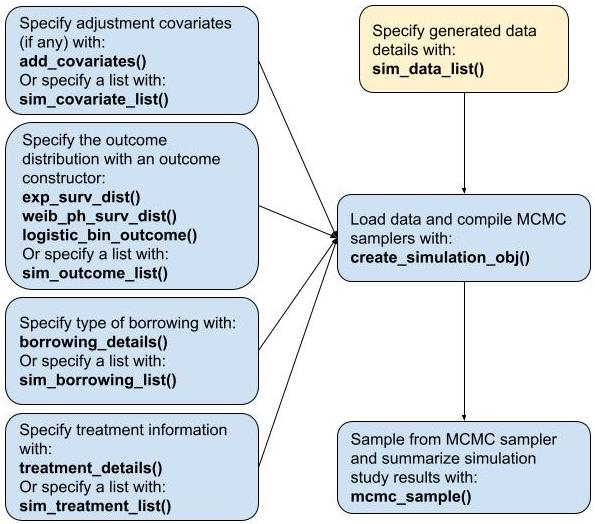

```{r, include = FALSE}
knitr::opts_chunk$set(
  collapse = TRUE,
  comment = ">"
)
```

```{css, echo=FALSE}
slides slide {
  background-image: none;
}
```

# Introducing `psborrow2`

## Presentation flow

- Bayesian Dynamic Borrowing
- History of `psborrow2`
- Overview of package
- Demonstration of a single dataset analysis
- Demonstration of a simulation study analysis

## Acknowledgements

`psborrow2` is the culmination of work from many individuals within
industry, academia, and the FDA. The below list of authors
and collaborators has been integral to the package development (alphabetical):

- Daniel Sabanes Bove
- Isaac Gravestock
- Craig Gower-Page
- Yichen Lu
- Herb Pang
- Matthew Secrest
- Jiawen Zhu

# Bayesian Dynamic Borrowing

## Background

### <u><b>Challenge</b></u>
Difficult to recruit patients in the control arm

- Rare disease
- Pediatric condition
- Oncology

### <u><b>Opportunity</b></u>
Abundant data available on control arm

- Reduce randomization to control arm
- Improve statistical power of randomized trial

## Hybrid controls

Hybrid control studies are those in which external data (i.e., from outside
the trial of consideration) are used to supplement the control arm of a
randomized, controlled trial (RCT).

<br>

<center>

</center>

## Types of borrowing

Consider the scenario just described. How best should we incorporate the knowledge we
have on the external control arm?

<br>

```{r echo = FALSE}
library(gt)
types_of_borrowing <- data.frame(
  bt = c("No borrowing", "Full borrowing", "Bayesian dynamic borrowing (BDB)"),
  desc = c(
    "Only include the internal RCT date (i.e., ignoring external controls)",
    "Pool external and internal controls",
    "Borrowing external controls to the extent that the outcomes are similar"
  )
)
colnames(types_of_borrowing) <- c("Borrowing type", "Description")
tab_style(
  gt(types_of_borrowing),
  locations = cells_column_labels(columns = everything()),
  style = list(
    cell_text(weight = "bold")
  )
)
```

## Standard Bayesian analysis

Consider a standard Bayesian model with survival as an endpoint without external data.
We will assume two parameters of interest:

- $\rho_{00}$, the hazard rate for the internal control
- $\rho_{10}$, the hazard rate for the internal experimental

The hazard rate would be:
$$
\theta = \frac{\rho_{10}}{\rho_{00}}
$$

And the posterior distribution would be:

$$
P(\theta | X) \propto P(X | \theta) \times P(\theta)
$$

## Bayesian Dynamic Borrowing

In BDB, we introduce two more parameters: the hazard rate of the
external cohort, $\rho_{01}$ and the precision parameter, $\tau$,
also known as the "commensurability parameter".

Information from the external control, $\rho_{01}$ is borrowed
as a prior on $\rho_{00}$ through a hierarchical model. That is:

$$
\rho_{00} | \rho_{01} \sim Normal(\rho_{01}, \frac{1}{\tau})
$$

Therefore:

$$
P(\theta, \tau | X) \propto P(X | \theta, \tau) \times P(\theta | \tau) \times P(\tau)
$$

## Impact of $\tau$

The commensurability parameter dictates the extent of borrowing of the external
control arm.

At greater values of $\tau$, more borrowing is performed.
As $\tau$ approaches infinity, the prior distribution on $\rho_{00}$ effectively
becomes:

$$
\rho_{00} \sim \rho_{01} \approxeq Normal(\rho_{01}, \infty)
$$

The commensurability parameter is estimated by the model but can be influenced
by the choice of prior.

## Choice of prior for $\tau$

Consider two prior distributions for $\tau$:

```{r echo = FALSE, fig.align="center", fig.dim = c(8,4)}
library(ggplot2)
uninf_gamma <- vapply(seq(1, 10000, 1), dgamma, shape = .01, rate = .001, FUN.VALUE = numeric(1))
inf_gamma <- vapply(seq(1, 10000, 1), dgamma, shape = 1, rate = 0.001, FUN.VALUE = numeric(1))
gamma_dens_df <- data.frame(
  xval = c(seq(1, 10000, 1), seq(1, 10000, 1)),
  dens = c(uninf_gamma, inf_gamma),
  type = c(
    rep("gamma(0.01, 0.001) -> Less borrowing", length(uninf_gamma)),
    rep("gamma(1, 0.001) -> More borrowing", length(inf_gamma))
  )
)
gamma_dens_df$type <- factor(gamma_dens_df$type, levels = c(
  "gamma(1, 0.001) -> More borrowing",
  "gamma(0.01, 0.001) -> Less borrowing"
))
ggplot(gamma_dens_df) +
  geom_density(aes(
    x = xval,
    y = dens,
    fill = type
  ),
  stat = "identity"
  ) +
  scale_x_continuous(limits = c(0, 10000)) +
  scale_y_continuous(limits = c(0, .0010)) +
  labs(
    x = "tau",
    y = "density",
    fill = "prior"
  ) +
  theme(
    legend.position = "bottom"
  )
```

The $gamma(1, .001)$ distribution has higher density at
higher levels of $\tau$ and will therefore induce more borrowing.

# History of `psborrow2`

## `psborrow2` timeline

`psborrow2` is the successor to [`psborrow`](https://cran.r-project.org/web/packages/psborrow/index.html),
an R package for primarily facilitating simulation studies to aid trial
design and understand the benefits of innovative methods such as Bayesian
Dynamic Borrowing on operating characteristics.

```{r echo = FALSE}
library(gt)
psborrow2_history <- data.frame(
  date = c("2019", "Q2 2021", "Q3 2021", "2021", "Q1 2022", "May 2022", "Jul 2022", "Sept 2022"),
  desc = c(
    "psborrow development started",
    "CRAN v0.1.0 published",
    "Biopharmaceutical Report Article to introduce psborrow published",
    "Initial user feedback received from the interial POC study and the FDA CID pilot project",
    "We start a collaboration with Roche statistical engineering team to productionize the package",
    "psborrow v0.2.0 published (bug fixed, documentation improved) on CRAN",
    "psborrow2 development started (faster, improved UI, tests, flexibility, more outcomes)",
    "psborrow2 package made public"
  )
)
colnames(psborrow2_history) <- c("Date", "Event")
tab_style(
  gt(psborrow2_history),
  locations = cells_column_labels(columns = everything()),
  style = list(
    cell_text(weight = "bold")
  )
)
```

## `psborrow2`: building and improving upon psborrow

<center>
{width=70%}
</center>

# Overview of package

## Package objectives

`psborrow2` has two objectives:

### <b><u>Facilitate BDB analyses</u></b>
`psborrow2` has a user-friendly interface for applying
analyses and handles the computationally-difficult MCMC sampling on behalf of the user.

### <b><u>Facilitate simulation studies of BDB</u></b>
`psborrow2` can be used to compare different borrowing parameters
(e.g. full borrowing, no borrowing, BDB) and other trial and BDB characteristics in a unified way
to inform trial design and analysis.

## Conducting BDB analyses in `psborrow2`

When analyzing data, the goal is to create an object of class `Analysis`
through the helper function `create_analysis_obj()`.

<center>
{width=50%}
</center>

## Conducting simulation studies in `psborrow2`

When conducting a simulation study, the goal is to create an object of
class `Simulation` through the helper function `create_simulation_obj()`.

<center>
{width=50%}
</center>

# Demonstration of a single BDB analysis

## Example data

`psborrow2` has example data we can use. Let's load the package and
explore `example_matrix`.

```{r message = FALSE}
library(psborrow2)
head(example_matrix)
```

We also may need this in `data.frame` format, so let's convert to
`data.frame` for later as well.

```{r}
example_dataframe <- as.data.frame(example_matrix)
```

##

The flags in this `data.frame` are explained in `?example_matrix`. For now,
we need to understand that `trt` is a flag denoting receipt of the
experimental treatment (`trt = 1L`) or the control therapy (`trt = 0L`).
`ext` is a flag for external data status, `1L` for external data or `0L` for
the internal trial.

```{r}
table(
  trt = example_matrix[, "trt"],
  ext = example_matrix[, "ext"]
)
```

It looks like we have 120 patients in our internal control,
260 in our internal experimental, and 344 in our external control.

## Naive internal comparisons

In a scenario where results from a trial just became available, we may
first want to conduct an internal comparison. Let's do this for
the time to event endpoint in our study.

```{r message = FALSE}
library(survival)
cox_fit <- coxph(Surv(time = time, event = 1 - cnsr) ~ trt,
  data = example_dataframe,
  subset = ext == 0
)

exp(confint(cox_fit))
```

##

Let's also explore the Kaplan-Meier curves.

```{r message = FALSE, fig.align = "center", fig.dim = c(6,4)}
library(survminer)
km_fit <- survfit(Surv(time = time, event = 1 - cnsr) ~ trt, example_dataframe,
  subset = ext == 0
)
ggsurvplot(fit = km_fit, data = example_dataframe)
```

##

Because later we will use an exponential survival distribution in our
fully parametric Bayesian model, let's also do so here for comparison:

```{r}
library(flexsurv)
exp_fit <- flexsurvreg(Surv(time = time, event = 1 - cnsr) ~ trt,
  dist = "exponential",
  data = example_dataframe,
  subset = ext == 0
)

exp(confint(exp_fit))
```

## Hybrid control analysis

We now may want to adjust conduct a Bayesian Dynamic Borrowing model that
incorporates external control data. Remember, our ultimate goal is to
create an object of class `Analysis` with `create_analysis_obj()`:

```
create_analysis_obj(
  data_matrix,
  outcome,
  borrowing,
  treatment
)
```

## Outcome class

Let's start with the `Outcome` class. There are three different
classes currently supported by `psborrow2`, which can be evaluated with:

```
?exp_surv_dist
?weib_ph_surv_dist
?logistic_bin_outcome
```

##

Let's create an exponential survival
distribution with the constructor `exp_surv_dist()`. Note there are three
arguments:

```
exp_surv_dist(time_var,
              cens_var,
              baseline_prior)
```

The first two arguments are simply the names of the time column and censorship flag
column in our data matrix. `baseline_prior` refers to the prior distribution for
the <b>log hazard rate of the external control arm</b> if we are doing Bayesian
Dynamic Borrowing.

##

How do we create objects of class `Prior`? There are many
priors available. Be sure to evaluate the help pages for them:

```
?bernoulli_prior
?beta_prior
?cauchy_prior
?exponential_prior
?gamma_prior
?normal_prior
?poisson_prior
?uniform_prior
```

##

Each prior has a `plot` method. Let's confirm that a normal distribution
centered at 0 and with wide variance appears to be an uninformative:

```{r fig.align = "center", fig.dim = c(6,4)}
plot(normal_prior(mu = 0, sigma = 10000),
  xlim = c(-100, 100),
  ylim = c(0, 0.1)
)
```

##

Now that we've seen how to create an object of class `Prior`, let's create
our outcome object with `exp_surv_dist()`.

```{r}
exp_outcome <- exp_surv_dist(
  time_var = "time",
  cens_var = "cnsr",
  baseline_prior = normal_prior(0, 10000)
)
```

##

Let's print the object to get a summary of our outcome distribution:

```{r}
exp_outcome
```

## Borrowing class

Next, we'll create an object of class `Borrowing` through the constructor
`borrowing_details`. We need to specify  `tau_prior`, which refers to the
hyperprior for the commensurability parameter. We'll
use a gamma distribution to create a largely uninformative prior:

```{r fig.align = "center", fig.dim = c(6, 4)}
plot(gamma_prior(0.001, 0.001), xlim = c(-10, 1000))
```

##

Now let's use this gamma prior to create our `Borrowing` object:

```{r}
bdb_borrowing <- borrowing_details(
  method = "BDB",
  ext_flag_col = "ext",
  tau_prior = gamma_prior(alpha = 0.001, beta = 0.001)
)
```

##

Let's print the object to get a summary of our borrowing details:

```{r}
bdb_borrowing
```

## Treatment class

Finally, we'll create an object of class `Treatment` through the constructor
`treatment_details`. In addition to column names, we need to provide a prior
distribution for the log hazard rate. Let's assume an uninformative prior.

```{r}
trt_details <- treatment_details(
  trt_flag_col = "trt",
  trt_prior = normal_prior(0, 10000)
)
```

##

Let's print the object to get a summary of our treatment details:

```{r}
trt_details
```

## Analysis class object

Now we have all the information we need to create an object of class `Analysis`:

```{r message = FALSE}
analysis_object <- create_analysis_obj(
  data_matrix = example_matrix,
  outcome = exp_outcome,
  borrowing = bdb_borrowing,
  treatment = trt_details
)
```

##

Let's print the `Analysis` object:

```{r}
analysis_object
```

Note that it tells us the inputs are valid and suggests calling `mcmc_sample()`
as a next step. Let's follow that advice!

## Sampling from an analysis object

The `Analysis` object contains all the data we need, plus a pre-compiled
MCMC sampler. Let's go ahead and take draws from the posterior distribution
using the function `mcmc_sample()`. Look at `?mcmc_sample` to better understand
the arguments to this function:

```{r include = FALSE}
results <- mcmc_sample(
  x = analysis_object,
  iter_warmup = 1000,
  iter_sampling = 500,
  chains = 2
)
```

```{r eval = FALSE}
results <- mcmc_sample(
  x = analysis_object,
  iter_warmup = 1000,
  iter_sampling = 500,
  chains = 2
)
```


##

Note that `results` is of class `CmdStanMCMC`, which is a `cmdstanr` class.

```{r}
class(results)
```

At this point in our analysis, we should refer
to the [`cmdstanr`](https://github.com/stan-dev/cmdstanr) help pages for
methods to apply to these objects, as we will only discuss a couple here.

##

For instance, the `$summary()` method prints a `data.frame` / `tibble` of results:

```{r}
results$summary()
```

##

You may be wondering what the parameters in the `results` object refer to.
For that reason, there is the `variable_dictionary()` function:

```{r}
variable_dictionary(analysis_object)
```

According to the variable dictionary, our primary estimand is `HR_trt`.

##

The `$draws()` method returns `draws` objects, which are objects shared
across many sampling packages in `R`:

```{r}
draws <- results$draws()
```

```{r}
class(draws)
```

##

With `draws` objects, we can use many other packages such as `posterior`.
Let's use `posterior` to see the 95% credible intervals instead of the default
90% credible intervals:

```{r message = FALSE}
library(posterior)
summarize_draws(draws, ~ quantile(.x, probs = c(0.025, 0.975)))
```

##

We can also use `draws` with the package `bayesplot`. Let's look at
the histogram of draws for our estimand of interest, the treatment hazard
ratio:

```{r message = FALSE, fig.align = "center"}
library(bayesplot)
mcmc_hist(draws, c("HR_trt"))
```

Interestingly, our results did not change substantially after using
Bayesian dynamic borrowing. This suggests that perhaps our outcome
distributions are dissimilar between internal and external control. Let's check:

```{r, fig.align="center", fig.dim = c(3,2)}
ggsurvplot(
  survfit(Surv(time, 1 - cnsr) ~ ext, example_dataframe,
    subset = trt == 0
  ),
  example_dataframe
)
```

## Evaluating balance between cohorts

Maybe our cohorts are imbalanced:

```{r, message = FALSE, fig.align = "center", warning = FALSE}
library(table1)
t1 <- table1(~ cov1 + cov2 |
  factor(trt, levels = 0:1, labels = c("Control", "Treatment")) +
    factor(ext, levels = 0:1, labels = c("Internal", "External")),
data = example_dataframe
)
```

<center>
```{r}
t1
```
</center>

<br>

Indeed, it looks like there may be some imbalance.

##

Let's consider adjusting for these imbalances through the use of
propensity scores. First, we'll build a propensity score model:

```{r}
ps_model <- glm(ext ~ cov1 + cov2, data = example_dataframe, family = binomial)
```

Let's incorporate the propensity scores back into our example `data.frame`.
```{r}
ps <- predict(ps_model, type = "response")
example_dataframe$ps <- ps
```

```{r}
head(example_dataframe)
```

##

Now let's convert into propensity score quartiles for which we will adjust:

```{r, message = FALSE}
example_dataframe$ps_cat <- cut(example_dataframe$ps,
  breaks = c(0, .2, .4, .8, 1),
  include.lowest = TRUE
)
```

```{r}
head(example_dataframe)
```

##

`psborrow2` has a helper function to convert a `data.frame` into a matrix.
Let's use this function to create a matrix with our propensity score
quartiles:

```{r include = FALSE}
example_matrix_ps <- create_data_matrix(
  example_dataframe,
  outcome = c("time", "cnsr"),
  trt_flag_col = "trt",
  ext_flag_col = "ext",
  covariates = ~ps_cat
)
```

```{r eval = FALSE}
example_matrix_ps <- create_data_matrix(
  example_dataframe,
  outcome = c("time", "cnsr"),
  trt_flag_col = "trt",
  ext_flag_col = "ext",
  covariates = ~ps_cat
)
```

```{r}
head(example_matrix_ps)
```

## Propensity score analysis, no borrowing

Let's do our propensity score analysis, first without any borrowing. First,
we make an `Analysis` object:

```{r message = FALSE}
anls_ps_no_borrow <- create_analysis_obj(
  data_matrix = example_matrix_ps,
  outcome = exp_surv_dist("time", "cnsr", normal_prior(0, 10000)),
  borrowing = borrowing_details("No borrowing", "ext"),
  treatment = treatment_details("trt", normal_prior(0, 10000)),
  covariates = add_covariates(
    c(
      "ps_cat(0.2,0.4]",
      "ps_cat(0.4,0.8]",
      "ps_cat(0.8,1]"
    ),
    normal_prior(0, 10000)
  )
)
```

```{r}
anls_ps_no_borrow
```

##

We then sample from the `Analysis` object and evaluate 95% credible intervals:

```{r message = FALSE, include = FALSE}
res_ps_no_borrow <- mcmc_sample(
  x = anls_ps_no_borrow,
  iter_warmup = 1000,
  iter_sampling = 500,
  chains = 2
)
```

```{r eval = FALSE}
res_ps_no_borrow <- mcmc_sample(
  x = anls_ps_no_borrow,
  iter_warmup = 1000,
  iter_sampling = 500,
  chains = 2
)
```

##

```{r}
summarize_draws(res_ps_no_borrow$draws(), ~ quantile(.x, probs = c(0.025, 0.975)))
```

## Propensity score analysis, Bayesian dynamic borrowing

Let's do this again, this time with Bayesian Dynamic Borrowing:

```{r, include = FALSE}
anls_ps_bdb <- create_analysis_obj(
  data_matrix = example_matrix_ps,
  outcome = exp_surv_dist("time", "cnsr", normal_prior(0, 10000)),
  borrowing = borrowing_details("BDB", "ext", gamma_prior(0.001, 0.001)),
  treatment = treatment_details("trt", normal_prior(0, 10000)),
  covariates = add_covariates(
    c(
      "ps_cat(0.2,0.4]",
      "ps_cat(0.4,0.8]",
      "ps_cat(0.8,1]"
    ),
    normal_prior(0, 10000)
  )
)
```

```{r, echo = FALSE}
anls_ps_bdb <- create_analysis_obj(
  data_matrix = example_matrix_ps,
  outcome = exp_surv_dist("time", "cnsr", normal_prior(0, 10000)),
  borrowing = borrowing_details("BDB", "ext", gamma_prior(0.001, 0.001)),
  treatment = treatment_details("trt", normal_prior(0, 10000)),
  covariates = add_covariates(
    c(
      "ps_cat(0.2,0.4]",
      "ps_cat(0.4,0.8]",
      "ps_cat(0.8,1]"
    ),
    normal_prior(0, 10000)
  )
)
```

```{r}
anls_ps_bdb
```

##

We then sample from the `Analysis` object and evaluate 95% credible intervals:

```{r message = FALSE, include = FALSE}
res_ps_bdb <- mcmc_sample(
  x = anls_ps_bdb,
  iter_warmup = 1000,
  iter_sampling = 500,
  chains = 2
)
```

```{r eval = FALSE}
res_ps_bdb <- mcmc_sample(
  x = anls_ps_bdb,
  iter_warmup = 1000,
  iter_sampling = 500,
  chains = 2
)
```

##

```{r}
summarize_draws(res_ps_bdb$draws(), ~ quantile(.x, probs = c(0.025, 0.975)))
```

## Summary of `psborrow2` for conducting Bayesian Dynamic Borrowing analyses

In just a few lines of code, `psborrow2` is able to:

* Help the user think about and specify inputs to a Bayesian analysis
* Create and compile an MCMC sampler
* Summarize results from the posterior distribution

# Demonstration of a simulation study

## Simulation study

We now turn to the question of how to design trials with Bayesian
dynamic borrowing in mind. Here, our ultimate goal is to
create an object of class `Simulation` with `create_simulation_obj()`:

```
create_simulation_obj(
  data_matrix_list,
  outcome,
  borrowing,
  treatment
)
```

If this looks similar to `create_analysis_obj()`, that is by design!

## Important information on inputs!

All the inputs to `create_simulation_obj()` except the data argument
can be identical to those to `create_analysis_obj()`. That is, if you only
want to simulate with one treatment prior distribution, you can specify:

```
treatment = treatment_details("trt", normal_prior(0, 1000))
```

If you want to specify multiple scenarios (maybe an informative
and uninformative prior), you effectively make a list of the treatment
details. We'll show this for the case of borrowing below.

## `sim_data_list()`

To fill in `create_simulation_obj()`, the first argument we need to fill in
is `data_matrix_list`. This argument requires a special `psborrow2`
data matrix list created by the function `sim_data_list`.

The key inputs to `sim_data_list` are:

```
sim_data_list(
  data_list,
  guide,
  effect,
  drift,
  index
)
```

The first of these is a list of lists of matrices. At the highest level,
we'll index different data generation parameters. At the lowest level,
we'll index different matrices generated with these parameters.

##

For instance, supposing we have a function called `sim_single_matrix()`
that creates a matrix with 600 patients according to a true hazard ratio
and drift hazard ratio (i.e., the ratio between the external and internal controls).
That function may work as follows:

```{r, include = FALSE}
library(simsurv)
sim_single_matrix <- function(true_hr = 0.6,
                              drift_hr = 1.0,
                              n = 600) {
  cov <- data.frame(
    id = 1:n,
    trt = rbinom(n, 1, 0.5)
  )
  cov$ext <- ifelse(cov$trt == 1L, 0L, rbinom(sum(cov$trt), 1, 0.5))

  # Simulate the event times
  dat <- simsurv(
    lambdas = 0.1,
    gammas = 1.5,
    betas = c(
      trt = log(true_hr),
      ext = log(drift_hr)
    ),
    x = cov,
    maxt = 5
  )

  dat$censor <- 1 - dat$status

  # Merge the simulated event times onto covariate data frame
  dat <- merge(cov, dat)

  as.matrix(dat)
}
```

```{r}
single_mat <- sim_single_matrix(
  true_hr = 0.6,
  drift_hr = 1.0
)
```

```{r}
head(single_mat)
```

##

We could use this function to generate lists of lists of data:

```{r include = FALSE}
set.seed(12345)
```

```{r}
# Create list of lists of data
my_data_list <- list(
  lapply(1:20, function(z) sim_single_matrix(true_hr = 0.6, drift_hr = 1.0)),
  lapply(1:20, function(z) sim_single_matrix(true_hr = 1.0, drift_hr = 1.0)),
  lapply(1:20, function(z) sim_single_matrix(true_hr = 0.6, drift_hr = 1.5)),
  lapply(1:20, function(z) sim_single_matrix(true_hr = 1.0, drift_hr = 1.5))
)
```

```{r}
NROW(my_data_list)
```

```{r}
NROW(my_data_list[[1]])
```

```{r}
my_data_list[[1]][[1]][1, ]
```

##

Looking back at `?sim_data_list`, the next thing we need to specify is
`guide`, which is a `data.frame` that explains how the top-level data generation
parameters differ in our simulated data list. Let's make a guide with
all four scenarios we created:

```{r}
my_sim_data_guide <- expand.grid(
  true_hr = c(0.6, 1.0),
  drift_hr = c(1.0, 1.5)
)
```

```{r}
my_sim_data_guide$id <- seq(1, NROW(my_sim_data_guide))
```

```{r}
my_sim_data_guide
```

##

Finally, we need to specify where in the `guide` three important features are:
the true hazard ratio, the drift hazard ratio, and the index. These are all
the columns we have in our guide, so we simply specify the inputs:

```{r}
my_sim_data_list <- sim_data_list(
  data_list = my_data_list,
  guide = my_sim_data_guide,
  effect = "true_hr",
  drift = "drift_hr",
  index = "id"
)
```

```{r}
my_sim_data_list
```

## Borrowing list

For this simulation study, let's focus on comparing three borrowing methods:

* No borrowing
* Full borrowing
* Bayesian dynamic borrowing

To compare those three methods, we'll use a special list of `Borrowing` objects,
which we'll create through the function `sim_borrowing_list()`. Note that
if we did not want to vary any inputs, we could simply use the constructor
`borrowing_details()`.

##

`sim_borrowing_list()` just needs a named list of `Borrowing` objects
as inputs, so let's pass one:

```{r}
my_borrowing_list <- sim_borrowing_list(
  list(
    "No borrowing" = borrowing_details("No borrowing", "ext"),
    "Full borrowing" = borrowing_details("Full borrowing", "ext"),
    "BDB" = borrowing_details("BDB", "ext", gamma_prior(0.001, 0.001))
  )
)
```

```{r}
my_borrowing_list
```

## `create_simulation_obj()`

Now, let's create a simulation object, filling in reasonable defaults
for `outcome` and `treatment`, which are features of the simulation study
we are not varying.

```{r}
simulation_obj <- create_simulation_obj(
  my_sim_data_list,
  outcome = exp_surv_dist("eventtime",
    "censor",
    baseline_prior = normal_prior(0, 10000)
  ),
  borrowing = my_borrowing_list,
  treatment = treatment_details(
    trt_flag_col = "trt",
    trt_prior = normal_prior(0, 10000)
  )
)
```

## `mcmc_sample()`

As with `Analysis` objects, the next step for us with `Simulation` objects
is to call `mcmc_sample()`:

```{r, include = FALSE}
simulation_res <- mcmc_sample(
  x = simulation_obj,
  iter_warmup = 1000,
  iter_sampling = 500,
  chains = 1
)
```


```{r, eval = FALSE}
simulation_res <- mcmc_sample(
  x = simulation_obj,
  iter_warmup = 1000,
  iter_sampling = 500,
  chains = 1
)
```


##

You'll note the simulation study results are a special `psborrow2` class,
<b>NOT</b> a `CmdStanMCMC` object (as with `Analysis` objects).

```{r}
simulation_res
```

Let's get a useful `data.frame` of results by calling `get_results`:

```{r}
simulation_res_df <- get_results(simulation_res)
```

## Simulation study results

You can see that the simulation study results `data.frame` is essentially
the cartesian product of our starting `sim_data_list` parameters and the three
borrowing scenarios we evaluated:

```{r}
head(simulation_res_df, 2)
```

##

Let's see what exactly is contained in the results.

```{r}
colnames(simulation_res_df)
```

Several results columns exist that summarize results across iterations of the
same study parameters:

* `mse_mean`, the mean MSE for results
* `bias_mean`, the mean bias for the results
* `null_coverage`, the proportion of results that contain the null effect (1.0)
in the specified credible interval quantiles (default are 0.025 - 0.975)
* `true_coverage`, the proportion of results that contain the true effect
in the specified credible interval quantiles (default are 0.025 - 0.975)

##

Let's look at the number of parameter combinations that were evaluated:

```{r}
NROW(simulation_res_df)
```

This makes sense as we had
`r NROW(my_sim_data_guide)` scenarios in our data generation step and
`r NROW(my_borrowing_list@guide)` in our borrowing step. The cartesian
product is `r NROW(simulation_res_df)`.

## MSE

We can use the results to plot MSE by scenario as below:

```{r, echo = FALSE, fig.align = "center"}
ggplot(simulation_res_df) +
  geom_bar(aes(x = factor(true_hr), fill = borrowing_scenario, y = mse_mean),
    stat = "identity", position = "dodge"
  ) +
  labs(
    fill = "Borrowing scenario",
    x = "True HR",
    y = "MSE"
  ) +
  facet_wrap(~ paste0("drift HR = ", drift_hr)) +
  scale_fill_manual(values = c("#29339B", "#74A4BC", "#B6D6CC"))
```

## Type I error

Because we included a true HR of 1.0, we can evaluate type I error by looking
at the compliment to the true parameter coverage:

```{r, echo = FALSE, fig.align = "center"}
ggplot(simulation_res_df[simulation_res_df$true_hr == 1.0, ]) +
  geom_bar(aes(x = factor(drift_hr), fill = borrowing_scenario, y = 1 - true_coverage),
    stat = "identity", position = "dodge"
  ) +
  labs(
    fill = "Borrowing scenario",
    x = "drift HR",
    y = "Type I error"
  ) +
  scale_fill_manual(values = c("#29339B", "#74A4BC", "#B6D6CC"))
```

## Power

We can include power by looking at the results for our true simulation of 0.6.

```{r, echo = FALSE, fig.align = "center"}
ggplot(simulation_res_df[simulation_res_df$true_hr == 1.0, ]) +
  geom_bar(aes(x = factor(drift_hr), fill = borrowing_scenario, y = 1 - true_coverage),
    stat = "identity", position = "dodge"
  ) +
  labs(
    fill = "Borrowing scenario",
    x = "drift HR",
    y = "Type I error"
  ) +
  scale_fill_manual(values = c("#29339B", "#74A4BC", "#B6D6CC"))
```
