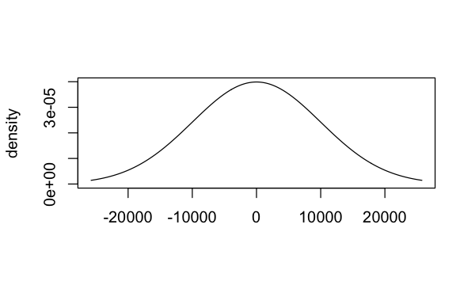
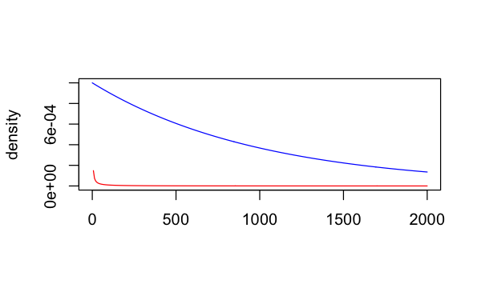

```r
library(psborrow2)
```

In this article, you'll learn how to specify prior distributions in `psborrow2`.

# Specifying prior distributions
Because `psborrow2` creates fully-parametrized Bayesian models,
proper prior distributions on all parameters must be specified. \bold{`psborrow2`
does not provide any default prior distributions by design: users must
specify these.}

Prior distributions are needed for several parameters,
depending on the analysis:

* beta coefficients (e.g. log hazard ratios or log odds ratios) for all
coefficients, passed to `add_covariates()`
* ancillary parameters for outcome distributions, such as the shape parameter
for the Weibull survival distribution, passed to `outcome_surv_weibull_ph()`
* log effect estimates (e.g. hazard ratios or odds ratios) for the primary
contrast between treatments, passed to `treatment_details()`
* baseline outcome rates or odds, passed to outcome functions
* the hyperprior on the commensurability parameter for
Bayesian dynamic borrowing (BDB), passed to `borrowing_hierarchical_commensurate()`

See the documentation of these functions for more information.

# Types of prior distributions
The currently supported prior distributions are created with the `prior_`
constructors below:

* `prior_bernoulli()`
* `prior_beta()`
* `prior_cauchy()`
* `prior_exponential()`
* `prior_gamma()`
* `prior_half_cauchy()`
* `prior_half_normal()`
* `prior_normal()`
* `prior_poisson()`

For example, we can create an uninformative normal distribution by specifying
a normal prior centered around 0 with a very large standard deviation:


```r
uninformative_normal <- prior_normal(0, 10000)
uninformative_normal
# Normal Distribution
# Parameters:
#  Stan  R    Value
#  mu    mean     0
#  sigma sd   10000
```

See the documentation for the respective functions above for additional
information.

# Visualizing prior distributions

You may sometimes find it useful to visualize prior distributions. In these
scenarios, you can call `plot()` on the prior object to visualize the
distribution:


```r
plot(uninformative_normal)
```

<div class="figure" style="text-align: center">

<p class="caption">plot of chunk unnamed-chunk-3</p>
</div>

`plot()` chooses the default axes for you, but you can change these to
make differences more obvious. Let's compare
a conservative `gamma(0.001, 0.001)` hyperprior distribution on the
commensurability parameter `tau` to an more aggressive `gamma(1, 0.001)`
distribution with greater density at higher values of `tau` (which
will lead to more borrowing in a BDB analysis):


```r
conservative_tau <- prior_gamma(0.001, 0.001)
aggressive_tau <- prior_gamma(1, 0.001)
plot(aggressive_tau, xlim = c(0, 2000), col = "blue", ylim = c(0, 1e-03))
plot(conservative_tau, xlim = c(0, 2000), col = "red", add = TRUE)
```

<div class="figure" style="text-align: center">

<p class="caption">plot of chunk unnamed-chunk-4</p>
</div>
