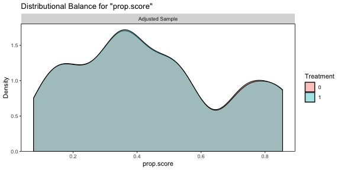
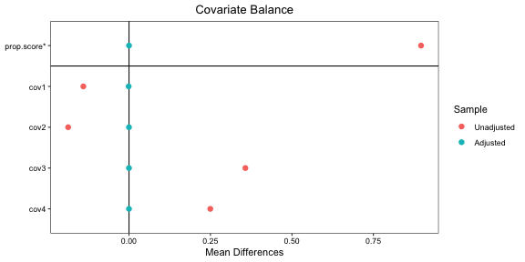
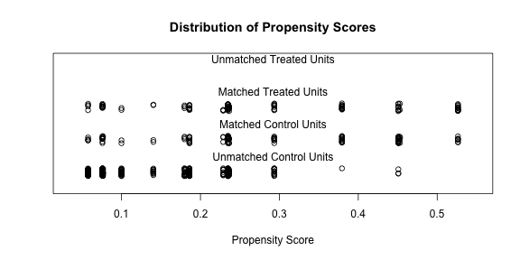
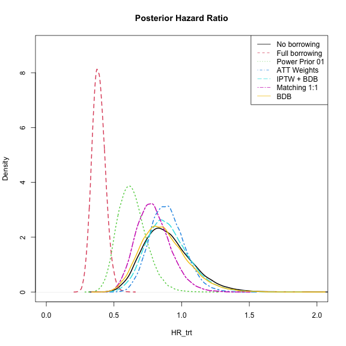

```r
library(psborrow2)
library(cmdstanr)
```

Propensity scores (PS) methods offer various ways to adjust analyses for differences in groups of patients.
@austin2013 discusses various approaches for using PS with survival analyses to obtain effect measures similar to
randomized controlled trials. @wang2021 discuss using PS for IPTW, matching and stratification in combination with a Bayesian analysis.
These methods allow for the separation of the design and analysis into two stages, which may be attractive in a regulatory setting.
Another approach is the direct inclusion of the PS as a covariate in the outcome model.

## Alternative PS Weights with `WeightIt`

The [`WeightIt`](https://cran.r-project.org/package=WeightIt) package can calculate PS and other balancing
weights with a number of different methods, such as generalized boosted modeling (`method = "gbm"`).
In addition, weights can be calculated differently for different estimands. Here, we specifying
`estimand = "ATT"`, to calculate weights for estimating the average treatment effect among the treated (ATT).


```r
library(WeightIt)

example_dataframe <- as.data.frame(example_matrix)
example_dataframe$int <- 1 - example_dataframe$ext

weightit_model <- weightit(
  int ~ cov1 + cov2 + cov3 + cov4,
  data = example_dataframe,
  method = "gbm",
  estimand = "ATT"
)
#> Warning: No `criterion` was provided. Using "smd.mean"FALSETRUE.
summary(weightit_model)
#>                  Summary of weights
#> 
#> - Weight ranges:
#> 
#>            Min                                  Max
#> treated 1.0000      ||                       1.0000
#> control 0.0826 |---------------------------| 5.8966
#> 
#> - Units with the 5 most extreme weights by group:
#>                                            
#>               5      4      3      2      1
#>  treated      1      1      1      1      1
#>             195    158    465    438    371
#>  control 2.7924 2.7924 5.8966 5.8966 5.8966
#> 
#> - Weight statistics:
#> 
#>         Coef of Var  MAD Entropy # Zeros
#> treated       0.000 0.00     0.0       0
#> control       1.582 0.82     0.6       0
#> 
#> - Effective Sample Sizes:
#> 
#>            Control Treated
#> Unweighted  350.       150
#> Weighted    100.09     150
```

Another useful package is [cobalt](https://cran.r-project.org/package=cobalt), which provides tools for
assessing balance between groups after weighting or matching. It is compatible with many matching and weighting packages.
See the [vignette](https://CRAN.R-project.org/package=cobalt/vignettes/cobalt.html) for more details.
We can use the `cobalt` package to assess balance with `bal.plot()`.


```r
library(cobalt)
bal.plot(weightit_model)
```

<div class="figure" style="text-align: center">

<p class="caption">plot of chunk balplot</p>
</div>

"Love plots" can also be generated that compare the populations before and after weighting:


```r
love.plot(weightit_model, stars = "std")
```

<div class="figure" style="text-align: center">

<p class="caption">plot of chunk loveplot</p>
</div>

The PS values can be copied into the data set and the analysis object can be constructed as before.


```r
example_dataframe$att <- weightit_model$weights

example_matrix_att <- create_data_matrix(
  example_dataframe,
  ext_flag_col = "ext",
  outcome = c("time", "cnsr"),
  trt_flag_col = "trt",
  weight_var = "att"
)

analysis_att <- create_analysis_obj(
  data_matrix = example_matrix_att,
  outcome = outcome_surv_exponential("time", "cnsr", prior_normal(0, 10000), weight_var = "att"),
  borrowing = borrowing_full("ext"),
  treatment = treatment_details("trt", prior_normal(0, 10000)),
  quiet = TRUE
)

result_att <- mcmc_sample(analysis_att, seed = 123)
```


## Matching with `MatchIt`

A variety of matching methods, including PS matching are implemented in the
[MatchIt](https://cran.r-project.org/package=MatchIt) package.

As described in the [Getting Started vignette](https://CRAN.R-project.org/package=MatchIt/vignettes/MatchIt.html),
it can be useful to check the imbalance before matching.


```r
library(MatchIt)
#> 
#> Attaching package: 'MatchIt'
#> The following object is masked from 'package:cobalt':
#> 
#>     lalonde
# No matching; constructing a pre-match matchit object
no_match <- matchit(trt ~ cov1 + cov2 + cov3 + cov4,
  data = example_dataframe,
  method = NULL, distance = "glm"
)
summary(no_match)
#> 
#> Call:
#> matchit(formula = trt ~ cov1 + cov2 + cov3 + cov4, data = example_dataframe, 
#>     method = NULL, distance = "glm")
#> 
#> Summary of Balance for All Data:
#>          Means Treated Means Control Std. Mean Diff. Var. Ratio eCDF Mean
#> distance        0.2898        0.1776          0.7585     1.5831    0.2328
#> cov1            0.6300        0.7150         -0.1761          .    0.0850
#> cov2            0.3700        0.4625         -0.1916          .    0.0925
#> cov3            0.7600        0.4475          0.7317          .    0.3125
#> cov4            0.4600        0.2250          0.4715          .    0.2350
#>          eCDF Max
#> distance   0.3375
#> cov1       0.0850
#> cov2       0.0925
#> cov3       0.3125
#> cov4       0.2350
#> 
#> Sample Sizes:
#>           Control Treated
#> All           400     100
#> Matched       400     100
#> Unmatched       0       0
#> Discarded       0       0
```

Here we are matching treated to untreated to select the most comparable control group, regardless of whether they are
internal or external. For simplicity let's try a 1:1 nearest matching approach.


```r
match_11 <- matchit(trt ~ cov1 + cov2 + cov3 + cov4,
  data = example_dataframe,
  method = "nearest", distance = "glm"
)
summary(match_11)
#> 
#> Call:
#> matchit(formula = trt ~ cov1 + cov2 + cov3 + cov4, data = example_dataframe, 
#>     method = "nearest", distance = "glm")
#> 
#> Summary of Balance for All Data:
#>          Means Treated Means Control Std. Mean Diff. Var. Ratio eCDF Mean
#> distance        0.2898        0.1776          0.7585     1.5831    0.2328
#> cov1            0.6300        0.7150         -0.1761          .    0.0850
#> cov2            0.3700        0.4625         -0.1916          .    0.0925
#> cov3            0.7600        0.4475          0.7317          .    0.3125
#> cov4            0.4600        0.2250          0.4715          .    0.2350
#>          eCDF Max
#> distance   0.3375
#> cov1       0.0850
#> cov2       0.0925
#> cov3       0.3125
#> cov4       0.2350
#> 
#> Summary of Balance for Matched Data:
#>          Means Treated Means Control Std. Mean Diff. Var. Ratio eCDF Mean
#> distance        0.2898        0.2845          0.0355     1.1082    0.0075
#> cov1            0.6300        0.6800         -0.1036          .    0.0500
#> cov2            0.3700        0.3900         -0.0414          .    0.0200
#> cov3            0.7600        0.7600          0.0000          .    0.0000
#> cov4            0.4600        0.4600          0.0000          .    0.0000
#>          eCDF Max Std. Pair Dist.
#> distance     0.07          0.0355
#> cov1         0.05          0.1036
#> cov2         0.02          0.1243
#> cov3         0.00          0.0000
#> cov4         0.00          0.0000
#> 
#> Sample Sizes:
#>           Control Treated
#> All           400     100
#> Matched       100     100
#> Unmatched     300       0
#> Discarded       0       0
```


```r
set.seed(123)
plot(match_11, type = "jitter", interactive = FALSE)
```

<div class="figure" style="text-align: center">

<p class="caption">plot of chunk matchit_jitter</p>
</div>

Determining whether the balance after matching is appropriate is beyond the scope of this vignette. You can read more in
the [MatchIt Assessing Balance](https://CRAN.R-project.org/package=MatchIt/vignettes/assessing-balance.html)
vignette. Again the `cobalt` package can be useful here.

However, if you are happy with the results of the matching procedure, you can extract the data for use in `psborrow2`.


```r
example_matrix_match <- create_data_matrix(
  data = example_dataframe[match_11$weights == 1, ],
  ext_flag_col = "ext",
  outcome = c("time", "cnsr"),
  trt_flag_col = "trt"
)
```


```r
analysis_match <- create_analysis_obj(
  data_matrix = example_matrix_match,
  outcome = outcome_surv_exponential("time", "cnsr", prior_normal(0, 10000)),
  borrowing = borrowing_full("ext"),
  treatment = treatment_details("trt", prior_normal(0, 10000)),
  quiet = TRUE
)

result_match <- mcmc_sample(analysis_match, seed = 123)
```

## Combined Weighting and Dynamic Borrowing

The models also support fixed weights on the likelihood contributions from each observation. This
is equivalent to fixed power prior weights. This allows for the combination of models, such as an
IPTW + commensurate prior approach.


```r
analysis_iptw_bdb <- create_analysis_obj(
  data_matrix = example_matrix_att,
  outcome = outcome_surv_exponential("time", "cnsr", prior_normal(0, 10000), weight_var = "att"),
  borrowing = borrowing_hierarchical_commensurate("ext", prior_gamma(0.01, 0.01)),
  treatment = treatment_details("trt", prior_normal(0, 10000)),
  quiet = TRUE
)

result_iptw_bdb <- mcmc_sample(analysis_iptw_bdb, seed = 123)
```

## Fixed Weights

We can also use weights to specify a fixed power prior model. Here we set the power parameter $\alpha = 0.1$
for the external controls.


```r
example_matrix_pp01 <- cbind(example_matrix, pp_alpha = ifelse(example_matrix[, "ext"] == 1, 0.1, 1))

analysis_pp01 <- create_analysis_obj(
  data_matrix = example_matrix_pp01,
  outcome = outcome_surv_exponential("time", "cnsr", prior_normal(0, 10000), weight_var = "pp_alpha"),
  borrowing = borrowing_full("ext"),
  treatment = treatment_details("trt", prior_normal(0, 10000)),
  quiet = TRUE
)

result_pp01 <- mcmc_sample(analysis_pp01, seed = 123)
```

## Reference Models

For comparison, we also fit a full borrowing, a no borrowing, and a BDB model without weights.


```r
result_full <- mcmc_sample(
  create_analysis_obj(
    data_matrix = example_matrix,
    outcome = outcome_surv_exponential("time", "cnsr", prior_normal(0, 10000)),
    borrowing = borrowing_full("ext"),
    treatment = treatment_details("trt", prior_normal(0, 10000)),
    quiet = TRUE
  ),
  seed = 123
)

result_none <- mcmc_sample(
  create_analysis_obj(
    data_matrix = example_matrix,
    outcome = outcome_surv_exponential("time", "cnsr", prior_normal(0, 10000)),
    borrowing = borrowing_none("ext"),
    treatment = treatment_details("trt", prior_normal(0, 10000)),
    quiet = TRUE
  ),
  seed = 123
)

result_bdb <- mcmc_sample(
  create_analysis_obj(
    data_matrix = example_matrix_att,
    outcome = outcome_surv_exponential("time", "cnsr", prior_normal(0, 10000)),
    borrowing = borrowing_hierarchical_commensurate("ext", prior_gamma(0.01, 0.01)),
    treatment = treatment_details("trt", prior_normal(0, 10000)),
    quiet = TRUE
  ),
  seed = 123
)
```


# Comparison of Results


```r
models <- list(
  "No borrowing" = result_none,
  "Full borrowing" = result_full,
  "Power Prior 01" = result_pp01,
  "ATT Weights" = result_att,
  "IPTW + BDB" = result_iptw_bdb,
  "Matching 1:1" = result_match,
  "BDB" = result_bdb
)
```

We can use `summary()` to extract the variable of interest and specify summary statistics.

```r
results_table <- do.call(rbind, lapply(
  models,
  function(i) i$summary("HR_trt", c("mean", "median", "sd", "quantile2"))
))
knitr::kable(cbind(models = names(models), results_table), digits = 3)
```


|models         |variable |  mean| median|    sd|    q5|   q95|
|:--------------|:--------|-----:|------:|-----:|-----:|-----:|
|No borrowing   |HR_trt   | 0.896|  0.879| 0.179| 0.635| 1.214|
|Full borrowing |HR_trt   | 0.387|  0.385| 0.049| 0.311| 0.471|
|Power Prior 01 |HR_trt   | 0.633|  0.625| 0.106| 0.475| 0.819|
|ATT Weights    |HR_trt   | 0.893|  0.884| 0.127| 0.700| 1.114|
|IPTW + BDB     |HR_trt   | 0.893|  0.877| 0.164| 0.654| 1.186|
|Matching 1:1   |HR_trt   | 0.796|  0.785| 0.130| 0.601| 1.028|
|BDB            |HR_trt   | 0.873|  0.855| 0.176| 0.620| 1.190|


We can extract a `draws` object from each model and plot the posterior distribution of the
treatment hazard ratio.

```r
plot(density(models[[1]]$draws("HR_trt")),
  col = 1, xlim = c(0, 2), ylim = c(0, 9), lwd = 2,
  xlab = "HR_trt",
  main = "Posterior Hazard Ratio"
)
for (i in 2:7) {
  lines(density(models[[i]]$draws("HR_trt")), col = i, lty = i, lwd = 2)
}
legend("topright", col = seq_along(models), lty = seq_along(models), legend = names(models))
```

<div class="figure" style="text-align: center">

<p class="caption">plot of chunk plots</p>
</div>

Here we see no borrowing and full borrowing at the extremes and the other methods in between.

## References
