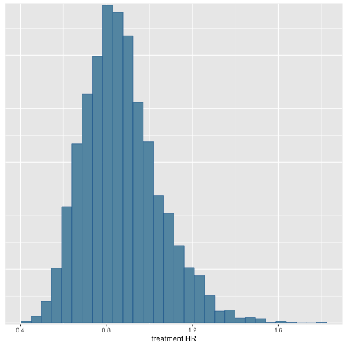

# Purpose
The goal of this demo is to conduct a Bayesian Dynamic Borrowing
(BDB) analysis using the hierarchical commensurate prior on a dataset.


```
# Load packages ----
library(psborrow2)

# Survival analysis
library(survival)
library(ggsurvfit)
library(flexsurv)

# Additional tools for draws objects
library(bayesplot)
library(posterior)

# Comparing populations
library(table1)
```


# Explore example data

## {psborrow2} contains an example matrix

```r
head(example_matrix)
```

```
##      id ext trt cov4 cov3 cov2 cov1       time status cnsr resp
## [1,]  1   0   0    1    1    1    0  2.4226411      1    0    1
## [2,]  2   0   0    1    1    0    1 50.0000000      0    1    1
## [3,]  3   0   0    0    0    0    1  0.9674372      1    0    1
## [4,]  4   0   0    1    1    0    1 14.5774738      1    0    1
## [5,]  5   0   0    1    1    0    0 50.0000000      0    1    0
## [6,]  6   0   0    1    1    0    1 50.0000000      0    1    0
```

```
?example_matrix # for more details
```


## Load as data.frame for some functions

```r
example_dataframe <- as.data.frame(example_matrix)
```


## Look at distribution of arms

```r
table(ext = example_matrix[, "ext"], trt = example_matrix[, "trt"])
```

```
##    trt
## ext   0   1
##   0  50 100
##   1 350   0
```

## Naive internal comparisons

### Kaplan-Meier curves

```r
km_fit <- survfit(Surv(time = time, event = 1 - cnsr) ~ trt + ext,
  data = example_dataframe
)

ggsurvfit(km_fit)
```


The internal and external control arms look quite different...

### Cox model

```r
cox_fit <- coxph(Surv(time = time, event = 1 - cnsr) ~ trt,
  data = example_dataframe,
  subset = ext == 0
)

cox_fit
```

```
## Call:
## coxph(formula = Surv(time = time, event = 1 - cnsr) ~ trt, data = example_dataframe, 
##     subset = ext == 0)
## 
##        coef exp(coef) se(coef)      z     p
## trt -0.1097    0.8961   0.1976 -0.555 0.579
## 
## Likelihood ratio test=0.3  on 1 df, p=0.5809
## n= 150, number of events= 114
```

```r
exp(confint(cox_fit)) # The internal HR is 0.90 (95% CI 0.61 - 1.32)
```

```
##         2.5 %   97.5 %
## trt 0.6083595 1.319842
```

# Hybrid control analysis

Let's start by demonstrating the utility of BDB by trying to
borrow data from the external control arm which we know
experiences worse survival.

The end goal is to create an Analysis object with:
```
?create_analysis_obj
```

# A note on prior distributions
psborrow2 allows the user to specify priors with the following
functions:

```
?prior_bernoulli
?prior_beta
?prior_cauchy
?prior_exponential
?prior_gamma
?prior_normal
?prior_poisson
?prior_uniform
```

Prior distributions can be plotted with the plot() method

```r
plot(prior_normal(0, 1), xlim = c(-100, 100), ylim = c(0, 1))
```


```r
plot(prior_normal(0, 10), xlim = c(-100, 100), ylim = c(0, 1))
```


```r
plot(prior_normal(0, 10000), xlim = c(-100, 100), ylim = c(0, 1))
```


# Outcome objects

psborrow2 currently supports 4 outcomes:

```
?outcome_surv_weibull_ph # Weibull survival w/ proportional hazards
?outcome_surv_exponential # Exponential survival
?outcome_bin_logistic # Logistic binary outcome
?outocme_cont_normal # Normal continuous outcome
```

# Create an exponential survival distribution Outcome object

```r
exp_outcome <- outcome_surv_exponential(
  time_var = "time",
  cens_var = "cnsr",
  baseline_prior = prior_normal(0, 10000)
)
```

# Borrowing object

Borrowing objects are created with:
```
?borrowing_hierarchical_commensurate # Hierarchical commensurate borrowing
?borrowing_none # No borrowing
?borrowing_full # Full borrowing
```


```r
bdb_borrowing <- borrowing_hierarchical_commensurate(
  ext_flag_col = "ext",
  tau_prior = prior_gamma(0.001, 0.001)
)
```

# Treatment objects

Treatment objects are created with:
```
?treatment_details
```


```r
trt_details <- treatment_details(
  trt_flag_col = "trt",
  trt_prior = prior_normal(0, 10000)
)
```

# Analysis objects

Combine everything and create object of class Analysis:

```r
analysis_object <- create_analysis_obj(
  data_matrix = example_matrix,
  outcome = exp_outcome,
  borrowing = bdb_borrowing,
  treatment = trt_details
)
```

```
## Inputs look good.
```

```
## Stan program compiled successfully!
```

```
## Ready to go! Now call `mcmc_sample()`.
```

```r
analysis_object
```

```
## Analysis Object
## 
## Outcome model: OutcomeSurvExponential 
## Outcome variables: time cnsr 
## 
## Borrowing method: Bayesian dynamic borrowing with the hierarchical commensurate prior 
## External flag: ext 
## 
## Treatment variable: trt 
## 
## Data: Matrix with 500 observations 
##     -  50  internal controls
##     -  350  external controls 
##     -  100  internal experimental
## 
## Stan model compiled and ready to sample.
##  Call mcmc_sample() next.
```

# MCMC sampling

Conduct MCMC sampling with:
```
?mcmc_sample
```


```
results <- mcmc_sample(
  x = analysis_object,
  iter_warmup = 1000,
  iter_sampling = 5000,
  chains = 1
)
```


```r
class(results)
```

```
## [1] "CmdStanMCMC" "CmdStanFit"  "R6"
```

```r
results
```

```
##  variable     mean   median   sd  mad       q5      q95 rhat ess_bulk ess_tail
##  lp__     -1617.91 -1617.57 1.50 1.29 -1620.76 -1616.16 1.00     1927     2101
##  beta_trt    -0.15    -0.16 0.20 0.19    -0.47     0.18 1.00     2087     2682
##  tau          1.19     0.50 1.73 0.68     0.00     4.65 1.00     2135     1393
##  alpha[1]    -3.36    -3.35 0.16 0.16    -3.63    -3.10 1.00     2140     2421
##  alpha[2]    -2.40    -2.40 0.06 0.06    -2.49    -2.31 1.00     3783     3085
##  HR_trt       0.87     0.85 0.17 0.17     0.62     1.19 1.00     2087     2682
```

# Interpret results


Dictionary to interpret parameters:

```r
variable_dictionary(analysis_object)
```

```
##   Stan_variable                        Description
## 1           tau         commensurability parameter
## 2      alpha[1] baseline log hazard rate, internal
## 3      alpha[2] baseline log hazard rate, external
## 4      beta_trt                   treatment log HR
## 5        HR_trt                       treatment HR
```

Create a draws object

```r
draws <- results$draws()
```

Rename draws object parameters

```r
draws <- rename_draws_covariates(draws, analysis_object)
```


Get 95% credible intervals with posterior package

```r
posterior::summarize_draws(draws, ~ quantile(.x, probs = c(0.025, 0.50, 0.975)))
```

```
## # A tibble: 6 × 4
##   variable                                 `2.5%`     `50%`   `97.5%`
##   <chr>                                     <dbl>     <dbl>     <dbl>
## 1 lp__                               -1622.       -1618.    -1616.   
## 2 treatment log HR                      -0.538       -0.157     0.231
## 3 commensurability parameter             0.000910     0.497     6.06 
## 4 baseline log hazard rate, internal    -3.69        -3.35     -3.05 
## 5 baseline log hazard rate, external    -2.51        -2.40     -2.29 
## 6 treatment HR                           0.584        0.855     1.26
```

Look at histogram of draws with bayesplot package

```r
bayesplot::mcmc_hist(draws, c("treatment HR"))
```

```
## `stat_bin()` using `bins = 30`. Pick better value with `binwidth`.
```



Our model does not borrow much from the external arm!
This is the ***desired outcome*** given how different the control arms were.

# Control arm imbalances

Check balance between arms

```r
table1(
  ~ cov1 + cov2 + cov3 + cov4 |
    factor(ext, labels = c("Internal RCT", "External data")) +
      factor(trt, labels = c("Not treated", "Treated")),
  data = example_dataframe
)
```

<!--html_preserve--><div class="Rtable1"><table class="Rtable1">
<thead>
<tr>
<th class="grouplabel"></th>
<th colspan="2" class="grouplabel"><div>Internal RCT</div></th>
<th colspan="1" class="grouplabel"><div>External data</div></th>
<th colspan="2" class="grouplabel"><div>Overall</div></th>
</tr>
<tr>
<th class='rowlabel firstrow lastrow'></th>
<th class='firstrow lastrow'><span class='stratlabel'>Not treated<br><span class='stratn'>(N=50)</span></span></th>
<th class='firstrow lastrow'><span class='stratlabel'>Treated<br><span class='stratn'>(N=100)</span></span></th>
<th class='firstrow lastrow'><span class='stratlabel'>Not treated<br><span class='stratn'>(N=350)</span></span></th>
<th class='firstrow lastrow'><span class='stratlabel'>Not treated<br><span class='stratn'>(N=400)</span></span></th>
<th class='firstrow lastrow'><span class='stratlabel'>Treated<br><span class='stratn'>(N=100)</span></span></th>
</tr>
</thead>
<tbody>
<tr>
<td class='rowlabel firstrow'>cov1</td>
<td class='firstrow'></td>
<td class='firstrow'></td>
<td class='firstrow'></td>
<td class='firstrow'></td>
<td class='firstrow'></td>
</tr>
<tr>
<td class='rowlabel'>Mean (SD)</td>
<td>0.540 (0.503)</td>
<td>0.630 (0.485)</td>
<td>0.740 (0.439)</td>
<td>0.715 (0.452)</td>
<td>0.630 (0.485)</td>
</tr>
<tr>
<td class='rowlabel lastrow'>Median [Min, Max]</td>
<td class='lastrow'>1.00 [0, 1.00]</td>
<td class='lastrow'>1.00 [0, 1.00]</td>
<td class='lastrow'>1.00 [0, 1.00]</td>
<td class='lastrow'>1.00 [0, 1.00]</td>
<td class='lastrow'>1.00 [0, 1.00]</td>
</tr>
<tr>
<td class='rowlabel firstrow'>cov2</td>
<td class='firstrow'></td>
<td class='firstrow'></td>
<td class='firstrow'></td>
<td class='firstrow'></td>
<td class='firstrow'></td>
</tr>
<tr>
<td class='rowlabel'>Mean (SD)</td>
<td>0.200 (0.404)</td>
<td>0.370 (0.485)</td>
<td>0.500 (0.501)</td>
<td>0.463 (0.499)</td>
<td>0.370 (0.485)</td>
</tr>
<tr>
<td class='rowlabel lastrow'>Median [Min, Max]</td>
<td class='lastrow'>0 [0, 1.00]</td>
<td class='lastrow'>0 [0, 1.00]</td>
<td class='lastrow'>0.500 [0, 1.00]</td>
<td class='lastrow'>0 [0, 1.00]</td>
<td class='lastrow'>0 [0, 1.00]</td>
</tr>
<tr>
<td class='rowlabel firstrow'>cov3</td>
<td class='firstrow'></td>
<td class='firstrow'></td>
<td class='firstrow'></td>
<td class='firstrow'></td>
<td class='firstrow'></td>
</tr>
<tr>
<td class='rowlabel'>Mean (SD)</td>
<td>0.760 (0.431)</td>
<td>0.760 (0.429)</td>
<td>0.403 (0.491)</td>
<td>0.448 (0.498)</td>
<td>0.760 (0.429)</td>
</tr>
<tr>
<td class='rowlabel lastrow'>Median [Min, Max]</td>
<td class='lastrow'>1.00 [0, 1.00]</td>
<td class='lastrow'>1.00 [0, 1.00]</td>
<td class='lastrow'>0 [0, 1.00]</td>
<td class='lastrow'>0 [0, 1.00]</td>
<td class='lastrow'>1.00 [0, 1.00]</td>
</tr>
<tr>
<td class='rowlabel firstrow'>cov4</td>
<td class='firstrow'></td>
<td class='firstrow'></td>
<td class='firstrow'></td>
<td class='firstrow'></td>
<td class='firstrow'></td>
</tr>
<tr>
<td class='rowlabel'>Mean (SD)</td>
<td>0.420 (0.499)</td>
<td>0.460 (0.501)</td>
<td>0.197 (0.398)</td>
<td>0.225 (0.418)</td>
<td>0.460 (0.501)</td>
</tr>
<tr>
<td class='rowlabel lastrow'>Median [Min, Max]</td>
<td class='lastrow'>0 [0, 1.00]</td>
<td class='lastrow'>0 [0, 1.00]</td>
<td class='lastrow'>0 [0, 1.00]</td>
<td class='lastrow'>0 [0, 1.00]</td>
<td class='lastrow'>0 [0, 1.00]</td>
</tr>
</tbody>
</table>
</div><!--/html_preserve-->

Because the imbalance may be conditional on observed covariates,
let's adjust for propensity scores in our analysis

Create a propensity score model

```r
ps_model <- glm(ext ~ cov1 + cov2 + cov3 + cov4,
  data = example_dataframe,
  family = binomial
)
ps <- predict(ps_model, type = "response")
example_dataframe$ps <- ps
example_dataframe$ps_cat_ <- cut(
  example_dataframe$ps,
  breaks = 5,
  include.lowest = TRUE
)
levels(example_dataframe$ps_cat_) <- c(
  "ref", "low",
  "low_med", "high_med", "high"
)
```


Convert the data back to a matrix with dummy variables for `ps_cat_` levels

```r
example_matrix_ps <- create_data_matrix(
  example_dataframe,
  outcome = c("time", "cnsr"),
  trt_flag_col = "trt",
  ext_flag_col = "ext",
  covariates = ~ps_cat_
)
```

```
## Call `add_covariates()` with `covariates =  c("ps_cat_low", "ps_cat_low_med", "ps_cat_high_med", "ps_cat_high" ) `
```

Propensity score analysis without borrowing


```
anls_ps_no_borrow <- create_analysis_obj(
  data_matrix = example_matrix_ps,
  covariates = add_covariates(
    c("ps_cat_low", "ps_cat_low_med", "ps_cat_high_med", "ps_cat_high"),
    prior_normal(0, 10000)
  ),
  outcome = outcome_surv_exponential("time", "cnsr", prior_normal(0, 10000)),
  borrowing = borrowing_none("ext"),
  treatment = treatment_details("trt", prior_normal(0, 10000))
)

res_ps_no_borrow <- mcmc_sample(
  x = anls_ps_no_borrow,
  iter_warmup = 1000,
  iter_sampling = 5000,
  chains = 1
)
```


```r
draws_ps_no_borrow <- rename_draws_covariates(
  res_ps_no_borrow$draws(),
  anls_ps_no_borrow
)

summarize_draws(draws_ps_no_borrow, ~ quantile(.x, probs = c(0.025, 0.50, 0.975)))
```

```
## # A tibble: 8 × 4
##   variable                   `2.5%`    `50%`   `97.5%`
##   <chr>                       <dbl>    <dbl>     <dbl>
## 1 lp__                     -466.    -462.    -460.    
## 2 treatment log HR           -0.742   -0.353    0.0581
## 3 baseline log hazard rate   -4.73    -4.18    -3.72  
## 4 ps_cat_low                 -0.371    0.398    1.12  
## 5 ps_cat_low_med              0.466    0.994    1.56  
## 6 ps_cat_high_med             1.42     2.08     2.79  
## 7 ps_cat_high                 2.42     3.01     3.64  
## 8 treatment HR                0.476    0.703    1.06
```


# Propensity score analysis with BDB


```
anls_ps_bdb <- create_analysis_obj(
  data_matrix = example_matrix_ps,
  covariates = add_covariates(
    c("ps_cat_low", "ps_cat_low_med", "ps_cat_high_med", "ps_cat_high"),
    prior_normal(0, 10000)
  ),
  outcome = outcome_surv_exponential("time", "cnsr", prior_normal(0, 10000)),
  borrowing = borrowing_hierarchical_commensurate("ext", prior_gamma(0.001, 0.001)),
  treatment = treatment_details("trt", prior_normal(0, 10000))
)

res_ps_bdb <- mcmc_sample(
  x = anls_ps_bdb,
  iter_warmup = 1000,
  iter_sampling = 5000,
  chains = 1
)
```


```r
draws_ps_bdb <- rename_draws_covariates(
  res_ps_bdb$draws(),
  anls_ps_bdb
)

summarize_draws(draws_ps_bdb, ~ quantile(.x, probs = c(0.025, 0.50, 0.975)))
```

```
## # A tibble: 10 × 4
##    variable                              `2.5%`     `50%`    `97.5%`
##    <chr>                                  <dbl>     <dbl>      <dbl>
##  1 lp__                               -1426.    -1420.    -1418.    
##  2 treatment log HR                      -0.709    -0.352    -0.0175
##  3 commensurability parameter             0.121    54.7    1298.    
##  4 baseline log hazard rate, internal    -4.63     -4.20     -3.77  
##  5 baseline log hazard rate, external    -4.66     -4.21     -3.80  
##  6 ps_cat_low                            -0.333     0.274     0.865 
##  7 ps_cat_low_med                         0.635     1.07      1.53  
##  8 ps_cat_high_med                        1.65      2.11      2.58  
##  9 ps_cat_high                            2.51      2.96      3.42  
## 10 treatment HR                           0.492     0.703     0.983
```

It looks like PS + BDB allowed us to most accurately recover the
true hazard ratio of 0.70.
