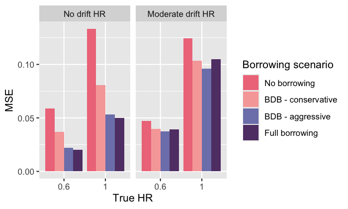

In this article, you'll learn how to use `psborrow2` to create a
simulation study with the goal of informing trial design. 

Note that we'll need `cmdstanr` to run the simulation study. Please install 
`cmdstanr` if you have not done so already following
[this guide](https://mc-stan.org/cmdstanr/articles/cmdstanr.html).

Let's load `psborrow2` to start:


```r
library(psborrow2)
library(cmdstanr)
```

# Bringing your own simulated data

We'll start by showing how to conduct a simulation study when you bring your
own simulated data. To learn how to use `psborrow2` for the data generation
as well, please refer to the [data simulation article (https://genentech.github.io/psborrow2/articles/data_simulation.html)](https://genentech.github.io/psborrow2/articles/data_simulation.html).

To execute a simulation study with your own data,
we need to build an object of class `Simulation` using the function
`create_simulation_obj()`. Let's look at the arguments to
`create_simulation_obj()` and consider them one-by-one below:

```
create_simulation_obj(
  data_matrix_list,
  outcome,
  borrowing,
  covariate,
  treatment
)

```

## `data_matrix_list`

`data_matrix_list` is where you input the data you will be using for the
simulation study using the function `sim_data_list()`.

The first argument is a list of lists of matrices. At the highest level,
we'll index different data generation parameters. At the lowest level,
we'll index different matrices generated with these parameters.

## `data_list`

<b>Figure 1</b> below depicts an example `data_list` object. This object is a
list of lists with two data generation scenarios (e.g., true
HR of 1.0 and true HR of 0.8). Each scenario is arranged as a list of
matrices that were generated according to that data generation scenario.

<center>
{width=80%}

</center>

We'll use the `simsurv` package to generate survival data and we'll
then put it in a similar format. In this example, we'll vary
two data generation parameters: true HR and drift HR (the HR comparing
external to internal controls). Suppose we have a function,
`sim_single_matrix()` which can simulate data for a single matrix.

That is:


```{.r .fold-hide}
library(simsurv)
# function to create a single matrix
sim_single_matrix <- function(n = 500, # n simulated pts
                              prob = c(
                                0.1, # proportion internal control
                                0.2, # proportion internal treated
                                0.7
                              ), # proportion external control
                              hr = 0.70, # true HR for the treatment
                              drift_hr = 1.0, # HR of external/internal
                              ...) {
  # checks
  if (sum(prob) != 1.0) {
    stop("prob must sum to 1")
  }

  # data frame with the subject IDs and treatment group
  df_ids <- data.frame(
    id = 1:n,
    ext = c(
      rep(0L, n * (prob[1] + prob[2])),
      rep(1L, n * prob[3])
    ),
    trt = c(
      rep(0L, n * prob[1]),
      rep(1L, n * prob[2]),
      rep(0L, n * prob[3])
    )
  )

  # simulated event times
  df_surv <- simsurv(
    lambdas = 0.1,
    dist = "exponential",
    betas = c(
      trt = log(hr),
      ext = log(drift_hr)
    ),
    x = df_ids,
    maxt = 50,
    ...
  )

  df_surv$censor <- 1 - df_surv$status

  # merge the simulated event times into data frame
  df <- merge(df_ids, df_surv)
  df <- df[, c("id", "ext", "trt", "eventtime", "status", "censor")]
  colnames(df) <- c("id", "ext", "trt", "time", "status", "cnsr")
  return(as.matrix(df))
}
```


```r
set.seed(123)
head(sim_single_matrix(n = 500, hr = 0.5, drift_hr = 1.2))
#      id ext trt      time status cnsr
# [1,]  1   0   0  8.179722      1    0
# [2,]  2   0   0  6.884286      1    0
# [3,]  3   0   0  2.348331      1    0
# [4,]  4   0   0 17.898011      1    0
# [5,]  5   0   0  3.870353      1    0
# [6,]  6   0   0  6.795403      1    0
```

Using this function, let's simulate a list of lists of matrices with four
scenarios:

- True HR = 0.6, drift HR = 1.0
- True HR = 1.0, drift HR = 1.0
- True HR = 0.6, drift HR = 1.5
- True HR = 1.0, drift HR = 1.5


```r
# Seed for reproducibility
set.seed(123)

# Number of simulations per scenario
n <- 100

# Create list of lists of data
my_data_list <- list(
  replicate(n,
    sim_single_matrix(n = 250, hr = 0.6, drift_hr = 1.0),
    simplify = FALSE
  ),
  replicate(n,
    sim_single_matrix(n = 250, hr = 1.0, drift_hr = 1.0),
    simplify = FALSE
  ),
  replicate(n,
    sim_single_matrix(n = 250, hr = 0.6, drift_hr = 1.5),
    simplify = FALSE
  ),
  replicate(n,
    sim_single_matrix(n = 250, hr = 1.0, drift_hr = 1.5),
    simplify = FALSE
  )
)
```

There are 4 scenarios.


```r
NROW(my_data_list)
# [1] 4
```

Each scenario has 100 matrices.


```r
NROW(my_data_list[[1]])
# [1] 100
```

The lowest level of the list of lists is a data matrix.


```r
head(my_data_list[[1]][[1]])
#      id ext trt      time status cnsr
# [1,]  1   0   0  8.179722      1    0
# [2,]  2   0   0  6.884286      1    0
# [3,]  3   0   0  2.348331      1    0
# [4,]  4   0   0 17.898011      1    0
# [5,]  5   0   0  3.870353      1    0
# [6,]  6   0   0  6.795403      1    0
```

### `guide`

In order to summarize the results from the different parameters in
your simulation study, `psborrow2` needs to know how the simulation parameters
differ. That is the purpose of the argument `guide`, which is a `data.frame`
that distinguishes the simulation study parameters. Three columns are required
in `guide`, though many more can be provided. The three required columns are:

* The true treatment effect (in our case a HR)
* The true drift effect (in our case a HR). Drift effects >1 will mean
that the external control arm experiences greater hazard than the internal
control arm.
* The name of a column that indexes the `data_list`

In this example, the 4 scenarios are
summarized with the below `guide`:


```r
my_sim_data_guide <- expand.grid(
  true_hr = c(0.6, 1.0),
  drift_hr = c("No drift HR", "Moderate drift HR")
)

my_sim_data_guide$id <- seq(1, NROW(my_sim_data_guide))

my_sim_data_guide
#   true_hr          drift_hr id
# 1     0.6       No drift HR  1
# 2     1.0       No drift HR  2
# 3     0.6 Moderate drift HR  3
# 4     1.0 Moderate drift HR  4
```

This guide implies that `my_sim_data_guide[[1]]` is a list of
matrices where the treatment HR was 0.6 and the drift HR was 1.0.

### `effect`, `drift`, and `index`

The last three inputs to `sim_data_list()`, `effect`, `drift`, and `index`
are the column names in `guide` that correspond to the true treatment effect,
true drift effect, and index of the `data_list` items, respectively.
For our study, these are `"true_hr"`, `"drift_hr"`, and `"id"`.

Putting it all together, we can create an object of class `SimDataList`:


```r
my_sim_data_list <- sim_data_list(
  data_list = my_data_list,
  guide = my_sim_data_guide,
  effect = "true_hr",
  drift = "drift_hr",
  index = "id"
)

my_sim_data_list
# SimDataList object with  4  different scenarios
#   true_hr          drift_hr id n_datasets_per_param
# 1     0.6       No drift HR  1                  100
# 2     1.0       No drift HR  2                  100
# 3     0.6 Moderate drift HR  3                  100
# 4     1.0 Moderate drift HR  4                  100
```

## `outcome`

`outcome` is where you pass information on the study outcomes. You can pass
either a single `Outcome` class object (e.g., as produced by `outcome_surv_exponential()`),
or a list of `Outcome` class objects passed to `sim_outcome_list()`. For our
example, let's just use a single exponential distribution.


```r
my_sim_out <- outcome_surv_exponential(
  time_var = "time",
  cens_var = "cnsr",
  baseline_prior = prior_normal(0, 1000)
)

my_sim_out
# Outcome object with class OutcomeSurvExponential 
# 
# Outcome variables:
# time_var cens_var 
#   "time"   "cnsr" 
# 
# Baseline prior:
# Normal Distribution
# Parameters:
#  Stan  R    Value
#  mu    mean    0 
#  sigma sd   1000
```

## `borrowing`

`borrowing` is where we input information on the type of borrowing we want to
evaluate. This can be either a single object of class `Borrowing` or
a list of objects created with `sim_borrowing_list()`. For the sake of example,
let's assume we are interested in comparing four borrowing scenarios:

* No borrowing
* BDB, conservative hyperprior
* BDB, aggressive hyperprior
* Full borrowing

How do we specify that we want to evaluate multiple borrowing methods?
We'll use a special list of `Borrowing` objects,
which we'll create through the function `sim_borrowing_list()`.


```r
my_borrowing_list <- sim_borrowing_list(
  list(
    "No borrowing" = borrowing_none("ext"),
    "Full borrowing" = borrowing_full("ext"),
    "BDB - conservative" = borrowing_hierarchical_commensurate("ext", prior_gamma(0.001, 0.001)),
    "BDB - aggressive" = borrowing_hierarchical_commensurate("ext", prior_gamma(1, 0.001))
  )
)

my_borrowing_list
# SimBorrowingList object with  4  different scenario(s)
#   borrowing_scenario
# 1       No borrowing
# 2     Full borrowing
# 3 BDB - conservative
# 4   BDB - aggressive
```

## `covariate`

`covariate` is for information on covariate adjustment details. This can be
a single instance of class `Covariates` from `add_covariates()` or a list of
`Covariates` objects created by `sim_covariate_list()` . This is also the only
argument that is not required in `create_simulation_obj`. Let's leave
this argument empty (i.e., let's not adjust for any covariates).

## `treatment`

`treatment` is where we input the treatment details for our simulation study.
As with other inputs, this can be a single instance of a class `Treatment`,
or a list of these classes, created with `sim_treatment_list()`. Let's
just use a single instance:


```r
my_sim_treat <- treatment_details("trt", prior_normal(0, 1000))

my_sim_treat
# Treatment object
# 
# Treatment flag column: trt 
# 
# Treatment effect prior:
# Normal Distribution
# Parameters:
#  Stan  R    Value
#  mu    mean    0 
#  sigma sd   1000
```

## `create_simulation_obj()`

Now that we have all of the relevant inputs for `create_simulation_obj()`,
let's call the function, which will generate and compile Stan models
ready to sample on our behalf.

***Important:*** `psborrow2` will simulate the Cartesian product of all
unique list elements in `data_matrix_list`, `outcome`, `borrowing`,
`covariate`, and `treatment`. We have 4 data
generation scenarios and 4 borrowing
scenarios. The other inputs just have one scenario (or 0 for `covariate`,
which is equivalent to one scenario). This means we should expect
4 $\times$ 4
$=$ 16
combinations of parameters. Let's create a simulation object of class
`Simulation`:


```r
simulation_obj <- create_simulation_obj(
  my_sim_data_list,
  outcome = my_sim_out,
  borrowing = my_borrowing_list,
  treatment = my_sim_treat,
  quiet = TRUE
)

simulation_obj
```


While we get a warning about the size of the simulation study, we are not worried
because we are limiting our MCMC samples below in this example.

We can access the guide to see the specific scenarios that will be
simulated with `show_guide()`:


```r
show_guide(simulation_obj)
#    true_hr          drift_hr id n_datasets_per_param outcome_scenario
# 1      0.6       No drift HR  1                  100          default
# 2      1.0       No drift HR  2                  100          default
# 3      0.6 Moderate drift HR  3                  100          default
# 4      1.0 Moderate drift HR  4                  100          default
# 5      0.6       No drift HR  1                  100          default
# 6      1.0       No drift HR  2                  100          default
# 7      0.6 Moderate drift HR  3                  100          default
# 8      1.0 Moderate drift HR  4                  100          default
# 9      0.6       No drift HR  1                  100          default
# 10     1.0       No drift HR  2                  100          default
# 11     0.6 Moderate drift HR  3                  100          default
# 12     1.0 Moderate drift HR  4                  100          default
# 13     0.6       No drift HR  1                  100          default
# 14     1.0       No drift HR  2                  100          default
# 15     0.6 Moderate drift HR  3                  100          default
# 16     1.0 Moderate drift HR  4                  100          default
#    borrowing_scenario covariate_scenario treatment_scenario
# 1        No borrowing      No adjustment            default
# 2        No borrowing      No adjustment            default
# 3        No borrowing      No adjustment            default
# 4        No borrowing      No adjustment            default
# 5      Full borrowing      No adjustment            default
# 6      Full borrowing      No adjustment            default
# 7      Full borrowing      No adjustment            default
# 8      Full borrowing      No adjustment            default
# 9  BDB - conservative      No adjustment            default
# 10 BDB - conservative      No adjustment            default
# 11 BDB - conservative      No adjustment            default
# 12 BDB - conservative      No adjustment            default
# 13   BDB - aggressive      No adjustment            default
# 14   BDB - aggressive      No adjustment            default
# 15   BDB - aggressive      No adjustment            default
# 16   BDB - aggressive      No adjustment            default
```

## `mcmc_sample()`

Now that we've created a simulation object, we're ready to call `mcmc_sample()`
and generate draws for our model.

***Note*** there is one important additional argument to `mcmc_sample()` for
simulation objects: `posterior_quantiles`. This numeric vector of length 2
specifies the quantiles for null coverage and true coverage. For instance,
95% credible coverage would be estimated with
`posterior_quantiles = c(0.025, 0.975)`, the default argument.


```r
simulation_res <- mcmc_sample(
  simulation_obj,
  posterior_quantiles = c(0.025, 0.975),
  iter_warmup = 400,
  iter_sampling = 1000,
  chains = 1L,
  seed = 112233
)
```


***Note*** unlike an analysis on a single dataset, `mcmc_sample()` does not
return a `CmdStanModel` object when applied to a simulation study object.
Instead, it returns a class unique to simulation study results:
`MCMCSimulationResult`.


```r
class(simulation_res)
# [1] "MCMCSimulationResult"
# attr(,"package")
# [1] "psborrow2"
```

Let's look at the performance of our simulation study by extracting the data.frame
that summarizes results, `get_results()`:


```r
simulation_res_df <- get_results(simulation_res)
head(simulation_res_df)
#   true_hr          drift_hr id n_datasets_per_param outcome_scenario
# 1     0.6       No drift HR  1                  100          default
# 2     1.0       No drift HR  2                  100          default
# 3     0.6 Moderate drift HR  3                  100          default
# 4     1.0 Moderate drift HR  4                  100          default
# 5     0.6       No drift HR  1                  100          default
# 6     1.0       No drift HR  2                  100          default
#   borrowing_scenario covariate_scenario treatment_scenario    trt_var
# 1       No borrowing      No adjustment            default 0.06383754
# 2       No borrowing      No adjustment            default 0.06233316
# 3       No borrowing      No adjustment            default 0.06306555
# 4       No borrowing      No adjustment            default 0.06333808
# 5     Full borrowing      No adjustment            default 0.02648792
# 6     Full borrowing      No adjustment            default 0.02573194
#     mse_mean  bias_mean null_coverage true_coverage
# 1 0.05915273 0.06270199          0.58          0.96
# 2 0.13032971 0.03916893          0.96          0.96
# 3 0.04724394 0.01524864          0.44          0.96
# 4 0.13079915 0.03571795          0.95          0.95
# 5 0.02027734 0.02150292          0.10          0.96
# 6 0.05067948 0.01040672          0.97          0.97
```

Let's quickly visualize the results using `ggplot2`. We will first
load `ggplot2` and factorize our borrowing scenarios:


```r
# Load ggplot2
library(ggplot2)

# Factorize
simulation_res_df$borrowing_scenario <- factor(simulation_res_df$borrowing_scenario,
  levels = c(
    "No borrowing",
    "BDB - conservative",
    "BDB - aggressive",
    "Full borrowing"
  )
)
```

### MSE


```{.r .fold-hide}
ggplot(simulation_res_df) +
  geom_bar(aes(x = factor(true_hr), fill = borrowing_scenario, y = mse_mean),
    stat = "identity", position = "dodge"
  ) +
  labs(
    fill = "Borrowing scenario",
    x = "True HR",
    y = "MSE"
  ) +
  facet_wrap(~drift_hr) +
  scale_fill_manual(values = c("#EF798A", "#F7A9A8", "#7D82B8", "#613F75"))
```

<div class="figure" style="text-align: center">

<p class="caption">plot of chunk unnamed-chunk-23</p>
</div>

### Type I error

Because we included a true HR of 1.0, we can evaluate type I error by looking
at the compliment to the true parameter coverage:


```{.r .fold-hide}
ggplot(simulation_res_df[simulation_res_df$true_hr == 1.0, ]) +
  geom_bar(aes(x = factor(drift_hr), fill = borrowing_scenario, y = 1 - true_coverage),
    stat = "identity", position = "dodge"
  ) +
  labs(
    fill = "Borrowing scenario",
    x = "drift HR",
    y = "Type I error"
  ) +
  scale_fill_manual(values = c("#EF798A", "#F7A9A8", "#7D82B8", "#613F75")) +
  scale_y_continuous(breaks = seq(0, 1, .1), limits = c(0, 1)) +
  geom_hline(aes(yintercept = 0.05), linetype = 2)
```

<div class="figure" style="text-align: center">

<p class="caption">plot of chunk unnamed-chunk-24</p>
</div>

### Power

We can include power by looking at the results for our true simulation of 0.6.


```{.r .fold-hide}
ggplot(simulation_res_df[simulation_res_df$true_hr == 0.6, ]) +
  geom_bar(aes(x = factor(drift_hr), fill = borrowing_scenario, y = 1 - null_coverage),
    stat = "identity", position = "dodge"
  ) +
  labs(
    fill = "Borrowing scenario",
    x = "drift HR",
    y = "Power"
  ) +
  scale_fill_manual(values = c("#EF798A", "#F7A9A8", "#7D82B8", "#613F75")) +
  scale_y_continuous(breaks = seq(0, 1, .1), limits = c(0, 1)) +
  geom_hline(aes(yintercept = 0.80), linetype = 2)
```

<div class="figure" style="text-align: center">

<p class="caption">plot of chunk unnamed-chunk-25</p>
</div>


### EHSS

We can calculate the external historical sample size (EHSS) based on the simulation results. 


```{.r .fold-hide}
var_mat <- do.call(rbind, simulation_res@results$trt_var)
N_internalcontrol <- 250*0.3

simulation_res_df$EHSS <- rowMeans(var_mat[rep(1:4, 4), ]/var_mat-1)*N_internalcontrol
simulation_res_df2 <- simulation_res_df[simulation_res_df$borrowing_scenario!="No borrowing", ]

ggplot(simulation_res_df2) +
  geom_bar(aes(x = factor(drift_hr), fill = borrowing_scenario, y = EHSS),
    stat = "identity", position = "dodge"
  ) +
  labs(
    fill = "Borrowing scenario",
    x = "Drift HR",
    y = "EHSS"
  ) +
  facet_grid(~true_hr)+
  scale_fill_manual(values = c("#F7A9A8", "#7D82B8", "#613F75")) +
  scale_y_continuous(breaks = c(0,30,60,N_internalcontrol, 90,120)) +
  geom_hline(aes(yintercept = N_internalcontrol), linetype = 2)
```

<div class="figure" style="text-align: center">

<p class="caption">plot of chunk unnamed-chunk-26</p>
</div>


### Optimal Accuracy Design 

We can also compare designs for accuracy on the basis of their Euclidean distance to the ideal design by minimizing the type I and type II errors [@zabor2022optimal]. We can visualize the accuracy of any design using a scatterplot displaying type I error rate on the x-axis and power (1 -type II error rate) on the y-axis. A perfectly accurate design approaches the point (0, 1), representing no type I error and power of one.

In the real design of clinical trial, we can designate probability to scenarios of drift hazard ratio and obtain weighted Euclidean distance to the ideal design. An example shows the probability of moderate drift hazard ratio is 0.2 and the probability of no drift hazard ratio is 0.8. 

*results weighted by (0.8, 0.2) for no drift and moderate drift


```{.r .fold-hide}
df_accuracy <- data.frame(simulation_res_df2[simulation_res_df2$true_hr == 1.0, 
                                            c("drift_hr", "borrowing_scenario")], 
                          typeI = 1 - simulation_res_df2[simulation_res_df2$true_hr == 1.0,
                                                        c("true_coverage")],
                          Power = 1 - simulation_res_df2[simulation_res_df2$true_hr == 0.6, 
                                                        "null_coverage"])
df_accuracy$weights <- rep(c(0.8, 0.2), 3)

df_sum <- data.frame(aggregate(df_accuracy$typeI*df_accuracy$weights,
                               list(df_accuracy$borrowing_scenario), sum), 
                     aggregate(df_accuracy$Power*df_accuracy$weights,
                               list(df_accuracy$borrowing_scenario), sum))
df_sum <- df_sum[, c(1,2,4)]
colnames(df_sum) <- c("borrowing_scenario", "typeI", "Power")

ggplot(df_sum) +
  geom_point(aes(x = typeI, color = borrowing_scenario, y = Power), size = 4) +
  xlim(c(0,1))+
  ylim(c(0,1))+
  labs(
    color = "Borrowing scenario",
    x = "Type I Error Rate",
    y = "Power"
  ) +
  scale_color_manual(values = c("#F7A9A8", "#7D82B8", "#613F75")) +
  ggtitle("Optimal Accuracy Design")
```

<div class="figure" style="text-align: center">

<p class="caption">plot of chunk unnamed-chunk-27</p>
</div>


# References
