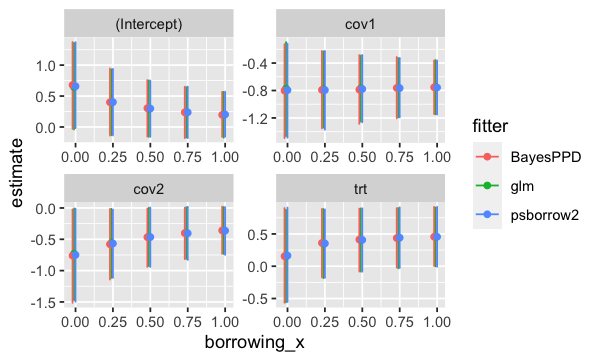
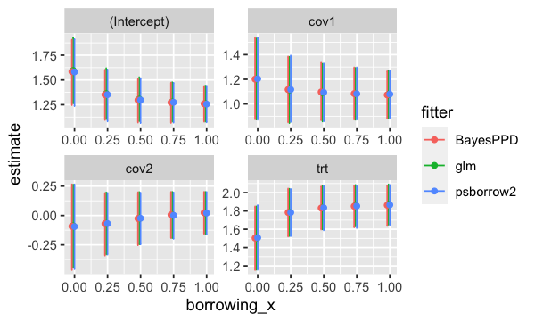

# Introduction

In a `psborrow2` analysis it is possible to specify fixed weights for an observation's log-likelihood contribution.
This is similar to a weighted regression or a fixed power prior parameter.

This vignette will show how weights can be specified and compare regression model results with other packages.
We will compare a `glm` model with weights, a weighted likelihood in Stan with `psborrow2`, and
`BayesPPD::glm.fixed.a0` for generalized linear models with fixed `a0` (power prior parameter).


```r
library(psborrow2)
library(BayesPPD)
library(ggplot2)
```

# Logistic regression

We fit logistic regression models with the external control arm having weights (or power parameters)
equal to 0, 0.25, 0.5, 0.75, 1. The internal treated and control patients have weight = 1.
The model has a treatment indicator and two covariates, `resp ~ trt + cov1 + cov2`.

### glm


### BayesPPD


### psborrow2


### Results


```r
logistic_res_df <- do.call(
  rbind,
  c(logistic_glm_reslist, logistic_ppd_reslist, logistic_psb_reslist)
)

logistic_res_df$est_ci <- sprintf(
  "%.3f (%.3f, %.3f)",
  logistic_res_df$estimate, logistic_res_df$lower, logistic_res_df$upper
)

wide <- reshape(
  logistic_res_df[, c("fitter", "borrowing", "variable", "est_ci")],
  direction = "wide",
  timevar = "fitter",
  idvar = c("borrowing", "variable"),
)
new_order <- order(wide$variable, wide$borrowing)
knitr::kable(wide[new_order, ], digits = 3, row.names = FALSE)
```


| borrowing|variable    |est_ci.glm              |est_ci.BayesPPD         |est_ci.psborrow2        |
|---------:|:-----------|:-----------------------|:-----------------------|:-----------------------|
|      0.00|(Intercept) |0.646 (-0.038, 1.357)   |0.678 (-0.029, 1.372)   |0.658 (-0.017, 1.370)   |
|      0.25|(Intercept) |0.394 (-0.131, 0.931)   |0.401 (-0.138, 0.945)   |0.402 (-0.136, 0.940)   |
|      0.50|(Intercept) |0.293 (-0.158, 0.751)   |0.304 (-0.154, 0.757)   |0.298 (-0.157, 0.749)   |
|      0.75|(Intercept) |0.235 (-0.168, 0.642)   |0.237 (-0.179, 0.651)   |0.238 (-0.178, 0.651)   |
|      1.00|(Intercept) |0.196 (-0.172, 0.567)   |0.196 (-0.160, 0.568)   |0.202 (-0.157, 0.570)   |
|      0.00|cov1        |-0.771 (-1.465, -0.095) |-0.802 (-1.493, -0.126) |-0.795 (-1.486, -0.118) |
|      0.25|cov1        |-0.781 (-1.340, -0.231) |-0.792 (-1.351, -0.224) |-0.794 (-1.371, -0.225) |
|      0.50|cov1        |-0.769 (-1.252, -0.291) |-0.787 (-1.285, -0.285) |-0.778 (-1.263, -0.282) |
|      0.75|cov1        |-0.758 (-1.191, -0.329) |-0.763 (-1.206, -0.312) |-0.765 (-1.191, -0.327) |
|      1.00|cov1        |-0.749 (-1.145, -0.357) |-0.754 (-1.145, -0.361) |-0.756 (-1.151, -0.364) |
|      0.00|cov2        |-0.730 (-1.472, -0.008) |-0.760 (-1.513, -0.024) |-0.750 (-1.495, -0.013) |
|      0.25|cov2        |-0.559 (-1.114, -0.014) |-0.579 (-1.141, -0.016) |-0.567 (-1.115, -0.027) |
|      0.50|cov2        |-0.459 (-0.926, 0.003)  |-0.466 (-0.938, -0.010) |-0.465 (-0.941, 0.007)  |
|      0.75|cov2        |-0.398 (-0.811, 0.011)  |-0.401 (-0.816, 0.004)  |-0.404 (-0.829, 0.018)  |
|      1.00|cov2        |-0.358 (-0.731, 0.013)  |-0.358 (-0.731, 0.019)  |-0.363 (-0.748, 0.013)  |
|      0.00|trt         |0.154 (-0.558, 0.871)   |0.155 (-0.565, 0.900)   |0.165 (-0.552, 0.908)   |
|      0.25|trt         |0.349 (-0.183, 0.885)   |0.360 (-0.172, 0.887)   |0.353 (-0.179, 0.878)   |
|      0.50|trt         |0.405 (-0.082, 0.894)   |0.413 (-0.081, 0.890)   |0.408 (-0.084, 0.896)   |
|      0.75|trt         |0.434 (-0.031, 0.900)   |0.436 (-0.019, 0.899)   |0.442 (-0.027, 0.911)   |
|      1.00|trt         |0.452 (-0.000, 0.905)   |0.456 (0.003, 0.919)    |0.456 (-0.008, 0.920)   |


```r
logistic_res_df$borrowing_x <- logistic_res_df$borrowing +
  (as.numeric(factor(logistic_res_df$fitter)) - 3) / 100

ggplot(logistic_res_df, aes(x = borrowing_x, y = estimate, group = fitter, colour = fitter)) +
  geom_errorbar(aes(ymin = lower, ymax = upper)) +
  geom_point() +
  facet_wrap(~variable, scales = "free")
```



# Exponential models

Now we fit models with an exponentially distributed outcome. There is no censoring in this data set.
For `glm` we use `family = Gamma(link = "log")` and specify fixed `dispersion = 1` to fit a exponential model.
As before, the external control arm having weights (or power parameters)
equal to 0, 0.25, 0.5, 0.75, 1. The internal treated and control patients have weight = 1.
The model has a treatment indicator and two covariates, `eventtime ~ trt + cov1 + cov2`.


```r
head(sim_data_exp)
#   id   eventtime status trt cov1 cov2 ext censor
# 1  1 0.027874289      1   0    0    1   0      0
# 2  2 0.036440392      1   0    1    0   0      0
# 3  3 0.002922008      1   0    1    0   0      0
# 4  4 0.008099077      1   0    1    0   0      0
# 5  5 0.252636949      1   0    0    0   0      0
# 6  6 0.004846619      1   0    1    0   0      0
```


### Results

Note: Wald confidence intervals are displayed here for `glm` for the exponential models.


```r
res_df <- do.call(rbind, c(glm_reslist, ppd_reslist, psb_reslist))

res_df$est_ci <- sprintf(
  "%.3f (%.3f, %.3f)",
  res_df$estimate, res_df$lower, res_df$upper
)

wide <- reshape(
  res_df[, c("fitter", "borrowing", "variable", "est_ci")],
  direction = "wide",
  timevar = "fitter",
  idvar = c("borrowing", "variable"),
)
new_order <- order(wide$variable, wide$borrowing)
knitr::kable(wide[new_order, ], digits = 3, row.names = FALSE)
```


| borrowing|variable    |est_ci.glm             |est_ci.BayesPPD        |est_ci.psborrow2       |
|---------:|:-----------|:----------------------|:----------------------|:----------------------|
|      0.00|(Intercept) |1.596 (1.263, 1.929)   |1.585 (1.246, 1.907)   |1.582 (1.236, 1.913)   |
|      0.25|(Intercept) |1.361 (1.104, 1.619)   |1.352 (1.096, 1.603)   |1.352 (1.081, 1.606)   |
|      0.50|(Intercept) |1.306 (1.083, 1.528)   |1.297 (1.070, 1.511)   |1.298 (1.064, 1.518)   |
|      0.75|(Intercept) |1.278 (1.079, 1.477)   |1.272 (1.065, 1.473)   |1.275 (1.069, 1.472)   |
|      1.00|(Intercept) |1.261 (1.079, 1.442)   |1.260 (1.079, 1.438)   |1.256 (1.072, 1.441)   |
|      0.00|cov1        |1.203 (0.873, 1.532)   |1.201 (0.875, 1.538)   |1.204 (0.872, 1.540)   |
|      0.25|cov1        |1.113 (0.844, 1.382)   |1.116 (0.850, 1.385)   |1.117 (0.854, 1.393)   |
|      0.50|cov1        |1.092 (0.858, 1.326)   |1.097 (0.867, 1.342)   |1.094 (0.858, 1.329)   |
|      0.75|cov1        |1.082 (0.872, 1.292)   |1.084 (0.872, 1.297)   |1.082 (0.873, 1.297)   |
|      1.00|cov1        |1.076 (0.884, 1.269)   |1.073 (0.883, 1.266)   |1.079 (0.886, 1.272)   |
|      0.00|cov2        |-0.089 (-0.441, 0.263) |-0.092 (-0.463, 0.265) |-0.094 (-0.456, 0.265) |
|      0.25|cov2        |-0.068 (-0.331, 0.196) |-0.070 (-0.341, 0.191) |-0.069 (-0.332, 0.192) |
|      0.50|cov2        |-0.024 (-0.246, 0.199) |-0.025 (-0.254, 0.197) |-0.024 (-0.246, 0.194) |
|      0.75|cov2        |0.004 (-0.192, 0.200)  |0.006 (-0.192, 0.200)  |0.001 (-0.198, 0.196)  |
|      1.00|cov2        |0.022 (-0.156, 0.200)  |0.024 (-0.155, 0.201)  |0.021 (-0.160, 0.200)  |
|      0.00|trt         |1.504 (1.159, 1.850)   |1.503 (1.155, 1.849)   |1.507 (1.158, 1.864)   |
|      0.25|trt         |1.784 (1.526, 2.042)   |1.783 (1.521, 2.044)   |1.783 (1.525, 2.040)   |
|      0.50|trt         |1.835 (1.599, 2.072)   |1.832 (1.598, 2.068)   |1.835 (1.589, 2.077)   |
|      0.75|trt         |1.858 (1.632, 2.084)   |1.852 (1.621, 2.075)   |1.854 (1.614, 2.073)   |
|      1.00|trt         |1.871 (1.650, 2.091)   |1.863 (1.637, 2.076)   |1.867 (1.646, 2.085)   |


```r
res_df$borrowing_x <- res_df$borrowing +
  (as.numeric(factor(res_df$fitter)) - 3) / 100

ggplot(res_df, aes(x = borrowing_x, y = estimate, group = fitter, colour = fitter)) +
  geom_errorbar(aes(ymin = lower, ymax = upper)) +
  geom_point() +
  facet_wrap(~variable, scales = "free")
```


